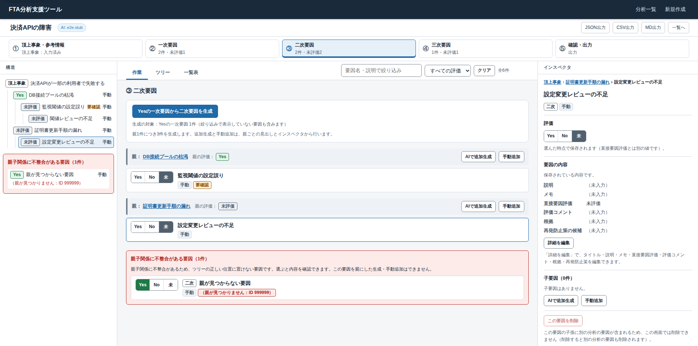
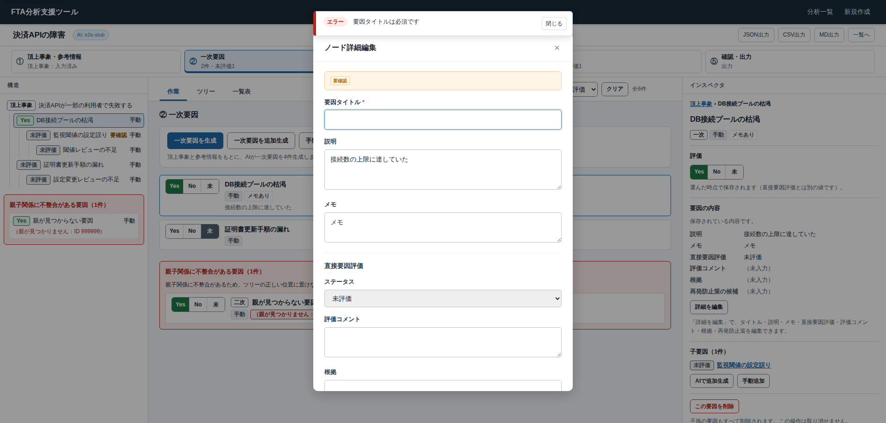
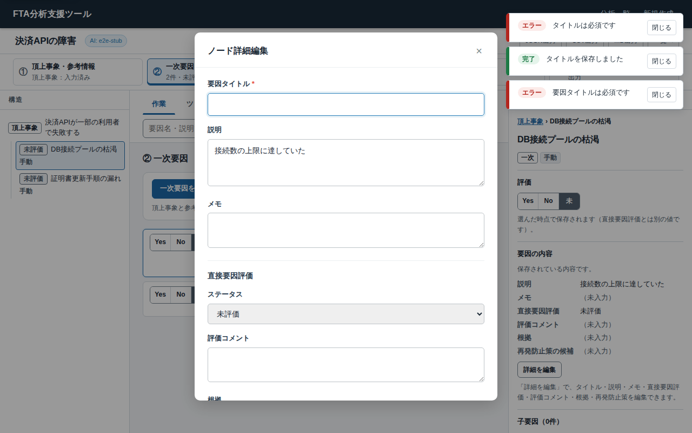
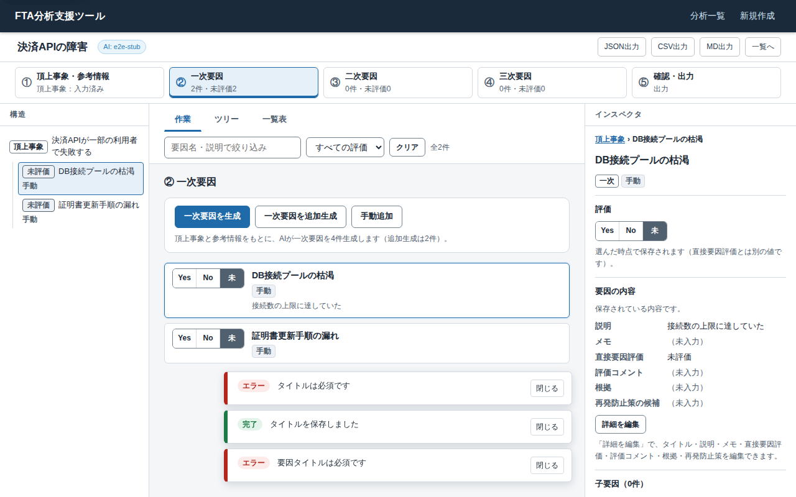

# PR-3 の確認資料

計画書（[ui-redesign-implementation-plan.md](../../ui-redesign-implementation-plan.md)）の PR-3「分析・編集の骨格」の PR から参照するための資料です。アプリとテストでは使いません。

**ファイルごとに対象コミットが異なります。** PR に載せた最新 HEAD での試験結果は PR 本文に記録しており、ここにある記録とは別のものです。

| ファイル | 対象コミット | 内容 |
|---|---|---|
| [`e2e-report-8714539.md`](e2e-report-8714539.md) | `87145395b0ec52e3206003f975342624ddf1e310` | UI 改修の必須受入検証（必須 E2E）の記録。`--e2e-report` が書き出したものを変更せずに置いた。成功 145・失敗 0・スキップ 0・未実施 0、判定：合格 |
| [`a61908e-chrome-1905x945-blocked-delete.png`](a61908e-chrome-1905x945-blocked-delete.png) | `a61908e8a6835aa654c94ad11486a14c0246f015`（下の注） | 表示領域 1905×945（利用者環境の実測値：Chrome）で、別の分析の要因が子孫にある要因（正常な二次要因）を選んだ画面。インスペクタの「この要因を削除」が無効で、理由が出ている。構造ナビと作業リストの末尾に「親子関係に不整合がある要因」のグループ |
| [`a61908e-edge-1912x914-dialog-error.png`](a61908e-edge-1912x914-dialog-error.png) | 同上 | 表示領域 1912×914（利用者環境の実測値：Edge）で、旧詳細ダイアログでタイトルを空にして保存したときのエラー通知。**この時点の画面**で、通知は上部の中央に出ている（`037cf3a` で上部の右側へ変更）。品質警告のない要因なのに空の「要確認」行が出ているのは、`8714539` で直した既存の不具合 |
| [`037cf3a-1280x800-dialog-stacked-errors.png`](037cf3a-1280x800-dialog-stacked-errors.png) | `037cf3a8480c7861e41921f9ecfe4bbea63b2fa7` | 表示領域 1280×800 で、エラー通知が残った状態で旧詳細ダイアログを開き、さらにエラーが出た画面。通知（エラー2件と成功1件）は上部の右側（ダイアログの横）に縦に並び、ダイアログのどの部分にも重ならない |
| [`037cf3a-1280x800-after-dialog.png`](037cf3a-1280x800-after-dialog.png) | `037cf3a` | 同じ状態でダイアログを閉じた後。通知は通常の位置（下部の中央）に戻る |

注：`a61908e` の2枚は、`a61908e` をコミットした直後（未コミットの変更なし）に撮影した。`8714539` との違いは、旧詳細ダイアログの空の「要確認」行を隠す CSS の規則1行（と説明のコメント）とそのテストだけ。これらの画像は、PR 作成の前に利用者へ報告した2枚と同じもの。

撮影と実行の環境：開発環境（Claude Code のリモート実行環境、Linux コンテナ）、Python 3.11.15、Playwright 1.56.0、Chromium 141.0.7390.37（headless）。テスト用サーバー（`tests/e2e/stub_server.py`：スタブの AI プロバイダ、一時 DB）を使い、実 LLM は呼んでいない。画像の分析・要因は撮影用に作ったデータで、不整合のある親子関係はテスト用の一時 DB にだけ書き込んだ。画面寸法は Playwright の表示領域の指定によるもので、**利用者の Windows の Edge・Chrome での表示ではない**（実機での確認は計画書 第8.3節の手動確認で行う）。

## 画像

画像ごとに対象コミットが異なります（上の表）。

### `a61908e`：報告で送った画面1（表示領域 1905×945）

### `a61908e`：報告で送った画面2（表示領域 1912×914）

### `037cf3a`：旧ダイアログを開いている間の通知（表示領域 1280×800）

### `037cf3a`：ダイアログを閉じた後（表示領域 1280×800）

経緯と判断は計画書の第14.3節を参照。
