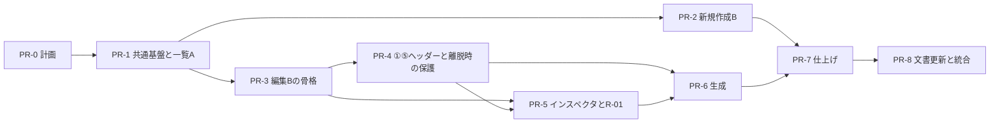

# FTA分析支援ツール 画面改修 実装計画（一覧A／新規作成B／分析編集B）

## 0. この文書について

| 項目 | 内容 |
|---|---|
| 種類 | 実装計画（調査結果と計画）。**この文書の作成では、アプリケーションコード・DB・設定値を変更していない** |
| 対象 | 採用済みの画面構成（分析一覧：A案、新規分析作成：B案、分析・編集：B案）の本番実装 |
| 状態 | 計画（作成 2026-09-27、同日に利用者の判断を反映）。第6節の28項目は、22項目を推奨案どおり採用（うち4項目は今回は対象外として採用）、6項目を条件付き採用。**本体の実装は未着手で、受入確認も未実施**。別提案 S-1〜S-11 は未承認 |
| 現行仕様 | [ui-current-spec.md](ui-current-spec.md)。この計画では変更しない（更新の範囲と時期は第10節） |
| 設計資料 | [proposals/ui-design-integrated-v2.md](proposals/ui-design-integrated-v2.md)（統合案 第2版の設計記録を取り込んだもの。提案／未承認を含む）。以下「設計記録」と呼ぶ |
| UI再設計ブリーフ | [ui-redesign-brief.md](ui-redesign-brief.md) |

この計画で守る前提：

1. 画面構成（一覧A／新規作成B／分析編集B）は再検討しない。
2. 設計記録 第6.2節の暫定動作と第7節の事項は、本番実装で承認済みとして扱わない。プロトタイプで動いていることも根拠にしない。
3. プロトタイプの HTML・模擬データ・模擬生成処理を本体へ置き換え・移植しない。本体は現行の FastAPI・Jinja2・JavaScript・CSS で作る。
4. フレームワーク移行、DB変更、API契約変更、生成プロンプト・Quality Gate の変更を前提にしない。必要と判断したものは第11節の別提案に分け、理由と影響を示す。
5. 統合プロトタイプの自動確認（182項目成功）は、本体の動作確認・テスト成功として流用しない。本体の確認はすべて本体に対して新たに行う（付録B）。

---

## 1. 基準と資料

### 1.1 ブランチと SHA（2026-09-27 08:38 UTC に確認）

| 確認対象 | 方法 | 結果 |
|---|---|---|
| 基準ブランチ `claude/fta-analysis-tool-Yg5yn` の先頭（GitHub 側） | `git ls-remote origin` | `594bcd2e05dfe357168f5feeb93e293f736fcac7` |
| 同ブランチの先頭（ローカル、`git fetch` 後） | `git rev-parse` | 同上 |
| リポジトリの既定ブランチ | `git remote show origin`、`git ls-remote origin HEAD` | 既定ブランチは `claude/fta-analysis-tool-Yg5yn`（HEAD の SHA も同上） |
| 設計記録が前提とするコミット | 設計記録 第1節 | `594bcd2e…`。**現在の先頭と一致** |
| 先頭コミット | `git log` | 2026-09-25 23:08 +0900「Merge pull request #14 from fujihara-masaki/codex-1qkohi」 |
| この計画の作業ブランチ | — | `claude/nice-davinci-yoh04d`（作成時点で `594bcd2` と同じ） |

- GitHub には git（fetch・ls-remote）と GitHub API の両方で接続でき、公開側の SHA を確認できた。
- 参考：GitHub API 上では PR #1〜#14 がすべて closed（merged=false）と表示されるが、基準ブランチには各 PR のマージコミットがある。この計画はブランチの内容を正とする。
- 利用者の判断（2026-09-27）は、この計画のコミット `26f9ba932a03a2623705cd747ecf26ae8771f06e` を基準に行われた。判断を反映する作業の開始時に PR #15 の HEAD を確認し、同じコミットで J 項目に変更がないことを確かめた。
- 各 PR の着手時に基準ブランチの先頭を再確認する。`594bcd2` から進んでいれば、第2節の前提（ファイル・行番号・テスト件数）を差分で確認し直す。

### 1.2 設計資料の出所と区分

| 資料 | 取得元・識別 | 扱い |
|---|---|---|
| 設計記録 `ui-design-integrated.md`（統合案 第2版、2026-09-27） | Artifact `https://claude.ai/artifact/HzSGnCu7hBnQHP2vVMvqVh`（版 `1790489920-a380`）の公開ファイル。SHA-256 `2659147e…33acb7ac`。資料の基準コミット `594bcd2` | 精読し、[proposals/ui-design-integrated-v2.md](proposals/ui-design-integrated-v2.md) に取り込んだ。本文は原文のまま、先頭に出所・版・基準SHA・「提案／未承認」の区分を追記 |
| 統合プロトタイプ `index.html` | 同 Artifact。SHA-256 `84c66d3b…f10952a0` | 画面部品・導線・模擬処理の把握にだけ使用。**取り込まない** |
| 検証記録 `evidence/results.json`・`repro.json`・画像 | 同 Artifact（results.json の SHA-256 `d5d161a3…`） | 確認項目の把握にだけ使用。結果は流用しない |
| `fta-integrated-v2.zip` | 利用者の手元 | **本環境では取得できず未確認**。上記 Artifact の公開ファイル一式（23ファイル）と同じ内容かは確認していない（Google Drive は権限不足で検索できなかった） |
| A/B構成比較 第3版 | Artifact `https://claude.ai/artifact/ADfPrgnntgsnacFX2tyPxY` | 設計記録が参照する R-01（要因切替時の未保存確認の対象経路）と D-01（直接要因評価・メモの表示）の定義確認にだけ使用 |

### 1.3 調査方法と確認の区分

| 区分 | 内容 |
|---|---|
| コード確認 | テンプレート4本、`static/app.js`、`static/style.css`、`main.py`、`crud.py`、`models.py`、`schemas.py`、`database.py`、`services/export_service.py`、`services/sample_scenarios.py`、`services/ai_provider.py`（生成呼出し部分）、関連テスト |
| テスト実行 | 既存テスト一式を実行：**269 passed / 1 skipped**（skip は pwsh がないための `test_run_langgraph_comparison_script.py` の構文チェック）。Python 3.11.15、`requirements.txt` の固定版。仮想環境・DB・キャッシュはリポジトリの外に置いた |
| 模擬プロバイダでの実測 | アプリを変更せず、リポジトリ外の起動用スクリプトで AI プロバイダだけを「3秒待って2件返す」スタブに差し替えて起動し、HTTP と Chromium（headless shell 141.0.7390.37、Playwright 1.48.0）で確認。**実LLMは呼んでいない**。手順は付録A。スクリプトはリポジトリに含めていない |
| 未確認 | 実LLM、Windows・macOS の実ブラウザ、表示倍率、BIZ UDPGothic での表示、利用者環境のブランチ・`.env`・DB（第12節） |

---

## 2. 現行実装の要点

### 2.1 画面とファイル

| 画面 | URL | テンプレート | JavaScript | 使う API |
|---|---|---|---|---|
| 分析一覧 | `GET /` | `index.html` | `app.js`（改名・削除） | `POST /analyses/{id}/title`、`POST /analyses/{id}/delete`、`GET /analyses/{id}/export/{json,csv,markdown}` |
| 新規分析作成 | `GET /analyses/new` | `analysis_form.html`（サンプル処理はテンプレート内のスクリプト） | テンプレート内 | `POST /analyses`（フォーム送信 → 303 で編集画面へ） |
| 分析・編集 | `GET /analyses/{id}` | `analysis_detail.html` | `app.js` | タイトル・頂上事象・参考情報の更新、生成、要因の取得・更新・削除・追加、出力 |

共通：`base.html` のヘッダー（分析一覧・新規作成）とトースト（`role="status"`。成功・エラーは3秒、警告は6秒で消える）。CSS は `style.css` 1本。文字は端末のフォント（`'Segoe UI', 'Hiragino Sans', 'Meiryo'`）で、外部から読み込むリソースはない。

### 2.2 保存と画面更新の現状

| 操作 | API | 関数（app.js） | 成功後 | 失敗時 |
|---|---|---|---|---|
| 分析タイトル（編集画面） | `POST /analyses/{id}/title` | `saveAnalysisTitle`（フォーカスが外れた時・Enter） | そのまま | トーストとタイトル下の表示 |
| 分析タイトル（一覧） | 同上 | `startTitleRename` → `saveAnalysisTitle` | セルを戻して文字を更新 | API の理由を「保存に失敗しました」で上書き（C-02） |
| 頂上事象 | `POST /analyses/{id}/top-event` | `saveTopEvent`（ボタン） | `data-saved` を更新 | トースト |
| 参考情報2種 | `POST /analyses/{id}/context` | `saveAnalysisContext`（ボタン） | `data-saved` と「入力済み／未入力」を更新 | トースト |
| 評価 Yes/No/未 | `POST /nodes/{id}/update` | `setJudgement` | カードと一覧表を更新（**ツリー表示は更新しない**、C-04） | トースト |
| 要因タイトル（カード上） | 同上 | `saveNodeTitle`（フォーカスが外れた時） | **応答を確認しない**（C-03） | コンソールのみ |
| 詳細（モーダル） | `GET /nodes/{id}` → `POST /nodes/{id}/update` | `openNodeDetail`・`saveNodeDetail` | 再読み込み | トースト |
| 手動追加 | `POST /analyses/{id}/nodes/add-level1`、`POST /nodes/{id}/children` | `submitAddNode` | 再読み込み | トースト（重複は 409 の理由） |
| 要因の削除 | `POST /nodes/{id}/delete` | `deleteNode`（`confirm`） | 再読み込み | トースト |
| 分析の削除 | `POST /analyses/{id}/delete` | `deleteAnalysis`（`confirm`） | 再読み込み | トースト |
| 生成 | `POST /analyses/{id}/generate/level/{n}` | `generateFactors`・`generateFactorsSequential`・`generateAdditional` | 作成が1件以上なら再読み込み | トースト・一時バッジ |

- 再読み込みは `reloadPreservingScroll()`（app.js:30）で、カード列のスクロール位置だけを sessionStorage で戻す。「選択中の要因」という状態はない。ツリー・一覧表・参考情報の開閉は分析ごとに localStorage（analysis_detail.html:440-457。try/catch なし）。
- 分析の `updated_at` は、分析項目の保存と要因の作成で更新され、要因の評価・更新・削除では更新されない（crud.py）。

### 2.3 生成処理とサーバーの並行性

- `generate_factors` は `async def`（main.py:318）だが、要求本文の読み込み（`await request.json()`）の後は await がなく、AI プロバイダの呼出しは同期処理（`httpx.Client`、再試行時の `time.sleep`）で行われる。このため **LLM の応答を待つ間、uvicorn（単一ワーカー）は他のリクエストを処理しない**。
- 1回の生成要求の中で、プロバイダ内の再試行、件数不足時の再試行、LangGraph の再生成が起こり得る。各 LLM 呼出しは `OLLAMA_TIMEOUT_SECONDS`（`.env.example` では360秒）まで待つ。
- README と比較試験スクリプトの起動方法は、いずれも単一ワーカー。
- 親を指定した生成は、親が同じ分析内に見つからなければ `success:false`・「生成対象の親要因がありません（Yes評価の要因がありません）」を返す（main.py:341-359）。**親の階層が「生成する階層−1」かどうかは検査しない**。
- SQLite の外部キー制約は有効にしていない（database.py）。主キーは AUTOINCREMENT なしのため、最大 ID の行を消すと同じ ID が再利用される。

### 2.4 実測結果（模擬プロバイダ、付録A）

| # | 手順 | 構成 | 結果 |
|---|---|---|---|
| M-1 | 二次生成（3秒）の開始0.6秒後に、一覧表示と親要因の削除を同時に送る | 単一ワーカー | 一覧表示・削除とも生成完了（約3.1秒）まで応答がなかった。削除は生成の後に実行され、作られた子要因ごと親が消えた。不整合なし（2回とも） |
| M-2 | 二次生成（3秒）の実行中に、一覧表示と親要因の削除を送る | 2ワーカー | 削除は0.6秒で完了し、その後の生成が**削除済みの親を参照する子要因2件を保存**した（3回とも）。いずれの回も削除した親の ID が新しい子要因に再利用され、**子要因が自分自身を親とする**状態になった |
| M-3 | 親の後に兄弟要因がある状態で M-2 と同じ手順 | 2ワーカー | 親のない子要因2件が残った。JSON 出力には含まれ、Markdown 出力には現れない |
| M-4 | 一次生成の実行中に分析を削除し、直後に別の分析を作成 | 2ワーカー | 削除済み分析の ID で要因が保存され、**同じ ID で作られた新しい分析の編集画面にその要因が表示された** |
| M-5 | M-3・M-4 と同じ手順 | 単一ワーカー | 削除は生成の後に実行され、不整合・混入なし |
| B-1 | 一次生成中（全画面オーバーレイ表示中）に Tab キーを押す | ブラウザ | オーバーレイの裏の「手動追加」「Yes/No/未」「詳細編集」「削除」などに移動でき、Enter で手動追加のモーダルが開いた |
| B-2 | 二次の一括生成中に操作できるか | ブラウザ | 削除・評価・「一覧へ」はいずれも操作できた |
| B-3 | 頂上事象を未保存のまま「一覧へ」 | ブラウザ | 確認なしで移動した（入力は失われる） |
| B-4 | 一覧で分析を改名 | ブラウザ | ブラウザのタブ名が「改名後のタイトル - FTA編集」に変わった（C-01） |

計画への影響：

- **実測した条件**（uvicorn 単一ワーカー・`--reload` なし、legacy 経路、3秒で応答するスタブ、上記の手順を各2〜3回）では、生成中に送った削除・一覧表示は生成が終わるまで待たされ、その結果として親子の不整合・別分析への混入は起きなかった（M-1・M-5）。**これは現行の単一ワーカー構成が一般に安全であることの証明ではない**。確認していない条件：実LLM（タイムアウト・再試行を含む長時間の処理）、LangGraph 経路・Quality Gate を有効にした場合、一括生成で親ごとの要求の**合間**に別タブの削除が入る場合、同じ親への生成要求を複数タブから送る場合、`--reload` での起動、ほかの ASGI サーバー・起動オプション。待たされる動きはサーバーの実装（同期処理が要求の処理を止めること）の副作用で、仕様として保証されたものではない。
- 画面側で「生成中もほかの操作を許す」と、その操作は生成が終わるまで（実LLMでは数分）待たされることがある（第5.3節、J-01）。
- ワーカー数を増やす、または生成処理を並行化すると M-2〜M-4 が起きた。画面側の抑止では別タブからの操作を防げない。並行化（S-7）へ進む条件は第11節に示す（S-1 だけでは足りない）。

### 2.5 現行の不具合・注意点

| ID | 内容 | 根拠 | 扱い |
|---|---|---|---|
| C-01 | 一覧で改名すると、ブラウザのタブ名が「… - FTA編集」に変わる | app.js:94、B-4 | PR-1 で修正（J-23） |
| C-02 | 一覧の改名失敗時、API の具体的な理由を「保存に失敗しました」で上書きする | app.js:157、現行仕様 §8.2 | PR-1 で修正（J-23） |
| C-03 | カード上の要因タイトル保存が応答を確認しない。空にすると画面だけ空になる | app.js:521-533、現行仕様 §8.1 | カード上の直接編集をやめる（J-10）ことで解消 |
| C-04 | 評価の変更がツリー表示に反映されない（再読み込みまで古い） | app.js:479-518 | PR-3 で全表示を同期（J-23） |
| C-05 | 一次生成中の全画面オーバーレイは、マウス操作だけを止め、キーボード操作を止めない | B-1 | J-01・J-05 |
| C-06 | 一括生成で成功と失敗が混在すると、失敗が通知されない | app.js:407-422、現行仕様 §5 | J-04 |
| C-07 | 画面を離れるときの未保存確認がない | B-3 | J-12 |
| C-08 | Enter で確定する処理が、日本語入力の変換中かどうかを確認しない（変換確定の Enter で保存・確定が走るおそれ） | app.js:162、805-813 | 新しい処理は変換中の Enter を無視する。実機で確認（第12節） |
| C-09 | 一覧表の「親要因」列は、親が見つからない要因を「（頂上事象）」と表示する | analysis_detail.html:325 | J-25 |
| C-10 | localStorage を try/catch なしで使う。保存領域が使えない環境で例外になる | analysis_detail.html:450-454 | 保存領域はすべて例外を処理して使う |
| C-11 | 新規作成のタイトルは空白だけ・256文字以上でも作成できる（改名は必須・255文字以内） | analysis_form.html、main.py:188 | J-22（画面側の入力制限のみ。サーバーは S-9） |

### 2.6 画面の文言・構造に依存する既存テスト

画面を作り直すと、次のテストは HTML の文字列が変わるため失敗する。**テストの意図を保って書き換える**（付録C）。

- `tests/test_analysis_context.py`：`test_new_analysis_form_shows_visible_context_fields`（テンプレート内スクリプトの文字列 `getElementById('systemContextInput').value = sample.system_context` を確認）、`test_create_analysis_without_context_keeps_legacy_behavior`（「分析コンテキスト」「未入力」）、`test_detail_page_renders_saved_context`（「入力済み」）、`test_detail_page_safe_on_broken_context_json`（「分析コンテキスト」）

API・出力・生成のテスト（`test_ui_endpoints.py`、`test_generate_endpoint.py`、`test_export_service.py` など）は、画面改修で変わらないことを確かめる回帰テストとして、そのまま通ることを受入条件にする。

---

## 3. 新しい画面構成と現行ファイルの対応

### 3.1 ファイルの対応

| 現行 | 改修後の役割 | 主な変更 |
|---|---|---|
| `templates/base.html` | 3画面共通の枠 | ヘッダー（ブランド、分析一覧、新規作成。現在の画面を `aria-current="page"` で示す）、本文へのスキップリンク、通知領域（`role="status"` と、エラー用の `role="alert"`）、共通の JS・CSS の読み込み |
| `templates/index.html` | 分析一覧（A案） | 表・操作列（編集／出力▾／削除）・行内改名・空状態 |
| `templates/analysis_form.html` | 新規分析作成（B案） | 2列（左：1 分析の名前と頂上事象、2 AIへの参考情報／右：入力の使われ方、サンプル）。フォーム送信（`POST /analyses`）は現行のまま。テンプレート内スクリプトは静的ファイルへ移し、サンプルはデータ（JSON）として埋め込む |
| `templates/analysis_detail.html` | 分析・編集（B案） | 部分テンプレート（ヘッダー、作業ステップ、構造ナビ、作業リスト、ツリー、一覧表、インスペクタ、ダイアログ）に分ける。要因の要約をデータ（JSON）として埋め込む |
| （新規）`templates/_macros.html` など | 共通部品 | 評価の切替（Yes/No/未）、タグ（階層・AI・手動・要確認・直接要因評価・メモあり）、出力メニュー、保存状態表示 |
| `static/app.js` | 分割 | 共通（通信、通知、ダイアログ、メニュー、未保存管理と移動の確認、文字の正規化、日本語入力中の Enter の判定、保存領域）と画面別（一覧、新規、編集：選択と同期、インスペクタ、生成、部分更新）に分ける。ブラウザ標準の ES モジュールで読み込み、ビルド工程は追加しない。旧関数は置き換えが終わった PR で削除する |
| `static/style.css` | 分割・整理 | デザイントークン（色・余白・文字）、共通部品、画面別。ライトテーマのみ（J-27）。外部フォントは読み込まない（J-28） |
| `main.py` | テンプレートへ渡す値の追加のみ | 一覧：分析ごとの要因数（J-13）。編集：要因の要約データ、生成件数の設定値（`_get_factor_count` の値）、親が見つからない要因の区分。**ルート・API・応答形式は変えない** |
| `crud.py` | 集計関数の追加のみ | 一覧の要因数を1回の集計で求める関数（J-13 採用時）。既存関数は変えない |
| `models.py`・`schemas.py`・`database.py`・`services/` | 変更しない | — |
| `tests/` | 追加・書き換え | テンプレートの構造テスト（pytest）、実ブラウザのテスト（J-26）、付録Cの書き換え |

### 3.2 画面ごとの構成要素

#### 分析一覧（A案）

| 要素 | 内容 | データ |
|---|---|---|
| 見出し行 | 「FTA分析一覧」、件数と並び順（更新日時の新しい順）、「＋ 新規分析を作成」 | サーバー描画 |
| 表 | タイトル（編集画面へのリンク）と ✎、頂上事象（2行で省略）、作成日時、更新日時、操作 | 同上。並びは `crud.get_analyses`（更新日時の降順）のまま |
| 行内改名 | 入力欄・保存・取消・文字数・エラー。Enter で保存、Esc で取消、必須・255文字 | `POST /analyses/{id}/title` |
| 出力▾ | JSON・CSV・Markdown と、それぞれに含まれる項目の説明（第4節 UI-04 の注） | 現行の出力 URL（`download` 属性付き） |
| 削除 | 画面内ダイアログ。タイトルと要因数（一覧表示時点）を表示 | `POST /analyses/{id}/delete` |
| 空状態 | 説明と「＋ 新規分析を作成」 | — |

#### 新規分析作成（B案）

| 要素 | 内容 |
|---|---|
| 左「1 分析の名前と頂上事象」 | 分析タイトル（必須）、頂上事象（任意・後から編集可。一次要因の生成に必須である旨） |
| 左「2 AIへの参考情報」 | システム構成・対象範囲、障害発生時の状況・観測事実（2列） |
| 操作 | キャンセル（入力があれば確認）、作成して編集へ（二重送信防止） |
| 右「入力の使われ方」 | 頂上事象・参考情報・作成後の画面の説明 |
| 右「サンプルから入力（デモ用）」 | 選択 → プレビュー → 「この内容を入力欄へ転記」。転記後は「サンプルを転記済み・未保存」と表示。`demo_points` は現行どおり非表示の項目で送る |

#### 分析・編集（B案）

| 要素 | 内容 |
|---|---|
| ヘッダー | 分析タイトルと ✎（行内編集）、AI プロバイダ名、出力▾、一覧へ |
| 作業ステップ | ① 頂上事象・参考情報、② 一次要因、③ 二次要因、④ 三次要因、⑤ 確認・出力。順序は強制しない。各ステップに状況（件数・未評価・未保存あり等） |
| 構造ナビ（左） | 頂上事象から三次要因までの木。評価の印・要確認・手動。選ぶと右のインスペクタと作業ステップが切り替わる |
| 中央 | 表示タブ「作業／ツリー／一覧表」。作業：①の入力欄、②〜④の操作バー（通常生成・追加生成・手動追加）・生成ログ・親グループごとの作業リスト、⑤の集計と出力 |
| インスペクタ（右） | パンくず、タグ、評価（即時保存）、品質警告、要因（タイトル・説明・メモ）、直接要因評価一式、子要因（リンク、AIで追加生成、手動追加）、削除、保存・取消 |
| ダイアログ | 未保存の確認（要因の切替・画面移動）、削除確認、手動追加 |

### 3.3 プロトタイプから取り込むもの・取り込まないもの

| 取り込む（設計意図として実装し直す） | 取り込まない |
|---|---|
| 3画面の構成・配置・導線、見出しと操作の文言 | ページ全体を `innerHTML` で描き直す方式（`render()`）。フォーカス・入力中の状態・読み上げが失われやすい |
| 部品の見た目の方針（評価の切替、タグ、保存状態表示、出力メニュー、ダイアログ、下部中央の通知） | 架空データ（`SEED`・`SAMPLES`）、模擬生成（`POOL`・`startGen`・`finishGen`）、模擬の保存 |
| R-01 の経路（要因の切替で未保存を確認する操作の一覧） | 検証用の表示と操作（紫の帯、採用元の表示、「生成の模擬結果」「架空データを初期状態に戻す」） |
| 生成結果の区分（作成・候補0件・全候補除外・処理失敗・通信失敗・親なし）という考え方 | ボタンの `mousedown` を止めてフォーカスを保つ細工（第5.7節で別の方法にする） |
| 日本語入力中（`isComposing`）の Enter を無視する扱い | Google Fonts・IBM Plex Mono の読み込み（J-28）、ダークテーマ（J-27） |
| | 固定の高さ（700px）・最小幅（1200px） |
| | 設計記録に記載のない動作：サンプル転記でタイトルが空ならサンプル名を入れる（J-21）、編集画面ヘッダーの「更新 日時」（J-15） |
| | 出力の項目差の表のうち、現行の出力と合わない記載（第4節 UI-04 の注） |

### 3.4 Jinja2 と JavaScript の分担（設計記録 第10節4への回答）

1. **サーバー描画を正とする**。構造ナビ、作業リスト（全階層）、ツリー、一覧表、⑤の集計、各ステップの状況は Jinja2 が描く。利用者の入力や LLM が出した文字列は Jinja2 の自動エスケープで出力する。
2. **要因の要約をデータとして埋め込む**。`<script type="application/json" id="analysis-data">`（`tojson`）に、要因ごとの ID・親 ID・階層・タイトル・評価・直接要因評価・AI/手動・要確認の有無・メモの有無を入れる。生成対象の親、子孫件数、各ステップの件数は、このデータから求める（画面に表示されているかどうかに依存させない）。
3. **画面の状態は JavaScript が持つ**：選択中の要因、作業ステップ、表示タブ、絞り込み、未保存の下書き、生成中かどうか、生成ログ。各表示の要素に `data-node-id` を付け、選択の強調や評価の表示を一つの更新関数で全表示に反映する。
4. **詳細はインスペクタを開くときに取得する**。現行のモーダルと同じく `GET /nodes/{id}` から最新の値を読む（メモ・根拠などを空で上書きしないため）。速く選択を切り替えたときは、最後に選んだ要因の応答だけを使う。
5. **構造が変わる操作の後は部分更新する**。手動追加・削除・生成の後は、同じ URL（`GET /analyses/{id}`）の HTML を取得し、構造ナビ・作業リスト・ツリー・一覧表・⑤・ステップの状況・埋め込みデータだけを差し替える。**インスペクタと①の入力欄は差し替えない**ので、下書き・選択・生成ログが残る。新しい API は作らない。分析が見つからない（404）場合は「分析が見つかりません（削除された可能性があります）」と表示して操作を止める。取得に失敗した場合は、未保存の入力がなければ再読み込み（状態は第5.5節の方法で戻す）、あれば再読み込みせず「最新の表示に更新できませんでした」と表示する。
   **古い応答による巻き戻りを防ぐ**（PR #15 の前回レビュー R-03）：
   - 部分更新の要求ごとに連番を付け、最後に**発行した**連番の応答だけを反映する。先に発行した取得が後から届いても捨てる。
   - 評価の保存など、画面をその場で更新する書き込みにも「書き込み連番」を付ける。部分更新の取得を**発行した時点**より後に書き込みが始まった（または完了した）場合、その取得の応答は古い可能性があるため反映せず、取得をやり直す。
   - 書き込みの送信中は部分更新の取得を発行しない（書き込みの完了を待ってから取得する）。単一ワーカーでは要求の処理順が送信順と一致しない場合があるため、送信順に頼らない。
   - 反映後に、埋め込みデータの各要因の値（評価など）が、画面側で確定済みの最新の書き込み結果と食い違う場合は、画面の値を上書きせずに取得をやり直す（2回続けて食い違う場合は「表示を最新にできませんでした」と表示し、再読み込みを促す）。
   - 生成中は部分更新を行わない（生成の完了後に1回行う）。
6. **利用者の入力や LLM の文字列を `innerHTML` に連結しない**。JavaScript で作る表示は `textContent` と DOM API で組み立てる。

---

## 4. UI-01〜UI-17 の変更箇所と機能維持の確認

確認方法の記号：T-xx は pytest（サーバー側）、E-xx は実ブラウザのテスト（第8.9節で定義、J-26）、M は手動確認。「既存」は現行のテスト一式がそのまま通ること。

| ID | 現行の実装（根拠） | 改修後の場所 | 主な変更 | 維持すること | 確認方法 | PR |
|---|---|---|---|---|---|---|
| UI-01 分析を開く | `index.html` の表、`crud.get_analyses`（更新日時降順） | 一覧の表。タイトルのリンク、「編集」 | 表の見た目、見出し行の件数表示 | 並び順、リンク先 `/analyses/{id}`、0件の空状態と作成への導線 | T-02、E-L01、E-L08、M | PR-1 |
| UI-02 一覧で改名 | `startTitleRename`・`saveAnalysisTitle`、`POST /title` | タイトル横の ✎ → 行内編集 | 保存・取消・文字数の表示、変換中の Enter を無視、API の理由をそのまま表示（C-02）、タブ名を変えない（C-01）、未保存の確認（J-12） | 必須・255文字（前後の空白を除く）、Enter で保存・Esc で取消、`updated_at` の更新 | E-L02〜E-L05 | PR-1 |
| UI-03 分析を削除 | `deleteAnalysis`（`confirm`）、`POST /delete`、cascade | 一覧の「削除」→ 画面内ダイアログ（J-13） | 要因数の表示、失敗時はダイアログ内に理由、成功時は行を消す | 分析と全要因・評価・メモが消えること、取り消せない旨の警告 | 既存（`test_delete_analysis_*`）、E-L06 | PR-1 |
| UI-04 出力 | 一覧・編集の出力リンク、`export_service.py` | 一覧の「出力▾」、編集ヘッダーの「出力▾」、⑤の項目差の表 | メニュー化と項目の説明、`download` 属性（入力中でも離脱確認が出ないように） | URL・ファイル名・形式ごとの内容（出力処理は変えない） | 既存（`test_export_service.py` 等）、T-06、E-L07、E-E13 | PR-1、PR-4 |
| UI-05 分析を作成 | `analysis_form.html`、`POST /analyses` → 303 | 新規作成の2列フォーム →「作成して編集へ」 | 2列化、タイトルの入力制限（J-22）、二重送信防止、未入力時の画面内エラー、キャンセル時の確認 | フォームの項目名（`title`・`top_event`・`system_context`・`incident_context`・`demo_points`）、303 の遷移先、参考情報の JSON 保存 | 既存（`test_create_analysis_*`）、T-03、E-N01・E-N02・E-N04・E-N05 | PR-2 |
| UI-06 サンプル | テンプレート内の `onSampleSelect`・`applySample` | 右のパネル →「この内容を入力欄へ転記」 | 右パネルへの移動、「転記済み・未保存」の表示、スクリプトの静的ファイル化 | 転記は未保存（作成で保存）、`demo_points` を非表示の項目で送る、タイトルは転記しない（J-21） | T-03、E-N03 | PR-2 |
| UI-07 タイトル・頂上事象 | `contenteditable` の h1（フォーカスが外れたら保存）、頂上事象の保存ボタン | ヘッダーの ✎、「① 頂上事象・参考情報」 | タイトルは入力欄での行内編集（Enter・Esc・フォーカスが外れたら保存）。頂上事象に保存状態表示（J-11） | タイトル必須・255文字、頂上事象は空でも保存可、一次の通常・追加生成の前の自動保存 | E-E10・E-E11、E-G01 | PR-4 |
| UI-08 参考情報2種 | `saveAnalysisContext`・`ensureAnalysisContextReady`、`POST /context` | 「① 頂上事象・参考情報」の2欄 | 保存状態表示、生成前に自動保存されることを画面に明記 | 全生成経路での自動保存、`demo_points`・未知のキーを保持、`demo_points` を画面に出さない | 既存（`test_update_context_*`、`test_updated_context_is_passed_*`）、T-04、E-E09・E-E10、E-G01 | PR-4 |
| UI-09 通常生成 | `generateFactors`・`generateFactorsSequential` | ②〜④の操作バー「通常生成」 | 対象の親名と件数の表示（J-06、J-07）、生成ログ（J-02〜J-04）、生成中の操作制限（J-01、J-05） | 一次は頂上事象が必須、二次・三次は Yes の全親が対象、親ごとに順に要求、生成件数は設定値、処理中は全生成ボタンを無効 | 既存（`test_generate_endpoint.py`）、E-G01〜E-G05 | PR-3（配置のみ）、PR-6 |
| UI-10 追加生成 | `generateAdditional`（`additional:true`） | 操作バー「追加生成」、親グループ見出し「AIで追加生成」、インスペクタの子要因欄 | 追加先の明示、件数は設定値（`FTA_ADDITIONAL_FACTOR_COUNT`）を表示 | 一次は一括、二次・三次は特定の親。親が No・未評価でも実行可（J-16） | E-G07 | PR-3（配置のみ）、PR-6 |
| UI-11 手動追加 | `showAddNodeModal`・`submitAddNode` | 操作バー、親グループ見出し、インスペクタ → ダイアログ | 追加先の明示、重複（409）の理由をダイアログ内に表示、追加後に自動選択（R-01 の確認を通す） | AI を使わない、手動・未評価で作られる、同じ親の下の同名は不可 | 既存、E-E17 | PR-3（配置のみ）、PR-5 |
| UI-12 評価 Yes/No/未 | `setJudgement`、カードの3ボタン | 作業リストの各行、インスペクタ上部 | 全表示（構造ナビ・作業リスト・ツリー・一覧表・インスペクタ・ステップの件数・生成対象）へ反映（C-04）。同じ要因への連続クリックは順に処理 | 選んだ時点で保存、直接要因評価とは別の値、Yes だけが通常生成の対象 | E-E03 | PR-3 |
| UI-13 詳細編集 | 詳細モーダル（`GET /nodes/{id}` → 保存 → 再読み込み） | インスペクタ（「保存」で確定） | モーダルをやめ、常時表示のインスペクタで編集。保存状態表示、切替時の確認（R-01） | 開くときにサーバーの値を読む、保存項目（タイトル・説明・メモ・直接要因評価・評価コメント・根拠・再発防止策）、評価は送らない | 既存（`test_get_node_*`、`test_detail_roundtrip_*`）、E-E14・E-E15・E-E18 | PR-3（旧モーダルを暫定利用）、PR-5 |
| UI-14 タイトル編集・削除 | カード上の直接編集（C-03）、`deleteNode`（`confirm`） | タイトルはインスペクタ（J-10）。削除はインスペクタ下部（子孫件数、J-13） | カード上の直接編集の廃止、削除確認のダイアログ化 | 空タイトルは保存しない、子孫も削除、取り消せない旨の警告 | 既存（`test_delete_*_cascades_*`）、E-E16 | PR-5 |
| UI-15 絞り込み | `applyNodeFilter`（カード・一覧表のみ） | 作業リスト・一覧表の上部。構造ナビとツリーは強調のみ（J-08） | 構造ナビ・ツリーの強調、一致件数の表示 | 名前・説明の文字検索と評価・要確認の AND、作業リストと一覧表での非表示、生成対象を変えない（J-07） | E-E04、E-G02 | PR-3 |
| UI-16 3表現 | カード列、`<details>` のツリーと一覧表（開閉を localStorage に保存） | 表示タブ「作業」「ツリー」「一覧表」と常時表示の構造ナビ | 表示の切替をタブにする。状態は URL のハッシュと sessionStorage（第5.5節）。旧 localStorage のキーは使わない | 3つの表現と各表現の表示項目（親、評価、直接要因評価、警告、説明） | T-04、E-E05・E-E06 | PR-3 |
| UI-17 品質警告 | 要確認バッジ（ホバー・クリックでトースト）、モーダル・一覧表・出力 | 要確認バッジ → 選択してインスペクタの「品質警告」欄に全文 | トーストでの表示をやめ、インスペクタに表示 | `warning_flags` の表示、一覧表の警告列、出力（変更なし） | T-04、E-E02 | PR-3 |

UI-04 の注（出力の項目差）：設計記録とプロトタイプの表記のうち、現行の出力（`export_service.py`）と合わない点がある。画面の説明は次の表（現行の出力に基づく）に合わせ、T-06 で出力の中身と一致することを確認する。

| 項目 | JSON | CSV | Markdown |
|---|---|---|---|
| 分析タイトル | あり | なし | なし（見出しは固定の「FTA分析結果」） |
| 頂上事象 | あり | なし | あり |
| 参考情報（デモ観点を含む） | あり | なし | あり |
| 作成・更新日時 | あり | なし | なし |
| 要因の階層・親子 | あり（ID・親ID・階層） | あり（ID・レベル・親ID・親要因） | あり（入れ子のリスト） |
| 説明 | あり | あり | なし |
| AI／手動 | あり | あり | なし |
| 評価（Yes/No/未評価） | あり | あり | あり |
| 直接要因評価・評価コメント | あり | あり | あり（未評価の状態は出さない） |
| 根拠 | あり | あり | なし |
| 再発防止策 | あり | あり | あり |
| メモ | あり | あり | なし |
| 品質警告 | あり | あり（要確認・警告理由・品質ステータス） | なし |

プロトタイプとの違い：CSV は参考情報だけでなく分析タイトル・頂上事象も含まない。Markdown は分析タイトルと AI／手動を含まない。

---

## 5. 重点検討事項

### 5.1 未保存内容の保護と、保存失敗時に移動しない制御

#### 未保存として扱う入力

| 画面 | 対象 | 保存方法 | 保存前の検査 |
|---|---|---|---|
| 分析一覧 | 改名中のタイトル（元と異なる場合） | `POST /analyses/{id}/title` | 必須・255文字 |
| 新規分析作成 | タイトル・頂上事象・参考情報2種のいずれかに入力あり | 「作成して編集へ」でのみ保存（「保存して移動」は置かない） | — |
| 分析・編集 | 分析タイトル（行内編集中） | `POST /analyses/{id}/title`（フォーカスが外れた時点。移動時も保存し、確認は出さない） | 必須・255文字。空なら移動を止める |
| 分析・編集 | 頂上事象 | `POST /analyses/{id}/top-event` | なし（空でも保存可） |
| 分析・編集 | 参考情報2種 | `POST /analyses/{id}/context`（1回で2項目） | なし |
| 分析・編集 | インスペクタの下書き（タイトル・説明・メモ・直接要因評価・評価コメント・根拠・再発防止策） | `POST /nodes/{id}/update`（1回。評価は含めない） | タイトル必須 |

- 未保存かどうかは、**保存時と同じ正規化（前後の空白の除去、改行コード CRLF/LF の統一）を両辺に適用して**比較する。入力して元に戻した場合は未保存に数えない。開いた直後に「未保存」と表示されないことを、CRLF を含む値で確認する（E-E10）。
- 手動追加ダイアログの入力は、ダイアログを閉じると破棄する（ダイアログ表示中は画面を移動できない）。

#### 移動の種類と扱い

| 移動 | 例 | 扱い |
|---|---|---|
| 画面内のリンク | ヘッダーの「分析一覧」「新規作成」、「一覧へ」、一覧のタイトル・「編集」、「キャンセル」 | クリックを横取りし、未保存があれば画面内ダイアログ（保存して移動／破棄して移動／編集を続ける。新規作成は入力を続ける／破棄して移動）。なければそのまま移動 |
| 要因の切替 | R-01 の経路（構造ナビ、作業リストの行、親グループ見出しの親名、ツリー、一覧表、要確認バッジ、パンくず、子要因リンク、手動追加後の自動選択） | インスペクタに未保存があれば同じ3択のダイアログ |
| ブラウザ操作 | 戻る・進む・再読み込み・タブを閉じる・URL 入力 | `beforeunload` によるブラウザ標準の確認。文言は変えられず「保存して移動」は出せない。未保存があるとき・生成中・保存中だけ登録し、なければ外す（戻る・進むの高速表示を妨げないため） |
| 出力 | 出力メニューのリンク | ダウンロードで画面は残るため確認しない。`download` 属性を付け、ブラウザが離脱確認を出さないことを E-L07 で確かめる |
| フォーム送信 | 「作成して編集へ」 | 送信時に確認を外す |

#### 「保存して移動」の手順

1. 送信中の保存があれば、その完了を待つ。10秒を超えたら「サーバーが別の処理（生成など）を実行中の可能性があります」と表示して待ち続ける。要求は取り消さない（取り消してもサーバー側では保存されることがあるため）。
2. すべての未保存項目を検査する。不備（要因タイトルが空など）があれば**何も送らず**、ダイアログに理由を出して移動しない。
3. 要因 → 頂上事象 → 参考情報 → 一覧の改名 の順に1件ずつ送る（並行して送らない）。
4. 成功した項目は、その場で「保存済み」にする（`data-saved` 等を更新）。
5. すべて成功したら確認を外して移動する。
6. 1件でも失敗したら**移動しない**。ダイアログに項目ごとの結果（保存済み／失敗と理由）を示し、「再試行」「破棄して移動」「編集を続ける」を出す。「破棄して移動」は失敗した項目だけを破棄し、保存済みの項目は戻らないことを明記する（J-12）。

「破棄して移動」は保存せずに確認を外して移動する。「編集を続ける」（と Esc）はダイアログを閉じ、フォーカスを操作した要素に戻す。

この手順は共通の保存調整処理として PR-4 で作る。対象の結び付け、結果の表示、生成中の扱い（J-01）との関係、保証しない範囲は第5.9.3節。

### 5.2 保存対象の取り違えと、複数保存の一部失敗

- **下書きは作った時点の対象に結び付ける**。インスペクタの下書きは要因 ID を持ち、保存・「保存して移動」は常にその ID へ送る（移動先・現在の選択へは送らない）。
- **古い応答を反映しない**。インスペクタの読込み・保存、評価の保存は、要求ごとに番号を付け、応答時に対象と番号が一致するときだけ画面に反映する。
- **同じ要因への評価は順に処理する**。前の要求が終わるまで次を送らない（応答の順序が入れ替わって古い評価が残るのを防ぐ）。
- **インスペクタの保存に評価（`user_judgement`）を含めない**。現行のモーダルと同じく、評価は即時保存の別経路とし、詳細の保存で評価を上書きしない。
- **保存中の切替・移動は待たせる**。インスペクタの保存中は保存・取消を無効にし、要因の切替や移動は保存の結果が出てから確認の判定をする。
- **部分更新では下書きを持つ領域を差し替えない**（第3.4節）。
- **編集中の要因が消えた場合**：自分の削除操作で編集中の要因（または祖先）を消すときは、削除確認に「編集中の変更も破棄されます」と表示する。部分更新で編集中の要因が見つからなくなったとき（別タブでの削除など）は、「編集中の要因が見つからないため、入力内容を保存できません」と表示する。別の要因を削除しても、編集中の下書きは残す（A/B比較 第3版での修正と同じ）。
- **複数保存の一部失敗**：第5.1節の手順6。項目ごとに成否を表示し、失敗した項目は未保存のまま残す。
- **別タブでの同時編集**：後から保存した内容で上書きされる（現行と同じ）。今回は対象外とし、第12節に記録する。

### 5.3 生成中に許可する操作と、削除との競合

現行の挙動（実測 B-1・B-2・M-1、コード確認）と、採用した方針（J-01 の案Cを条件付き採用）：

| 操作 | 現行：一次の生成中 | 現行：二次・三次・特定親の生成中 | 採用した方針 |
|---|---|---|---|
| 選択・表示の切替・絞り込み・スクロール | マウス不可、キーボードは可（B-1） | 可 | 可 |
| 入力欄への入力 | 同上 | 可 | 可（下書きとして保持し、保存は生成の後。第5.9.1節） |
| 評価（Yes/No/未） | 同上 | 可。ただし生成が終わるまで保存が待たされる（M-1） | 不可 |
| 詳細・頂上事象・参考情報・タイトルの保存 | 同上 | 同上 | 不可 |
| 手動追加 | 同上（手動追加モーダルが開けた） | 同上 | 不可 |
| 要因の削除 | 同上 | 可（削除は生成の後に実行される） | 不可 |
| 別の生成 | 不可 | 不可 | 不可 |
| 出力 | 同上 | 可（生成が終わるまで待たされる） | 不可（生成途中の内容を出さない） |
| 画面内の移動 | 同上 | 可（残りの親は生成されず、結果も出ない） | 不可（理由を表示） |
| ブラウザの戻る・再読み込み・閉じる | 確認なし | 確認なし | ブラウザ標準の確認 |

実装の要点（状態遷移・生成前の保存・詳細の取得待ち・下書きの扱いは第5.9.1節）：

- 生成中は、作業エリア上部に状態表示（例：「生成中（2/5 件目の親）。完了まで保存・削除・画面移動はできません。入力内容は保持されます」）を出し、読み上げにも伝える。
- 無効にする操作は、マウス・キーボードとも同じにする（オーバーレイで覆う方式はやめる、J-05）。ボタンは `disabled`、リンクは `aria-disabled="true"` とクリックの横取りで止め、理由を表示する。
- **削除は3か所で止める**（プロトタイプの I-01 と同じ考え方）：ボタンの無効化、削除確認を開く処理、削除を確定する処理。
- 別タブからの削除・複数ワーカーでの並行処理は、画面の操作制限では止められない。**画面の操作制限は同じ画面内の誤操作を防ぐためのもので、サーバー側の安全性の保証ではない**（J-01 の条件）。実測した単一ワーカーの条件では削除が生成の後に実行され不整合は起きなかった（M-1・M-5、第2.4節の限定を参照）。生成結果の表示は、生成後の部分更新で親の存在と親子関係を確かめて示す（第5.4節）。
- 生成中に画面を離れる操作は、画面内では止め、ブラウザ操作には標準の確認を出す。「中断して移動」「裏で継続」は今回置かない（継続にはサーバー側の仕組みが必要：S-10）。
- サーバーの並行化（S-7）を行う場合は、S-1（保存直前の親・分析の存在確認）を先に入れる。

### 5.4 生成結果を反映するときの親子整合性

- **対象の親と生成する階層は、埋め込みデータから決める**。通常生成の対象は「その階層−1 の Yes の要因すべて」（絞り込みで非表示でも含む、J-07）。子の階層は「親の階層＋1」とし、3を超える場合や、画面の階層と一致しない場合は送らない（サーバーは親の階層を検査しないため、画面側で誤りを作らない。サーバー側の検査は S-9）。
- **結果は要求時の親に結び付ける**。生成ログの各行は要求した親 ID をキーにし、応答の反映に現在の選択を使わない。
- **生成後は部分更新で実際の状態を表示する**。作成件数は応答の `created` を示し、部分更新後に親が見つからない場合は「親要因が見つかりません（削除された可能性があります）」と表示する。応答の作成件数と、更新後に親の下にある新しい子要因の数が合わない場合は、ログに注記する。
- **不正な親子関係を持つ要因を隠さない**（J-25、条件付き採用）。親不在・別分析への親参照・自己参照・循環・階層不一致を区別して表示し、走査が循環で止まらなくならないようにする。削除できる区分は安全性を自動テストで確かめたものに限る。詳細は第5.9.5節。一覧表の親要因列に「（頂上事象）」と誤って出さない（C-09）。
- **サーバー側の対策は別提案**：生成結果を保存する直前の親・分析の存在確認（S-1）、親の階層の検査（S-9）、外部キー制約と ID の再利用防止（S-8）。実測した単一ワーカーの条件では起きなかったが（第2.4節の限定を参照）、それ以外の条件での安全は確認していない。並行化の前提条件は第11節。

### 5.5 再読み込み後の選択要因・ステップ・表示タブの復元

| 状態 | 保持場所 | 復元 |
|---|---|---|
| 選択中の要因、作業ステップ、表示タブ | URL のハッシュ（例：`#sel=123&step=3&view=work`。`step` は ①〜⑤ を 1〜5、`sel=top` は頂上事象） | 読み込み時に検査し、要因がない・値が不正なら既定の表示に戻す（エラーは出さない）。変更は `history.replaceState` で行い、ブラウザの履歴を増やさない |
| 構造ナビ・作業エリア・インスペクタのスクロール位置 | sessionStorage（分析ごと） | 読み込み時に戻す（現行の `reloadPreservingScroll` を拡張） |
| 絞り込みの条件 | sessionStorage（分析ごと） | 同じタブの再読み込みで戻す |
| 生成ログ | sessionStorage（J-03、第5.9.2節） | 同じタブの再読み込みで戻す。「再読み込み前の結果」と明示する |
| インスペクタ・①の下書き | 保持しない | 再読み込みの前に `beforeunload` で確認する。下書きをブラウザに残すと、古い下書きで上書きする危険があるため |

- 既定の表示：一次要因があれば「② 一次要因」と最初の一次要因を選ぶ。なければ「① 頂上事象・参考情報」と頂上事象を選ぶ。**「作成して編集へ」の直後は要因がないので①が開く**（設計記録 第10節2への回答。サーバーのリダイレクト先は変えない）。
- 手動追加の後は、API が返す `node_id` を選択にして部分更新する。削除の後は、削除した要因の親（なければ頂上事象）を選ぶ。
- 保存領域が使えない環境（プライベートブラウズ等）では、例外を処理して既定の表示で動く。
- 旧版の localStorage のキー（`ftaTreeOpen_{id}`・`ftaTableOpen_{id}`・`analysisContextOpen_{id}`）は読まない。移行はしない（残っても害はない）。

### 5.6 生成結果の表示と保持範囲

1回の要求（親1件）の応答から、次の区分を決める（API は変えない）。

| 応答 | 区分 | 表示に使う値 |
|---|---|---|
| HTTP 200、`success=true`、`created>0` | 作成 N件 | `created`、`message` |
| HTTP 200、`success=true`、`created=0`、`quality_summary.all_candidates_excluded=true` | 全候補除外 | `message`（候補数・主な理由）、`reason_summary` |
| HTTP 200、`success=true`、`created=0`、全候補除外でない | 候補0件 | `message`（LLM が返さなかった） |
| HTTP 200、`success=false`、親指定あり、部分更新後に親が存在しない | 親要因が見つからない | 部分更新後のデータ |
| HTTP 200、`success=false`（上記以外） | 処理失敗 | `message`。`created>0` なら「一部作成」と併記（現行の画面は親ごとに要求するため通常は起きない） |
| HTTP 404 | 分析が見つからない | `detail` |
| その他の HTTP エラー、JSON でない応答 | サーバーエラー | 状態コード |
| 通信の例外 | 通信失敗 | — |

全親の終了後の通知（J-04）：

- 作成あり・失敗あり → 警告「二次要因の通常生成：N件作成、M件の親で失敗（詳細は生成ログ）」
- 作成のみ → 成功「…N件作成しました」（除外があれば「うち候補 K件は品質チェックで除外」）
- 作成なし・失敗あり → エラー
- 作成なし・全候補除外あり → 警告（主な理由）
- どれもなし → 警告「生成候補がありませんでした（LLMが要因を返しませんでした）」

生成ログ（J-02）：操作バーの下に、階層・種類（通常／追加）・開始時刻、進捗、親ごとの行（待機中／生成中／作成 N件／候補0件／全候補除外／処理失敗／通信失敗／親なし と理由）、要約、保持範囲の説明、「閉じる」を置く。親グループ見出しにも同じ区分のバッジを出す。区分は色だけでなく文字で示す。

保持範囲（J-03：案Bを条件付き採用）：画面内に保持し、同じタブの再読み込みでも残るよう sessionStorage に分析ごと直近1回分を保存する。保存する内容は結果区分・件数・親 ID・理由・時刻などに限り、要因の本文や下書きは保存しない。対象分析と実行時刻の表示、古い結果の区別、保存領域が使えない場合の扱い、保証しない範囲は第5.9.2節。サーバー保存（S-6）は未承認。

### 5.7 キーボード操作・フォーカス管理・実ブラウザと表示倍率での確認

#### 実装の要件

- すべての操作をキーボードだけで行える。フォーカスの表示（`:focus-visible`）を消さない。
- ダイアログはブラウザ標準の `<dialog>` と `showModal()` を使う（背景を操作不可にし、Esc で閉じる）。Esc は「編集を続ける」「キャンセル」と同じ扱い。開いたときのフォーカスは、確認・削除では安全な選択肢（編集を続ける・キャンセル）、手動追加ではタイトル欄に置く。閉じたら開く操作をした要素に戻す（その要素が消えていたら、最も近い見出し・行に戻す）。
- 表示タブは WAI-ARIA のタブの作法（`role="tablist"`・`tab`・`tabpanel`、左右キーで移動、`aria-selected`）。作業ステップは `aria-current="step"`。構造ナビは入れ子のリストとボタンで作り、選択中を `aria-current` で示す。ページ先頭に「作業リストへ」「インスペクタへ」のスキップリンクを置く。
- 出力メニューは開閉ボタン（`aria-expanded`）とリンクの一覧にし、Esc で閉じてボタンへ戻す。
- 評価の切替は `role="group"` と `aria-pressed`。
- 日本語入力の変換中（`isComposing` または `keyCode 229`）の Enter では保存・確定しない（C-08）。
- タイトルの行内編集は、フォーカスが外れたら保存する。ただし「取消」「保存」ボタンへ移った場合は保存しない（`focusout` の `relatedTarget` で判定）。macOS の Safari はボタンのクリックでフォーカスが移らないため、実機で確認する。
- 部分更新の後は、同じ要素（`data-node-id` と役割で特定）にフォーカスを戻す。要素が消えた場合は、親の行か一覧の見出しへ移す。
- 通知：進捗と結果は `role="status"` で読み上げる。エラーは閉じるまで表示し（J-24）、画面内の該当箇所にも出す。生成ログは画面の表示とし、読み上げは要所（開始・各親の完了・全体の完了）に絞る。

#### 確認する環境（利用者の環境に合わせて調整。対象ブラウザは J-20 で決める）

| 環境 | 優先度 | 確認内容 |
|---|---|---|
| Windows 11・Microsoft Edge 最新安定版 | 必須 | 第8節の全手動確認、表示倍率 100%・125%・150%（OS 設定とブラウザの拡大の両方）、幅 1280・1366・1920 |
| Windows 11・Google Chrome 最新安定版 | 必須 | 代表シナリオ（付録D） |
| Windows 11・Firefox 最新版 | 推奨 | 代表シナリオ、ダイアログ、離脱確認 |
| macOS・Safari 最新版 | 利用があれば | タイトルの行内編集（フォーカス）、ダイアログ、離脱確認 |
| 日本語入力（Microsoft IME、macOS の日本語入力） | 必須 | 変換確定の Enter で保存されないこと（改名・タイトル・手動追加・絞り込み・新規作成） |
| スクリーンリーダー（NVDA と Edge） | 推奨 | ダイアログ、通知、評価の切替、表示タブの読み上げ |

表示倍率の注意：表示倍率を上げると CSS 上の画面幅は狭くなる。例：1920×1080 で OS の表示倍率150%なら幅1280、1366×768 で125%なら幅約1093・画面の高さ約614（タスクバーとブラウザのタブ・アドレスバーを除いた表示領域は、目安で高さ500前後）。「1280px 未満は対象外」とすると、よくある設定の利用者が対象外になるため、J-20 で対応幅を決める。実ブラウザのテストでは、これらの幅と高さを画面サイズで近似して確認し、実際の拡大・OS 設定は手動で確認する。

### 5.8 外部フォントが読み込めない環境での表示

- 現行は外部リソースを読み込まない。プロトタイプは Google Fonts（BIZ UDPGothic・IBM Plex Mono）を読み込むが、この計画では**外部フォントを読み込まない**（J-28）。ローカル LLM を使う閉じたネットワークでも同じ表示にするため、また外部への通信を増やさないため。
- 文字の指定は端末のフォントだけにする：`"BIZ UDPGothic", "Yu Gothic UI", "Meiryo", "Hiragino Sans", "Hiragino Kaku Gothic ProN", sans-serif`。BIZ UDPGothic が利用者の端末に入っているかは未確認（第12節）。
- レイアウトは特定のフォントの文字幅に依存させない：文字の長さで幅が決まるボタンを固定幅の枠に入れない、長い要因名は折り返し（`overflow-wrap: anywhere`）または行数での省略、表は横スクロール枠の中に置く。
- 確認：T-01（テンプレートと CSS が外部 URL のリソースを参照しない）、E-X01（各画面を開いたときのリクエストがすべて同じサーバー宛て）、E-F01（代替フォントで、主要なボタン・見出しが欠けない・重ならない）、手動確認（BIZ UDPGothic あり・なし、ネットワーク切断時）。

### 5.9 条件付き採用の具体化（2026-09-27 の判断による）

この節は、利用者が条件付きで採用した6項目（J-01・J-03・J-12・J-20・J-25・J-26）の条件を、実装できる形に具体化したものである。**ここに書いた内容は計画であり、実装・動作確認は済んでいない。**「着手前に確認」と書いた点は、該当 PR の着手前に利用者へ確認する。

#### 5.9.1 J-01 生成中の操作：状態遷移

編集画面は次の4つの状態を持つ（画面の状態は JavaScript が持ち、ページを開き直すと必ず「通常」から始まる）。

| 状態 | 入る条件 | この状態でできること・できないこと | 画面の表示 | 出る条件 |
|---|---|---|---|---|
| 通常 | ページを開いた、または生成後処理が終わった | すべての操作 | — | 生成ボタンを押す → 生成準備 |
| 生成準備 | 生成ボタンを押した | 全生成ボタンを直ちに無効にする（二重開始を防ぐ）。「生成を取りやめる」を押せる。書き込みの新規開始は止める | 「生成の準備中：○○の保存が終わるのを待っています」と、待っている保存の名前 | 準備が成功 → 生成中。準備が失敗・取りやめ → 通常（何も生成しない） |
| 生成中 | 生成準備が成功した | 第5.3節の表のとおり（書き込み・評価の確定・保存・手動追加・削除・出力・別画面への移動を止める。閲覧と下書きの入力は可） | 「生成中（n/N件目の親）：サーバーの応答を待っています。完了まで保存・削除・移動はできません。入力中の内容は保持されます」 | 最後の親の応答、または例外 → 生成後処理 |
| 生成後処理 | 生成中が終わった（成功・失敗・例外を問わない） | 生成中と同じ制限 | 「結果を反映しています」 | 部分更新の成否にかかわらず → 通常（制限の解除は `finally` で必ず行う） |

生成準備で行うこと（順番どおり）：

1. **先行する保存の完了を待つ**。送信中の保存（評価、インスペクタの保存、頂上事象・参考情報・分析タイトルの保存）があれば、その結果が出るまで待つ。分析タイトルの行内編集中に生成ボタンを押した場合、フォーカスが外れた時点の保存が先に始まるので、それを待ってから生成する（生成要求は分析タイトルも AI に渡すため）。10秒を超えたら「サーバーが別の処理を実行中の可能性があります」と表示し、待ち続けるか「生成を取りやめる」を選べるようにする。
2. **先行する保存が失敗していたら生成しない**。「○○の保存に失敗したため、生成を開始しませんでした」と表示して通常に戻る。入力中の内容は残す。
3. **生成前の自動保存**：一次の通常・追加生成は、頂上事象（空なら生成しない）と参考情報を保存する。二次・三次の生成は参考情報だけを保存し、頂上事象は保存しない（J-09）。操作バーには操作前から「保存済みの頂上事象を使います」と表示し、頂上事象に未保存の変更がある場合は「入力中の頂上事象は使われません」と併記する。インスペクタの下書きは生成に使わないので保存しない。
4. 自動保存が失敗したら生成しない（2と同じ扱い）。

生成中の扱い：

- **詳細の取得**：生成中は要因の詳細（`GET /nodes/{id}`）を取得しない（単一ワーカーでは生成が終わるまで応答が来ないため）。生成中に別の要因を選ぶと、インスペクタには埋め込みデータから分かる項目（タイトル・階層・評価・タグ）だけを表示し、説明・メモ・直接要因評価などの欄には値を入れず「詳細は生成の完了後に取得します（取得待ち）」と表示する。**前に選んでいた要因の詳細を、新しく選んだ要因の欄に残さない**。取得待ちの間は詳細の入力欄を編集不可にする。生成開始前に読み込み済みだった要因に戻った場合は、読み込み済みの値（取得時刻を表示）と下書きを表示する。生成後処理の後、選択中の要因の詳細だけを取得する（要求の連番で、最後に選んだ要因の応答だけを使う）。
- **評価の確定・保存ボタン**：押せない（理由を表示）。
- **分析タイトルの行内編集**：フォーカスが外れても、Enter を押しても保存を送らない。編集欄を開いたまま下書きを保持し、「生成中のため保存していません（生成後に保存できます）」と表示する。
- **インスペクタに下書きがあるときの要因の切替**（「保存禁止」と「保存して移動」の両立）：確認ダイアログの「保存して移動」は押せない状態で表示し、「生成中は保存できません」と理由を書く。選択肢は「編集を続ける」（既定のフォーカス）、「下書きを残して移動」、「破棄して移動」。「下書きを残して移動」は下書きを画面内のメモリにだけ残し（sessionStorage 等には保存しない）、構造ナビに「未保存の下書きあり」の印を付ける。その要因に戻ると下書きがインスペクタに戻る。生成が終わると「未保存の下書きが N件あります」と一覧で知らせる。残した下書きは画面を離れる確認（J-12）の対象に含める。
  - **着手前に確認**：「下書きを残して移動」は設計記録の3択にない選択肢である。採らない場合は、生成中に下書きがあるときの切替を「編集を続ける／破棄して移動」の2択にする（下書きを失わないためには「編集を続ける」を選ぶ必要がある）。
- **別画面への移動**：画面内のリンクは「生成中のため移動できません。完了までお待ちください」と表示して止める（この状態では「保存して移動」の確認は出さない）。ブラウザ操作（戻る・再読み込み・閉じる）には標準の確認を出す。
- **終了時**：成功・失敗・通信の例外・JavaScript の例外のいずれでも、生成後処理を経て制限を解除する。部分更新に失敗しても解除する。制限の状態は保存しないので、再読み込みで制限が残ることはない。
- **サーバー側の安全性**：以上は同じ画面内の制限である。別タブからの操作や複数ワーカーでの並行処理に対する安全は保証しない（第2.4節、第11節 S-1・S-7・S-8）。

#### 5.9.2 J-03 生成結果の保持

- 保存先のキー：`fta:genlog:v1:<分析ID>`（sessionStorage）。分析ごとに直近1回分だけを持ち、新しい生成で上書きする。
- 保存する内容：分析 ID、開始・終了時刻、階層、種類（通常／追加）、親ごとの行（親 ID、結果区分、作成件数、理由の文言、HTTP 状態）、要約の件数。**要因のタイトル・説明などの本文、入力途中の下書きは保存しない**。親の名前は表示の時点で埋め込みデータから引く（見つからなければ「ID n」と表示する）。
- 表示：生成ログの見出しに「この分析で YYYY-MM-DD HH:MM に実行した生成の結果」と対象分析と実行時刻を示す。再読み込み後に復元した結果には「再読み込み前の結果です。件数は実行時点の値です」と表示し、現在の状態と照らして、親が現在見つからない行には「現在はこの親が見つかりません」と添える。別の分析の結果は表示しない（キーの分析 ID と画面の分析 ID が一致するときだけ読む）。
- 保存領域が使えない場合（例外・容量超過・プライベートブラウズ）：画面内の保持だけに切り替え、「この画面を開き直すと結果は消えます」と小さく表示する。生成・保存などの基本操作は止めない。
- 説明の範囲：これは「同じタブで開き直しても直近の結果を確認できる」ための仕組みで、正式な履歴の保存、下書きの復旧、ブラウザを閉じたときの確実な消去は保証しない（ブラウザがセッションを復元すると残る場合がある）。「閉じる」を押すと画面と sessionStorage から消す。

#### 5.9.3 J-12 未保存内容の保護：保存調整処理の契約（R-04）

画面を離れるとき（PR-4）と要因を切り替えるとき（PR-5）の「保存して移動」は、共通の**保存調整処理**で行う。**PR-4 が作り、PR-5 はそれを使う**（PR-5 は PR-4 のマージ後に着手し、同じ処理を別に作らない）。

保存元（保存できる入力のまとまり）の登録内容：

| 項目 | 内容 |
|---|---|
| 対象 | 分析 ID と、要因の場合は要因 ID。**編集を始めた時点で決め、変えない**。インスペクタで別の要因を開いたら、新しい保存元として登録し直す |
| 表示名 | ダイアログに出す名前（例：「要因『○○』のメモ・根拠」「頂上事象」） |
| 未保存か | 第5.1節の正規化で比較した結果 |
| 検査 | 送信前に行う検査（要因タイトル必須、分析タイトル必須・255文字など） |
| 保存 | 既存の API を1回呼ぶ。結果は成功／失敗（理由）で返す |
| 保存後 | 保存済みの値を更新し、未保存でなくする |

保存調整処理の動き：

1. 生成準備・生成中・生成後処理のときは受け付けない（J-01。その状態では画面内の移動を止めているため「保存して移動」は出ない）。
2. 送信中の保存があれば完了を待つ。
3. すべての保存元を検査する。1件でも不備があれば何も送らない。
4. 要因 → 頂上事象 → 参考情報 → 一覧の改名 の順に1件ずつ送る。ある保存元が失敗しても、残りの保存元（対象が別）は続けて送り、全件の結果を出す。
5. 全件成功なら移動する。1件でも失敗なら移動しない。
6. 結果は保存元ごとに「保存済み」「失敗：理由」「未送信：理由」で示し、「再試行」（失敗した保存元だけ送り直す）、「破棄して移動」、「編集を続ける」を出す。部分成功の後の「破棄して移動」では、「保存済みの項目は取り消されません。失敗した項目の入力だけが破棄されます」と表示する。

区別すること：

- 画面内の3択（またはJ-01 の生成中の選択肢）は、画面内のリンクと要因の切替のときだけ出す。ブラウザ操作（戻る・再読み込み・閉じる）はブラウザ標準の確認だけで、「保存して移動」は出せない。
- 強制終了（ブラウザやOSの異常終了、タブの強制終了）を含む完全な下書きの復旧は保証しない。下書きをブラウザに保存する機能も作らない。

#### 5.9.4 J-20 幅・表示倍率

- 幅と高さは、**ブラウザがレイアウトに使う表示領域**（CSS ピクセル。`document.documentElement.clientWidth` など）で扱う。画面の解像度や OS の設定値では判定しない。
- 1280px 以上：3ペイン。1024〜1279px：構造ナビを折りたたみ（開閉ボタンで重ねて表示）、中央とインスペクタを残す。1024px 未満：ページは最小幅 1024px で横スクロールになるが、**インスペクタの保存・取消、ダイアログのボタン（保存して移動・破棄・編集を続ける等）は横スクロールしなくても届く**ようにする（インスペクタの下部を固定表示、ダイアログは表示領域の幅・高さに収め、内部をスクロール）。1024px 未満を「重要なボタンが欠けてもよい」扱いにはしない。
- 低い表示領域（高さ 500px 前後）でも、インスペクタの保存・取消とダイアログのボタンが見える。
- 確認は2種類に分けて記録する：

| 種類 | 方法 | 対象 |
|---|---|---|
| 想定寸法でのテスト（自動） | Playwright の表示領域の寸法を指定 | 1920×1080 相当（倍率100%）、1536×730 相当（1920×1080・125%）、1280×620 相当（1920×1080・150%）、1366×650 相当（1366×768・100%）、1093×500 相当（1366×768・125%）、1024×683、900×600（1024px 未満で主要操作に届くことの確認） |
| 実ブラウザでの確認（手動） | Windows 11 の Edge・Chrome で、OS の表示倍率 100%・125%・150% とブラウザの拡大 100%・125%・150% | 付録Dの代表シナリオと、未保存確認・削除確認のダイアログ |

  想定寸法でのテストが通っても、実ブラウザでの確認の代わりにはしない。
- 実利用環境の表示領域が想定（幅1024px・高さ500px）を下回る場合は、対応方法（例：インスペクタの折りたたみ）と影響を利用者に示して判断を受ける。スマートフォン専用画面は作らない。

#### 5.9.5 J-25 不正な親子関係の区別と扱い

区分はサーバー側（`main.py` がテンプレートへ渡す値を作る段階）で決め、埋め込みデータとテンプレートの両方で使う。DB と API は変えない（別分析の要因かどうかを調べるための読み取りの問い合わせを1回加える）。

| 区分 | 判定 | 表示（一覧表の親要因列など） |
|---|---|---|
| 親不在 | `parent_id` があり、その ID の要因が DB にない | 「（親が見つかりません：ID n）」 |
| 別分析への親参照 | 親の要因が DB にあるが、別の分析に属する | 「（別の分析の要因を親にしています：ID n）」 |
| 自己参照 | `parent_id` が自分の ID と同じ | 「（自分自身を親にしています）」 |
| 循環 | 親をたどると同じ要因に戻る | 「（親子関係が循環しています）」 |
| 階層不一致 | 一次なのに親がある、二次・三次なのに親がない、親の階層が「自分の階層−1」でない、階層が1〜3以外 | 「（階層が合いません：親は○次）」など |
| 上位に不整合あり | 自分は正常だが、祖先のどれかが上記の区分 | 不整合のある祖先の下に表示 |

- **走査の停止の保証**：ツリーの組み立て、祖先の表示（パンくず）、子孫件数、生成対象の計算は、サーバー（Python）・画面（JavaScript）とも、たどった要因を記録して同じ要因に戻ったら止め、深さの上限（3）を超えたら止める。
- **表示**：不整合のある要因は、構造ナビ・作業リスト・ツリーの末尾の「親子関係に不整合がある要因」にまとめ、区分を文字で示す。黙って隠さない。頂上事象として表示しない。
- **選択と閲覧**：選択してインスペクタで閲覧でき、詳細（説明・メモなど）の保存もできる（親子関係は変えないため）。生成・手動追加の親としては選べないようにする（不整合を広げないため）。
- **削除と修復を分ける**：
  - 親不在（自己参照・循環を含まない）：既存の削除 API（子孫も削除）で、その要因と子孫だけが消えることを PR-3 の自動テスト（T-07）で確認できた場合にだけ、削除を有効にする。確認できるまでは無効にし、理由を表示する。
  - 自己参照・循環・別分析への親参照・階層不一致：この画面からは削除・修復できないようにし、「安全に削除できるか確認できていないため、この画面では削除できません」と表示する。修復や安全な削除の手段は別提案（S-11）とし、この判断で承認した扱いにはしない。

#### 5.9.6 J-26 実ブラウザのテスト基盤

- 依存を分ける：本番用は `requirements.txt`（変更しない）、開発用は新しい `requirements-dev.txt`（Playwright と pytest 用のプラグイン。版を固定）。
- 実LLMを呼ばない：第8.0節のスタブを使う。スタブ以外が使われたらテストを失敗させる。
- 実行を2つに分ける：
  - 通常の `pytest`：これまでのテストと、テンプレートの構造テスト（T-xx）。実ブラウザのテストはブラウザが入っていなければスキップしてよい（通常の開発を妨げないため）。
  - **UI 改修の必須受入検証**：`pytest -m e2e` に、スキップを失敗として扱う指定（例：`--e2e-required` オプション、または環境変数 `FTA_E2E_REQUIRED=1`）を付けて実行する。ブラウザ未導入などで実行できない・スキップが出る場合は、**受入確認を合格にしない**。
- 記録：受入検証ごとに、実行日時、対象コミット、OS・ブラウザと版、画面寸法、件数を「成功・失敗・スキップ・未実施（実行しなかったテスト）」に分けて PR に残す。
- プロトタイプの182項目成功は、本体の検証として引用しない。

---

## 6. 判断事項と利用者の判断（設計記録 第6.2節・第7節ほか）

当初（コミット `26f9ba9`）はここに推奨案だけを示していた。**2026-09-27 に利用者が判断し、22項目を推奨案どおり（うち4項目は今回は対象外として）採用、6項目（J-01・J-03・J-12・J-20・J-25・J-26）を条件付きで採用した。** 各項目の「判断」の行と、末尾の判断の記録を参照。条件付き採用の条件は第5.9節で具体化し、PR 分割・受入条件・テストに反映した。判断は方針の採用であり、実装・動作確認はまだ行っていない。

各項目の書式：判断（利用者）／条件（条件付き採用のみ）／反映先／現行の挙動／選択肢／推奨案（理由）／影響／判断時に確認を求めた点。

### J-01 生成中の操作（第6.2節「生成中の操作」、第7節「生成中の画面移動」「生成中の要因削除」、第10節5）
- **判断（2026-09-27、利用者）**：**条件付き採用**（案C）。条件と具体化は第5.9.1節。
- 採用の条件（利用者指定）：生成開始前に必要な保存と先行する保存処理との関係を明確にする／読み込み済みの詳細と取得待ちの詳細を区別する／古い要因の詳細を新しく選んだ要因の内容として表示しない／生成中の「保存禁止」と「保存して移動」を両立させる／タイトルのフォーカス移動による保存も生成中の制限を通す／下書きを失わず、何を待っているかを表示する／成功・失敗のどちらでも終了後に制限を解除する／同じ画面内の操作制限を、別タブや複数ワーカーを含むサーバー側の安全性の保証として扱わない。
- 反映先：第5.3節、第5.9.1節（状態遷移）、第7.2節 PR-6、第8.6節、第8.9節（E-G04・E-G09〜E-G12）。
- 現行：一次の生成中は全画面オーバーレイ（マウスのみ遮断）。二次・三次・特定親の生成中は生成ボタンだけ無効で、削除・評価・編集・画面移動ができる。実測した単一ワーカーの条件では、それらの操作は生成が終わるまで待たされた。画面を移動すると、残りの親は生成されず結果も出ない（第2.4節）。
- 選択肢：A 現行どおり／B プロトタイプ相当（画面移動と削除だけ止める）／C 書き込み（評価・保存・手動追加・削除）と出力、画面内の移動を止め、閲覧と入力（下書き）は許可、ブラウザ操作には標準の確認／D C に「残りの親を中止」を追加（実行中の親の要求は止められない）
- 推奨：**C**。単一ワーカーでは書き込みを許しても生成が終わるまで反映されず、保存待ちの表示と失敗の扱いが複雑になる。書き込みを止めれば同じタブでの削除の競合も起きない。下書きは残るので生成後に保存できる。D は後で検討する。
- 影響：二次・三次の生成中に評価ができなくなる（現行はできる）。生成が長いと、その間は評価を進められない。
- 判断時に確認を求めた点：(1) 生成中に評価も止めること。(2) 画面内の移動を止め、「中断して移動」を置かないこと。(3) ブラウザ操作での離脱時にブラウザ標準の確認を出すこと。

### J-02 生成結果の種類別表示（第6.2節）
- **判断（2026-09-27、利用者）**：推奨案を採用（案C）。生成ログと親別バッジに加え、親不在・分析不在・サーバーエラーも区別する。
- 現行：一次はトーストのみ。二次・三次は親ごとの一時バッジ（生成中…／+N件／0件(除外)／エラー）と最後のトースト。作成があれば再読み込みでバッジは消える。
- 選択肢：A 現行どおり／B 生成ログ（親ごとの作成・候補0件・全候補除外・処理失敗・通信失敗と理由、進捗、要約）と親グループ見出しのバッジ／C B に「親要因が見つからない」「分析が見つからない」「サーバーエラー」を追加
- 推奨：**C**（第5.6節の対応表）。全除外と候補0件を区別する方針（ブリーフ §2-7）を保ち、失敗の種類も分ける。
- 影響：API は変えない。E-G03 で全区分を確認する。
- 判断時に確認を求めた点：区分と文言。

### J-03 生成結果を残す範囲（第6.2節、第7節）
- **判断（2026-09-27、利用者）**：**条件付き採用**（案B）。条件と具体化は第5.9.2節。
- 採用の条件（利用者指定）：対象分析と実行時刻を明示する／保持内容は結果区分・件数・親ID・理由・時刻などに限定し、要因本文や下書きの保存へ広げない／古い結果を現在の分析状態と混同させない／保存領域が使えない場合は画面内保持に切り替えて基本操作を継続する／正式な履歴保存・下書き復旧・終了時の確実な消去を保証する機能として説明しない。
- 反映先：第5.6節、第5.9.2節、第8.6節、第8.9節（E-G06）。
- 現行：残さない。
- 選択肢：A 画面内のみ（再読み込み・移動で消える）／B 画面内と sessionStorage（同じタブの再読み込みでは残る。分析ごとに直近1回分。「閉じる」で消す）／C localStorage（ブラウザを閉じても残る）／D サーバー保存（S-6。DB・API の変更）
- 推奨：**B**。誤った再読み込みや部分更新の失敗で結果が消えるのを防ぎつつ、タブを閉じれば消えるので古い結果が残り続けない。C は古い結果と現在の状態の食い違いが起きやすい。
- 影響：保存するのは親 ID・区分・件数・理由・時刻のみ。保存領域が使えない環境では A と同じ。
- 判断時に確認を求めた点：保持範囲。

### J-04 一括生成の部分失敗の通知（第6.2節、第7節）
- **判断（2026-09-27、利用者）**：推奨案を採用（案C）。部分失敗を作成件数と併記し、失敗した親と理由をログに残す。
- 現行：作成が1件でもあれば「合計N件の要因を生成しました」のみで、失敗は通知されない（C-06）。
- 選択肢：A 現行どおり／B 作成件数と失敗した親の数を併記し、警告として出す／C B に加え、失敗した親と理由を生成ログに残す
- 推奨：**C**。
- 判断時に確認を求めた点：通知の文言と種別（成功ではなく警告として出すこと）。

### J-05 一次生成中の表示（第6.2節）
- **判断（2026-09-27、利用者）**：推奨案を採用（案B）。全面オーバーレイをやめ、J-01 の操作制限と一体で実装する。
- 現行：全画面オーバーレイ（C-05）。
- 選択肢：A 現行どおり／B オーバーレイをやめ、生成ボタンの無効化・進捗表示・J-01 の操作制限で示す
- 推奨：**B**（J-01 の案Cとあわせて）。マウスとキーボードで制限をそろえられる。
- 判断時に確認を求めた点：オーバーレイの廃止。

### J-06 生成対象の事前表示（第6.2節）
- **判断（2026-09-27、利用者）**：推奨案を採用（案B）。生成対象の親名と全対象件数を事前表示する。
- 現行：ボタン名のみ（「Yesの一次要因から二次要因を生成」）。
- 選択肢：A 現行どおり／B 操作バーに対象の親名と件数（絞り込みで非表示の親を含む全件）を表示
- 推奨：**B**。対象は埋め込みデータから求め、表示の有無に依存させない。親が多い場合は先頭数件と「ほか N件」。
- 判断時に確認を求めた点：表示内容。

### J-07 絞り込みで非表示の Yes 親を一括生成の対象から外すか（第7節）
- **判断（2026-09-27、利用者）**：推奨案を採用（案A）。絞り込みで非表示の Yes 親も対象に含め、その旨を明示する。
- 現行：外さない（非表示でも対象。現行仕様 §8.3）。
- 選択肢：A 対象に含め、画面と通知で明示／B 外す（表示中の Yes 親だけ）／C 絞り込み中は実行時に選ばせる
- 推奨：**A**。「Yes＝通常生成の対象」という現行の意味を変えない。B は絞り込みが「対象の選択」に変わり、気付かずに親を漏らすおそれがある。
- 判断時に確認を求めた点：現行どおりとすること。

### J-08 絞り込みをツリーにも適用するか（第7節）
- **判断（2026-09-27、利用者）**：推奨案を採用（案B）。構造ナビ・ツリーでは一致箇所を強調し、親子構造を隠さない。
- 現行：ツリーは対象外（強調もしない）。
- 選択肢：A 現行どおり／B 構造ナビ・ツリーは非表示にせず、一致を強調し他を薄く表示／C 非表示にする
- 推奨：**B**。親子の構造を崩さずに一致箇所が分かる。C は親が隠れて位置関係が分からなくなる。
- 判断時に確認を求めた点：強調表示の採用。

### J-09 二次・三次の生成で入力中の頂上事象を保存するか（第7節）
- **判断（2026-09-27、利用者）**：推奨案を採用（案A）。二次・三次生成では未保存の頂上事象を自動保存せず、保存済みの値を使うことを操作前に明示する。
- 現行：保存しない（一次の通常・追加生成だけ保存）。二次・三次の生成には保存済みの頂上事象が AI に渡る。
- 選択肢：A 保存しない（現行）。操作バーと通知で明示／B 全生成経路で自動保存（参考情報と同じ）／C 入力中の変更があれば生成前に確認（保存して生成／保存せずに生成／キャンセル）
- 推奨：**A**。保存のタイミングを変えず、①の未保存表示とステップの状況表示で気付けるようにする。B は利用者が決めていない変更を保存する。
- 判断時に確認を求めた点：A でよいか（B・C は動作の変更になる）。

### J-10 要因タイトルの編集場所（第6.2節、第7節）
- **判断（2026-09-27、利用者）**：推奨案を採用（案A）。要因タイトルの編集をインスペクタへ集約する。
- 現行：カード上で直接編集（応答未確認、C-03）と詳細モーダル。
- 選択肢：A インスペクタに集約／B 作業リストでの直接編集も残す
- 推奨：**A**。保存経路を1つにして、未保存表示・失敗時の扱い・切替時の確認をそろえられる。C-03 の経路がなくなる。
- 判断時に確認を求めた点：カード上の直接編集の廃止。

### J-11 保存状態の表示（第6.2節）
- **判断（2026-09-27、利用者）**：推奨案を採用（案B）。
- 現行：参考情報の「入力済み／未入力」のみ。
- 選択肢：A 表示しない／B 頂上事象・参考情報・インスペクタに「入力中（未保存）／保存済み」
- 推奨：**B**（比較は第5.1節の正規化で行う）。未保存の確認ダイアログの前提になる。
- 判断時に確認を求めた点：表示と文言。

### J-12 未保存内容の保護の実現方法（第6.2節、第10節1）
- **判断（2026-09-27、利用者）**：**条件付き採用**（第5.1節の方式）。条件と具体化は第5.9.3節。
- 採用の条件（利用者指定）：保存対象を編集開始時の分析・要因に結び付ける／必要な入力を検査してから、対象を取り違えず順番に保存する／1件でも失敗したら移動しない／項目別の保存済み・失敗と理由を表示する／再試行・破棄して移動・編集を続けるを選べる／部分成功後の「破棄して移動」では成功済みの保存は取り消されないことを説明する／生成中・保存中の扱いを J-01 と整合させる／ブラウザ操作の標準確認と画面内の3択確認を区別する／強制終了を含む完全な下書き復旧を今回の保証範囲に含めない。
- 反映先：第5.1節、第5.2節、第5.9.3節（保存調整の契約）、第7.2節 PR-4・PR-5、第8.4節・第8.5節、第8.9節（E-E12・E-E15・E-G11）。
- 現行：なし（C-07）。
- 推奨：第5.1節の方式。画面内のリンクと要因の切替は画面内ダイアログ（3択、新規作成は2択）、ブラウザ操作は標準の確認、「保存して移動」は検査してから1件ずつ保存し、一部でも失敗したら移動しない（再試行／破棄して移動／編集を続ける）。
- 影響：設計記録にない「再試行」を追加する。一覧の改名中に別の行の ✎ を押した場合も同じ確認を出す（設計記録に記載なし。プロトタイプでは確認なしで破棄される）。
- 判断時に確認を求めた点：(1) ダイアログの選択肢と文言。(2) ブラウザ操作時は標準の確認になり「保存して移動」は出せないこと。(3) 一部失敗時の「再試行」。(4) 別の行の ✎ での確認。

### J-13 削除確認（第6.2節）
- **判断（2026-09-27、利用者）**：推奨案を採用（案B）。対象名と件数を表示し、件数が画面表示時点の値であることを示す。削除範囲は変えない。
- 現行：ブラウザ標準の `confirm`。件数は出さない。削除範囲は子孫を含む（維持）。
- 選択肢：A 現行どおり／B 画面内ダイアログ。要因は子孫件数、分析は要因数を表示
- 推奨：**B**。分析の要因数は一覧の描画時に1回の集計で求めてページに埋め込む（API・DB は変えない）。件数は一覧を表示した時点の値であることをダイアログに書く。
- 影響：一覧の描画に集計の問い合わせが1回増える。一覧の表に要因数の列を出すこと（S-3）とは別。
- 判断時に確認を求めた点：ダイアログ化、件数の表示、件数が表示時点の値であること。

### J-14 直接要因評価・メモの表示（第6.2節）
- **判断（2026-09-27、利用者）**：推奨案を採用（案B）。
- 現行：カードに「直接要因の可能性高」など（未評価以外）、一覧表は「可能性高」など。メモの有無は出さない。
- 選択肢：A 現行の表記／B 「直接要因評価：可能性高」と項目名を付け、「メモあり」を追加
- 推奨：**B**。Yes/No との取り違えを防ぐ。
- 判断時に確認を求めた点：「メモあり」の追加（A/B比較 第3版で追加提案とされたもの）。

### J-15 更新日時の定義（第7節）
- **判断（2026-09-27、利用者）**：推奨案を採用（案A）。更新日時の定義は現行を維持し、編集画面ヘッダーには表示しない。
- 現行：分析項目（タイトル・頂上事象・参考情報）の保存と要因の作成で更新。要因の評価・更新・削除では更新しない。
- 選択肢：A 現行どおり／B 要因の評価・更新・削除でも更新（サーバーの変更、S-4）
- 推奨：**A**。あわせて、編集画面のヘッダーには更新日時を出さない（プロトタイプの「更新 …」は、要因を編集しても変わらないため誤解を招く）。
- 判断時に確認を求めた点：A とすること、編集画面のヘッダーに出さないこと。

### J-16 No 評価の親の子要因、No の親への追加生成（第7節）
- **判断（2026-09-27、利用者）**：推奨案を採用（案A）。
- 現行：No にしても子は残る。特定の親への追加生成は No でもできる。
- 選択肢：A 現行どおり／B No の親への追加生成を画面で止める／C No の親の子を薄く表示する
- 推奨：**A**。業務上の定義が決まるまで変えない。親の評価を親グループ見出しとインスペクタに表示して気付けるようにする。
- 判断時に確認を求めた点：現行どおりとすること。

### J-17 一覧に要因数・評価状況を表示（第7節）
- **判断（2026-09-27、利用者）**：今回は対象外として採用。一覧への要因数・評価状況の追加は行わない。J-13 の削除確認用の件数は別扱い。
- 推奨：今回は表示しない（設計記録どおり別提案 S-3）。削除確認の要因数（J-13）だけを扱う。
- 判断時に確認を求めた点：対象外とすること。

### J-18 追加生成で作られた要因の記録（第7節）
- **判断（2026-09-27、利用者）**：今回は対象外として採用。通常生成・追加生成の区分の永続記録は追加しない。追加生成機能と生成された要因の保存は維持する。
- 推奨：今回は記録しない（AI／手動の区別のみ。DB の変更が必要なため S-5）。
- 判断時に確認を求めた点：対象外とすること。

### J-19 出力で分析が存在しない場合の404（第7節）
- **判断（2026-09-27、利用者）**：今回は対象外として採用。出力の不存在時応答を404へ変更しない。
- 現行：HTTP 200 でエラー内容を返す（現行仕様 §6）。
- 推奨：今回は変えない（API の変更のため S-2）。画面は存在する分析にだけ出力メニューを出す（現行どおり）。
- 判断時に確認を求めた点：対象外とすること。

### J-20 1280px 未満の幅、対象ブラウザ、表示倍率（第7節）
- **判断（2026-09-27、利用者）**：**条件付き採用**（案B）。条件と具体化は第5.9.4節。
- 採用の条件（利用者指定）：幅はブラウザがレイアウトに使う表示領域で扱う／100%・125%・150%の表示倍率について、想定寸法でのテストと実ブラウザ確認を区別する／狭い幅や低い表示領域でも保存・取消・未保存確認などの主要操作へ到達できる／1024px 未満を重要なボタンが欠けてもよい扱いにしない／実利用環境が想定を下回る場合は対応方法と影響を再提示する／スマートフォン専用画面は対象外。
- 反映先：第5.7節、第5.9.4節、第7.2節 PR-3・PR-7、第8.7節、第8.9節（E-V01〜E-V03）。
- 現行：分析・編集は横スクロールするカード列で、幅の前提はない。
- 選択肢：A 1280px 以上のみ（未満はページ全体を横スクロール）／B 1024px 以上に対応（1280px 未満は構造ナビを折りたたみにし、中央とインスペクタを残す。1024px 未満は横スクロール）／C さらに狭い幅までレスポンシブ
- 推奨：**B**。表示倍率125〜150%の一般的な設定で1280px を下回るため（第5.7節）。対象ブラウザは Windows 11 の Edge・Chrome の最新安定版を必須、Firefox を推奨確認、macOS Safari は利用があれば確認。表示領域の高さ 500px 前後でもインスペクタの保存ボタンとダイアログのボタンが見えること。
- 判断時に確認を求めた点：対応する最小幅、対象ブラウザ、確認する表示倍率。

### J-21 サンプル転記時のタイトル（設計記録に記載なし）
- **判断（2026-09-27、利用者）**：推奨案を採用（現行維持）。サンプル転記時に分析タイトルを自動入力しない。
- 現行：タイトルは転記しない。プロトタイプはタイトルが空ならサンプル名を入れる。
- 推奨：**現行どおり転記しない**。設計記録に記載がなく、採用されていない動作のため。
- 判断時に確認を求めた点：現行どおりとすること。

### J-22 新規作成のタイトルの入力制限（設計記録に記載なし）
- **判断（2026-09-27、利用者）**：推奨案を採用（案B）。画面側の制限のみ。サーバー側の入力検査強化（S-9）を同時に承認した扱いにはしない。
- 現行：`required` のみ。空白だけ・256文字以上でも作成できる（C-11）。改名は必須・255文字。
- 選択肢：A 現行どおり／B 画面側で「前後の空白を除いて必須・255文字以内」とし、画面内にエラーを出す（サーバーは変えない。サーバーの検査は S-9）
- 推奨：**B**。改名と同じ規則にそろえる。
- 判断時に確認を求めた点：画面側の制限の追加。

### J-23 現行仕様書の「不具合の疑い」などを改修で直すか（ブリーフ §4）
- **判断（2026-09-27、利用者）**：推奨案を採用。修正は C-01〜C-04・C-09 に限り、無関係な不具合修正へ範囲を広げない。
- 対象：C-01（一覧改名でタブ名が変わる）、C-02（改名エラーの上書き）、C-03（カード上のタイトル保存が応答を確認しない）、C-04（評価がツリーに反映されない）、C-09（親が見つからない要因の親列）。
- 推奨：**直す**。該当箇所は今回作り直すため、現行の挙動を再現する理由がない。C-03 は J-10 で経路ごと廃止。
- 判断時に確認を求めた点：これらを修正として扱うこと。

### J-24 エラー通知の表示時間
- **判断（2026-09-27、利用者）**：推奨案を採用（案B）。
- 現行：成功・エラーは3秒、警告は6秒で消える。
- 選択肢：A 現行どおり／B エラーは閉じるまで表示し、画面内の該当箇所にも表示。成功・警告は現行どおり
- 推奨：**B**。3秒では読み切れない場合があり、失敗に気付けないため。
- 判断時に確認を求めた点：エラーを自動で消さないこと。

### J-25 不正な親子関係を持つ要因の表示（旧題：親が見つからない要因の表示）
- **判断（2026-09-27、利用者）**：**条件付き採用**（不正な親子関係の表示）。条件と具体化は第5.9.5節。
- 採用の条件（利用者指定）：親不在・自己参照・循環・階層不一致・別分析への親参照を区別する／ツリー・祖先表示・子孫件数などの走査が循環で止まらなくならないようにする／不正な要因を黙って隠したり頂上事象として表示したりしない／表示・選択できることと、安全に削除・修復できることを分ける／安全性が確認できない削除・修復を無条件に実行可能にしない／DB修復やサーバー側の変更が必要なら別提案とし、この判断で一括承認した扱いにしない。
- 反映先：第5.4節、第5.9.5節、第7.2節 PR-3、第8.3節、第8.9節（T-07、E-E08）、第11節 S-11。
- 現行：カード列では親の表示なし、一覧表では「（頂上事象）」、ツリーと Markdown 出力には出ない。
- 当初の推奨（判断前）：構造ナビと作業リストの末尾に「親が見つからない要因」としてまとめ、一覧表の親要因列は「（親が見つかりません：ID n）」。選択・削除はできる。
- 判断後の扱い：親不在だけでなく、自己参照・循環・階層不一致・別分析への親参照を区別して表示する（PR #15 の Codex レビュー指摘も同趣旨）。削除は、安全性を自動テストで確かめた区分だけに限る（第5.9.5節）。通常の利用では現れない想定だが、実測した条件（第2.4節）以外で発生しないことは確認していない。
- 判断時に確認を求めた点：表示方法。

### J-26 実ブラウザのテスト基盤の追加
- **判断（2026-09-27、利用者）**：**条件付き採用**（案B）。条件と具体化は第5.9.6節。
- 採用の条件（利用者指定）：本番用と開発用の依存を分ける／実LLMを呼ばずスタブで確認する／通常の pytest 実行と UI 改修の必須受入検証を区別する／必須の E2E がブラウザ未導入などで未実施・スキップの場合は受入を合格にしない／未実施・スキップ・失敗・成功を区別して記録する／プロトタイプの182項目成功を本体の検証へ流用しない。
- 反映先：第5.9.6節、第8.0節、第8.8節。
- 現行：pytest のみ。画面の動作（フォーカス、ダイアログ、離脱確認、部分更新）を確認する自動テストはない。
- 選択肢：A 追加しない（手動確認のみ）／B 開発用の依存（`requirements-dev.txt` に Playwright と pytest 用プラグイン）を追加し、`tests/e2e/` に実ブラウザのテストを置く。ブラウザが入っていない環境では自動的に skip し、通常の `pytest` の結果を変えない
- 推奨：**B**。今回の主な危険（未保存の喪失、保存先の取り違え、生成中の操作）はブラウザでしか確認できない。本番用の `requirements.txt` は変えない。
- 影響：開発者の端末に Chromium の取得（`playwright install chromium`）が必要。テストはスタブの AI プロバイダで動かし、実LLMを呼ばない（第8.0節）。
- 判断時に確認を求めた点：開発用の依存とテストの追加。

### J-27 ダークテーマ
- **判断（2026-09-27、利用者）**：今回は対象外として採用（ライトテーマに限定）。
- プロトタイプにはあるが、現行にはなく、確認もされていない。
- 推奨：**今回は対象外**（ライトのみ）。色はトークン（CSS 変数）で定義し、後から追加できるようにする。
- 判断時に確認を求めた点：対象外とすること。

### J-28 外部フォント
- **判断（2026-09-27、利用者）**：推奨案を採用。外部フォントを取得せず端末のフォントを使い、代替フォントでも操作できるようにする。
- プロトタイプは Google Fonts を読み込む。
- 推奨：**読み込まない**（第5.8節）。
- 判断時に確認を求めた点：端末のフォントによってはプロトタイプと文字の見え方が変わること。

### 判断の記録（承認記入欄）

2026-09-27 に利用者が判断した（判断の基準とした計画のコミット：`26f9ba932a03a2623705cd747ecf26ae8771f06e`。作業開始時の PR #15 の HEAD も同じで、J 項目の選択肢・推奨内容に変更はなかった）。

次の4つは別々に管理する。**方針が採用されたことだけを理由に、条件達成済み・動作確認済み・実装完了とは記録しない。**

- 利用者の方針：利用者が選んだ方針（この表の「利用者の方針」）
- 着手前の具体化：方針を実装できる形にした計画の記述。着手前に利用者の確認が必要な点が残る場合はその旨を書く
- 実装の状況：未着手／実装中（PR番号）／実装済み（PR番号・コミット）
- 受入確認：未実施／実施中／合格／不合格（第5.9.6節の区分で記録。スキップ・未実施は合格にしない）

| ID | 事項 | 利用者の方針 | 着手前の具体化 | 実装の状況 | 受入確認 |
|---|---|---|---|---|---|
| J-01 | 生成中の操作 | 条件付き採用 | 具体化済み（第5.9.1節）。下書き退避の選択肢は着手前に確認（第5.9.1節の注） | 未着手 | 未実施 |
| J-02 | 生成結果の種類別表示 | 推奨案を採用 | 第5.6節 | 未着手 | 未実施 |
| J-03 | 生成結果を残す範囲 | 条件付き採用 | 具体化済み（第5.9.2節） | 未着手 | 未実施 |
| J-04 | 一括生成の部分失敗の通知 | 推奨案を採用 | 第5.6節 | 未着手 | 未実施 |
| J-05 | 一次生成中の表示 | 推奨案を採用 | J-01 と一体（第5.9.1節） | 未着手 | 未実施 |
| J-06 | 生成対象の事前表示 | 推奨案を採用 | 第5.4節 | 未着手 | 未実施 |
| J-07 | 絞り込みで非表示の Yes 親 | 推奨案を採用 | 第5.4節 | 未着手 | 未実施 |
| J-08 | 絞り込みとツリー | 推奨案を採用 | 第4節 UI-15 | 未着手 | 未実施 |
| J-09 | 二次・三次の生成と頂上事象 | 推奨案を採用 | 第5.9.1節（生成前の保存） | 未着手 | 未実施 |
| J-10 | 要因タイトルの編集場所 | 推奨案を採用 | 第4節 UI-14 | 未着手 | 未実施 |
| J-11 | 保存状態の表示 | 推奨案を採用 | 第5.1節 | 未着手 | 未実施 |
| J-12 | 未保存内容の保護 | 条件付き採用 | 具体化済み（第5.9.3節） | 未着手 | 未実施 |
| J-13 | 削除確認 | 推奨案を採用 | 第3.2節、第4節 UI-03・UI-14 | 未着手 | 未実施 |
| J-14 | 直接要因評価・メモの表示 | 推奨案を採用 | — | 未着手 | 未実施 |
| J-15 | 更新日時の定義 | 推奨案を採用 | — | 未着手 | 未実施 |
| J-16 | No の親 | 推奨案を採用 | — | 未着手 | 未実施 |
| J-17 | 一覧の要因数・評価状況 | 今回は対象外として採用 | —（S-3 は未承認） | 未着手 | 未実施 |
| J-18 | 追加生成の区分の記録 | 今回は対象外として採用 | —（S-5 は未承認） | 未着手 | 未実施 |
| J-19 | 出力の404 | 今回は対象外として採用 | —（S-2 は未承認） | 未着手 | 未実施 |
| J-20 | 幅・ブラウザ・倍率 | 条件付き採用 | 具体化済み（第5.9.4節）。実利用環境の寸法は未確認 | 未着手 | 未実施 |
| J-21 | サンプル転記時のタイトル | 推奨案を採用（現行維持） | — | 未着手 | 未実施 |
| J-22 | 新規作成のタイトルの制限 | 推奨案を採用（画面側のみ。S-9 は未承認） | — | 未着手 | 未実施 |
| J-23 | 不具合の疑いの修正 | 推奨案を採用（C-01〜C-04・C-09 に限る） | — | 未着手 | 未実施 |
| J-24 | エラー通知の表示時間 | 推奨案を採用 | — | 未着手 | 未実施 |
| J-25 | 不正な親子関係の表示 | 条件付き採用 | 具体化済み（第5.9.5節）。削除を許す区分は PR-3 の自動テストで確定 | 未着手 | 未実施 |
| J-26 | 実ブラウザのテスト基盤 | 条件付き採用 | 具体化済み（第5.9.6節） | 未着手 | 未実施 |
| J-27 | ダークテーマ | 今回は対象外として採用 | — | 未着手 | 未実施 |
| J-28 | 外部フォント | 推奨案を採用 | 第5.8節 | 未着手 | 未実施 |

別提案 S-1〜S-11 は、この判断で実装を承認した扱いにはしない（第11節）。

---

## 7. PR 分割と依存関係

### 7.1 進め方

- 基準ブランチ `claude/fta-analysis-tool-Yg5yn` から統合用ブランチ（例：`feature/ui-redesign`）を作り、PR-1〜PR-7 はこのブランチへマージする。最後に PR-8 で統合用ブランチを基準ブランチへマージする。途中の状態を基準ブランチに出さないため（基準ブランチへ直接マージする方法も、各 PR の終わりで UI-01〜UI-17 が使えるので可能だが、途中の画面が利用者に見える）。
- 各 PR の終わりで、UI-01〜UI-17 がすべて使える状態を保つ。置き換えが済んでいない機能は旧処理を使い、旧処理のうち画面の要素に依存する部分（一括生成の対象の取得、一時バッジの表示先、削除確認での要因名の取得など）は新しい画面の要素に合わせて最小限だけ直す。動作（対象・順序・通知）は変えない。
- 各 PR は「アプリの変更」と「テスト」を同じ PR に含める。文書（README・現行仕様書）は PR-8 でまとめて更新する（第10節）。
- J 項目の方針は判断済み（第6節）。条件付き採用の項目は、第5.9節の具体化に沿って実装する。具体化に「着手前に確認」と書いた点は、その PR の着手前に利用者へ確認する。

### 7.2 PR の一覧

| PR | 内容 | 主な UI | 依存する PR | 関係する判断（第6節） | 規模 |
|---|---|---|---|---|---|
| PR-0 | この計画と設計記録の取り込み（文書のみ） | — | — | — | 小 |
| PR-1 | 共通基盤（トークン・部品・通知・ダイアログ・メニュー・未保存の検出と画面内リンクの横取り・通信・実ブラウザのテスト基盤と必須受入検証の実行方法）と分析一覧（A案） | UI-01〜04（一覧） | — | J-12（一覧の改名のみ）、J-13、J-23、J-24、J-26（第5.9.6節）、J-28 | 中 |
| PR-2 | 新規分析作成（B案） | UI-05、06 | PR-1 | J-12、J-21、J-22 | 小〜中 |
| PR-3 | 分析・編集の骨格：3ペイン、作業ステップ、構造ナビ、作業リスト、表示タブ、絞り込み、評価、選択と同期、状態の復元、部分更新（古い応答の破棄を含む、第3.4節）、不正な親子関係の区分と走査の停止保証（第5.9.5節）、インスペクタ（表示のみ。詳細編集・削除・手動追加・生成は旧処理を暫定で使う） | UI-09〜12・15〜17（配置）、UI-13・14（暫定） | PR-1 | J-08、J-14、J-20（暫定：1280px 以上で作り、狭い幅は PR-7）、J-25（第5.9.5節） | 大 |
| PR-4 | ① 頂上事象・参考情報、⑤ 確認・出力、ヘッダー（タイトルの行内編集・出力）、**保存調整処理（第5.9.3節の契約）**、画面を離れるときの未保存保護 | UI-04（編集）、07、08 | PR-3 | J-09（説明の表示）、J-11、J-12（第5.9.3節）、J-15 | 中 |
| PR-5 | インスペクタでの詳細編集・タイトル編集・削除、手動追加ダイアログ、要因切替時の未保存保護（設計記録の R-01 経路。PR-4 の保存調整処理を使う）、旧モーダル・カード上の直接編集の削除 | UI-11、13、14 | PR-3、**PR-4**（保存調整処理を使うため。並行では進めない） | J-10、J-12（第5.9.3節）、J-13 | 中 |
| PR-6 | 生成：操作バーの対象表示、生成ログと結果区分、通知、生成中の操作制限と状態遷移（第5.9.1節）、詳細の取得待ち、生成後の部分更新、結果の保持（第5.9.2節） | UI-09、10 | PR-4、PR-5 | J-01（第5.9.1節）〜J-02、J-03（第5.9.2節）、J-04〜J-07、J-09、J-16 | 中〜大 |
| PR-7 | 仕上げ：狭い幅・表示倍率（第5.9.4節）、キーボード・読み上げの確認と修正、フォントの確認、旧 CSS・JS の削除 | 全体 | PR-2、PR-6 | J-20（第5.9.4節）、J-27 | 中 |
| PR-8 | README・現行仕様書の更新と、統合用ブランチから基準ブランチへのマージ | — | PR-7 と受入確認 | 受入確認の結果 | 小 |



別提案（第11節）は、この PR の列に含めない。承認された場合は別の PR とし、画面の PR とは独立に切り戻せるようにする。S-7（生成の並行化）を行う場合は、S-1 を先にマージする。

---

## 8. 各 PR の受入条件・テスト・手動確認

### 8.0 全 PR 共通

受入条件：
- 既存のテスト一式が通る（2026-09-27 時点で 269 passed / 1 skipped。skip は pwsh がないためで、環境により件数は変わる）。
- 追加したテストが通る。実ブラウザのテスト（J-26 採用時）は Chromium で通る。
- API のルート・要求・応答の形、DB のスキーマ、`config/prompts.yaml`、Quality Gate の設定と処理、`requirements.txt` を変えていない（差分で確認）。
- 画面が外部 URL のリソースを読み込まない（T-01、E-X01）。
- 利用者の入力・LLM の文字列を `innerHTML` に連結していない（レビューで確認）。
- ブラウザのコンソールにエラーが出ない（実ブラウザのテストで確認）。
- 変更した画面の手動確認を行い、確認した環境（OS・ブラウザと版・幅・倍率）を PR に記録する。
- プロトタイプの確認結果（182項目）を、この PR の確認結果として引用しない。
- 実ブラウザのテストは、第5.9.6節の「UI 改修の必須受入検証」（スキップを失敗として扱う実行）で結果を記録する。未実施・スキップ・失敗が1件でもあれば、その PR の受入確認は合格にしない。結果は成功・失敗・スキップ・未実施に分けて PR に残す。
- この PR の方針（第6節）が採用済みでも、受入確認を実施するまでは判断の記録の「受入確認」を「未実施」のままにする。

実ブラウザのテストの実行方法（J-26 採用時）：
- テスト用の起動スクリプト（`tests/e2e/` 内）が、一時ディレクトリを作業ディレクトリにして uvicorn を起動する（DB はその中の `fta_tool.db`。`database.py` の DB の場所が作業ディレクトリからの相対のため）。
- AI プロバイダは `app.main.get_ai_provider` をスタブに差し替える（既存の `test_generate_endpoint.py` と同じ考え方）。`app.main` の読み込み時に `.env` が上書きで読まれるため、読み込んだ後で `ENABLE_LANGGRAPH_*` などを固定し、スタブ以外が使われたらテストを失敗させる。**実LLMは呼ばない**。
- スタブは環境変数で結果を選ぶ：作成、品質警告付きの作成、候補0件、全候補除外（親の言い換えを返す）、処理失敗（例外）、遅延（生成中の操作の確認用）。通信失敗はブラウザ側で要求を遮断して再現する。
- 画面サイズは 1280×800 と 1440×900 を基本とし、PR-7 で第5.9.4節の想定寸法を追加する。想定寸法でのテストは、実ブラウザでの表示倍率の確認の代わりにしない。

### 8.1 PR-1 共通基盤と分析一覧（A案）

範囲：`base.html` のヘッダー・通知・スキップリンク、共通 CSS（トークン・部品）、共通 JS（通信、通知、`<dialog>`、出力メニュー、未保存管理と移動の確認、文字の正規化、変換中の Enter の判定、保存領域）、`index.html`、一覧の要因数の集計、テスト基盤。

受入条件：
1. 一覧は更新日時の新しい順で、タイトルのリンクと「編集」で `/analyses/{id}` が開く。0件なら空状態と作成への導線が出る。
2. 改名：✎ で行内編集になり、Enter で保存、Esc と取消で元に戻る。変換中の Enter では保存しない。空・256文字以上は画面内にエラー。サーバーのエラー理由はそのまま出る（C-02）。保存してもブラウザのタブ名は変わらない（C-01）。
3. 改名中（変更あり）に他の分析を開く・新規作成・ヘッダーのリンクを押すと3択のダイアログ。保存して移動（成功で移動、失敗で留まり理由を表示）、破棄して移動、編集を続ける（フォーカスが戻る）。変更がなければ確認しない。別の行の ✎ でも同じ確認（J-12）。
4. 改名中（変更あり）の再読み込み・タブを閉じる操作でブラウザの確認が出る。変更がなければ出ない。
5. 削除：ダイアログにタイトルと要因数（表示時点）、取り消せない旨。キャンセル・Esc で何も消えない。確定で分析と全要因が消え、行がなくなる。失敗時はダイアログに理由。
6. 出力▾：キーボードで開閉・選択でき、Esc でボタンへ戻る。3形式の URL が現行と同じで、`download` 属性がある。改名中でも出力でブラウザの確認が出ない。
7. 文字は端末のフォントで表示され、外部へのリクエストがない。

自動テスト：
- pytest（新規 `tests/test_ui_templates.py`）：T-01、T-02
- 実ブラウザ：E-L01〜E-L08、E-X01
- 既存：`test_delete_analysis_removes_analysis_and_nodes`、`test_delete_analysis_not_found` ほか一式

手動確認：
1. `AI_PROVIDER` を設定しない（mock）で起動し、分析を3件作る（1件は要因を生成しておく）。
2. 一覧の並び、リンク、「編集」を確認する。
3. 1件を改名し（日本語入力で変換を確定する Enter を含む）、一覧の表示とブラウザのタブ名を確認する。空・256文字でエラーになることを確認する。
4. 改名中に別の分析のタイトルを押し、3択をそれぞれ試す。サーバーを止めた状態で「保存して移動」を押し、移動しないことを確認する。
5. 改名中に F5 を押し、ブラウザの確認が出ることを確認する。
6. 要因のある分析を削除する（件数の表示、キャンセル、確定）。
7. 出力メニューをキーボードだけで操作し、3形式をダウンロードして、中身が改修前の版で取得したファイルと同じことを確認する。
8. ネットワークを切った状態で一覧を開き、表示が崩れないことを確認する。

### 8.2 PR-2 新規分析作成（B案）

受入条件：
1. 2列の配置（左：1・2、右：入力の使われ方・サンプル）。
2. 作成：4項目が現行と同じ形で保存され（参考情報は JSON、`demo_points` を含む）、編集画面へ移る。
3. タイトル：前後の空白を除いて必須・255文字以内。違反時は画面内のエラーとフォーカス移動をし、送信しない（J-22）。
4. サンプル：選択でプレビュー、「この内容を入力欄へ転記」で頂上事象・参考情報2種と `demo_points` が入り、「サンプルを転記済み・未保存」が出る。タイトルは入らない（J-21）。
5. キャンセル・ヘッダーのリンク：入力があれば「入力を続ける／破棄して移動」。入力がなければ確認なし。入力があるときの再読み込み・タブを閉じる操作でブラウザの確認。
6. 「作成して編集へ」の連打で分析が2件できない。送信時にブラウザの確認は出ない。
7. サンプルの設定ファイルがない・壊れている場合も、サンプル欄なしで作成できる（現行どおり）。

自動テスト：
- pytest：T-03。`test_new_analysis_form_shows_visible_context_fields` を付録Cの方針で書き換える。既存の `test_create_analysis_*` はそのまま通る。
- 実ブラウザ：E-N01〜E-N06

手動確認：
1. 何も入力せずに「作成して編集へ」を押し、エラーとフォーカスを確認する。
2. サンプルを選び、プレビュー・転記・未保存表示を確認する。タイトルを入れて作成し、編集画面の参考情報と、JSON 出力の `analysis_context`（`demo_points` を含む）を確認する。
3. 入力してからキャンセル・ヘッダーのリンク・F5 を試す。
4. 日本語入力でタイトルを入力し、変換確定の Enter で送信されないことを確認する。

### 8.3 PR-3 分析・編集の骨格

範囲：部分テンプレート化、作業ステップ、3ペイン、構造ナビ、作業リスト（全階層、親グループ）、表示タブ、ツリー、一覧表、絞り込み、評価、選択と全表示の同期、インスペクタ（表示・評価・品質警告・子要因リンク。「詳細を編集」「削除」「手動追加」「追加生成」は旧処理を呼ぶ）、埋め込みデータ、状態の復元（ハッシュ・sessionStorage）、部分更新、親が見つからない要因の表示。①は現行の入力欄（ID・保存関数）を移すだけ、ヘッダーは現行のタイトル編集を移すだけ（PR-4 で作り直す）。

受入条件：
1. 既定の表示：要因なし → ①と頂上事象、要因あり → ②と最初の一次要因。
2. R-01 の各経路（構造ナビ、作業リストの行、親グループ見出しの親名、ツリー、一覧表、要確認バッジ、パンくず、子要因リンク）で選択でき、全表示で選択中の強調とインスペクタの内容が一致する。要確認バッジでは品質警告の全文が出る。
3. 評価：作業リスト・インスペクタから保存でき、構造ナビ・ツリー・一覧表・ステップの件数・生成対象の件数に反映される。失敗時は表示が変わらずエラーが出る。連続クリックで最後の選択が残る。
4. 絞り込み：作業リストと一覧表では非表示、構造ナビとツリーは強調（J-08）。件数を表示。生成対象は変わらない。
5. 表示タブ：左右キーで移動でき、選択中の要因を保持する。
6. 再読み込み：選択・ステップ・タブ・スクロール位置・絞り込みが戻る。不正なハッシュ・存在しない要因は既定の表示。保存領域が使えなくても動く。
7. 旧処理（詳細編集・削除・手動追加・生成）の後、全体を再読み込みせずに部分更新され、選択・スクロール・①の入力中の値が残る。
8. 不正な親子関係（親不在・別分析への親参照・自己参照・循環・階層不一致）を DB に直接作った分析で、区分ごとの表示、走査が止まること（画面が固まらない）、頂上事象として出ないこと、削除できない区分では削除ボタンが無効で理由が出ることを確認する（J-25、第5.9.5節）。親不在の削除を有効にするのは、T-07 で安全性を確かめた場合だけ。
8-2. 部分更新の古い応答で表示が巻き戻らない：評価を変えた直後に、それより前に発行した部分更新の応答が届いても評価が元に戻らない（第3.4節）。
9. `demo_points` を表示しない。要因名に `<script>` などを含むデータでも、そのまま文字として表示される。
10. UI-09〜UI-14 は旧処理で従来どおり使える（二次・三次の一括生成は、絞り込みで非表示の Yes 親も対象）。

自動テスト：
- pytest：T-04、T-07。`test_analysis_context.py` の表示テスト3件を付録Cの方針で書き換える。
- 実ブラウザ：E-E01〜E-E09、E-E19

手動確認：
1. 要因のない分析・ある分析を開き、既定の表示を確認する。
2. 三次まである分析で、全経路から選択し、表示の一致を確認する。
3. 評価を変え、全表示とステップの件数を確認する。ツリー表示に反映されること（C-04）。
4. 絞り込み（文字・評価・要確認）を試し、構造ナビ・ツリーの強調と、作業リスト・一覧表の非表示を確認する。
5. 選択・ステップ・タブ・スクロールを変えて F5 を押し、戻ることを確認する。
6. 旧モーダルで詳細を保存・要因を削除・手動追加し、全体の再読み込みなしに表示が更新されることを確認する。
7. 1280×800・1440×900 で3ペインが収まり、各ペインが個別にスクロールすることを確認する。

### 8.4 PR-4 ①・⑤・ヘッダーと離脱時の未保存保護

受入条件：
1. ①：頂上事象と参考情報2種の保存と「入力中（未保存）／保存済み」の表示。前後の空白・改行コードの違いだけでは未保存にならない（CRLF を含む値を DB に直接入れて確認）。
2. 生成前の自動保存（一次は頂上事象と参考情報、二次・三次は参考情報のみ。J-09 の案Aの場合）の説明が①と操作バーにある。
3. ヘッダーのタイトル：✎ で行内編集、Enter で保存、Esc で取消、フォーカスが外れたら保存（取消・保存ボタンへの移動を除く）。空・256文字はエラーで、移動も止める。
4. 画面を離れる操作（一覧へ、ヘッダーのリンク）：①とインスペクタの未保存を列挙した3択。「保存して移動」は第5.9.3節の保存調整処理で行う：検査で不備があれば何も送らない、決まった順に1件ずつ送る、編集開始時の分析・要因へ送る、1件でも失敗したら移動しない、保存元ごとの「保存済み／失敗：理由／未送信」と「再試行／破棄して移動／編集を続ける」、部分成功の後の「破棄して移動」では成功済みの保存が取り消されない旨の表示。ブラウザ操作は標準の確認だけ。
4-2. 保存調整処理は PR-5 から使える形（第5.9.3節の登録内容）で作り、その契約を E-E20 で確認する。
5. ⑤：階層別の件数（Yes・No・未評価・要確認・直接要因）と、出力の項目差の表（第4節の表）と出力ボタン。
6. ヘッダーの出力メニューの URL・`download` が一覧と同じ。

自動テスト：
- pytest：T-06
- 実ブラウザ：E-E10〜E-E13、E-E20
- 既存：`test_update_context_*`、`test_updated_context_is_passed_*`、出力のテスト一式

手動確認：
1. 頂上事象を入力して保存状態表示を確認し、元の文字に戻して「保存済み」に戻ることを確認する。
2. 参考情報を編集したまま「一覧へ」を押し、3択を確認する。サーバーを止めて「保存して移動」を押し、移動しないこと・結果の表示を確認する。サーバーを再開して「再試行」を押す。
3. タイトルを編集中にヘッダーの「分析一覧」を押し、保存されて移動する（確認なし）ことを確認する。空にして移動しようとすると止まることを確認する。
4. ⑤の件数を目で数えた値と比べる。3形式を出力し、⑤の表と中身を突き合わせる。

### 8.5 PR-5 インスペクタと要因切替時の未保存保護

受入条件：
1. インスペクタで詳細（タイトル・説明・メモ・直接要因評価・評価コメント・根拠・再発防止策）を保存でき、評価は送らない。保存後、全表示のタイトル・タグが更新される。
0. 保存は PR-4 の保存調整処理を使い、同じ処理を別に作っていない。
2. 未保存のまま R-01 の全経路で切り替えると3択。「保存して移動」は編集中の要因に保存する（移動先ではない）。空タイトルなら保存も移動もしない。変更して元に戻した場合は確認しない。
3. インスペクタの保存中に別の要因を選んでも、保存結果が別の要因の表示に反映されない。速く選択を切り替えても、最後に選んだ要因の詳細が出る。
4. 削除：子孫件数を示すダイアログ。編集中の要因（または祖先）を消す場合は「編集中の変更も破棄されます」。削除後は親（なければ頂上事象）を選ぶ。別の要因を消しても編集中の下書きは残る。
5. 手動追加：追加先の表示、重複の理由をダイアログ内に表示、追加後に自動選択（インスペクタに未保存があれば確認）。
6. 旧モーダル、カード上の直接編集、`confirm` による削除確認が残っていない。

自動テスト：
- 実ブラウザ：E-E14〜E-E18
- 既存：`test_get_node_returns_all_detail_fields`、`test_detail_roundtrip_preserves_saved_fields`、`test_delete_*_cascades_*`、`test_delete_node_leaves_no_orphans`

手動確認：
1. 要因 A のメモを変更し、構造ナビで B を選んで3択を確認する。「保存して移動」の後、A に保存され、B には保存されていないことを確認する。
2. A のタイトルを空にして B を選び、「保存して移動」が止まることを確認する。
3. 子孫のある要因を削除する（件数、キャンセル、確定）。編集中の要因の親を削除するときの文言を確認する。
4. 同じ親の下に同名の要因を手動追加し、理由の表示を確認する。

### 8.6 PR-6 生成

受入条件：
1. 操作バー：通常生成・追加生成・手動追加の3種を区別し、対象（親名と件数、非表示の親を含む）と生成件数（設定値）を表示する。
2. 一次の通常生成：頂上事象が空なら止める。未保存の頂上事象・参考情報を保存してから生成し、その旨を表示する。二次・三次は参考情報だけ保存し、頂上事象の扱いを表示する（J-09）。
3. 結果区分：作成・候補0件・全候補除外・処理失敗・通信失敗・親なし・分析なし・サーバーエラーが、生成ログと親グループ見出しに区別して出る。要約の通知は J-04 のとおり（部分失敗を警告で出す）。
4. 生成中：第5.9.1節の状態遷移どおりに操作が止まる（マウス・キーボードとも）。削除はボタン・確認を開く処理・確定処理の3か所で止まる。ブラウザ操作には標準の確認。生成が終わると、成功・失敗・通信の例外・JavaScript の例外のいずれでも制限が解除される。
4-2. 生成準備：送信中の保存を待ってから生成する（待っている保存の名前を表示）。先行する保存・生成前の自動保存が失敗したら生成しない。「生成を取りやめる」で何も生成されない。
4-3. 詳細の取得待ち：生成中に選んだ要因は「取得待ち」と表示され、前の要因の詳細が表示されない。生成後に最後に選んだ要因の詳細だけが表示される。
4-4. 生成中のタイトルの行内編集：フォーカスが外れても Enter でも保存を送らず、下書きと「生成中のため保存していません」が残る。
4-5. 生成中に下書きがあるときの要因の切替：「保存して移動」は理由付きで押せない。下書きは失われない（「下書きを残して移動」を採る場合は、戻ると下書きが復元され、生成後に一覧で知らされる。第5.9.1節の「着手前に確認」の結果に合わせる）。
5. 生成後：部分更新で新しい子要因が正しい親の下に出る。選択・スクロール・下書き・生成ログが残る。
6. 保持（第5.9.2節）：同じタブの再読み込みで生成ログが残り、対象分析・実行時刻・「再読み込み前の結果」が表示される。現在見つからない親には注記が付く。「閉じる」で消え、別タブ・別の分析では出ない。保存内容に要因の本文・下書きが含まれない。保存領域が使えない状態でも生成と保存ができる。
7. 追加生成：一次（一括）と特定の親（Yes・No・未評価のいずれでも可、J-16）。
8. オーバーレイがない（J-05）。

自動テスト：
- 実ブラウザ：E-G01〜E-G12（スタブの結果と遅延を切り替えて実行）
- 既存：`test_generate_endpoint.py` 一式、`test_analysis_context.py` の生成関連（API の契約が変わらないこと）

手動確認（スタブを使い、実LLMは使わない）：
1. 遅延するスタブで二次の一括生成を始め、生成中に評価・詳細保存・削除・手動追加・出力・「一覧へ」・ヘッダーのリンクが止まり、選択・タブ・絞り込み・入力はできることを確認する。キーボードでも同じことを確認する。
2. 生成中に F5 を押し、ブラウザの確認を確認する。
3. 結果の各区分をスタブで再現し、ログ・バッジ・通知を確認する。一部の親だけ失敗する設定で、警告の通知と失敗した親の表示を確認する。
4. 別のタブで、生成中の親を削除する（実測した単一ワーカーの条件では生成の後に削除された）。生成ログと表示を確認する。結果に関係なく、この確認はサーバー側の安全性の証明として扱わない。
5. 生成後に F5 を押し、生成ログが残ることを確認する。新しいタブで同じ分析を開き、ログが出ないことを確認する。

実LLM（Ollama など）での確認は、この計画の範囲外とし、利用者の承認を得て別途行う（第12節）。

### 8.7 PR-7 仕上げ

受入条件：
1. 第5.9.4節のとおり、表示領域の幅 1024〜1279px で構造ナビが折りたたみになり、中央とインスペクタが使える。1024px 未満はページが横スクロールになるが、インスペクタの保存・取消とダイアログのボタンには横スクロールせずに届く。
2. 表示領域の高さ 500px 前後でもインスペクタの保存・取消、ダイアログのボタンが見える。
2-2. 想定寸法でのテスト（自動）の結果と、実ブラウザ（Windows の Edge・Chrome、OS の表示倍率とブラウザの拡大 100%・125%・150%）での確認結果を、別々の表として記録する。実利用環境の表示領域が想定を下回る場合は、対応方法と影響を利用者に示す。
3. キーボードだけで付録Dの代表シナリオを完了できる。ダイアログのフォーカスが外へ出ず、Esc と戻り先が正しい。
4. 主要な操作の要素が他の要素（通知を含む）に隠れない（要素の中心点の最前面がその要素であること）。
5. BIZ UDPGothic がない環境で、見出し・ボタンが欠けない・重ならない。
6. 使われなくなった旧 CSS・JS（カード列、旧モーダル、旧 `reloadPreservingScroll` など）を削除し、全画面で参照切れがない。

自動テスト：E-K01〜E-K03、E-V01〜E-V03、E-F01。すべての実ブラウザのテストを 1280×800・1440×900 と PR-7 で追加したサイズで実行する。

手動確認：第5.7節の環境表のとおり。確認した環境・倍率・結果を表にして PR に残す。

### 8.8 PR-8 文書更新と統合

受入条件：
1. 統合用ブランチで、通常の pytest と、UI 改修の必須受入検証（第5.9.6節。スキップを失敗として扱う）が通る。未実施・スキップが1件でもあれば合格にしない。
1-2. 第6節の判断の記録を更新する：実装の状況（PR番号・コミット）と受入確認の結果を、方針とは別の欄に書く。条件付き採用の条件のうち確認できなかったものがあれば、合格にせず利用者に報告する。
2. 利用者が付録Dの代表シナリオを利用者の環境で確認し、受け入れた。
3. README・現行仕様書を第10節の範囲で更新した（実装に合わせ、提案の内容を書き写さない）。
4. マージ前の基準ブランチの SHA を PR に記録した（切り戻し用）。

### 8.9 テストの一覧

pytest（サーバー側。`tests/test_ui_templates.py` を新設）：

| ID | 内容 |
|---|---|
| T-01 | 全画面（一覧・新規・編集）の HTML と CSS が、外部 URL のリソース（`http://`・`https://` の `link`・`script`・`@import`・`url()`）を参照しない |
| T-02 | 一覧：各行のリンク先、出力 URL と `download` 属性、要因数のデータ属性、空状態 |
| T-03 | 新規：フォームの項目名と ID、サンプルのデータ（JSON）の形、`demo_points` の非表示項目 |
| T-04 | 編集：領域の ID、埋め込みデータ（要因の要約）の形と内容、親が見つからない要因の区分、`demo_points` を出さない、生成件数の設定値、各表示の `data-node-id` |
| T-05 | 既存の API・出力・生成のテスト一式が変更なしで通る |
| T-06 | 出力の項目差（第4節の表）：JSON・CSV・Markdown に含まれる項目と含まれない項目 |
| T-07 | 不正な親子関係の区分（親不在・別分析への親参照・自己参照・循環・階層不一致・上位に不整合あり）が正しく付き、循環があっても区分とツリーの組み立てが終わること。親不在の要因を既存の削除 API で消したとき、その要因と子孫だけが消えること（この確認が通った場合にだけ親不在の削除を有効にする） |

実ブラウザ（`tests/e2e/`、J-26 採用時）：

| ID | 内容 |
|---|---|
| E-L01 | 一覧から分析を開く（タイトル・「編集」）、並び順 |
| E-L02 | 改名：Enter で保存、Esc・取消、変換中の Enter では保存しない（合成したキー操作で確認。実機は手動） |
| E-L03 | 改名の検査（空・256文字）と、サーバーのエラー理由の表示 |
| E-L04 | 改名してもブラウザのタブ名が変わらない |
| E-L05 | 改名中の移動：3択、保存して移動の成功・失敗、破棄、継続、変更なしなら確認なし、別の行の ✎ |
| E-L06 | 分析の削除ダイアログ：件数、キャンセル・Esc、確定、失敗時の表示 |
| E-L07 | 出力メニュー：キーボード操作、URL と `download`、改名中でも離脱確認が出ない |
| E-L08 | 空の一覧 |
| E-X01 | 全画面で、外部へのリクエストがない |
| E-N01 | 作成：4項目の保存と編集画面への移動（①が開くことは PR-3 のマージ後に確認を追加） |
| E-N02 | タイトルの検査（空白のみ・256文字）、エラーとフォーカス |
| E-N03 | サンプル：プレビュー、転記、未保存表示、`demo_points` の保存、タイトルは転記しない |
| E-N04 | キャンセル・ヘッダーのリンク：入力あり・なし |
| E-N05 | 二重送信で分析が2件できない |
| E-N06 | 入力があるときのブラウザ離脱の確認 |
| E-E01 | 既定の表示（要因なし・あり） |
| E-E02 | R-01 の全経路での選択と、全表示・インスペクタの一致。要確認バッジで品質警告の全文 |
| E-E03 | 評価の保存と全表示への反映、失敗時、連続クリック |
| E-E04 | 絞り込み：非表示と強調、件数、生成対象が変わらない |
| E-E05 | 表示タブ：キー操作、選択の保持 |
| E-E06 | 再読み込み後の復元、不正なハッシュ、保存領域が使えない場合 |
| E-E07 | 部分更新の後も、フォーカス・スクロール・入力中の値が残る。分析が削除されていた場合の表示 |
| E-E08 | 不正な親子関係の区分ごとの表示、走査が止まること、頂上事象として出ないこと、削除できない区分での無効表示 |
| E-E09 | `demo_points` を表示しない。`<script>` などを含む要因名が文字として表示される |
| E-E10 | ①の保存と保存状態表示（前後の空白・CRLF で未保存にならない） |
| E-E11 | ヘッダーのタイトル編集：Enter・Esc・フォーカスが外れたら保存・空なら移動を止める |
| E-E12 | 画面離脱の3択、保存して移動の一部失敗、再試行、破棄、継続 |
| E-E13 | ⑤の件数と出力の表・出力ボタン |
| E-E14 | インスペクタの保存（評価を送らない） |
| E-E15 | 要因切替時の確認（全経路）、保存先、空タイトル、元に戻した場合は確認なし |
| E-E16 | 要因の削除：子孫件数、編集中の要因を含む削除、削除後の選択、別の要因の削除では下書きが残る |
| E-E17 | 手動追加：追加先の表示、重複の理由、追加後の自動選択と確認 |
| E-E18 | 保存中・読込み中の切替で、応答が別の要因に反映されない |
| E-E19 | 部分更新の古い応答で表示が巻き戻らない（評価の書き込みの前に発行した取得の応答を遅らせて返す） |
| E-E20 | 保存調整処理の契約：検査で不備があれば何も送らない、順番、編集開始時の対象へ送る、一部失敗で移動しない、再試行は失敗分だけ、部分成功後の破棄の表示、生成中は受け付けない |
| E-G01 | 一次生成：頂上事象が空なら止める、未保存の頂上事象・参考情報を保存してから生成 |
| E-G02 | 二次・三次の一括生成：対象（非表示の親を含む）の表示と実行、頂上事象の扱い（J-09） |
| E-G03 | 結果区分（8種）と要約の通知（部分失敗を含む） |
| E-G04 | 生成中の操作制限（J-01）、削除の3か所での抑止、終了後に戻ること |
| E-G05 | 生成後の部分更新：新しい子要因が正しい親の下に出る、下書き・選択・ログが残る、親なしの表示 |
| E-G06 | 生成ログの保持（第5.9.2節）：対象分析・実行時刻・再読み込み前の表示、別の分析では出ない、本文・下書きを保存しない、保存領域が使えなくても基本操作が続く |
| E-G07 | 追加生成（一次・特定の親・No の親）と件数表示が設定値に従う |
| E-G08 | 生成中のブラウザ離脱の確認 |
| E-G09 | 生成準備：先行する保存を待つ、待っている保存の表示、先行保存・自動保存の失敗で生成しない、取りやめ |
| E-G10 | 生成中の詳細の取得待ち：前の要因の詳細を表示しない、取得待ちの表示、生成後に最後に選んだ要因だけ取得 |
| E-G11 | 生成中の保存の抑止：タイトルのフォーカス移動・Enter、インスペクタの保存、「保存して移動」が押せず、下書きが残る |
| E-G12 | 制限の解除：成功・部分失敗・通信失敗・スタブの例外・部分更新の失敗のいずれでも、終了後に操作が戻る |
| E-K01 | キーボードだけで付録Dの代表シナリオを完了 |
| E-K02 | ダイアログ：初期フォーカス、フォーカスが外へ出ない、Esc、戻り先 |
| E-K03 | 読み上げ領域：生成の進捗・結果・保存の失敗が通知される |
| E-V01 | 第5.9.4節の想定寸法で、主要なボタンが見え、他の要素に隠れない（実ブラウザでの表示倍率の確認とは別に記録） |
| E-V02 | 対応する幅以上で、ページ全体の横スクロールが出ない |
| E-V03 | 表示領域 900×600 と 1093×500 で、インスペクタの保存・取消とダイアログのボタンに横スクロールせずに届く |
| E-F01 | 代替フォントでの表示で、見出し・ボタンが欠けない・重ならない |

---

## 9. 問題が出た場合の切り戻し

前提：この改修は画面（テンプレート・JS・CSS）とテンプレートへ渡す値の追加（一覧の要因数の集計を含む）だけで、DB のスキーマ、API、生成処理を変えない。**改修前後の版で同じ DB をそのまま使える**。ブラウザの保存領域も、新旧でキーが重ならない（新しい版のキーは古い版では使われず、その逆も同じ）。

| 段階 | 方法 | 確認 |
|---|---|---|
| 統合用ブランチでの問題（PR-8 の前） | 問題の PR を `git revert` する（履歴を残すため、強制 push はしない）。後続の PR が依存している場合は、後続から順に戻す | 戻した後の統合用ブランチで全テスト |
| 部分的な切り戻し | PR-6 だけ戻す → 生成は PR-3 時点の旧処理に戻る。PR-5 だけ戻す → 詳細編集は旧モーダルに戻る（PR-3 時点の暫定状態）。PR-4 を戻す場合は、保存調整処理を使う PR-5 も先に戻す。PR-7 だけ戻す → 狭い幅の対応がなくなる | 該当する実ブラウザのテストと手動確認 |
| 基準ブランチへ統合した後 | 統合のマージコミットを `git revert -m 1 <マージコミット>` で戻す。利用環境では、PR-8 に記録した統合前の SHA を取り出して再起動してもよい | 既存テスト一式、改修前の画面での代表シナリオ |
| 別提案（S-x） | 画面の PR とは別の PR にし、それぞれ単独で戻せるようにする。S-8（DB）は戻し方を含めて別途計画する | 各提案の計画による |

切り戻しを判断する目安：入力が確認なしに失われる、別の要因・分析に保存される、UI-01〜UI-17 のいずれかが使えない、生成結果が別の親に表示される、キーボードで操作できなくなる（フォーカスが閉じ込められる等）、対象ブラウザで読み込み時にエラーが出る。

切り戻し後も、改修後の版で作ったデータ（分析・要因・評価）はそのまま旧画面で使える。改修後の版がブラウザに保存した値（選択状態・生成ログなど）は、旧画面では使われない。

---

## 10. 実装後に更新する文書

更新は、実装が統合用ブランチで完成し受け入れられた後（PR-8）に、**実装されたコードを根拠に**行う。提案（設計記録）の内容を、実装の確認なしに現行仕様として書き写さない。

| 文書 | 更新する範囲 | 更新しない範囲 |
|---|---|---|
| `README.md` | 「機能」（横並びカラムの記述を、作業ステップ・構造ナビ・作業リスト・インスペクタ・表示タブに置き換える。画面上の名称「AIへの参考情報」と、出力・README の「分析コンテキスト」の対応を明記する）、「UI仕様・再設計資料」（この計画と設計記録へのリンク、各文書の位置づけ）、「使い方」の手順（ボタンの名前と場所）、「ディレクトリ構成」（追加した静的ファイル・テンプレート・テスト）、「テストの実行」（実ブラウザのテストの準備と実行。J-26 採用時）、Ollama の手順にある「一次要因を生成」の場所 | AI プロバイダ、設定ファイル、LangGraph・比較試験、API エンドポイントの表（変わらないため） |
| `docs/ui-current-spec.md` | 第1節（調査したブランチ・SHA・日付・確認方法。実ブラウザのテストの実施を記録）、第2節（画面と遷移、未保存の確認、ヘッダー）、第3節（UI-01〜UI-17 の画面・操作・根拠を新しいファイル名・関数名で）、第4節（代表フロー）、第5節（生成の経路別の表示：生成ログ・結果区分・部分失敗の通知・生成中の操作制限）、第7節（README との照合）、第8節（解消した C-01〜C-04・C-09 と、残る現行挙動）、第9節（未確認事項）、第10節（テストとの対応） | 第6節の保存・出力データ（出力は変えないため。出力の項目差の表を画面に載せたことだけ追記する） |
| `docs/ui-redesign-brief.md` | 冒頭に「A/B比較の結果、一覧A／新規作成B／分析編集Bを採用し実装した」旨と、この計画・設計記録へのリンク | 本文（当時のブリーフとして残す） |
| `docs/proposals/ui-design-integrated-v2.md` | 変更しない（原文の取り込み）。採否は、この計画の第6節の承認記入欄に記録する | — |
| この計画 | 各 PR の完了、J 項目の判断結果、実施した確認と環境 | — |

別提案（S-x）を実装した場合は、それぞれの PR で README の API 表・現行仕様書の該当箇所を更新する。

---

## 11. 別提案（今回の前提にしない変更）

いずれも画面改修の PR には含めない。**2026-09-27 の判断（第6節）は、S-1〜S-11 の実装を承認したものではない**。必要なら利用者の承認を得て、別の PR にする。

| ID | 内容 | 理由 | 影響・注意 |
|---|---|---|---|
| S-1 | 生成結果を保存する直前に、親要因と分析がまだあるかを確認し、なければ保存しない（応答の形は変えず、理由を `message` に入れて `success:false`） | 並行処理の構成で、親のない子要因・別分析への混入が起きる（M-2〜M-4） | `main.py` の生成処理の変更。**存在確認だけでは防げないもの**がある：確認から保存までの間の削除（並行処理の場合）、削除された親の ID が別の要因に再利用された場合（確認が誤って成功する）。実測した単一ワーカーの条件では不整合が出ていないため優先度は中。S-7 の前提条件の一部（単独では不十分） |
| S-2 | 出力で分析が存在しない場合に 404 を返す | 設計記録 第7節 | API の変更。出力を使う外部の仕組みがあれば影響する |
| S-3 | 一覧に要因数・評価状況を表示する（一覧取得時の集計） | 設計記録 第7節 | 一覧の問い合わせと表示の追加 |
| S-4 | 要因の評価・更新・削除でも分析の更新日時を更新する | J-15 | 一覧の並び順が変わる。`crud.py` の変更 |
| S-5 | 追加生成で作られた要因を記録する（通常生成・追加生成・手動の区別） | 設計記録 第7節 | DB の列の追加と移行、出力への反映 |
| S-6 | 生成結果（ログ）をサーバーに保存する | J-03 の案D | DB と API の追加 |
| S-7 | 生成処理を他の要求と並行して動かす（同期処理をスレッドで実行するなど） | 生成中に他の操作が待たされる（M-1） | **進む条件**：(1) S-1 に加え、確認と保存を1つのトランザクションで直列化する（SQLite の書き込みロックを確認の前に取るなど）か、S-8（外部キー制約と ID の再利用防止）で DB が不整合を拒むこと、(2) 親の階層・所属分析の検査（S-9 の一部）、(3) 複数ワーカー・並行要求で M-2〜M-4 が再現しないことを自動テストで確認、(4) 既存データの不整合を事前に確認。そのうえで J-01 の見直し（生成中の書き込みを許すか）を利用者と判断する |
| S-8 | SQLite の外部キー制約を有効にし、ID の再利用を防ぐ | 親子の不整合を DB で防ぐ（M-2〜M-4） | DB の変更。既存データの不整合（親不在・自己参照など）の確認と移行が必要。有効にすると既存の不整合データで削除・更新が失敗する可能性がある |
| S-9 | サーバー側の入力検査を強化する（要因タイトルの必須・長さ、評価の値、生成時の親の階層、新規作成のタイトルの必須・255文字） | 画面以外から不正な値が入らないようにする（C-11 など） | API の挙動の変更（400 を返す）。既存の呼び出し元への影響を確認する |
| S-10 | 生成の中止・裏での継続 | J-01 の案D、設計記録 第10節5 | 実行中の要求を止めるには、サーバー側の仕組み（処理の単位の管理）が必要 |
| S-11 | 不正な親子関係を持つ要因の安全な削除・修復の手段（自己参照・循環・別分析への親参照・階層不一致を含む） | J-25 の条件（安全性を確認できない削除・修復を画面から実行可能にしない） | サーバー側の処理または DB の修復手順が必要。現行の削除 API が自己参照・循環でどう動くかは未確認のため、先に確認する |

---

## 12. 未確認事項

### 12.1 ローカルと公開側で確認したこと

- 基準ブランチの先頭 SHA（ローカル・GitHub とも `594bcd2e…`）と、資料が前提とするコミットとの一致。
- 既存テストの実行結果（269 passed / 1 skipped）。
- 模擬プロバイダでの実測（第2.4節）。

### 12.2 確認できていないこと

| 事項 | 理由・次の手順 |
|---|---|
| `fta-integrated-v2.zip` と Artifact の公開ファイルの同一性 | zip を取得できなかった。利用者の手元で、zip 内の `ui-design-integrated.md` の SHA-256 が `2659147ed62f5d4189d2bab798b3e86950a1da07fcd3431ca114408c33acb7ac` と一致するか確認する |
| 利用者の実行環境のブランチ・SHA・`.env`・DB・起動方法（ワーカー数） | 環境が提供されていない。複数ワーカーで動かしている場合は S-1 の優先度が上がる |
| Windows・macOS の実ブラウザ、ブラウザの拡大、OS の表示倍率 | 本環境は Linux の headless Chromium のみ。PR-7 と受入確認で行う |
| 日本語入力で変換を確定する Enter の挙動（C-08） | headless では確認できない |
| 利用者の端末に BIZ UDPGothic が入っているか | 未確認 |
| スクリーンリーダーでの読み上げ | 未確認 |
| 実LLMでの生成時間と結果の分布 | 実LLMを呼んでいない（本計画の範囲外）。別途承認を得て行う |
| 別タブ・複数人での同時利用の実態 | 未確認。同時編集は後から保存した内容が残る（第5.2節） |
| GitHub 上の PR の状態（closed・merged=false）と基準ブランチのマージコミットの関係 | 計画への影響はないため追跡していない |
| 第5.9.1節「下書きを残して移動」を採るか | 設計記録の3択にない選択肢のため、PR-6 の着手前に利用者に確認する |
| 親不在の要因の削除を有効にできるか、現行の削除 API が自己参照・循環でどう動くか | PR-3 の T-07 で確認する。確認できない区分は削除を無効のままにする（S-11） |
| 実利用環境の表示領域の寸法 | 未確認。想定（幅1024px・高さ500px）を下回る場合は対応方法を再提示する（第5.9.4節） |
| 利用者環境で実ブラウザのテストを実行できるか（Chromium の取得） | 未確認。実行できない場合、UI 改修の受入確認は合格にできない（第5.9.6節） |
| 前回レビュー R-01〜R-04 の原文 | GitHub の PR #15 には Codex の指摘1件だけがあり、R-01〜R-04 の原文は確認できなかった。利用者の依頼文に挙げられた4点を R-01〜R-04 とみなして対応した（第13節） |

---

## 13. レビュー指摘への対応（PR #15）

| 指摘 | 内容 | 対応 | 反映先 |
|---|---|---|---|
| R-01 | 単一ワーカーの安全性の記述を、実測した条件に限定する | 実測の条件（単一ワーカー、`--reload` なし、legacy 経路、3秒のスタブ、各2〜3回）を明記し、確認していない条件を列挙した。「単一ワーカーなら不整合は起きない」という一般化をやめ、画面の操作制限をサーバー側の安全性の保証として扱わないことを明記した | 第2.4節、第5.3節、第5.4節、J-25、第8.6節、第11節 S-1 |
| R-02 | S-1 の単純な存在確認で ID の再利用や確認後の削除まで防げると断定せず、S-7 へ進む条件を明確にする | S-1 だけでは防げないもの（確認と保存の間の削除、再利用された ID による確認の誤成功）を記載し、S-7 へ進む条件（確認と保存の直列化または S-8、親の階層・所属分析の検査、並行時の自動テスト、既存データの確認、J-01 の再判断）を定めた | 第11節 S-1・S-7・S-8 |
| R-03 | 構造部分の HTML 再取得でも、古い応答による巻き戻りを防ぐ | 部分更新に取得の連番と書き込みの連番を設け、古い取得の応答を捨てる規則を定めた。書き込みの送信中は取得しない。生成中は部分更新しない | 第3.4節、第8.3節、E-E19 |
| R-04 | PR-4 と PR-5 の共通保存処理について、担当 PR と契約を決める | 保存調整処理は PR-4 が作り、PR-5 はそれを使う（並行して進めない）。登録内容・動き・結果の表示を契約として定めた | 第5.9.3節、第7.2節、第8.4節・第8.5節、E-E20 |
| Codex（P2） | 自己参照の要因は親が存在するため「親が見つからない」に入らず、走査が止まらないおそれがある | J-25 の条件付き採用とあわせ、自己参照・循環・階層不一致・別分析への親参照を区別し、すべての走査に停止の保証を設けた | 第5.9.5節、T-07、E-E08 |

R-01〜R-04 の原文は GitHub 上で確認できなかったため、利用者の依頼文（2026-09-27）に挙げられた4点を上表のとおり対応付けた。対応付けが違う場合は指摘を受けて直す。

---

## 付録A 実測の手順（アプリの変更なし、実LLMなし）

環境：リポジトリ外の作業ディレクトリ、Python 3.11.15 の仮想環境に `requirements.txt` を導入。ブラウザの確認は Playwright 1.48.0 と Chromium headless shell 141.0.7390.37。`fta_tool/.env` は置いていない。

起動用スクリプト（リポジトリには含めていない）：

```python
# slow_app.py — 実アプリの AI プロバイダだけを、3秒待って2件返すスタブに差し替える
import os, time
import app.main as m
from app.services.ai_provider import GeneratedFactor

class SlowStub:
    def generate_factors(self, **kw):
        time.sleep(float(os.environ.get("SLOW_SECONDS", "3")))
        stamp = time.time_ns() % 100000
        return [GeneratedFactor(title=f"{t}{stamp}", description="検証用の説明文です。",
                                rationale="r", check_points=[])
                for t in ("キャッシュ設定の不整合", "証明書更新手順の漏れ")]

m.get_ai_provider = lambda: SlowStub()
app = m.app
```

起動（作業ディレクトリに `fta_tool.db` が作られる）：

```bash
export PYTHONPATH=<リポジトリ>/fta_tool:<作業ディレクトリ>
export SLOW_SECONDS=3 FTA_RETRY_BELOW_MIN=false ENABLE_LANGGRAPH_GENERATION_WORKFLOW=false
uvicorn slow_app:app --port 8765               # 単一ワーカー（M-1・M-5・B-1〜B-4）
uvicorn slow_app:app --port 8766 --workers 2   # 2ワーカー（M-2〜M-4）
```

手順：

- M-1：API で分析と一次要因2件（親を Yes、その後に兄弟）を作り、二次生成（親指定）を送る。0.5秒後に別々の接続で `GET /` と `POST /nodes/{親}/delete` を同時に送り、各要求の開始・終了の時刻と、終了後の `nodes` 表を調べる。
- M-2：一次要因1件（Yes）で二次生成（親指定）を送り、0.5秒後に別の接続で `GET /`、続けて `POST /nodes/{親}/delete` を送る。終了後の `nodes` 表（親 ID が存在しない行・自分自身を指す行）を調べる。
- M-3：一次要因を2件（親、兄弟の順）作り、親だけ Yes にして M-2 と同じ手順。終了後に JSON・Markdown 出力に子要因が含まれるかを調べる。
- M-4：一次生成を送り、0.5秒後に `POST /analyses/{id}/delete`。生成の終了後に新しい分析を作り、その編集画面の HTML に生成された要因名が含まれるかを調べる。
- M-5：M-3・M-4 を単一ワーカーで行う。
- B-1〜B-4：Chromium で編集画面を開き、一次生成中に Tab を12回押してフォーカスの移り先を記録、「手動追加」に Enter。二次の一括生成中に削除・評価・「一覧へ」が有効かを調べる。頂上事象を入力して「一覧へ」を押し、確認の有無を調べる。一覧で改名し、`document.title` を調べる。

---

## 付録B プロトタイプの確認項目と本体のテスト

プロトタイプの確認（91項目×2幅＝182項目と、環境の記録2項目）は模擬画面に対する結果で、本体には流用しない。本体のテストは、同じ観点を本体に対して新たに作る。

| プロトタイプの項目 | 観点 | 本体のテスト |
|---|---|---|
| T01・T02 | 一覧から開く、戻る（変更なしは確認なし） | E-L01、E-E12 |
| T03 | 新規作成の引継ぎ、他の分析の要因が混ざらない、作成した分析が一覧の先頭 | E-N01、T-04、E-L01 |
| T04 | 新規作成のキャンセル（入力あり・なし）、空タイトル | E-N02、E-N04 |
| T05 | 改名の反映（編集と一覧）、編集中のタイトルは移動時に保存、空タイトル | E-L02・E-L03、E-E11 |
| T07 | 評価の即時保存、詳細の保存、手動追加と選択 | E-E03、E-E14、E-E17 |
| T08 | 要因切替時の3択、保存先、空タイトル | E-E15 |
| T09 | 画面離脱時の3択、保存・破棄・継続 | E-E12 |
| T10 | 生成結果の各区分、生成中の移動の抑止 | E-G03・E-G04 |
| T11 | 絞り込みと生成対象 | E-G02 |
| T12 | 生成前の保存条件 | E-G01 |
| T13・T14 | 分析・要因の削除と件数 | E-L06、E-E16 |
| T16 | 3表示への到達 | E-E05 |
| T17 | 出力メニューの共通化 | E-L07、E-E13 |
| I01 | 生成中の削除の抑止、親のない子要因がない、ログの件数と子要因数の一致 | E-G04、E-G05 |
| layout・page errors | 重なり・欠け、ページのエラー | E-V01、全テスト共通のコンソール確認 |

---

## 付録C 既存テストの書き換え方針

| テスト | 現在の確認内容 | 書き換え（意図は保つ） |
|---|---|---|
| `test_new_analysis_form_shows_visible_context_fields` | 参考情報が見える入力欄（`name`・`id`）であること、`demo_points` が非表示の項目であること、テンプレート内スクリプトの転記処理の文字列 | 入力欄と非表示の項目の確認はそのまま。転記処理の確認は、サンプルのデータ（JSON）が埋め込まれていることの確認（T-03）と、実ブラウザでの転記の確認（E-N03）に置き換える |
| `test_create_analysis_without_context_keeps_legacy_behavior` | 保存形式（`analysis_context == ""`）、編集画面の「分析コンテキスト」「未入力」 | 保存形式の確認はそのまま。画面の確認は、参考情報の欄（ID）があり、空の状態の表示が出ることに変える |
| `test_detail_page_renders_saved_context` | 保存した値の表示、「入力済み」、`demo_points` を出さない | 値の表示と `demo_points` を出さないことはそのまま。「入力済み」は新しい保存状態の表示に変える |
| `test_detail_page_safe_on_broken_context_json` | 壊れた JSON でも 200、「分析コンテキスト」 | 200 で開け、参考情報の欄が空で表示されることに変える |

---

## 付録D 受入確認の代表シナリオ（UI再設計ブリーフ §5 に対応）

1. 初回：0件の一覧 → 手入力またはサンプル → 作成 → ①が開く。
2. 未保存の値から生成：頂上事象・参考情報を編集し、保存せずに一次生成 → 自動保存と対象が分かる。
3. 評価と一括深掘り：一次要因を Yes/No/未評価に分け、Yes だけから二次を生成 → 親ごとの進捗と結果が追える。
4. 特定の親の補完：ある親に AI で追加、別の親に手動追加 → AI／手動と追加先を取り違えない。
5. 評価の併存：Yes の要因を「直接要因でない」にし、根拠などを保存 → 3表示で意味が一貫する。
6. 結果の分岐：正常、候補0件、全除外、一部の親の失敗、通信失敗、警告付き保存を個別に再現する。
7. 多件・長文：全階層多数、長いタイトル・説明・警告 → 検索、横スクロール、位置の維持。
8. 破壊操作：子孫付きの要因と分析全体の削除、取消、失敗。
9. 出力：3形式の導線と項目差。
10. 未保存の保護：各画面での離脱・要因の切替・再読み込み、保存の一部失敗。
11. 生成中の操作：J-01 の決定どおりに止まる操作と、できる操作。
