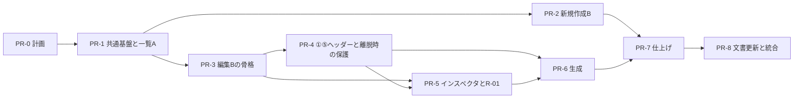

# FTA分析支援ツール 画面改修 実装計画（一覧A／新規作成B／分析編集B）

## 0. この文書について

| 項目 | 内容 |
|---|---|
| 種類 | 実装計画（調査結果と計画）。**この文書の作成では、アプリケーションコード・DB・設定値を変更していない** |
| 対象 | 採用済みの画面構成（分析一覧：A案、新規分析作成：B案、分析・編集：B案）の本番実装 |
| 状態 | 計画（作成 2026-09-27、同日に利用者の判断を反映）。第6節の28項目は、22項目を推奨案どおり採用（うち4項目は今回は対象外として採用）、6項目を条件付き採用。別提案 S-1〜S-12 は未承認（S-12 は 2026-09-29 に追加）。**2026-09-28：PR-1（共通基盤と分析一覧A）を PR #16 で実装し、受入確認は合格（自動確認は成功。利用者の Windows 実機での手動確認（対象 `516ee00`）で第8.1節の手動確認を完了）。統合用ブランチ `feature/ui-redesign` へのマージは利用者の指示による（基準ブランチへの統合は PR-8）。J 項目は PR-1 分だけを更新し、全体の完了とはしていない（第6節、第14.1節）。2026-09-28：PR-2（新規分析作成B）を PR #17 で実装し、受入確認は合格（自動確認は成功。利用者の Windows 実機（Edge・Chrome、Microsoft IME）での手動確認（対象 `9fa2967`）で第8.2節の手動確認を完了）。統合用ブランチへのマージは利用者の指示による。J 項目は PR-2 分だけを更新した（第6節、第14.2節）。2026-09-29：PR-3（分析・編集の骨格）を、利用者の判断1〜4（第6節の判断の記録）に沿って作業ブランチ `claude/intelligent-noether-fcntpc`（起点 `0d966b0`）で実装し、自動確認（pytest・必須 E2E）は成功。同日、利用者が `feature/ui-redesign` 宛ての PR の作成とコードレビューの開始を承認し、PR #18 を作成した（Windows 実機での手動確認と PR-3 の最終受入判断は未了で、マージは承認していない。コードレビューの指摘への対応は第14.3節）。J 項目は PR-3 分だけを更新した（第6節、第14.3節）。2026-09-30：PR #18 のコードレビューの指摘に対応し、Windows 実機確認の手順書（[manual-check-pr3.md](manual-check-pr3.md)）を加えた（受入は未判断）。2026-10-03：Edge は手動で確認済み（対象 `4b49914`）。Chrome の確認を、Windows の Chrome Stable での自動 E2E と限定した目視に切り替えた（利用者の判断。Chrome は未実施で、受入は未判断）。同日、E2E のページの確認で、ブラウザ自身が要求する `/favicon.ico` の 404 だけを、条件を限定した既知の例外として除いて記録することにした（利用者の判断。アプリは変えない。favicon の実装と除外の廃止は PR-7）。2026-10-06：Chrome は、Windows の Chrome Stable で `410972d` の準備確認（成功 7）・全必須 E2E（合格、成功 181）・目視4点（OK）を完了。同日、利用者が PR-3 の受入確認を「合格」と判断した（PR-3 の対象範囲。J 項目は PR-3 分だけを更新し、全体の完了とはしていない。マージは利用者が別途判断する。第6節、第14.3節）。PR-4 以降は未着手** |
| 現行仕様 | [ui-current-spec.md](ui-current-spec.md)。この計画では変更しない（更新の範囲と時期は第10節） |
| 設計資料 | [proposals/ui-design-integrated-v2.md](proposals/ui-design-integrated-v2.md)（統合案 第2版の設計記録を取り込んだもの。提案／未承認を含む）。以下「設計記録」と呼ぶ |
| UI再設計ブリーフ | [ui-redesign-brief.md](ui-redesign-brief.md) |

この計画で守る前提：

1. 画面構成（一覧A／新規作成B／分析編集B）は再検討しない。
2. 設計記録 第6.2節の暫定動作と第7節の事項は、本番実装で承認済みとして扱わない。プロトタイプで動いていることも根拠にしない。
3. プロトタイプの HTML・模擬データ・模擬生成処理を本体へ置き換え・移植しない。本体は現行の FastAPI・Jinja2・JavaScript・CSS で作る。
4. フレームワーク移行、DB変更、API契約変更、生成プロンプト・Quality Gate の変更を前提にしない。必要と判断したものは第11節の別提案に分け、理由と影響を示す。
5. 統合プロトタイプの自動確認（182項目成功）は、本体の動作確認・テスト成功として流用しない。本体の確認はすべて本体に対して新たに行う（付録B）。

---

## 1. 基準と資料

### 1.1 ブランチと SHA（2026-09-27 08:38 UTC に確認）

| 確認対象 | 方法 | 結果 |
|---|---|---|
| 基準ブランチ `claude/fta-analysis-tool-Yg5yn` の先頭（GitHub 側） | `git ls-remote origin` | `594bcd2e05dfe357168f5feeb93e293f736fcac7` |
| 同ブランチの先頭（ローカル、`git fetch` 後） | `git rev-parse` | 同上 |
| リポジトリの既定ブランチ | `git remote show origin`、`git ls-remote origin HEAD` | 既定ブランチは `claude/fta-analysis-tool-Yg5yn`（HEAD の SHA も同上） |
| 設計記録が前提とするコミット | 設計記録 第1節 | `594bcd2e…`。**現在の先頭と一致** |
| 先頭コミット | `git log` | 2026-09-25 23:08 +0900「Merge pull request #14 from fujihara-masaki/codex-1qkohi」 |
| この計画の作業ブランチ | — | `claude/nice-davinci-yoh04d`（作成時点で `594bcd2` と同じ） |

- GitHub には git（fetch・ls-remote）と GitHub API の両方で接続でき、公開側の SHA を確認できた。
- 参考：GitHub API 上では PR #1〜#14 がすべて closed（merged=false）と表示されるが、基準ブランチには各 PR のマージコミットがある。この計画はブランチの内容を正とする。
- 利用者の判断（2026-09-27）は、この計画のコミット `26f9ba932a03a2623705cd747ecf26ae8771f06e` を基準に行われた。判断を反映する作業の開始時に PR #15 の HEAD を確認し、同じコミットで J 項目に変更がないことを確かめた。
- 各 PR の着手時に基準ブランチの先頭を再確認する。`594bcd2` から進んでいれば、第2節の前提（ファイル・行番号・テスト件数）を差分で確認し直す。

### 1.2 設計資料の出所と区分

| 資料 | 取得元・識別 | 扱い |
|---|---|---|
| 設計記録 `ui-design-integrated.md`（統合案 第2版、2026-09-27） | Artifact `https://claude.ai/artifact/HzSGnCu7hBnQHP2vVMvqVh`（版 `1790489920-a380`）の公開ファイル。SHA-256 `2659147e…33acb7ac`。資料の基準コミット `594bcd2` | 精読し、[proposals/ui-design-integrated-v2.md](proposals/ui-design-integrated-v2.md) に取り込んだ。本文は原文のまま、先頭に出所・版・基準SHA・「提案／未承認」の区分を追記 |
| 統合プロトタイプ `index.html` | 同 Artifact。SHA-256 `84c66d3b…f10952a0` | 画面部品・導線・模擬処理の把握にだけ使用。**取り込まない** |
| 検証記録 `evidence/results.json`・`repro.json`・画像 | 同 Artifact（results.json の SHA-256 `d5d161a3…`） | 確認項目の把握にだけ使用。結果は流用しない |
| `fta-integrated-v2.zip` | 利用者の手元 | **本環境では取得できず未確認**。上記 Artifact の公開ファイル一式（23ファイル）と同じ内容かは確認していない（Google Drive は権限不足で検索できなかった） |
| A/B構成比較 第3版 | Artifact `https://claude.ai/artifact/ADfPrgnntgsnacFX2tyPxY` | 設計記録が参照する R-01（要因切替時の未保存確認の対象経路）と D-01（直接要因評価・メモの表示）の定義確認にだけ使用 |

### 1.3 調査方法と確認の区分

| 区分 | 内容 |
|---|---|
| コード確認 | テンプレート4本、`static/app.js`、`static/style.css`、`main.py`、`crud.py`、`models.py`、`schemas.py`、`database.py`、`services/export_service.py`、`services/sample_scenarios.py`、`services/ai_provider.py`（生成呼出し部分）、関連テスト |
| テスト実行 | 既存テスト一式を実行：**269 passed / 1 skipped**（skip は pwsh がないための `test_run_langgraph_comparison_script.py` の構文チェック）。Python 3.11.15、`requirements.txt` の固定版。仮想環境・DB・キャッシュはリポジトリの外に置いた |
| 模擬プロバイダでの実測 | アプリを変更せず、リポジトリ外の起動用スクリプトで AI プロバイダだけを「3秒待って2件返す」スタブに差し替えて起動し、HTTP と Chromium（headless shell 141.0.7390.37、Playwright 1.48.0）で確認。**実LLMは呼んでいない**。手順は付録A。スクリプトはリポジトリに含めていない |
| 未確認 | 実LLM、Windows・macOS の実ブラウザ、表示倍率、BIZ UDPGothic での表示、利用者環境のブランチ・`.env`・DB（第12節） |

---

## 2. 現行実装の要点

### 2.1 画面とファイル

| 画面 | URL | テンプレート | JavaScript | 使う API |
|---|---|---|---|---|
| 分析一覧 | `GET /` | `index.html` | `app.js`（改名・削除） | `POST /analyses/{id}/title`、`POST /analyses/{id}/delete`、`GET /analyses/{id}/export/{json,csv,markdown}` |
| 新規分析作成 | `GET /analyses/new` | `analysis_form.html`（サンプル処理はテンプレート内のスクリプト） | テンプレート内 | `POST /analyses`（フォーム送信 → 303 で編集画面へ） |
| 分析・編集 | `GET /analyses/{id}` | `analysis_detail.html` | `app.js` | タイトル・頂上事象・参考情報の更新、生成、要因の取得・更新・削除・追加、出力 |

共通：`base.html` のヘッダー（分析一覧・新規作成）とトースト（`role="status"`。成功・エラーは3秒、警告は6秒で消える）。CSS は `style.css` 1本。文字は端末のフォント（`'Segoe UI', 'Hiragino Sans', 'Meiryo'`）で、外部から読み込むリソースはない。

### 2.2 保存と画面更新の現状

| 操作 | API | 関数（app.js） | 成功後 | 失敗時 |
|---|---|---|---|---|
| 分析タイトル（編集画面） | `POST /analyses/{id}/title` | `saveAnalysisTitle`（フォーカスが外れた時・Enter） | そのまま | トーストとタイトル下の表示 |
| 分析タイトル（一覧） | 同上 | `startTitleRename` → `saveAnalysisTitle` | セルを戻して文字を更新 | API の理由を「保存に失敗しました」で上書き（C-02） |
| 頂上事象 | `POST /analyses/{id}/top-event` | `saveTopEvent`（ボタン） | `data-saved` を更新 | トースト |
| 参考情報2種 | `POST /analyses/{id}/context` | `saveAnalysisContext`（ボタン） | `data-saved` と「入力済み／未入力」を更新 | トースト |
| 評価 Yes/No/未 | `POST /nodes/{id}/update` | `setJudgement` | カードと一覧表を更新（**ツリー表示は更新しない**、C-04） | トースト |
| 要因タイトル（カード上） | 同上 | `saveNodeTitle`（フォーカスが外れた時） | **応答を確認しない**（C-03） | コンソールのみ |
| 詳細（モーダル） | `GET /nodes/{id}` → `POST /nodes/{id}/update` | `openNodeDetail`・`saveNodeDetail` | 再読み込み | トースト |
| 手動追加 | `POST /analyses/{id}/nodes/add-level1`、`POST /nodes/{id}/children` | `submitAddNode` | 再読み込み | トースト（重複は 409 の理由） |
| 要因の削除 | `POST /nodes/{id}/delete` | `deleteNode`（`confirm`） | 再読み込み | トースト |
| 分析の削除 | `POST /analyses/{id}/delete` | `deleteAnalysis`（`confirm`） | 再読み込み | トースト |
| 生成 | `POST /analyses/{id}/generate/level/{n}` | `generateFactors`・`generateFactorsSequential`・`generateAdditional` | 作成が1件以上なら再読み込み | トースト・一時バッジ |

- 再読み込みは `reloadPreservingScroll()`（app.js:30）で、カード列のスクロール位置だけを sessionStorage で戻す。「選択中の要因」という状態はない。ツリー・一覧表・参考情報の開閉は分析ごとに localStorage（analysis_detail.html:440-457。try/catch なし）。
- 分析の `updated_at` は、分析項目の保存と要因の作成で更新され、要因の評価・更新・削除では更新されない（crud.py）。

### 2.3 生成処理とサーバーの並行性

- `generate_factors` は `async def`（main.py:318）だが、要求本文の読み込み（`await request.json()`）の後は await がなく、AI プロバイダの呼出しは同期処理（`httpx.Client`、再試行時の `time.sleep`）で行われる。このため **LLM の応答を待つ間、uvicorn（単一ワーカー）は他のリクエストを処理しない**。
- 1回の生成要求の中で、プロバイダ内の再試行、件数不足時の再試行、LangGraph の再生成が起こり得る。各 LLM 呼出しは `OLLAMA_TIMEOUT_SECONDS`（`.env.example` では360秒）まで待つ。
- README と比較試験スクリプトの起動方法は、いずれも単一ワーカー。
- 親を指定した生成は、親が同じ分析内に見つからなければ `success:false`・「生成対象の親要因がありません（Yes評価の要因がありません）」を返す（main.py:341-359）。**親の階層が「生成する階層−1」かどうかは検査しない**。
- SQLite の外部キー制約は有効にしていない（database.py）。主キーは AUTOINCREMENT なしのため、最大 ID の行を消すと同じ ID が再利用される。

### 2.4 実測結果（模擬プロバイダ、付録A）

| # | 手順 | 構成 | 結果 |
|---|---|---|---|
| M-1 | 二次生成（3秒）の開始0.6秒後に、一覧表示と親要因の削除を同時に送る | 単一ワーカー | 一覧表示・削除とも生成完了（約3.1秒）まで応答がなかった。削除は生成の後に実行され、作られた子要因ごと親が消えた。不整合なし（2回とも） |
| M-2 | 二次生成（3秒）の実行中に、一覧表示と親要因の削除を送る | 2ワーカー | 削除は0.6秒で完了し、その後の生成が**削除済みの親を参照する子要因2件を保存**した（3回とも）。いずれの回も削除した親の ID が新しい子要因に再利用され、**子要因が自分自身を親とする**状態になった |
| M-3 | 親の後に兄弟要因がある状態で M-2 と同じ手順 | 2ワーカー | 親のない子要因2件が残った。JSON 出力には含まれ、Markdown 出力には現れない |
| M-4 | 一次生成の実行中に分析を削除し、直後に別の分析を作成 | 2ワーカー | 削除済み分析の ID で要因が保存され、**同じ ID で作られた新しい分析の編集画面にその要因が表示された** |
| M-5 | M-3・M-4 と同じ手順 | 単一ワーカー | 削除は生成の後に実行され、不整合・混入なし |
| B-1 | 一次生成中（全画面オーバーレイ表示中）に Tab キーを押す | ブラウザ | オーバーレイの裏の「手動追加」「Yes/No/未」「詳細編集」「削除」などに移動でき、Enter で手動追加のモーダルが開いた |
| B-2 | 二次の一括生成中に操作できるか | ブラウザ | 削除・評価・「一覧へ」はいずれも操作できた |
| B-3 | 頂上事象を未保存のまま「一覧へ」 | ブラウザ | 確認なしで移動した（入力は失われる） |
| B-4 | 一覧で分析を改名 | ブラウザ | ブラウザのタブ名が「改名後のタイトル - FTA編集」に変わった（C-01） |

計画への影響：

- **実測した条件**（uvicorn 単一ワーカー・`--reload` なし、legacy 経路、3秒で応答するスタブ、上記の手順を各2〜3回）では、生成中に送った削除・一覧表示は生成が終わるまで待たされ、その結果として親子の不整合・別分析への混入は起きなかった（M-1・M-5）。**これは現行の単一ワーカー構成が一般に安全であることの証明ではない**。確認していない条件：実LLM（タイムアウト・再試行を含む長時間の処理）、LangGraph 経路・Quality Gate を有効にした場合、一括生成で親ごとの要求の**合間**に別タブの削除が入る場合、同じ親への生成要求を複数タブから送る場合、`--reload` での起動、ほかの ASGI サーバー・起動オプション。待たされる動きはサーバーの実装（同期処理が要求の処理を止めること）の副作用で、仕様として保証されたものではない。
- 画面側で「生成中もほかの操作を許す」と、その操作は生成が終わるまで（実LLMでは数分）待たされることがある（第5.3節、J-01）。
- ワーカー数を増やす、または生成処理を並行化すると M-2〜M-4 が起きた。画面側の抑止では別タブからの操作を防げない。並行化（S-7）へ進む条件は第11節に示す（S-1 だけでは足りない）。

### 2.5 現行の不具合・注意点

| ID | 内容 | 根拠 | 扱い |
|---|---|---|---|
| C-01 | 一覧で改名すると、ブラウザのタブ名が「… - FTA編集」に変わる | app.js:94、B-4 | PR-1 で修正（J-23） |
| C-02 | 一覧の改名失敗時、API の具体的な理由を「保存に失敗しました」で上書きする | app.js:157、現行仕様 §8.2 | PR-1 で修正（J-23） |
| C-03 | カード上の要因タイトル保存が応答を確認しない。空にすると画面だけ空になる | app.js:521-533、現行仕様 §8.1 | カード上の直接編集をやめる（J-10）ことで解消 |
| C-04 | 評価の変更がツリー表示に反映されない（再読み込みまで古い） | app.js:479-518 | PR-3 で全表示を同期（J-23） |
| C-05 | 一次生成中の全画面オーバーレイは、マウス操作だけを止め、キーボード操作を止めない | B-1 | J-01・J-05 |
| C-06 | 一括生成で成功と失敗が混在すると、失敗が通知されない | app.js:407-422、現行仕様 §5 | J-04 |
| C-07 | 画面を離れるときの未保存確認がない | B-3 | J-12 |
| C-08 | Enter で確定する処理が、日本語入力の変換中かどうかを確認しない（変換確定の Enter で保存・確定が走るおそれ） | app.js:162、805-813 | 新しい処理は変換中の Enter を無視する。実機で確認（第12節） |
| C-09 | 一覧表の「親要因」列は、親が見つからない要因を「（頂上事象）」と表示する | analysis_detail.html:325 | J-25 |
| C-10 | localStorage を try/catch なしで使う。保存領域が使えない環境で例外になる | analysis_detail.html:450-454 | 保存領域はすべて例外を処理して使う |
| C-11 | 新規作成のタイトルは空白だけ・256文字以上でも作成できる（改名は必須・255文字以内） | analysis_form.html、main.py:188 | J-22（画面側の入力制限のみ。サーバーは S-9） |

### 2.6 画面の文言・構造に依存する既存テスト

画面を作り直すと、次のテストは HTML の文字列が変わるため失敗する。**テストの意図を保って書き換える**（付録C）。

- `tests/test_analysis_context.py`：`test_new_analysis_form_shows_visible_context_fields`（テンプレート内スクリプトの文字列 `getElementById('systemContextInput').value = sample.system_context` を確認）、`test_create_analysis_without_context_keeps_legacy_behavior`（「分析コンテキスト」「未入力」）、`test_detail_page_renders_saved_context`（「入力済み」）、`test_detail_page_safe_on_broken_context_json`（「分析コンテキスト」）

API・出力・生成のテスト（`test_ui_endpoints.py`、`test_generate_endpoint.py`、`test_export_service.py` など）は、画面改修で変わらないことを確かめる回帰テストとして、そのまま通ることを受入条件にする。

---

## 3. 新しい画面構成と現行ファイルの対応

### 3.1 ファイルの対応

| 現行 | 改修後の役割 | 主な変更 |
|---|---|---|
| `templates/base.html` | 3画面共通の枠 | ヘッダー（ブランド、分析一覧、新規作成。現在の画面を `aria-current="page"` で示す）、本文へのスキップリンク、通知領域（`role="status"` と、エラー用の `role="alert"`）、共通の JS・CSS の読み込み |
| `templates/index.html` | 分析一覧（A案） | 表・操作列（編集／出力▾／削除）・行内改名・空状態 |
| `templates/analysis_form.html` | 新規分析作成（B案） | 2列（左：1 分析の名前と頂上事象、2 AIへの参考情報／右：入力の使われ方、サンプル）。フォーム送信（`POST /analyses`）は現行のまま。テンプレート内スクリプトは静的ファイルへ移し、サンプルはデータ（JSON）として埋め込む |
| `templates/analysis_detail.html` | 分析・編集（B案） | 部分テンプレート（ヘッダー、作業ステップ、構造ナビ、作業リスト、ツリー、一覧表、インスペクタ、ダイアログ）に分ける。要因の要約をデータ（JSON）として埋め込む |
| （新規）`templates/_macros.html` など | 共通部品 | 評価の切替（Yes/No/未）、タグ（階層・AI・手動・要確認・直接要因評価・メモあり）、出力メニュー、保存状態表示 |
| `static/app.js` | 分割 | 共通（通信、通知、ダイアログ、メニュー、未保存管理と移動の確認、文字の正規化、日本語入力中の Enter の判定、保存領域）と画面別（一覧、新規、編集：選択と同期、インスペクタ、生成、部分更新）に分ける。ブラウザ標準の ES モジュールで読み込み、ビルド工程は追加しない。旧関数は置き換えが終わった PR で削除する |
| `static/style.css` | 分割・整理 | デザイントークン（色・余白・文字）、共通部品、画面別。ライトテーマのみ（J-27）。外部フォントは読み込まない（J-28） |
| `main.py` | テンプレートへ渡す値の追加のみ | 一覧：分析ごとの要因数（J-13）。編集：要因の要約データ、生成件数の設定値（`_get_factor_count` の値）、親が見つからない要因の区分。**ルート・API・応答形式は変えない** |
| `crud.py` | 集計関数の追加のみ | 一覧の要因数を1回の集計で求める関数（J-13 採用時）。既存関数は変えない |
| `models.py`・`schemas.py`・`database.py`・`services/` | 変更しない | — |
| `tests/` | 追加・書き換え | テンプレートの構造テスト（pytest）、実ブラウザのテスト（J-26）、付録Cの書き換え |

### 3.2 画面ごとの構成要素

#### 分析一覧（A案）

| 要素 | 内容 | データ |
|---|---|---|
| 見出し行 | 「FTA分析一覧」、件数と並び順（更新日時の新しい順）、「＋ 新規分析を作成」 | サーバー描画 |
| 表 | タイトル（編集画面へのリンク）と ✎、頂上事象（2行で省略）、作成日時、更新日時、操作 | 同上。並びは `crud.get_analyses`（更新日時の降順）のまま |
| 行内改名 | 入力欄・保存・取消・文字数・エラー。Enter で保存、Esc で取消、必須・255文字 | `POST /analyses/{id}/title` |
| 出力▾ | JSON・CSV・Markdown と、それぞれに含まれる項目の説明（第4節 UI-04 の注） | 現行の出力 URL（`download` 属性付き） |
| 削除 | 画面内ダイアログ。タイトルと要因数（一覧表示時点）を表示 | `POST /analyses/{id}/delete` |
| 空状態 | 説明と「＋ 新規分析を作成」 | — |

#### 新規分析作成（B案）

| 要素 | 内容 |
|---|---|
| 左「1 分析の名前と頂上事象」 | 分析タイトル（必須）、頂上事象（任意・後から編集可。一次要因の生成に必須である旨） |
| 左「2 AIへの参考情報」 | システム構成・対象範囲、障害発生時の状況・観測事実（2列） |
| 操作 | キャンセル（入力があれば確認）、作成して編集へ（二重送信防止） |
| 右「入力の使われ方」 | 頂上事象・参考情報・作成後の画面の説明 |
| 右「サンプルから入力（デモ用）」 | 選択 → プレビュー → 「この内容を入力欄へ転記」。転記後は「サンプルを転記済み・未保存」と表示。`demo_points` は現行どおり非表示の項目で送る |

#### 分析・編集（B案）

| 要素 | 内容 |
|---|---|
| ヘッダー | 分析タイトルと ✎（行内編集）、AI プロバイダ名、出力▾、一覧へ |
| 作業ステップ | ① 頂上事象・参考情報、② 一次要因、③ 二次要因、④ 三次要因、⑤ 確認・出力。順序は強制しない。各ステップに状況（件数・未評価・未保存あり等） |
| 構造ナビ（左） | 頂上事象から三次要因までの木。評価の印・要確認・手動。選ぶと右のインスペクタと作業ステップが切り替わる |
| 中央 | 表示タブ「作業／ツリー／一覧表」。作業：①の入力欄、②〜④の操作バー（通常生成・追加生成・手動追加）・生成ログ・親グループごとの作業リスト、⑤の集計と出力 |
| インスペクタ（右） | パンくず、タグ、評価（即時保存）、品質警告、要因（タイトル・説明・メモ）、直接要因評価一式、子要因（リンク、AIで追加生成、手動追加）、削除、保存・取消 |
| ダイアログ | 未保存の確認（要因の切替・画面移動）、削除確認、手動追加 |

### 3.3 プロトタイプから取り込むもの・取り込まないもの

| 取り込む（設計意図として実装し直す） | 取り込まない |
|---|---|
| 3画面の構成・配置・導線、見出しと操作の文言 | ページ全体を `innerHTML` で描き直す方式（`render()`）。フォーカス・入力中の状態・読み上げが失われやすい |
| 部品の見た目の方針（評価の切替、タグ、保存状態表示、出力メニュー、ダイアログ、下部中央の通知） | 架空データ（`SEED`・`SAMPLES`）、模擬生成（`POOL`・`startGen`・`finishGen`）、模擬の保存 |
| R-01 の経路（要因の切替で未保存を確認する操作の一覧） | 検証用の表示と操作（紫の帯、採用元の表示、「生成の模擬結果」「架空データを初期状態に戻す」） |
| 生成結果の区分（作成・候補0件・全候補除外・処理失敗・通信失敗・親なし）という考え方 | ボタンの `mousedown` を止めてフォーカスを保つ細工（第5.7節で別の方法にする） |
| 日本語入力中（`isComposing`）の Enter を無視する扱い | Google Fonts・IBM Plex Mono の読み込み（J-28）、ダークテーマ（J-27） |
| | 固定の高さ（700px）・最小幅（1200px） |
| | 設計記録に記載のない動作：サンプル転記でタイトルが空ならサンプル名を入れる（J-21）、編集画面ヘッダーの「更新 日時」（J-15） |
| | 出力の項目差の表のうち、現行の出力と合わない記載（第4節 UI-04 の注） |

### 3.4 Jinja2 と JavaScript の分担（設計記録 第10節4への回答）

1. **サーバー描画を正とする**。構造ナビ、作業リスト（全階層）、ツリー、一覧表、⑤の集計、各ステップの状況は Jinja2 が描く。利用者の入力や LLM が出した文字列は Jinja2 の自動エスケープで出力する。
2. **要因の要約をデータとして埋め込む**。`<script type="application/json" id="analysis-data">`（`tojson`）に、要因ごとの ID・親 ID・階層・タイトル・評価・直接要因評価・AI/手動・要確認の有無・メモの有無を入れる。生成対象の親、子孫件数、各ステップの件数は、このデータから求める（画面に表示されているかどうかに依存させない）。PR-3 では、絞り込みのための説明と、J-25 の区分・表示文・生成と手動追加の親にできるか・削除の可否と理由（サーバーで計算したもの）も入れた。メモ・品質警告の本文と `demo_points` は入れない（第5.9.5節、第14.3節）。
3. **画面の状態は JavaScript が持つ**：選択中の要因、作業ステップ、表示タブ、絞り込み、未保存の下書き、生成中かどうか、生成ログ。各表示の要素に `data-node-id` を付け、選択の強調や評価の表示を一つの更新関数で全表示に反映する。
4. **詳細はインスペクタを開くときに取得する**。現行のモーダルと同じく `GET /nodes/{id}` から最新の値を読む（メモ・根拠などを空で上書きしないため）。速く選択を切り替えたときは、最後に選んだ要因の応答だけを使う。
5. **構造が変わる操作の後は部分更新する**。手動追加・削除・生成の後は、同じ URL（`GET /analyses/{id}`）の HTML を取得し、構造ナビ・作業リスト・ツリー・一覧表・⑤・ステップの状況・埋め込みデータだけを差し替える。**インスペクタと①の入力欄は差し替えない**ので、下書き・選択・生成ログが残る（PR-3 のインスペクタは下書きを持たないため、取得した HTML ではなく新しい埋め込みデータから同じ選択の内容を描き直し、詳細を取り直す。第14.3節）。新しい API は作らない。分析が見つからない（404）場合は「分析が見つかりません（削除された可能性があります）」と表示して操作を止める。取得に失敗した場合は、未保存の入力がなければ再読み込み（状態は第5.5節の方法で戻す）、あれば再読み込みせず「最新の表示に更新できませんでした」と表示する。
   **古い応答による巻き戻りを防ぐ**（第13節 P-3）：
   - 部分更新の要求ごとに連番を付け、最後に**発行した**連番の応答だけを反映する。先に発行した取得が後から届いても捨てる。
   - 評価の保存など、画面をその場で更新する書き込みにも「書き込み連番」を付ける。部分更新の取得を**発行した時点**より後に書き込みが始まった（または完了した）場合、その取得の応答は古い可能性があるため反映せず、取得をやり直す。
   - 書き込みの送信中は部分更新の取得を発行しない（書き込みの完了を待ってから取得する）。単一ワーカーでは要求の処理順が送信順と一致しない場合があるため、送信順に頼らない。
   - 反映後に、埋め込みデータの各要因の値（評価など）が、画面側で確定済みの最新の書き込み結果と食い違う場合は、画面の値を上書きせずに取得をやり直す（2回続けて食い違う場合は「表示を最新にできませんでした」と表示し、再読み込みを促す）。
   - 生成中は部分更新を行わない（生成の完了後に1回行う）。
6. **利用者の入力や LLM の文字列を `innerHTML` に連結しない**。JavaScript で作る表示は `textContent` と DOM API で組み立てる。

---

## 4. UI-01〜UI-17 の変更箇所と機能維持の確認

確認方法の記号：T-xx は pytest（サーバー側）、E-xx は実ブラウザのテスト（第8.9節で定義、J-26）、M は手動確認。「既存」は現行のテスト一式がそのまま通ること。

| ID | 現行の実装（根拠） | 改修後の場所 | 主な変更 | 維持すること | 確認方法 | PR |
|---|---|---|---|---|---|---|
| UI-01 分析を開く | `index.html` の表、`crud.get_analyses`（更新日時降順） | 一覧の表。タイトルのリンク、「編集」 | 表の見た目、見出し行の件数表示 | 並び順、リンク先 `/analyses/{id}`、0件の空状態と作成への導線 | T-02、E-L01、E-L08、M | PR-1 |
| UI-02 一覧で改名 | `startTitleRename`・`saveAnalysisTitle`、`POST /title` | タイトル横の ✎ → 行内編集 | 保存・取消・文字数の表示、変換中の Enter を無視、API の理由をそのまま表示（C-02）、タブ名を変えない（C-01）、未保存の確認（J-12） | 必須・255文字（前後の空白を除く）、Enter で保存・Esc で取消、`updated_at` の更新 | E-L02〜E-L05 | PR-1 |
| UI-03 分析を削除 | `deleteAnalysis`（`confirm`）、`POST /delete`、cascade | 一覧の「削除」→ 画面内ダイアログ（J-13） | 要因数の表示、失敗時はダイアログ内に理由、成功時は行を消す | 分析と全要因・評価・メモが消えること、取り消せない旨の警告 | 既存（`test_delete_analysis_*`）、E-L06 | PR-1 |
| UI-04 出力 | 一覧・編集の出力リンク、`export_service.py` | 一覧の「出力▾」、編集ヘッダーの「出力▾」、⑤の項目差の表 | メニュー化と項目の説明、`download` 属性（入力中でも離脱確認が出ないように） | URL・ファイル名・形式ごとの内容（出力処理は変えない） | 既存（`test_export_service.py` 等）、T-06、E-L07、E-E13 | PR-1、PR-4 |
| UI-05 分析を作成 | `analysis_form.html`、`POST /analyses` → 303 | 新規作成の2列フォーム →「作成して編集へ」 | 2列化、タイトルの入力制限（J-22）、二重送信防止、未入力時の画面内エラー、キャンセル時の確認 | フォームの項目名（`title`・`top_event`・`system_context`・`incident_context`・`demo_points`）、303 の遷移先、参考情報の JSON 保存 | 既存（`test_create_analysis_*`）、T-03、E-N01・E-N02・E-N04・E-N05 | PR-2 |
| UI-06 サンプル | テンプレート内の `onSampleSelect`・`applySample` | 右のパネル →「この内容を入力欄へ転記」 | 右パネルへの移動、「転記済み・未保存」の表示、スクリプトの静的ファイル化 | 転記は未保存（作成で保存）、`demo_points` を非表示の項目で送る、タイトルは転記しない（J-21） | T-03、E-N03 | PR-2 |
| UI-07 タイトル・頂上事象 | `contenteditable` の h1（フォーカスが外れたら保存）、頂上事象の保存ボタン | ヘッダーの ✎、「① 頂上事象・参考情報」 | タイトルは入力欄での行内編集（Enter・Esc・フォーカスが外れたら保存）。頂上事象に保存状態表示（J-11） | タイトル必須・255文字、頂上事象は空でも保存可、一次の通常・追加生成の前の自動保存 | E-E10・E-E11、E-G01 | PR-4 |
| UI-08 参考情報2種 | `saveAnalysisContext`・`ensureAnalysisContextReady`、`POST /context` | 「① 頂上事象・参考情報」の2欄 | 保存状態表示、生成前に自動保存されることを画面に明記 | 全生成経路での自動保存、`demo_points`・未知のキーを保持、`demo_points` を画面に出さない | 既存（`test_update_context_*`、`test_updated_context_is_passed_*`）、T-04、E-E09・E-E10、E-G01 | PR-4 |
| UI-09 通常生成 | `generateFactors`・`generateFactorsSequential` | ②〜④の操作バー「通常生成」 | 対象の親名と件数の表示（J-06、J-07）、生成ログ（J-02〜J-04）、生成中の操作制限（J-01、J-05） | 一次は頂上事象が必須、二次・三次は Yes の全親が対象、親ごとに順に要求、生成件数は設定値、処理中は全生成ボタンを無効 | 既存（`test_generate_endpoint.py`）、E-G01〜E-G05 | PR-3（配置のみ）、PR-6 |
| UI-10 追加生成 | `generateAdditional`（`additional:true`） | 操作バー「追加生成」、親グループ見出し「AIで追加生成」、インスペクタの子要因欄 | 追加先の明示、件数は設定値（`FTA_ADDITIONAL_FACTOR_COUNT`）を表示 | 一次は一括、二次・三次は特定の親。親が No・未評価でも実行可（J-16） | E-G07 | PR-3（配置のみ）、PR-6 |
| UI-11 手動追加 | `showAddNodeModal`・`submitAddNode` | 操作バー、親グループ見出し、インスペクタ → ダイアログ | 追加先の明示、重複（409）の理由をダイアログ内に表示、追加後に自動選択（R-01 の確認を通す） | AI を使わない、手動・未評価で作られる、同じ親の下の同名は不可 | 既存、E-E17 | PR-3（配置のみ）、PR-5 |
| UI-12 評価 Yes/No/未 | `setJudgement`、カードの3ボタン | 作業リストの各行、インスペクタ上部 | 全表示（構造ナビ・作業リスト・ツリー・一覧表・インスペクタ・ステップの件数・生成対象）へ反映（C-04）。同じ要因への連続クリックは順に処理 | 選んだ時点で保存、直接要因評価とは別の値、Yes だけが通常生成の対象 | E-E03 | PR-3 |
| UI-13 詳細編集 | 詳細モーダル（`GET /nodes/{id}` → 保存 → 再読み込み） | インスペクタ（「保存」で確定） | モーダルをやめ、常時表示のインスペクタで編集。保存状態表示、切替時の確認（R-01） | 開くときにサーバーの値を読む、保存項目（タイトル・説明・メモ・直接要因評価・評価コメント・根拠・再発防止策）、評価は送らない | 既存（`test_get_node_*`、`test_detail_roundtrip_*`）、E-E14・E-E15・E-E18 | PR-3（旧モーダルを暫定利用）、PR-5 |
| UI-14 タイトル編集・削除 | カード上の直接編集（C-03）、`deleteNode`（`confirm`） | タイトルはインスペクタ（J-10）。削除はインスペクタ下部（子孫件数、J-13） | カード上の直接編集の廃止、削除確認のダイアログ化 | 空タイトルは保存しない、子孫も削除、取り消せない旨の警告 | 既存（`test_delete_*_cascades_*`）、E-E16 | PR-5 |
| UI-15 絞り込み | `applyNodeFilter`（カード・一覧表のみ） | 作業リスト・一覧表の上部。構造ナビとツリーは強調のみ（J-08） | 構造ナビ・ツリーの強調、一致件数の表示 | 名前・説明の文字検索と評価・要確認の AND、作業リストと一覧表での非表示、生成対象を変えない（J-07） | E-E04、E-G02 | PR-3 |
| UI-16 3表現 | カード列、`<details>` のツリーと一覧表（開閉を localStorage に保存） | 表示タブ「作業」「ツリー」「一覧表」と常時表示の構造ナビ | 表示の切替をタブにする。状態は URL のハッシュと sessionStorage（第5.5節）。旧 localStorage のキーは使わない | 3つの表現と各表現の表示項目（親、評価、直接要因評価、警告、説明） | T-04、E-E05・E-E06 | PR-3 |
| UI-17 品質警告 | 要確認バッジ（ホバー・クリックでトースト）、モーダル・一覧表・出力 | 要確認バッジ → 選択してインスペクタの「品質警告」欄に全文 | トーストでの表示をやめ、インスペクタに表示 | `warning_flags` の表示、一覧表の警告列、出力（変更なし） | T-04、E-E02 | PR-3 |

UI-04 の注（出力の項目差）：設計記録とプロトタイプの表記のうち、現行の出力（`export_service.py`）と合わない点がある。画面の説明は次の表（現行の出力に基づく）に合わせ、T-06 で出力の中身と一致することを確認する。

| 項目 | JSON | CSV | Markdown |
|---|---|---|---|
| 分析タイトル | あり | なし | なし（見出しは固定の「FTA分析結果」） |
| 頂上事象 | あり | なし | あり |
| 参考情報（デモ観点を含む） | あり | なし | あり |
| 作成・更新日時 | あり | なし | なし |
| 要因の階層・親子 | あり（ID・親ID・階層） | あり（ID・レベル・親ID・親要因） | あり（入れ子のリスト） |
| 説明 | あり | あり | なし |
| AI／手動 | あり | あり | なし |
| 評価（Yes/No/未評価） | あり | あり | あり |
| 直接要因評価・評価コメント | あり | あり | あり（未評価の状態は出さない） |
| 根拠 | あり | あり | なし |
| 再発防止策 | あり | あり | あり |
| メモ | あり | あり | なし |
| 品質警告 | あり | あり（要確認・警告理由・品質ステータス） | なし |

プロトタイプとの違い：CSV は参考情報だけでなく分析タイトル・頂上事象も含まない。Markdown は分析タイトルと AI／手動を含まない。

---

## 5. 重点検討事項

### 5.1 未保存内容の保護と、保存失敗時に移動しない制御

#### 未保存として扱う入力

| 画面 | 対象 | 保存方法 | 保存前の検査 |
|---|---|---|---|
| 分析一覧 | 改名中のタイトル（元と異なる場合） | `POST /analyses/{id}/title` | 必須・255文字 |
| 新規分析作成 | タイトル・頂上事象・参考情報2種のいずれかに入力あり | 「作成して編集へ」でのみ保存（「保存して移動」は置かない） | — |
| 分析・編集 | 分析タイトル（行内編集中） | `POST /analyses/{id}/title`（フォーカスが外れた時点。移動時も保存し、確認は出さない） | 必須・255文字。空なら移動を止める |
| 分析・編集 | 頂上事象 | `POST /analyses/{id}/top-event` | なし（空でも保存可） |
| 分析・編集 | 参考情報2種 | `POST /analyses/{id}/context`（1回で2項目） | なし |
| 分析・編集 | インスペクタの下書き（タイトル・説明・メモ・直接要因評価・評価コメント・根拠・再発防止策） | `POST /nodes/{id}/update`（1回。評価は含めない） | タイトル必須 |

- 未保存かどうかは、**保存時と同じ正規化（前後の空白の除去、改行コード CRLF/LF の統一）を両辺に適用して**比較する。入力して元に戻した場合は未保存に数えない。開いた直後に「未保存」と表示されないことを、CRLF を含む値で確認する（E-E10）。
- 手動追加ダイアログの入力は、ダイアログを閉じると破棄する（ダイアログ表示中は画面を移動できない）。

#### 移動の種類と扱い

| 移動 | 例 | 扱い |
|---|---|---|
| 画面内のリンク | ヘッダーの「分析一覧」「新規作成」、「一覧へ」、一覧のタイトル・「編集」、「キャンセル」 | クリックを横取りし、未保存があれば画面内ダイアログ（保存して移動／破棄して移動／編集を続ける。新規作成は入力を続ける／破棄して移動）。なければそのまま移動 |
| 要因の切替 | R-01 の経路（構造ナビ、作業リストの行、親グループ見出しの親名、ツリー、一覧表、要確認バッジ、パンくず、子要因リンク、手動追加後の自動選択） | インスペクタに未保存があれば同じ3択のダイアログ |
| ブラウザ操作 | 戻る・進む・再読み込み・タブを閉じる・URL 入力 | `beforeunload` によるブラウザ標準の確認。文言は変えられず「保存して移動」は出せない。未保存があるとき・生成中・保存中だけ登録し、なければ外す（戻る・進むの高速表示を妨げないため） |
| 出力 | 出力メニューのリンク | ダウンロードで画面は残るため確認しない。`download` 属性を付け、ブラウザが離脱確認を出さないことを E-L07 で確かめる |
| フォーム送信 | 「作成して編集へ」 | 送信時に確認を外す |

#### 「保存して移動」の手順

1. 送信中の保存があれば、その完了を待つ。10秒を超えたら「サーバーが別の処理（生成など）を実行中の可能性があります」と表示して待ち続ける。要求は取り消さない（取り消してもサーバー側では保存されることがあるため）。
2. すべての未保存項目を検査する。不備（要因タイトルが空など）があれば**何も送らず**、ダイアログに理由を出して移動しない。
3. 要因 → 頂上事象 → 参考情報 → 一覧の改名 の順に1件ずつ送る（並行して送らない）。
4. 成功した項目は、その場で「保存済み」にする（`data-saved` 等を更新）。
5. すべて成功したら確認を外して移動する。
6. 1件でも失敗したら**移動しない**。ダイアログに項目ごとの結果（保存済み／失敗と理由）を示し、「再試行」「破棄して移動」「編集を続ける」を出す。「破棄して移動」は失敗した項目だけを破棄し、保存済みの項目は戻らないことを明記する（J-12）。

「破棄して移動」は保存せずに確認を外して移動する。「編集を続ける」（と Esc）はダイアログを閉じ、フォーカスを操作した要素に戻す。

この手順は共通の保存調整処理として PR-4 で作る。対象の結び付け、結果の表示、生成中の扱い（J-01）との関係、保証しない範囲は第5.9.3節。

### 5.2 保存対象の取り違えと、複数保存の一部失敗

- **下書きは作った時点の対象に結び付ける**。インスペクタの下書きは要因 ID を持ち、保存・「保存して移動」は常にその ID へ送る（移動先・現在の選択へは送らない）。
- **古い応答を反映しない**。インスペクタの読込み・保存、評価の保存は、要求ごとに番号を付け、応答時に対象と番号が一致するときだけ画面に反映する。
- **同じ要因への評価は順に処理する**。前の要求が終わるまで次を送らない（応答の順序が入れ替わって古い評価が残るのを防ぐ）。
- **インスペクタの保存に評価（`user_judgement`）を含めない**。現行のモーダルと同じく、評価は即時保存の別経路とし、詳細の保存で評価を上書きしない。
- **保存中の切替・移動は待たせる**。インスペクタの保存中は保存・取消を無効にし、要因の切替や移動は保存の結果が出てから確認の判定をする。
- **部分更新では下書きを持つ領域を差し替えない**（第3.4節）。
- **編集中の要因が消えた場合**：自分の削除操作で編集中の要因（または祖先）を消すときは、削除確認に「編集中の変更も破棄されます」と表示する。部分更新で編集中の要因が見つからなくなったとき（別タブでの削除など）は、「編集中の要因が見つからないため、入力内容を保存できません」と表示する。別の要因を削除しても、編集中の下書きは残す（A/B比較 第3版での修正と同じ）。
- **複数保存の一部失敗**：第5.1節の手順6。項目ごとに成否を表示し、失敗した項目は未保存のまま残す。
- **別タブでの同時編集**：後から保存した内容で上書きされる（現行と同じ）。今回は対象外とし、第12節に記録する。

### 5.3 生成中に許可する操作と、削除との競合

現行の挙動（実測 B-1・B-2・M-1、コード確認）と、採用した方針（J-01 の案Cを条件付き採用）：

| 操作 | 現行：一次の生成中 | 現行：二次・三次・特定親の生成中 | 採用した方針 |
|---|---|---|---|
| 選択・表示の切替・絞り込み・スクロール | マウス不可、キーボードは可（B-1） | 可 | 可 |
| 入力欄への入力 | 同上 | 可 | 可（下書きとして保持し、保存は生成の後。第5.9.1節） |
| 評価（Yes/No/未） | 同上 | 可。ただし生成が終わるまで保存が待たされる（M-1） | 不可 |
| 詳細・頂上事象・参考情報・タイトルの保存 | 同上 | 同上 | 不可 |
| 手動追加 | 同上（手動追加モーダルが開けた） | 同上 | 不可 |
| 要因の削除 | 同上 | 可（削除は生成の後に実行される） | 不可 |
| 別の生成 | 不可 | 不可 | 不可 |
| 出力 | 同上 | 可（生成が終わるまで待たされる） | 不可（生成途中の内容を出さない） |
| 画面内の移動 | 同上 | 可（残りの親は生成されず、結果も出ない） | 不可（理由を表示） |
| ブラウザの戻る・再読み込み・閉じる | 確認なし | 確認なし | ブラウザ標準の確認 |

実装の要点（状態遷移・生成前の保存・詳細の取得待ち・下書きの扱いは第5.9.1節）：

- 生成中は、作業エリア上部に状態表示（例：「生成中（2/5 件目の親）。完了まで保存・削除・画面移動はできません。入力内容は保持されます」）を出し、読み上げにも伝える。
- 無効にする操作は、マウス・キーボードとも同じにする（オーバーレイで覆う方式はやめる、J-05）。ボタンは `disabled`、リンクは `aria-disabled="true"` とクリックの横取りで止め、理由を表示する。
- **削除は3か所で止める**（プロトタイプの I-01 と同じ考え方）：ボタンの無効化、削除確認を開く処理、削除を確定する処理。
- 別タブからの削除・複数ワーカーでの並行処理は、画面の操作制限では止められない。**画面の操作制限は同じ画面内の誤操作を防ぐためのもので、サーバー側の安全性の保証ではない**（J-01 の条件）。実測した単一ワーカーの条件では削除が生成の後に実行され不整合は起きなかった（M-1・M-5、第2.4節の限定を参照）。生成結果の表示は、生成後の部分更新で親の存在と親子関係を確かめて示す（第5.4節）。
- 生成中に画面を離れる操作は、画面内では止め、ブラウザ操作には標準の確認を出す。「中断して移動」「裏で継続」は今回置かない（継続にはサーバー側の仕組みが必要：S-10）。
- サーバーの並行化（S-7）を行う場合は、S-1（保存直前の親・分析の存在確認）を先に入れる。

### 5.4 生成結果を反映するときの親子整合性

- **対象の親と生成する階層は、埋め込みデータから決める**。通常生成の対象は「その階層−1 の Yes の要因すべて」（絞り込みで非表示でも含む、J-07）。子の階層は「親の階層＋1」とし、3を超える場合や、画面の階層と一致しない場合は送らない（サーバーは親の階層を検査しないため、画面側で誤りを作らない。サーバー側の検査は S-9）。
- **結果は要求時の親に結び付ける**。生成ログの各行は要求した親 ID をキーにし、応答の反映に現在の選択を使わない。
- **生成後は部分更新で実際の状態を表示する**。作成件数は応答の `created` を示し、部分更新後に親が見つからない場合は「親要因が見つかりません（削除された可能性があります）」と表示する。応答の作成件数と、更新後に親の下にある新しい子要因の数が合わない場合は、ログに注記する。
- **不正な親子関係を持つ要因を隠さない**（J-25、条件付き採用）。親不在・別分析への親参照・自己参照・循環・階層不一致を区別して表示し、走査が循環で止まらなくならないようにする。削除できる区分は安全性を自動テストで確かめたものに限る。詳細は第5.9.5節。一覧表の親要因列に「（頂上事象）」と誤って出さない（C-09）。
- **サーバー側の対策は別提案**：生成結果を保存する直前の親・分析の存在確認（S-1）、親の階層の検査（S-9）、外部キー制約と ID の再利用防止（S-8）。実測した単一ワーカーの条件では起きなかったが（第2.4節の限定を参照）、それ以外の条件での安全は確認していない。並行化の前提条件は第11節。

### 5.5 再読み込み後の選択要因・ステップ・表示タブの復元

| 状態 | 保持場所 | 復元 |
|---|---|---|
| 選択中の要因、作業ステップ、表示タブ | URL のハッシュ（例：`#sel=123&step=3&view=work`。`step` は ①〜⑤ を 1〜5、`sel=top` は頂上事象） | 読み込み時に検査し、要因がない・値が不正なら既定の表示に戻す（エラーは出さない）。変更は `history.replaceState` で行い、ブラウザの履歴を増やさない |
| 構造ナビ・作業エリア・インスペクタのスクロール位置 | sessionStorage（分析ごと） | 読み込み時に戻す（現行の `reloadPreservingScroll` を拡張） |
| 絞り込みの条件 | sessionStorage（分析ごと） | 同じタブの再読み込みで戻す |
| 生成ログ | sessionStorage（J-03、第5.9.2節） | 同じタブの再読み込みで戻す。「再読み込み前の結果」と明示する |
| インスペクタ・①の下書き | 保持しない | 再読み込みの前に `beforeunload` で確認する。下書きをブラウザに残すと、古い下書きで上書きする危険があるため |

- 既定の表示：一次要因があれば「② 一次要因」と最初の一次要因を選ぶ。なければ「① 頂上事象・参考情報」と頂上事象を選ぶ。**「作成して編集へ」の直後は要因がないので①が開く**（設計記録 第10節2への回答。サーバーのリダイレクト先は変えない）。
- 手動追加の後は、API が返す `node_id` を選択にして部分更新する。削除の後は、削除した要因の親（なければ頂上事象）を選ぶ。
- 保存領域が使えない環境（プライベートブラウズ等）では、例外を処理して既定の表示で動く。
- 旧版の localStorage のキー（`ftaTreeOpen_{id}`・`ftaTableOpen_{id}`・`analysisContextOpen_{id}`）は読まない。移行はしない（残っても害はない）。

### 5.6 生成結果の表示と保持範囲

1回の要求（親1件）の応答から、次の区分を決める（API は変えない）。

| 応答 | 区分 | 表示に使う値 |
|---|---|---|
| HTTP 200、`success=true`、`created>0` | 作成 N件 | `created`、`message` |
| HTTP 200、`success=true`、`created=0`、`quality_summary.all_candidates_excluded=true` | 全候補除外 | `message`（候補数・主な理由）、`reason_summary` |
| HTTP 200、`success=true`、`created=0`、全候補除外でない | 候補0件 | `message`（LLM が返さなかった） |
| HTTP 200、`success=false`、親指定あり、部分更新後に親が存在しない | 親要因が見つからない | 部分更新後のデータ |
| HTTP 200、`success=false`（上記以外） | 処理失敗 | `message`。`created>0` なら「一部作成」と併記（現行の画面は親ごとに要求するため通常は起きない） |
| HTTP 404 | 分析が見つからない | `detail` |
| その他の HTTP エラー、JSON でない応答 | サーバーエラー | 状態コード |
| 通信の例外 | 通信失敗 | — |

全親の終了後の通知（J-04）：

- 作成あり・失敗あり → 警告「二次要因の通常生成：N件作成、M件の親で失敗（詳細は生成ログ）」
- 作成のみ → 成功「…N件作成しました」（除外があれば「うち候補 K件は品質チェックで除外」）
- 作成なし・失敗あり → エラー
- 作成なし・全候補除外あり → 警告（主な理由）
- どれもなし → 警告「生成候補がありませんでした（LLMが要因を返しませんでした）」

生成ログ（J-02）：操作バーの下に、階層・種類（通常／追加）・開始時刻、進捗、親ごとの行（待機中／生成中／作成 N件／候補0件／全候補除外／処理失敗／通信失敗／親なし と理由）、要約、保持範囲の説明、「閉じる」を置く。親グループ見出しにも同じ区分のバッジを出す。区分は色だけでなく文字で示す。

保持範囲（J-03：案Bを条件付き採用）：画面内に保持し、同じタブの再読み込みでも残るよう sessionStorage に分析ごと直近1回分を保存する。保存する内容は結果区分・件数・親 ID・理由・時刻などに限り、要因の本文や下書きは保存しない。対象分析と実行時刻の表示、古い結果の区別、保存領域が使えない場合の扱い、保証しない範囲は第5.9.2節。サーバー保存（S-6）は未承認。

### 5.7 キーボード操作・フォーカス管理・実ブラウザと表示倍率での確認

#### 実装の要件

- すべての操作をキーボードだけで行える。フォーカスの表示（`:focus-visible`）を消さない。
- ダイアログはブラウザ標準の `<dialog>` と `showModal()` を使う（背景を操作不可にし、Esc で閉じる）。Esc は「編集を続ける」「キャンセル」と同じ扱い。開いたときのフォーカスは、確認・削除では安全な選択肢（編集を続ける・キャンセル）、手動追加ではタイトル欄に置く。閉じたら開く操作をした要素に戻す（その要素が消えていたら、最も近い見出し・行に戻す）。
- 表示タブは WAI-ARIA のタブの作法（`role="tablist"`・`tab`・`tabpanel`、左右キーで移動、`aria-selected`）。作業ステップは `aria-current="step"`。構造ナビは入れ子のリストとボタンで作り、選択中を `aria-current` で示す。ページ先頭に「作業リストへ」「インスペクタへ」のスキップリンクを置く。
- 出力メニューは開閉ボタン（`aria-expanded`）とリンクの一覧にし、Esc で閉じてボタンへ戻す。
- 評価の切替は `role="group"` と `aria-pressed`。
- 日本語入力の変換中（`isComposing` または `keyCode 229`）の Enter では保存・確定しない（C-08）。
- タイトルの行内編集は、フォーカスが外れたら保存する。ただし「取消」「保存」ボタンへ移った場合は保存しない（`focusout` の `relatedTarget` で判定）。macOS の Safari はボタンのクリックでフォーカスが移らないため、実機で確認する。
- 部分更新の後は、同じ要素（`data-node-id` と役割で特定）にフォーカスを戻す。要素が消えた場合は、親の行か一覧の見出しへ移す。
- 通知：進捗と結果は `role="status"` で読み上げる。エラーは閉じるまで表示し（J-24）、画面内の該当箇所にも出す。生成ログは画面の表示とし、読み上げは要所（開始・各親の完了・全体の完了）に絞る。

#### 確認する環境（利用者の環境に合わせて調整。対象ブラウザは J-20 で決める）

| 環境 | 優先度 | 確認内容 |
|---|---|---|
| Windows 11・Microsoft Edge 最新安定版 | 必須 | 第8節の全手動確認、表示倍率 100%・125%・150%（OS 設定とブラウザの拡大の両方）、幅 1280・1366・1920 |
| Windows 11・Google Chrome 最新安定版 | 必須 | 代表シナリオ（付録D） |
| Windows 11・Firefox 最新版 | 推奨 | 代表シナリオ、ダイアログ、離脱確認 |
| macOS・Safari 最新版 | 利用があれば | タイトルの行内編集（フォーカス）、ダイアログ、離脱確認 |
| 日本語入力（Microsoft IME、macOS の日本語入力） | 必須 | 変換確定の Enter で保存されないこと（改名・タイトル・手動追加・絞り込み・新規作成） |
| スクリーンリーダー（NVDA と Edge） | 推奨 | ダイアログ、通知、評価の切替、表示タブの読み上げ |

表示倍率の注意：表示倍率を上げると CSS 上の画面幅は狭くなる。例：1920×1080 で OS の表示倍率150%なら幅1280、1366×768 で125%なら幅約1093・画面の高さ約614（タスクバーとブラウザのタブ・アドレスバーを除いた表示領域は、目安で高さ500前後）。「1280px 未満は対象外」とすると、よくある設定の利用者が対象外になるため、J-20 で対応幅を決める。実ブラウザのテストでは、これらの幅と高さを画面サイズで近似して確認し、実際の拡大・OS 設定は手動で確認する。

### 5.8 外部フォントが読み込めない環境での表示

- 現行は外部リソースを読み込まない。プロトタイプは Google Fonts（BIZ UDPGothic・IBM Plex Mono）を読み込むが、この計画では**外部フォントを読み込まない**（J-28）。ローカル LLM を使う閉じたネットワークでも同じ表示にするため、また外部への通信を増やさないため。
- 文字の指定は端末のフォントだけにする：`"BIZ UDPGothic", "Yu Gothic UI", "Meiryo", "Hiragino Sans", "Hiragino Kaku Gothic ProN", sans-serif`。BIZ UDPGothic が利用者の端末に入っているかは未確認（第12節）。
- レイアウトは特定のフォントの文字幅に依存させない：文字の長さで幅が決まるボタンを固定幅の枠に入れない、長い要因名は折り返し（`overflow-wrap: anywhere`）または行数での省略、表は横スクロール枠の中に置く。
- 確認：T-01（テンプレートと CSS が外部 URL のリソースを参照しない）、E-X01（各画面を開いたときのリクエストがすべて同じサーバー宛て）、E-F01（代替フォントで、主要なボタン・見出しが欠けない・重ならない）、手動確認（BIZ UDPGothic あり・なし、ネットワーク切断時）。

### 5.9 条件付き採用の具体化（2026-09-27 の判断による）

この節は、利用者が条件付きで採用した6項目（J-01・J-03・J-12・J-20・J-25・J-26）の条件を、実装できる形に具体化したものである。**ここに書いた内容は計画であり、実装・動作確認は済んでいない。**「着手前に確認」と書いた点は、該当 PR の着手前に利用者へ確認する。

#### 5.9.1 J-01 生成中の操作：状態遷移

編集画面は次の4つの状態を持つ（画面の状態は JavaScript が持ち、ページを開き直すと必ず「通常」から始まる）。

| 状態 | 入る条件 | この状態でできること・できないこと | 画面の表示 | 出る条件 |
|---|---|---|---|---|
| 通常 | ページを開いた、または生成後処理が終わった | すべての操作 | — | 生成ボタンを押す → 生成準備 |
| 生成準備 | 生成ボタンを押した | 全生成ボタンを直ちに無効にする（二重開始を防ぐ）。「生成を取りやめる」を押せる。書き込みの新規開始は止める | 「生成の準備中：○○の保存が終わるのを待っています」と、待っている保存の名前 | 準備が成功 → 生成中。準備が失敗・取りやめ → 通常（何も生成しない） |
| 生成中 | 生成準備が成功した | 第5.3節の表のとおり（書き込み・評価の確定・保存・手動追加・削除・出力・別画面への移動を止める。閲覧と下書きの入力は可） | 「生成中（n/N件目の親）：サーバーの応答を待っています。完了まで保存・削除・移動はできません。入力中の内容は保持されます」 | 最後の親の応答、または例外 → 生成後処理 |
| 生成後処理 | 生成中が終わった（成功・失敗・例外を問わない） | 生成中と同じ制限 | 「結果を反映しています」 | 部分更新の成否にかかわらず → 通常（制限の解除は `finally` で必ず行う） |

生成準備で行うこと（順番どおり）：

1. **先行する保存の完了を待つ**。送信中の保存（評価、インスペクタの保存、頂上事象・参考情報・分析タイトルの保存）があれば、その結果が出るまで待つ。分析タイトルの行内編集中に生成ボタンを押した場合、フォーカスが外れた時点の保存が先に始まるので、それを待ってから生成する（生成要求は分析タイトルも AI に渡すため）。10秒を超えたら「サーバーが別の処理を実行中の可能性があります」と表示し、待ち続けるか「生成を取りやめる」を選べるようにする。
2. **先行する保存が失敗していたら生成しない**。「○○の保存に失敗したため、生成を開始しませんでした」と表示して通常に戻る。入力中の内容は残す。
3. **生成前の自動保存**：一次の通常・追加生成は、頂上事象（空なら生成しない）と参考情報を保存する。二次・三次の生成は参考情報だけを保存し、頂上事象は保存しない（J-09）。操作バーには操作前から「保存済みの頂上事象を使います」と表示し、頂上事象に未保存の変更がある場合は「入力中の頂上事象は使われません」と併記する。インスペクタの下書きは生成に使わないので保存しない。
4. 自動保存が失敗したら生成しない（2と同じ扱い）。

生成中の扱い：

- **詳細の取得**：生成中は要因の詳細（`GET /nodes/{id}`）を取得しない（単一ワーカーでは生成が終わるまで応答が来ないため）。生成中に別の要因を選ぶと、インスペクタには埋め込みデータから分かる項目（タイトル・階層・評価・タグ）だけを表示し、説明・メモ・直接要因評価などの欄には値を入れず「詳細は生成の完了後に取得します（取得待ち）」と表示する。**前に選んでいた要因の詳細を、新しく選んだ要因の欄に残さない**。取得待ちの間は詳細の入力欄を編集不可にする。生成開始前に読み込み済みだった要因に戻った場合は、読み込み済みの値（取得時刻を表示）を表示する。生成後処理の後、選択中の要因の詳細だけを取得する（要求の連番で、最後に選んだ要因の応答だけを使う。未保存の下書きは上書きしない）。
- **評価の確定・保存ボタン**：押せない（理由を表示）。
- **分析タイトルの行内編集**：フォーカスが外れても、Enter を押しても保存を送らない。編集欄を開いたまま下書きを保持し、「生成中のため保存していません（生成後に保存できます）」と表示する。
- **インスペクタに未保存の変更があるときの要因の切替**（「保存禁止」と「保存して移動」の両立。2026-09-27 に利用者が決定）：生成中は確認ダイアログを「編集を続ける／破棄して移動」の2択にする。
  - 編集を続ける（既定のフォーカス、Esc も同じ）：切替をやめ、選択中の要因と入力内容をそのまま保持する。
  - 破棄して移動：利用者が明示的に選んだ場合だけ、変更を破棄して切り替える。
  - 「保存して移動」は生成中は実行しない。ダイアログに「生成中は保存できません。生成が終わると保存できます」と理由を示す（ボタンを押せない状態で表示するか、文言だけで示すかは PR-6 で決める。いずれも保存要求は送らない）。
  - 未保存の変更がなければ（第5.1節の正規化で比較）、確認を出さずに切り替える。
  - 生成後処理が終わったら、通常の3択（保存して移動／破棄して移動／編集を続ける）に戻す。
  - 生成後に選択中の要因の詳細を取り直すとき、インスペクタに未保存の変更があれば、下書きの欄を上書きしない（保存済みの値として記録するだけにする）。取り直した保存済みの値が下書きを始めたときの値と違う場合は「保存済みの値が変わっています」と知らせる。
  - **初回実装では採用しないもの**（将来の追加候補、第12節）：生成中に下書きを残したまま別の要因へ移る「下書きを残して移動」、複数の要因の下書きの退避、未保存の下書きの一覧、それらをまとめて保存する機能。
- **別画面への移動**：画面内のリンクは「生成中のため移動できません。完了までお待ちください」と表示して止める（この状態では「保存して移動」の確認は出さない）。ブラウザ操作（戻る・再読み込み・閉じる）には標準の確認を出す。
- **終了時**：成功・失敗・通信の例外・JavaScript の例外のいずれでも、生成後処理を経て制限を解除する。部分更新に失敗しても解除する。制限の状態は保存しないので、再読み込みで制限が残ることはない。
- **サーバー側の安全性**：以上は同じ画面内の制限である。別タブからの操作や複数ワーカーでの並行処理に対する安全は保証しない（第2.4節、第11節 S-1・S-7・S-8）。

#### 5.9.2 J-03 生成結果の保持

- 保存先のキー：`fta:genlog:v1:<分析ID>`（sessionStorage）。分析ごとに直近1回分だけを持ち、新しい生成で上書きする。
- 保存する内容：分析 ID、開始・終了時刻、階層、種類（通常／追加）、親ごとの行（親 ID、結果区分、作成件数、理由の文言、HTTP 状態）、要約の件数。**要因のタイトル・説明などの本文、入力途中の下書きは保存しない**。親の名前は表示の時点で埋め込みデータから引く（見つからなければ「ID n」と表示する）。
- 表示：生成ログの見出しに「この分析で YYYY-MM-DD HH:MM に実行した生成の結果」と対象分析と実行時刻を示す。再読み込み後に復元した結果には「再読み込み前の結果です。件数は実行時点の値です」と表示し、現在の状態と照らして、親が現在見つからない行には「現在はこの親が見つかりません」と添える。別の分析の結果は表示しない（キーの分析 ID と画面の分析 ID が一致するときだけ読む）。
- 保存領域が使えない場合（例外・容量超過・プライベートブラウズ）：画面内の保持だけに切り替え、「この画面を開き直すと結果は消えます」と小さく表示する。生成・保存などの基本操作は止めない。
- 説明の範囲：これは「同じタブで開き直しても直近の結果を確認できる」ための仕組みで、正式な履歴の保存、下書きの復旧、ブラウザを閉じたときの確実な消去は保証しない（ブラウザがセッションを復元すると残る場合がある）。「閉じる」を押すと画面と sessionStorage から消す。

#### 5.9.3 J-12 未保存内容の保護：保存調整処理の契約（第13節 P-4）

画面を離れるとき（PR-4）と要因を切り替えるとき（PR-5）の「保存して移動」は、共通の**保存調整処理**で行う。**PR-4 が作り、PR-5 はそれを使う**（PR-5 は PR-4 のマージ後に着手し、同じ処理を別に作らない）。

保存元（保存できる入力のまとまり）の登録内容：

| 項目 | 内容 |
|---|---|
| 対象 | 分析 ID と、要因の場合は要因 ID。**編集を始めた時点で決め、変えない**。インスペクタで別の要因を開いたら、新しい保存元として登録し直す |
| 表示名 | ダイアログに出す名前（例：「要因『○○』のメモ・根拠」「頂上事象」） |
| 未保存か | 第5.1節の正規化で比較した結果 |
| 検査 | 送信前に行う検査（要因タイトル必須、分析タイトル必須・255文字など） |
| 保存 | 既存の API を1回呼ぶ。結果は成功／失敗（理由）で返す |
| 保存後 | 保存済みの値を更新し、未保存でなくする |

保存調整処理の動き：

1. 生成準備・生成中・生成後処理のときは受け付けない（J-01。その状態では画面内の移動を止めているため「保存して移動」は出ない）。
2. 送信中の保存があれば完了を待つ。
3. すべての保存元を検査する。1件でも不備があれば何も送らない。
4. 要因 → 頂上事象 → 参考情報 → 一覧の改名 の順に1件ずつ送る。ある保存元が失敗しても、残りの保存元（対象が別）は続けて送り、全件の結果を出す。
5. 全件成功なら移動する。1件でも失敗なら移動しない。
6. 結果は保存元ごとに「保存済み」「失敗：理由」「未送信：理由」で示し、「再試行」（失敗した保存元だけ送り直す）、「破棄して移動」、「編集を続ける」を出す。部分成功の後の「破棄して移動」では、「保存済みの項目は取り消されません。失敗した項目の入力だけが破棄されます」と表示する。

区別すること：

- 画面内の3択（またはJ-01 の生成中の選択肢）は、画面内のリンクと要因の切替のときだけ出す。ブラウザ操作（戻る・再読み込み・閉じる）はブラウザ標準の確認だけで、「保存して移動」は出せない。
- 強制終了（ブラウザやOSの異常終了、タブの強制終了）を含む完全な下書きの復旧は保証しない。下書きをブラウザに保存する機能も作らない。

#### 5.9.4 J-20 幅・表示倍率

- 幅と高さは、**ブラウザがレイアウトに使う表示領域**（CSS ピクセル。`document.documentElement.clientWidth` など）で扱う。画面の解像度や OS の設定値では判定しない。
- 1280px 以上：3ペイン。1024〜1279px：構造ナビを折りたたみ（開閉ボタンで重ねて表示）、中央とインスペクタを残す。1024px 未満：ページは最小幅 1024px で横スクロールになるが、**インスペクタの保存・取消、ダイアログのボタン（保存して移動・破棄・編集を続ける等）は横スクロールしなくても届く**ようにする（インスペクタの下部を固定表示、ダイアログは表示領域の幅・高さに収め、内部をスクロール）。1024px 未満を「重要なボタンが欠けてもよい」扱いにはしない。
- 低い表示領域（高さ 500px 前後）でも、インスペクタの保存・取消とダイアログのボタンが見える。
- 確認は2種類に分けて記録する：

| 種類 | 方法 | 対象 |
|---|---|---|
| 想定寸法でのテスト（自動） | Playwright の表示領域の寸法を指定 | 1920×1080 相当（倍率100%）、1536×730 相当（1920×1080・125%）、1280×620 相当（1920×1080・150%）、1366×650 相当（1366×768・100%）、1093×500 相当（1366×768・125%）、1024×683、900×600（1024px 未満で主要操作に届くことの確認） |
| 実ブラウザでの確認（手動） | Windows 11 の Edge・Chrome で、OS の表示倍率 100%・125%・150% とブラウザの拡大 100%・125%・150% | 付録Dの代表シナリオと、未保存確認・削除確認のダイアログ |

  想定寸法でのテストが通っても、実ブラウザでの確認の代わりにはしない。
- 上の寸法は**想定寸法**であり、実利用環境で測った値ではない。実利用環境の寸法（利用者の端末で、ブラウザがレイアウトに使う表示領域の幅と高さ）は「実測値」として想定寸法と分けて記録する（下の「利用者環境の実測値」）。
- 実測値の確認は、**画面幅に依存する設計を固定する前**（遅くとも PR-3 で3ペインの幅と折りたたみの境目を決める前、および PR-7 の着手前）に行う。文書の PR や、幅に依存しない共通基盤の作業（PR-1 の通信・ダイアログ・未保存管理・テスト基盤など）は、実測値が未確認でも進めてよい。
- 実測値が想定（幅1024px・高さ500px）を下回る場合は、影響（どの操作に届きにくくなるか）と対応方法（例：インスペクタの折りたたみ）を利用者に示して判断を受ける。スマートフォン専用画面は作らない。

**利用者環境の実測値**（2026-09-29 に利用者が測定して報告。PR-3 の判断1の前提。上の想定寸法とは別のもの）：

| 環境（報告どおり） | ブラウザ | ブラウザの拡大 | 実測値 `[幅, 高さ, devicePixelRatio]` |
|---|---|---|---|
| Windows 11、ディスプレイの解像度 1920×1080、Windows の表示倍率 100%、ブラウザは最大化、DevTools は別ウィンドウ | Google Chrome | 100% | `[1905, 945, 1]` |
| 同上 | Microsoft Edge | 100% | `[1912, 914, 1]` |

- 測定方法：ブラウザのコンソールで `[document.documentElement.clientWidth, document.documentElement.clientHeight, window.devicePixelRatio]` を実行する方法を依頼した（PR-3 着手前確認）。報告は上の値。ブラウザの版は報告なし。
- 扱い（判断1、2026-09-29）：どちらも PR-3 の暫定対象（幅 1280px 以上で3ペイン）を十分上回るため、PR-3 は計画どおり 1280px 以上の3ペインで作った。1024〜1279px、1024px 未満、ブラウザの拡大 125%・150%、低い表示領域への対応は、計画どおり PR-7 で確認・仕上げる。
- PR-3 の自動確認（PR3-LAYOUT）は、基本寸法 1280×800 に加えて上の2つの実測値の寸法で行った。ブラウザの表示領域をこの寸法にし、編集画面の `document.documentElement.clientWidth`×`clientHeight` が実測値と同じになることもテストで確かめている（Linux の Chromium による確認で、利用者の Edge・Chrome での確認の代わりにはしない。第14.3節）。2026-10-06 から、要求と実測（アプリの表示前と表示後）を記録し、Chrome 1905×945 だけは、表示前からある各軸 +1 CSS px までの差を、レイアウトの境界を跨がない場合に許容して実測の寸法で検査する（Windows の Chrome での準備確認で 1906×946 になったため。検証条件の限定変更。第6節の 2026-10-06 の指示）。
- まだ測っていない値：ブラウザの拡大・OS の表示倍率が 125%・150% のときの実測値、ブラウザを最大化しない場合、DevTools を同じウィンドウに表示した場合。PR-7 の着手前に必要な範囲を確認する。

#### 5.9.5 J-25 不正な親子関係の区別と扱い

区分はサーバー側（`main.py` がテンプレートへ渡す値を作る段階。PR-3 では純粋な関数として `app/detail_view.py` に置いた）で決め、埋め込みデータとテンプレートの両方で使う。DB と API は変えない。別分析の要因を調べるため、読み取りの問い合わせを加える（当初は1回としていたが、判断2-5（2026-09-29）で取得列・取得範囲・回数を明記した追加の読み取りが認められ、PR-3 では次の2回とした。要因ごとには問い合わせない。`crud.get_cross_analysis_links`）：

| 問い合わせ | 取得する列 | 取得の範囲 | 回数 |
|---|---|---|---|
| 別の分析にある親 | `nodes.id`、`nodes.analysis_id` | この分析の要因が `parent_id` で参照する ID の要因のうち、別の分析に属するもの（`analysis_id <> この分析` かつ `id IN (この分析の要因の parent_id)`） | 編集画面の表示（部分更新の取得を含む）1回につき1回 |
| 別の分析にある子 | `nodes.id`、`nodes.parent_id` | 親がこの分析の要因である、別の分析の要因（`analysis_id <> この分析` かつ `parent_id IN (この分析の要因の id)`） | 同上1回 |

問い合わせが失敗しても画面は開く。そのときは削除をすべて無効にし、親が分析内にない要因は「親を確認できない」として不整合の区分に入れる（親不在と別分析への親参照を区別できないため）。

| 区分 | 判定 | 表示（一覧表の親要因列など） |
|---|---|---|
| 親不在 | `parent_id` があり、その ID の要因が DB にない | 「（親が見つかりません：ID n）」 |
| 別分析への親参照 | 親の要因が DB にあるが、別の分析に属する | 「（別の分析の要因を親にしています：ID n）」 |
| 自己参照 | `parent_id` が自分の ID と同じ | 「（自分自身を親にしています）」 |
| 循環 | 親をたどると同じ要因に戻る | 「（親子関係が循環しています）」 |
| 階層不一致 | 一次なのに親がある、二次・三次なのに親がない、親の階層が「自分の階層−1」でない、階層が1〜3以外 | 「（階層が合いません：親は○次）」など |
| 上位に不整合あり | 自分は正常だが、祖先のどれかが上記の区分 | 不整合のある祖先の下に表示 |
| 親を確認できない（PR-3 で追加） | 上の問い合わせが失敗し、親が分析内にない | 「（親を確認できませんでした：ID n）」 |

1つの要因に複数の問題があるときは、自己参照・循環・別分析への親参照・親不在・親を確認できない・階層不一致の順で最初のものを主な区分として表示し、ほかもインスペクタに示す。

- **走査の停止の保証**：ツリーの組み立て、祖先の表示（パンくず）、子孫件数、生成対象の計算は、サーバー（Python）・画面（JavaScript）とも、たどった要因を記録して同じ要因に戻ったら止め、深さの上限（3）を超えたら止める。循環の判定は、各要因を1回ずつたどる方法で要因数に比例する時間で終わる。**削除される範囲の走査だけは深さの上限を設けない**（下記。表示用の上限3で打ち切ったことを安全の根拠にしないため）。
- **表示**：不整合のある要因は、構造ナビ・作業リスト・ツリーの末尾の「親子関係に不整合がある要因」にまとめ、区分を文字で示す。黙って隠さない。頂上事象として表示しない。
- **選択と閲覧**：選択してインスペクタで閲覧でき、詳細（説明・メモなど）の保存もできる（親子関係は変えないため。PR-3 では旧モーダルの「詳細を編集」）。生成・手動追加の親としては選べないようにする（不整合を広げないため。下の判断3）。
- **削除（判断2、2026-09-29。PR-3 で実装）**：削除の可否と理由はサーバーが計算して埋め込みデータに入れ、画面の表示（インスペクタの「この要因を削除」を無効にして理由を出す）と操作時の判定（旧処理の `deleteNode` が確認の前に同じ結果を確かめ、不可なら確認も要求も出さない）で共通に使う。既存の削除 API は要因と、`parent_id` でたどれる子孫を分析をまたいで削除する（下の「既存 API の動作」）ため、削除される範囲を深さの上限なしで走査する（たどった要因を記録し、同じ要因に戻ったら、またはたどった数が分析の要因数を超えたら「完了できない」として中止する）。

  | 区分 | 編集画面からの削除 |
  |---|---|
  | 正常・上位に不整合あり・親不在 | 範囲の走査が完了し、範囲に別の分析の要因がない（直接・間接の子孫のすべてが同じ分析に属する）場合だけ可。T-07 で、既存の削除 API がその要因と子孫だけを消すことを確認した（判断2-1）。別の分析の要因が子孫にあれば、その要因の親だけでなく、削除すると巻き込む祖先もすべて不可。要因自身が正常でも例外にしない（判断2-2）。理由「この要因の子孫に別の分析の要因が含まれるため、この画面では削除できません（削除すると別の分析の要因も削除されます）。」 |
  | 自己参照・循環・別分析への親参照・階層不一致、親を確認できない | 不可（判断2-4：今回の判断で一括して削除可能にしない）。理由「安全に削除できるか確認できていないため、この画面では削除できません。」修復や安全な削除の手段は別提案（S-11）とし、この判断で承認した扱いにはしない |
  | 走査を完了できない（循環などで安全性が不明） | 不可（判断2-3）。理由「削除される範囲をすべて確認できなかったため、この画面では削除できません。」 |
  | 問い合わせが失敗した（必要な情報を取得できない） | すべて不可（判断2-3）。理由「削除される範囲を確認するための情報を取得できなかったため、この画面では削除できません。」 |

  - **追加判断（2026-09-29、利用者、PR-3 の PR 作成の承認時。判断2の追加）：削除範囲に階層不一致の子孫が含まれる場合**。以前の判断の解釈としてではなく、この追加判断として、次の限定条件をすべて満たす場合に限り、その子孫も一緒に削除する実装を採用した：(a) 削除の起点となる要因自身が、削除可能な区分（正常・上位に不整合あり・親不在）であること／(b) 削除対象の全子孫を確認できること（深さの上限なしで走査が完了する）／(c) 別の分析の要因が直接・間接に含まれないこと／(d) 走査の未完了、循環、問い合わせの失敗などで安全性を確認できない場合は削除不可のままであること／(e) 階層不一致の要因自身を直接削除可能にしないこと／(f) T-07 で、階層不一致の子孫を含めた削除範囲が想定どおりで、それ以外の要因を削除しないことを確認すること。(f) は `test_T07_level_mismatch_descendants_go_with_a_deletable_factor_and_nothing_else`（正常・上位に不整合あり・親不在のそれぞれを起点に、表示の深さ3を超える位置の子孫も含めて確認）で、画面からの経路は PR3-DELETE-SCOPE で確認した。
  - **これは画面が取得した時点の情報に基づく画面側の抑止であり、既存の削除 API そのものの安全性を保証したものではない**（上の追加判断の承認も同じ）。取得の後に別タブなどでデータが変わった場合や、API を直接呼んだ場合は防げない。S-11 は未解決のまま残す（第11節 S-11、第12.2節）。
- **生成・手動追加の親（判断3、2026-09-29。第7.1節の例外）**：不整合のある要因（上の区分）と「上位に不整合あり」の要因は、一括生成・親グループの見出し・インスペクタのどの経路でも親にしない。ボタンを無効にして理由を出すだけでなく、要求の送信前にも同じ判定をする。二次・三次の要求は必ず親を指定し、親指定なしの要求（API はすべての Yes の要因を親にする）へフォールバックしない。一括生成の対象が0件なら要求を送らない。操作バーと開始の通知で、生成の対象件数と不整合による除外件数を分けて示す。正常な Yes の親は、絞り込みで非表示でも一括生成の対象にする（J-07）。正常な親への追加生成は、No・未評価の親でも従来どおり実行できる（J-16）。三次要因の下には追加しない（従来どおり）。
- **既存 API の動作（2026-09-29 に一時 DB とコードで確認した事実。改善は別提案。PR-3 では API を変えていない）**：
  - 要因の削除（`POST /nodes/{id}/delete`）：モデルの親子の連鎖削除（`models.py` の `children`、`cascade="all, delete-orphan"`）により、`parent_id` でたどれる子孫を分析をまたいで削除する（別の分析の要因も消える）。自己参照・循環の要因では、ORM が循環する削除を拒んで HTTP 500 になり、何も消えない（T-07 で記録。画面はこれらの要求を送らない）。
  - 分析の削除（一覧の `POST /analyses/{id}/delete`）：分析の要因を連鎖削除するため、同じ仕組みで、親がこの分析の要因である別の分析の要因も削除される（一時 DB で確認：HTTP 200 で別の分析の要因が消え、その分析の無関係な要因は残った）。一覧の削除ダイアログの件数（`crud.count_nodes_by_analysis`）には別の分析の子孫は入らない。分析に自己参照・循環の要因があると HTTP 500 になり、何も消えない（分析も残る）。PR-3 では変更していない（第11節 S-11、第12.2節）。
  - 生成（`POST /analyses/{id}/generate/level/{n}`）：親の祖先をたどって経路を作る処理（`main.py` の生成処理の親の経路の組み立て）に、たどった要因の記録がない。親が循環上にあるか循環の下にある場合、処理が終わらない（コードの確認による。実行はしていない）。また、親を指定しない二次・三次の要求は、不整合のある要因を含むすべての Yes の要因を親にする。**PR-3 の判断3の対策は、この画面からそのような要求を送らないだけで、API の無限ループを修正したものではない**（第11節 S-12）。

#### 5.9.6 J-26 実ブラウザのテスト基盤

- 依存を分ける：本番用は `requirements.txt`（変更しない）、開発用は新しい `requirements-dev.txt`（Playwright と pytest 用のプラグイン。版を固定）。
- 実LLMを呼ばない：第8.0節のスタブを使う。スタブ以外が使われたらテストを失敗させる。
- 実行を2つに分ける：
  - 通常の `pytest`：これまでのテストと、テンプレートの構造テスト（T-xx）。実ブラウザのテストはブラウザが入っていなければスキップしてよい（通常の開発を妨げないため）。
  - **UI 改修の必須受入検証**：`pytest -m e2e` に、スキップを失敗として扱う指定（例：`--e2e-required` オプション、または環境変数 `FTA_E2E_REQUIRED=1`）を付けて実行する。必要な E2E が未実施・スキップの場合は、**受入確認を合格にしない**。
- **実行場所**（2026-09-27 に利用者が決定）：必須 E2E は、実行できる開発環境・検証環境・CI のいずれかで行う。利用者本人の PC で実行することは必須にしない。実行場所と準備手順は PR-1 のテスト基盤の整備で確定し、PR-1 の必須検証を実際に実行してから受入を判断する。
- 記録：受入検証ごとに、実行環境（開発環境・検証環境・CI の別と OS）、対象コミット、ブラウザと版、実行コマンド、画面寸法、結果の件数を「成功・失敗・スキップ・未実施（実行しなかったテスト）」に分けて PR に残す。
- **実利用環境での手動確認は別に行う**：利用者の Windows 環境で、Edge・Chrome、表示倍率、日本語入力、主要操作を手動で確認する（第5.7節、第5.9.4節）。開発環境などでの E2E の成功を、実利用環境での手動確認の代わりにはしない。受入確認では両方の結果を別々に記録する。
- プロトタイプの182項目成功は、本体の検証として引用しない。

---

## 6. 判断事項と利用者の判断（設計記録 第6.2節・第7節ほか）

当初（コミット `26f9ba9`）はここに推奨案だけを示していた。**2026-09-27 に利用者が判断し、22項目を推奨案どおり（うち4項目は今回は対象外として）採用、6項目（J-01・J-03・J-12・J-20・J-25・J-26）を条件付きで採用した。** 各項目の「判断」の行と、末尾の判断の記録を参照。条件付き採用の条件は第5.9節で具体化し、PR 分割・受入条件・テストに反映した。判断は方針の採用であり、実装・動作確認はまだ行っていない。

各項目の書式：判断（利用者）／条件（条件付き採用のみ）／反映先／現行の挙動／選択肢／推奨案（理由）／影響／判断時に確認を求めた点。

### J-01 生成中の操作（第6.2節「生成中の操作」、第7節「生成中の画面移動」「生成中の要因削除」、第10節5）
- **判断（2026-09-27、利用者）**：**条件付き採用**（案C）。条件と具体化は第5.9.1節。生成中にインスペクタへ未保存の変更がある場合の切替は「編集を続ける／破棄して移動」の2択とし、「下書きを残して移動」・複数の下書きの退避・下書き一覧・まとめて保存は初回実装では採用しない（将来の追加候補）。
- 採用の条件（利用者指定）：生成開始前に必要な保存と先行する保存処理との関係を明確にする／読み込み済みの詳細と取得待ちの詳細を区別する／古い要因の詳細を新しく選んだ要因の内容として表示しない／生成中の「保存禁止」と「保存して移動」を両立させる／タイトルのフォーカス移動による保存も生成中の制限を通す／下書きを失わず、何を待っているかを表示する／成功・失敗のどちらでも終了後に制限を解除する／同じ画面内の操作制限を、別タブや複数ワーカーを含むサーバー側の安全性の保証として扱わない。
- 反映先：第5.3節、第5.9.1節（状態遷移）、第7.2節 PR-6、第8.6節、第8.9節（E-G04・E-G09〜E-G12）。
- 現行：一次の生成中は全画面オーバーレイ（マウスのみ遮断）。二次・三次・特定親の生成中は生成ボタンだけ無効で、削除・評価・編集・画面移動ができる。実測した単一ワーカーの条件では、それらの操作は生成が終わるまで待たされた。画面を移動すると、残りの親は生成されず結果も出ない（第2.4節）。
- 選択肢：A 現行どおり／B プロトタイプ相当（画面移動と削除だけ止める）／C 書き込み（評価・保存・手動追加・削除）と出力、画面内の移動を止め、閲覧と入力（下書き）は許可、ブラウザ操作には標準の確認／D C に「残りの親を中止」を追加（実行中の親の要求は止められない）
- 推奨：**C**。単一ワーカーでは書き込みを許しても生成が終わるまで反映されず、保存待ちの表示と失敗の扱いが複雑になる。書き込みを止めれば同じタブでの削除の競合も起きない。下書きは残るので生成後に保存できる。D は後で検討する。
- 影響：二次・三次の生成中に評価ができなくなる（現行はできる）。生成が長いと、その間は評価を進められない。
- 判断時に確認を求めた点：(1) 生成中に評価も止めること。(2) 画面内の移動を止め、「中断して移動」を置かないこと。(3) ブラウザ操作での離脱時にブラウザ標準の確認を出すこと。

### J-02 生成結果の種類別表示（第6.2節）
- **判断（2026-09-27、利用者）**：推奨案を採用（案C）。生成ログと親別バッジに加え、親不在・分析不在・サーバーエラーも区別する。
- 現行：一次はトーストのみ。二次・三次は親ごとの一時バッジ（生成中…／+N件／0件(除外)／エラー）と最後のトースト。作成があれば再読み込みでバッジは消える。
- 選択肢：A 現行どおり／B 生成ログ（親ごとの作成・候補0件・全候補除外・処理失敗・通信失敗と理由、進捗、要約）と親グループ見出しのバッジ／C B に「親要因が見つからない」「分析が見つからない」「サーバーエラー」を追加
- 推奨：**C**（第5.6節の対応表）。全除外と候補0件を区別する方針（ブリーフ §2-7）を保ち、失敗の種類も分ける。
- 影響：API は変えない。E-G03 で全区分を確認する。
- 判断時に確認を求めた点：区分と文言。

### J-03 生成結果を残す範囲（第6.2節、第7節）
- **判断（2026-09-27、利用者）**：**条件付き採用**（案B）。条件と具体化は第5.9.2節。
- 採用の条件（利用者指定）：対象分析と実行時刻を明示する／保持内容は結果区分・件数・親ID・理由・時刻などに限定し、要因本文や下書きの保存へ広げない／古い結果を現在の分析状態と混同させない／保存領域が使えない場合は画面内保持に切り替えて基本操作を継続する／正式な履歴保存・下書き復旧・終了時の確実な消去を保証する機能として説明しない。
- 反映先：第5.6節、第5.9.2節、第8.6節、第8.9節（E-G06）。
- 現行：残さない。
- 選択肢：A 画面内のみ（再読み込み・移動で消える）／B 画面内と sessionStorage（同じタブの再読み込みでは残る。分析ごとに直近1回分。「閉じる」で消す）／C localStorage（ブラウザを閉じても残る）／D サーバー保存（S-6。DB・API の変更）
- 推奨：**B**。誤った再読み込みや部分更新の失敗で結果が消えるのを防ぎつつ、タブを閉じれば消えるので古い結果が残り続けない。C は古い結果と現在の状態の食い違いが起きやすい。
- 影響：保存するのは親 ID・区分・件数・理由・時刻のみ。保存領域が使えない環境では A と同じ。
- 判断時に確認を求めた点：保持範囲。

### J-04 一括生成の部分失敗の通知（第6.2節、第7節）
- **判断（2026-09-27、利用者）**：推奨案を採用（案C）。部分失敗を作成件数と併記し、失敗した親と理由をログに残す。
- 現行：作成が1件でもあれば「合計N件の要因を生成しました」のみで、失敗は通知されない（C-06）。
- 選択肢：A 現行どおり／B 作成件数と失敗した親の数を併記し、警告として出す／C B に加え、失敗した親と理由を生成ログに残す
- 推奨：**C**。
- 判断時に確認を求めた点：通知の文言と種別（成功ではなく警告として出すこと）。

### J-05 一次生成中の表示（第6.2節）
- **判断（2026-09-27、利用者）**：推奨案を採用（案B）。全面オーバーレイをやめ、J-01 の操作制限と一体で実装する。
- 現行：全画面オーバーレイ（C-05）。
- 選択肢：A 現行どおり／B オーバーレイをやめ、生成ボタンの無効化・進捗表示・J-01 の操作制限で示す
- 推奨：**B**（J-01 の案Cとあわせて）。マウスとキーボードで制限をそろえられる。
- 判断時に確認を求めた点：オーバーレイの廃止。

### J-06 生成対象の事前表示（第6.2節）
- **判断（2026-09-27、利用者）**：推奨案を採用（案B）。生成対象の親名と全対象件数を事前表示する。
- 現行：ボタン名のみ（「Yesの一次要因から二次要因を生成」）。
- 選択肢：A 現行どおり／B 操作バーに対象の親名と件数（絞り込みで非表示の親を含む全件）を表示
- 推奨：**B**。対象は埋め込みデータから求め、表示の有無に依存させない。親が多い場合は先頭数件と「ほか N件」。
- 判断時に確認を求めた点：表示内容。

### J-07 絞り込みで非表示の Yes 親を一括生成の対象から外すか（第7節）
- **判断（2026-09-27、利用者）**：推奨案を採用（案A）。絞り込みで非表示の Yes 親も対象に含め、その旨を明示する。
- 現行：外さない（非表示でも対象。現行仕様 §8.3）。
- 選択肢：A 対象に含め、画面と通知で明示／B 外す（表示中の Yes 親だけ）／C 絞り込み中は実行時に選ばせる
- 推奨：**A**。「Yes＝通常生成の対象」という現行の意味を変えない。B は絞り込みが「対象の選択」に変わり、気付かずに親を漏らすおそれがある。
- 判断時に確認を求めた点：現行どおりとすること。

### J-08 絞り込みをツリーにも適用するか（第7節）
- **判断（2026-09-27、利用者）**：推奨案を採用（案B）。構造ナビ・ツリーでは一致箇所を強調し、親子構造を隠さない。
- 現行：ツリーは対象外（強調もしない）。
- 選択肢：A 現行どおり／B 構造ナビ・ツリーは非表示にせず、一致を強調し他を薄く表示／C 非表示にする
- 推奨：**B**。親子の構造を崩さずに一致箇所が分かる。C は親が隠れて位置関係が分からなくなる。
- 判断時に確認を求めた点：強調表示の採用。

### J-09 二次・三次の生成で入力中の頂上事象を保存するか（第7節）
- **判断（2026-09-27、利用者）**：推奨案を採用（案A）。二次・三次生成では未保存の頂上事象を自動保存せず、保存済みの値を使うことを操作前に明示する。
- 現行：保存しない（一次の通常・追加生成だけ保存）。二次・三次の生成には保存済みの頂上事象が AI に渡る。
- 選択肢：A 保存しない（現行）。操作バーと通知で明示／B 全生成経路で自動保存（参考情報と同じ）／C 入力中の変更があれば生成前に確認（保存して生成／保存せずに生成／キャンセル）
- 推奨：**A**。保存のタイミングを変えず、①の未保存表示とステップの状況表示で気付けるようにする。B は利用者が決めていない変更を保存する。
- 判断時に確認を求めた点：A でよいか（B・C は動作の変更になる）。

### J-10 要因タイトルの編集場所（第6.2節、第7節）
- **判断（2026-09-27、利用者）**：推奨案を採用（案A）。要因タイトルの編集をインスペクタへ集約する。
- 現行：カード上で直接編集（応答未確認、C-03）と詳細モーダル。
- 選択肢：A インスペクタに集約／B 作業リストでの直接編集も残す
- 推奨：**A**。保存経路を1つにして、未保存表示・失敗時の扱い・切替時の確認をそろえられる。C-03 の経路がなくなる。
- 判断時に確認を求めた点：カード上の直接編集の廃止。

### J-11 保存状態の表示（第6.2節）
- **判断（2026-09-27、利用者）**：推奨案を採用（案B）。
- 現行：参考情報の「入力済み／未入力」のみ。
- 選択肢：A 表示しない／B 頂上事象・参考情報・インスペクタに「入力中（未保存）／保存済み」
- 推奨：**B**（比較は第5.1節の正規化で行う）。未保存の確認ダイアログの前提になる。
- 判断時に確認を求めた点：表示と文言。

### J-12 未保存内容の保護の実現方法（第6.2節、第10節1）
- **判断（2026-09-27、利用者）**：**条件付き採用**（第5.1節の方式）。条件と具体化は第5.9.3節。
- 採用の条件（利用者指定）：保存対象を編集開始時の分析・要因に結び付ける／必要な入力を検査してから、対象を取り違えず順番に保存する／1件でも失敗したら移動しない／項目別の保存済み・失敗と理由を表示する／再試行・破棄して移動・編集を続けるを選べる／部分成功後の「破棄して移動」では成功済みの保存は取り消されないことを説明する／生成中・保存中の扱いを J-01 と整合させる／ブラウザ操作の標準確認と画面内の3択確認を区別する／強制終了を含む完全な下書き復旧を今回の保証範囲に含めない。
- 反映先：第5.1節、第5.2節、第5.9.3節（保存調整の契約）、第7.2節 PR-4・PR-5、第8.4節・第8.5節、第8.9節（E-E12・E-E15・E-G11）。
- 現行：なし（C-07）。
- 推奨：第5.1節の方式。画面内のリンクと要因の切替は画面内ダイアログ（3択、新規作成は2択）、ブラウザ操作は標準の確認、「保存して移動」は検査してから1件ずつ保存し、一部でも失敗したら移動しない（再試行／破棄して移動／編集を続ける）。
- 影響：設計記録にない「再試行」を追加する。一覧の改名中に別の行の ✎ を押した場合も同じ確認を出す（設計記録に記載なし。プロトタイプでは確認なしで破棄される）。
- 判断時に確認を求めた点：(1) ダイアログの選択肢と文言。(2) ブラウザ操作時は標準の確認になり「保存して移動」は出せないこと。(3) 一部失敗時の「再試行」。(4) 別の行の ✎ での確認。

### J-13 削除確認（第6.2節）
- **判断（2026-09-27、利用者）**：推奨案を採用（案B）。対象名と件数を表示し、件数が画面表示時点の値であることを示す。削除範囲は変えない。
- 現行：ブラウザ標準の `confirm`。件数は出さない。削除範囲は子孫を含む（維持）。
- 選択肢：A 現行どおり／B 画面内ダイアログ。要因は子孫件数、分析は要因数を表示
- 推奨：**B**。分析の要因数は一覧の描画時に1回の集計で求めてページに埋め込む（API・DB は変えない）。件数は一覧を表示した時点の値であることをダイアログに書く。
- 影響：一覧の描画に集計の問い合わせが1回増える。一覧の表に要因数の列を出すこと（S-3）とは別。
- 判断時に確認を求めた点：ダイアログ化、件数の表示、件数が表示時点の値であること。

### J-14 直接要因評価・メモの表示（第6.2節）
- **判断（2026-09-27、利用者）**：推奨案を採用（案B）。
- 現行：カードに「直接要因の可能性高」など（未評価以外）、一覧表は「可能性高」など。メモの有無は出さない。
- 選択肢：A 現行の表記／B 「直接要因評価：可能性高」と項目名を付け、「メモあり」を追加
- 推奨：**B**。Yes/No との取り違えを防ぐ。
- 判断時に確認を求めた点：「メモあり」の追加（A/B比較 第3版で追加提案とされたもの）。

### J-15 更新日時の定義（第7節）
- **判断（2026-09-27、利用者）**：推奨案を採用（案A）。更新日時の定義は現行を維持し、編集画面ヘッダーには表示しない。
- 現行：分析項目（タイトル・頂上事象・参考情報）の保存と要因の作成で更新。要因の評価・更新・削除では更新しない。
- 選択肢：A 現行どおり／B 要因の評価・更新・削除でも更新（サーバーの変更、S-4）
- 推奨：**A**。あわせて、編集画面のヘッダーには更新日時を出さない（プロトタイプの「更新 …」は、要因を編集しても変わらないため誤解を招く）。
- 判断時に確認を求めた点：A とすること、編集画面のヘッダーに出さないこと。

### J-16 No 評価の親の子要因、No の親への追加生成（第7節）
- **判断（2026-09-27、利用者）**：推奨案を採用（案A）。
- 現行：No にしても子は残る。特定の親への追加生成は No でもできる。
- 選択肢：A 現行どおり／B No の親への追加生成を画面で止める／C No の親の子を薄く表示する
- 推奨：**A**。業務上の定義が決まるまで変えない。親の評価を親グループ見出しとインスペクタに表示して気付けるようにする。
- 判断時に確認を求めた点：現行どおりとすること。

### J-17 一覧に要因数・評価状況を表示（第7節）
- **判断（2026-09-27、利用者）**：今回は対象外として採用。一覧への要因数・評価状況の追加は行わない。J-13 の削除確認用の件数は別扱い。
- 推奨：今回は表示しない（設計記録どおり別提案 S-3）。削除確認の要因数（J-13）だけを扱う。
- 判断時に確認を求めた点：対象外とすること。

### J-18 追加生成で作られた要因の記録（第7節）
- **判断（2026-09-27、利用者）**：今回は対象外として採用。通常生成・追加生成の区分の永続記録は追加しない。追加生成機能と生成された要因の保存は維持する。
- 推奨：今回は記録しない（AI／手動の区別のみ。DB の変更が必要なため S-5）。
- 判断時に確認を求めた点：対象外とすること。

### J-19 出力で分析が存在しない場合の404（第7節）
- **判断（2026-09-27、利用者）**：今回は対象外として採用。出力の不存在時応答を404へ変更しない。
- 現行：HTTP 200 でエラー内容を返す（現行仕様 §6）。
- 推奨：今回は変えない（API の変更のため S-2）。画面は存在する分析にだけ出力メニューを出す（現行どおり）。
- 判断時に確認を求めた点：対象外とすること。

### J-20 1280px 未満の幅、対象ブラウザ、表示倍率（第7節）
- **判断（2026-09-27、利用者）**：**条件付き採用**（案B）。条件と具体化は第5.9.4節。
- 採用の条件（利用者指定）：幅はブラウザがレイアウトに使う表示領域で扱う／100%・125%・150%の表示倍率について、想定寸法でのテストと実ブラウザ確認を区別する／狭い幅や低い表示領域でも保存・取消・未保存確認などの主要操作へ到達できる／1024px 未満を重要なボタンが欠けてもよい扱いにしない／実利用環境が想定を下回る場合は対応方法と影響を再提示する／スマートフォン専用画面は対象外。
- **判断1（2026-09-29、利用者、PR-3 着手前確認）**：案(a)（実測してから着手）。利用者環境の実測値（Windows 11、1920×1080、Windows の表示倍率100%、ブラウザを最大化：Chrome `[1905, 945, 1]`、Edge `[1912, 914, 1]`。ブラウザの拡大はどちらも100%）は PR-3 の暫定対象（1280px 以上で3ペイン）を十分上回るため、PR-3 は計画どおり 1280px 以上の3ペインの暫定構成で着手する。1024〜1279px、1024px 未満、ブラウザの拡大 125%・150%、低い表示領域への対応は PR-7 で確認・仕上げる。実測値は「想定寸法」ではなく「利用者環境の実測値」として区別して記録する（第5.9.4節）。
- 反映先：第5.7節、第5.9.4節、第7.2節 PR-3・PR-7、第8.7節、第8.9節（E-V01〜E-V03、PR3-LAYOUT）、第14.3節。
- 現行：分析・編集は横スクロールするカード列で、幅の前提はない。
- 選択肢：A 1280px 以上のみ（未満はページ全体を横スクロール）／B 1024px 以上に対応（1280px 未満は構造ナビを折りたたみにし、中央とインスペクタを残す。1024px 未満は横スクロール）／C さらに狭い幅までレスポンシブ
- 推奨：**B**。表示倍率125〜150%の一般的な設定で1280px を下回るため（第5.7節）。対象ブラウザは Windows 11 の Edge・Chrome の最新安定版を必須、Firefox を推奨確認、macOS Safari は利用があれば確認。表示領域の高さ 500px 前後でもインスペクタの保存ボタンとダイアログのボタンが見えること。
- 判断時に確認を求めた点：対応する最小幅、対象ブラウザ、確認する表示倍率。

### J-21 サンプル転記時のタイトル（設計記録に記載なし）
- **判断（2026-09-27、利用者）**：推奨案を採用（現行維持）。サンプル転記時に分析タイトルを自動入力しない。
- 現行：タイトルは転記しない。プロトタイプはタイトルが空ならサンプル名を入れる。
- 推奨：**現行どおり転記しない**。設計記録に記載がなく、採用されていない動作のため。
- 判断時に確認を求めた点：現行どおりとすること。

### J-22 新規作成のタイトルの入力制限（設計記録に記載なし）
- **判断（2026-09-27、利用者）**：推奨案を採用（案B）。画面側の制限のみ。サーバー側の入力検査強化（S-9）を同時に承認した扱いにはしない。
- 現行：`required` のみ。空白だけ・256文字以上でも作成できる（C-11）。改名は必須・255文字。
- 選択肢：A 現行どおり／B 画面側で「前後の空白を除いて必須・255文字以内」とし、画面内にエラーを出す（サーバーは変えない。サーバーの検査は S-9）
- 推奨：**B**。改名と同じ規則にそろえる。
- 判断時に確認を求めた点：画面側の制限の追加。

### J-23 現行仕様書の「不具合の疑い」などを改修で直すか（ブリーフ §4）
- **判断（2026-09-27、利用者）**：推奨案を採用。修正は C-01〜C-04・C-09 に限り、無関係な不具合修正へ範囲を広げない。
- 対象：C-01（一覧改名でタブ名が変わる）、C-02（改名エラーの上書き）、C-03（カード上のタイトル保存が応答を確認しない）、C-04（評価がツリーに反映されない）、C-09（親が見つからない要因の親列）。
- 推奨：**直す**。該当箇所は今回作り直すため、現行の挙動を再現する理由がない。C-03 は J-10 で経路ごと廃止。
- 判断時に確認を求めた点：これらを修正として扱うこと。

### J-24 エラー通知の表示時間
- **判断（2026-09-27、利用者）**：推奨案を採用（案B）。
- 現行：成功・エラーは3秒、警告は6秒で消える。
- 選択肢：A 現行どおり／B エラーは閉じるまで表示し、画面内の該当箇所にも表示。成功・警告は現行どおり
- 推奨：**B**。3秒では読み切れない場合があり、失敗に気付けないため。
- 判断時に確認を求めた点：エラーを自動で消さないこと。
- **判断4（2026-09-29、利用者、PR-3 着手前確認）**：案(a)。編集画面で暫定的に使う旧処理（`app.js` の `showToast`）の通知を、共通の通知へ中継する。文言と通知の種別（成功・警告・エラー）は維持し、接続点を1つにまとめて旧トースト（`#toast`）との二重表示を防ぐ。保存・生成など旧処理からの通知も回帰確認の対象とする。**J-24 の PR-3 への一部前倒し**として記録し、生成ログ・結果区分・生成中の制限の全体は PR-6 に残す（第14.3節）。
- **表示上の調整の採用（2026-09-29、利用者、PR-3 の PR 作成の承認時）**：旧ダイアログを表示している間だけ共通の通知の位置を移すこと、品質警告がない場合の空の「要確認」行を隠す CSS の修正、部分更新で親グループの見出しの生成件数バッジが消えることを PR-3 の暫定動作とすることを採用。条件（利用者指定）：通知の二重表示がない／ダイアログの操作ボタンを覆わない／ダイアログを閉じた後は通常の通知位置に戻る／品質警告がある場合は「要確認」行が引き続き表示される。生成結果の継続表示・生成ログは PR-6 に残し、生成処理全体の改修へ広げない。確認の結果、上部の中央では、通知が複数重なるとダイアログの上部（× を含む）に重なることがあったため、上部の右側（ダイアログの横）へ移すようにした（第14.3節）。

### J-25 不正な親子関係を持つ要因の表示（旧題：親が見つからない要因の表示）
- **判断（2026-09-27、利用者）**：**条件付き採用**（不正な親子関係の表示）。条件と具体化は第5.9.5節。
- 採用の条件（利用者指定）：親不在・自己参照・循環・階層不一致・別分析への親参照を区別する／ツリー・祖先表示・子孫件数などの走査が循環で止まらなくならないようにする／不正な要因を黙って隠したり頂上事象として表示したりしない／表示・選択できることと、安全に削除・修復できることを分ける／安全性が確認できない削除・修復を無条件に実行可能にしない／DB修復やサーバー側の変更が必要なら別提案とし、この判断で一括承認した扱いにしない。
- 反映先：第5.4節、第5.9.5節、第7.2節 PR-3、第8.3節、第8.9節（T-07、E-E08）、第11節 S-11。
- 現行：カード列では親の表示なし、一覧表では「（頂上事象）」、ツリーと Markdown 出力には出ない。
- 当初の推奨（判断前）：構造ナビと作業リストの末尾に「親が見つからない要因」としてまとめ、一覧表の親要因列は「（親が見つかりません：ID n）」。選択・削除はできる。
- 判断後の扱い：親不在だけでなく、自己参照・循環・階層不一致・別分析への親参照を区別して表示する（PR #15 の Codex レビュー指摘も同趣旨）。削除は、安全性を自動テストで確かめた区分だけに限る（第5.9.5節）。通常の利用では現れない想定だが、実測した条件（第2.4節）以外で発生しないことは確認していない。
- 判断時に確認を求めた点：表示方法。
- **判断2（2026-09-29、利用者、PR-3 着手前確認）**：案(b)（条件付きで、「親不在」「上位に不整合あり」の削除を編集画面から可能にする）。条件（利用者指定）：(1) 削除対象からたどれる全子孫が同じ分析に属し、削除範囲の安全性を T-07 で確認できた場合だけ可能にする／(2) 別分析の要因が直接・間接の子孫に含まれる場合は、その要因だけでなく、削除すると巻き込むことになる祖先も削除不可にする。要因自身の区分が正常でも例外にしない／(3) 表示用の深さ上限3で走査を打ち切ったことを、削除範囲が安全である根拠にしない。全体を確認できない、循環などで安全性が不明、必要な情報が取得できない場合は削除不可にする／(4) 元の計画で削除不可とした自己参照・循環・別分析への親参照・階層不一致を、この判断で一括して削除可能にしない／(5) 追加の読み取りの問い合わせは認める。取得列・取得範囲・問い合わせ回数を明記し、要因ごとに問い合わせる方式は避ける／(6) 削除可否と理由はサーバー側で計算して埋め込みデータに渡し、画面表示と操作時の判定で共通に使う。ただし取得時点の情報に基づく画面側の抑止であり、既存の削除 API そのものの安全性を保証したとは記録しない／(7) T-07 と E2E に、別分析の子が直接付く場合、孫以下に付く場合、その祖先を削除しようとする場合、走査を完了できない場合を含め、削除不可の場合に画面から削除要求が送られないことも確認する。一覧画面からの分析全体の削除や、API の直接呼び出しの問題は PR-3 では修正せず、S-11 と第12.2節に記録し、PR-8 で基準ブランチへ統合する前に対応方針を判断する。具体化は第5.9.5節、結果は第14.3節。
- **判断3（2026-09-29、利用者、PR-3 着手前確認）**：推奨案を採用。生成・手動追加の親から、不整合のある要因と「上位に不整合あり」の要因を、一括生成・親グループの見出し・インスペクタのすべての経路で除く。第7.1節の「旧処理の動作（対象）を変えない」の例外とし、J-25 を優先する。条件（利用者指定）：ボタンの表示だけでなく要求の送信前にも判定する／対象0件なら要求を送らない／親指定なしの要求へフォールバックしない／生成の対象件数と不整合による除外件数を分けて表示する／正常な Yes の親は、画面の絞り込みで非表示でも通常生成の対象にする／正常な親への追加生成は、No・未評価でも実行できる従来仕様を維持する。生成 API に循環の検出がない問題は別に記録し（第11節 S-12）、画面側の対策で API の無限ループを修正済みとはしない。具体化は第5.9.5節。
- **判断2の追加（2026-09-29、利用者、PR-3 の PR 作成の承認時）**：削除範囲に階層不一致の子孫が含まれる場合について、PR-3 の実装を次の限定条件で採用する（以前の判断の解釈ではなく、追加の判断として記録する）：削除の起点となる要因自身が削除可能な区分である／削除対象の全子孫を確認できる／別の分析の要因が直接・間接に含まれない／走査の未完了・循環・問い合わせの失敗などで安全性を確認できない場合は削除不可のまま／階層不一致の要因自身を直接削除可能にしない／T-07 で、階層不一致の子孫を含めた削除範囲が想定どおりで、それ以外の要因を削除しないことを確認する。この承認は既存の削除 API そのものの安全性を保証するものではなく、S-11 の未解決事項は残す。具体化は第5.9.5節。
- 反映先（2026-09-29 の判断2・3）：第5.9.5節、第7.1節、第8.3節、第8.9節（T-07、E-E08、PR3-DELETE-SCOPE、PR3-GEN-PARENTS）、第11節 S-11・S-12、第12.2節、第14.3節。

### J-26 実ブラウザのテスト基盤の追加
- **判断（2026-09-27、利用者）**：**条件付き採用**（案B）。条件と具体化は第5.9.6節。
- 採用の条件（利用者指定）：本番用と開発用の依存を分ける／実LLMを呼ばずスタブで確認する／通常の pytest 実行と UI 改修の必須受入検証を区別する／必須の E2E がブラウザ未導入などで未実施・スキップの場合は受入を合格にしない／未実施・スキップ・失敗・成功を区別して記録する／プロトタイプの182項目成功を本体の検証へ流用しない。
- 反映先：第5.9.6節、第8.0節、第8.8節。
- 現行：pytest のみ。画面の動作（フォーカス、ダイアログ、離脱確認、部分更新）を確認する自動テストはない。
- 選択肢：A 追加しない（手動確認のみ）／B 開発用の依存（`requirements-dev.txt` に Playwright と pytest 用プラグイン）を追加し、`tests/e2e/` に実ブラウザのテストを置く。ブラウザが入っていない環境では自動的に skip し、通常の `pytest` の結果を変えない
- 推奨：**B**。今回の主な危険（未保存の喪失、保存先の取り違え、生成中の操作）はブラウザでしか確認できない。本番用の `requirements.txt` は変えない。
- 影響：E2E を実行する環境（開発環境・検証環境・CI のいずれか）に Chromium の取得（`playwright install chromium`）が必要。テストはスタブの AI プロバイダで動かし、実LLMを呼ばない（第8.0節）。
- 判断時に確認を求めた点：開発用の依存とテストの追加。

### J-27 ダークテーマ
- **判断（2026-09-27、利用者）**：今回は対象外として採用（ライトテーマに限定）。
- プロトタイプにはあるが、現行にはなく、確認もされていない。
- 推奨：**今回は対象外**（ライトのみ）。色はトークン（CSS 変数）で定義し、後から追加できるようにする。
- 判断時に確認を求めた点：対象外とすること。

### J-28 外部フォント
- **判断（2026-09-27、利用者）**：推奨案を採用。外部フォントを取得せず端末のフォントを使い、代替フォントでも操作できるようにする。
- プロトタイプは Google Fonts を読み込む。
- 推奨：**読み込まない**（第5.8節）。
- 判断時に確認を求めた点：端末のフォントによってはプロトタイプと文字の見え方が変わること。

### 判断の記録（承認記入欄）

2026-09-27 に利用者が判断した（判断の基準とした計画のコミット：`26f9ba932a03a2623705cd747ecf26ae8771f06e`。作業開始時の PR #15 の HEAD も同じで、J 項目の選択肢・推奨内容に変更はなかった）。

次の4つは別々に管理する。**方針が採用されたことだけを理由に、条件達成済み・動作確認済み・実装完了とは記録しない。**

- 利用者の方針：利用者が選んだ方針（この表の「利用者の方針」）
- 着手前の具体化：方針を実装できる形にした計画の記述。着手前に利用者の確認が必要な点が残る場合はその旨を書く
- 実装の状況：未着手／実装中（PR番号）／実装済み（PR番号・コミット）
- 受入確認：未実施／実施中／合格／不合格（第5.9.6節の区分で記録。スキップ・未実施は合格にしない）

| ID | 事項 | 利用者の方針 | 着手前の具体化 | 実装の状況 | 受入確認 |
|---|---|---|---|---|---|
| J-01 | 生成中の操作 | 条件付き採用。生成中の切替は「編集を続ける／破棄して移動」の2択（「下書きを残して移動」は初回実装では採用しない。2026-09-27 決定） | 具体化済み（第5.9.1節） | 未着手 | 未実施 |
| J-02 | 生成結果の種類別表示 | 推奨案を採用 | 第5.6節 | 未着手 | 未実施 |
| J-03 | 生成結果を残す範囲 | 条件付き採用 | 具体化済み（第5.9.2節） | 未着手 | 未実施 |
| J-04 | 一括生成の部分失敗の通知 | 推奨案を採用 | 第5.6節 | 未着手 | 未実施 |
| J-05 | 一次生成中の表示 | 推奨案を採用 | J-01 と一体（第5.9.1節） | 未着手 | 未実施 |
| J-06 | 生成対象の事前表示 | 推奨案を採用 | 第5.4節 | 未着手 | 未実施 |
| J-07 | 絞り込みで非表示の Yes 親 | 推奨案を採用 | 第5.4節 | 一部実装（PR-3：一括生成の親を埋め込みデータから求め、絞り込みで非表示の Yes 親も対象。操作バーに「絞り込みで表示していない要因も含みます」と対象件数。通知での明示と生成の作り直しは PR-6。第14.3節） | 実施中（PR-3 分＝合格（2026-10-06、PR-3 の受入確認）：自動確認（E-E04・PR3-LEGACY-OPS・PR3-GEN-PARENTS）は成功、Windows 実機（Edge の手動確認、Chrome の全必須 E2E）で確認。通知での明示と生成の作り直し（PR-6）は未実施） |
| J-08 | 絞り込みとツリー | 推奨案を採用 | 第4節 UI-15 | 実装済み（PR-3：作業リスト・一覧表は非表示、構造ナビ・ツリーは強調（非一致は薄く）。第14.3節） | 合格（PR-3 の受入確認、2026-10-06：自動確認（E-E04）は成功、Windows 実機（Edge の手動確認、Chrome の全必須 E2E と目視4）で確認。第14.3節） |
| J-09 | 二次・三次の生成と頂上事象 | 推奨案を採用 | 第5.9.1節（生成前の保存） | 未着手 | 未実施 |
| J-10 | 要因タイトルの編集場所 | 推奨案を採用 | 第4節 UI-14 | 一部実装（PR-3：カード上の直接編集（C-03 の経路）をなくし、暫定で旧モーダルの「詳細を編集」で編集。インスペクタへの集約は PR-5。第14.3節） | 実施中（PR-3 分＝合格（2026-10-06、PR-3 の受入確認）：自動確認（PR3-LEGACY-OPS・E-E07）は成功、Windows 実機（Edge の手動確認、Chrome の全必須 E2E）で確認。インスペクタへの集約（PR-5）は未実施） |
| J-11 | 保存状態の表示 | 推奨案を採用 | 第5.1節 | 未着手 | 未実施 |
| J-12 | 未保存内容の保護 | 条件付き採用 | 具体化済み（第5.9.3節） | 一部実装（PR #16：一覧の改名の保護。PR #17：新規作成の入力の保護（入力を続ける／破棄して移動の2択、ブラウザ操作は標準の確認）。保存調整処理の契約・編集画面は PR-4・PR-5。第14.1節・第14.2節） | 実施中（PR-1 分＝一覧の改名の保護は合格：自動確認は成功、Windows 実機で3択・保存失敗時に移動しない・通信エラーの理由表示・再試行と、改名中の再読み込み（F5）・タブを閉じる操作でのブラウザ標準の確認を確認。PR-2 分＝新規作成の入力の保護は合格：自動確認（E-N04・E-N06）は成功、Windows 実機（Edge・Chrome）で「入力を続ける／破棄して移動」の2択と F5 でのブラウザ標準の確認を確認。保存調整処理の契約と編集画面の保護（PR-4・PR-5）は未実施） |
| J-13 | 削除確認 | 推奨案を採用 | 第3.2節、第4節 UI-03・UI-14 | 一部実装（PR #16：分析の削除確認のみ。要因の削除確認は PR-5） | 実施中（PR-1 分＝分析の削除確認は合格：自動確認は成功、Windows 実機で件数表示・キャンセル・Esc・確定を確認。要因の削除確認（PR-5）は未実施） |
| J-14 | 直接要因評価・メモの表示 | 推奨案を採用 | — | 実装済み（PR-3：作業リスト・ツリー・インスペクタのタグ「直接要因評価：可能性高」など・「メモあり」、一覧表の直接要因評価の列。第14.3節） | 合格（PR-3 の受入確認、2026-10-06：自動確認（T-04・E-E02）は成功、Windows 実機（Edge の手動確認、Chrome の全必須 E2E）で確認。第14.3節） |
| J-15 | 更新日時の定義 | 推奨案を採用 | — | 未着手 | 未実施 |
| J-16 | No の親 | 推奨案を採用 | — | 一部実装（PR-3：No・未評価の親の子要因を残し、親グループの見出しとインスペクタに親の評価を表示。正常な親への追加生成は No・未評価でも実行できる（判断3でも維持）。生成の作り直しは PR-6。第14.3節） | 実施中（PR-3 分＝合格（2026-10-06、PR-3 の受入確認）：自動確認（PR3-LEGACY-OPS・PR3-GEN-PARENTS）は成功、Windows 実機（Edge の手動確認、Chrome の全必須 E2E）で確認。生成の作り直し（PR-6）は未実施） |
| J-17 | 一覧の要因数・評価状況 | 今回は対象外として採用 | —（S-3 は未承認） | 未着手 | 未実施 |
| J-18 | 追加生成の区分の記録 | 今回は対象外として採用 | —（S-5 は未承認） | 未着手 | 未実施 |
| J-19 | 出力の404 | 今回は対象外として採用 | —（S-2 は未承認） | 未着手 | 未実施 |
| J-20 | 幅・ブラウザ・倍率 | 条件付き採用。判断1（2026-09-29）：実測してから着手（案a） | 具体化済み（第5.9.4節）。利用者環境の実測値（ブラウザの拡大100%：Chrome 1905×945、Edge 1912×914）を 2026-09-29 に記録。拡大・表示倍率 125%・150% の実測値は未確認 | 一部実装（PR-3：1280px 以上の3ペイン（暫定）。1024〜1279px・1024px 未満・拡大 125%・150%・低い表示領域は PR-7。第14.3節） | 実施中（PR-3 分＝合格（2026-10-06、PR-3 の受入確認）：自動確認（PR3-LAYOUT：1280×800 と実測値の2寸法）は成功、Windows 実機（Edge の手動確認、Chrome の全必須 E2E と目視1）で確認。Windows の Chrome の全必須 E2E（`410972d`）の記録では、chrome-1905x945 の表示領域が 1906×946 で、2026-10-06 の指示による限定した許容の条件を満たした（原因は未確認。第14.3節）。E-V01〜E-V03（PR-7）と、拡大・表示倍率 125%・150% の実測値は未確認） |
| J-21 | サンプル転記時のタイトル | 推奨案を採用（現行維持） | — | 実装済み（PR #17：転記で分析タイトルを入力しない。第14.2節） | 合格（PR-2 の受入確認、2026-09-28：自動確認（E-N03）は成功、Windows 実機（Edge・Chrome）でサンプルの転記で分析タイトルが入らないことを確認。第14.2節） |
| J-22 | 新規作成のタイトルの制限 | 推奨案を採用（画面側のみ。S-9 は未承認） | — | 実装済み（PR #17：画面側の検査のみ。サーバー側の検査（S-9）は変更していない。第14.2節） | 合格（PR-2 の受入確認、2026-09-28：自動確認（E-N02・PR2-IME）は成功、Windows 実機で未入力・空白・256文字のエラーとフォーカス（Edge）と、Microsoft IME の変換確定の Enter で送信されないこと（Edge・Chrome）を確認。画面側の制限についての合格で、サーバー側の検査（S-9）は未承認のまま。第14.2節） |
| J-23 | 不具合の疑いの修正 | 推奨案を採用（C-01〜C-04・C-09 に限る） | — | 一部実装（PR #16：C-01・C-02。PR-3：C-04（評価をツリーにもすぐ反映）・C-09（親が見つからない要因などの親要因列に区分を表示）、C-03 の経路（カード上のタイトル保存）の廃止。インスペクタでのタイトル編集は PR-5。第14.3節） | 実施中（PR-1 分＝C-01・C-02 は合格：自動確認は成功、Windows 実機で改名後もタブ名が変わらないこと（C-01）と通信エラーの理由表示（C-02）を確認。サーバーが返す理由の表示は自動確認のみ。PR-3 分＝C-04・C-09 は合格（2026-10-06、PR-3 の受入確認）：自動確認（E-E03・T-04・E-E08）は成功、Windows 実機（Edge の手動確認、Chrome の全必須 E2E）で確認。C-03（PR-5）は未実施） |
| J-24 | エラー通知の表示時間 | 推奨案を採用。判断4（2026-09-29）：編集画面の旧処理の通知を共通の通知へ中継（PR-3 への一部前倒し） | — | 一部実装（PR #16：共通の通知部品と一覧。PR #17：新規作成は旧トーストを使わない（タイトルの誤りは画面内に表示し、読み上げ領域で通知）。PR-3：編集画面の新しい処理（評価・部分更新）は共通の通知、旧処理（`app.js` の `showToast`）も共通の通知へ中継し文言・種別を維持、旧トースト（`#toast`）は出さない。旧ダイアログの表示中は通知をダイアログの横（上部の右側）に出す（2026-09-29 の表示上の調整）。生成ログ・結果区分・生成中の制限は PR-6。第14.3節） | 実施中（PR-1 分＝共通の通知部品と一覧は合格：自動確認は成功、Windows 実機でエラー理由の表示と、エラー通知が時間経過で消えないことを確認。PR-2 分＝新規作成は合格：自動確認は成功、Windows 実機（Edge の一式）でタイトルの誤りが画面内に表示されることを確認。PR-3 分＝編集画面は合格（2026-10-06、PR-3 の受入確認）：自動確認（PR3-LEGACY-NOTIFY・E-E03・E-E07）は成功、Windows 実機（Edge の手動確認の項目9、Chrome の全必須 E2E と目視3）で確認。生成ログ・結果区分・生成中の制限（PR-6）は未実施） |
| J-25 | 不正な親子関係の表示 | 条件付き採用。判断2（2026-09-29）：条件付きで親不在・上位に不整合ありの削除を可能にする（案b）。判断3（同日）：生成・手動追加の親から不整合のある要因を除く。判断2の追加（同日、PR 作成の承認時）：削除範囲に階層不一致の子孫を含む場合を限定条件付きで採用 | 具体化済み（第5.9.5節。判断2・3の条件を反映） | 実装済み（PR-3：区分・表示・走査の停止、削除の可否と理由（サーバーで計算し、表示と操作時の判定で共通に使用）、生成・手動追加の親の判定。画面側の抑止であり既存 API の安全性の保証ではない。修復・安全な削除の手段（S-11）と生成 API の循環検出（S-12）は未承認。第14.3節） | 合格（PR-3 の受入確認、2026-10-06：自動確認（T-07・T-04・E-E08・PR3-DELETE-SCOPE・PR3-GEN-PARENTS）は成功、Windows 実機（Edge の手動確認の第7節、Chrome の全必須 E2E と目視2）で確認。削除範囲に階層不一致の子孫を含む場合の扱いは、2026-09-29 の追加判断で限定条件付きで採用（第5.9.5節）。画面側の抑止についての合格で、既存 API の安全性の保証ではない。S-11・S-12 は未承認で、PR-8 で基準ブランチへ統合する前に判断する） |
| J-26 | 実ブラウザのテスト基盤 | 条件付き採用 | 具体化済み（第5.9.6節） | 一部実装（PR #16：開発用依存、E2E の起動・スタブ、必須受入検証と記録。PR #17：新規作成の E2E（E-N01〜E-N06、PR2-IME、PR2-NO-SAMPLES）。PR-3：編集画面の E2E（E-E01〜E-E09、E-E19、PR3-LEGACY-OPS・PR3-LEGACY-NOTIFY・PR3-LAYOUT・PR3-DELETE-SCOPE・PR3-GEN-PARENTS）、スタブへの障害の注入（確認用の問い合わせの失敗・削除範囲の走査の打ち切り）。PR-4 以降の E2E は各 PR で追加） | 実施中（PR-1 分は合格：必須 E2E を開発環境で実行して成功し、スキップ・未実施を失敗にすることも確認。PR-2 分は合格：必須 E2E（80件）を開発環境で実行して成功。PR-3 分は合格（2026-10-06、PR-3 の受入確認）：必須 E2E を開発環境で実行して成功（`8714539` で145件。その後の変更で 181件。結果は PR #18 の本文）。2026-10-03 に、PR-3 の Chrome の確認方式として、インストール済みのブラウザ（`--browser-channel`）での準備確認・必須 E2E、記録の追加、Windows 用スクリプトを加え、利用者環境（Windows 11、Google Chrome 154）で `410972d` の準備確認（成功 7）と全必須 E2E（合格、成功 181）を実行した（2026-10-06。第14.3節）。PR-4 以降の E2E は未実施） |
| J-27 | ダークテーマ | 今回は対象外として採用 | — | 未着手 | 未実施 |
| J-28 | 外部フォント | 推奨案を採用 | 第5.8節 | 一部実装（PR #16：共通 CSS の端末フォント指定、外部フォントなし。PR #17：新規作成も共通 CSS の端末フォント。E-F01 は PR-7） | 実施中（PR-1 分＝共通 CSS と一覧は合格：T-01・E-X01 は成功、Windows 実機で表示倍率 100%・125%・150% の一覧表示とネットワーク切断時の一覧表示を確認。PR-2 分＝新規作成は合格：T-01・E-X01 は成功、Windows 実機（Chrome）で表示倍率 100%・125%・150% の表示を確認。BIZ UDPGothic での表示は未確認。E-F01（PR-7）は未実施） |

別提案 S-1〜S-12 は、この判断で実装を承認した扱いにはしない（第11節）。

**2026-09-29 の判断（PR-3 着手前確認への回答）**：PR-3 の着手前確認（基準 `feature/ui-redesign` の先頭 `0d966b02e1948561aba28c159b2133e367f1b132`、PR #17 は merged、基準ブランチは `8a50db1` のまま）の報告に対し、利用者が次のとおり判断した。

| 判断 | 内容 | 記録先 |
|---|---|---|
| 判断1 | 実測してから着手（案a）。利用者環境の実測値（Chrome 1905×945、Edge 1912×914、いずれも Windows の表示倍率とブラウザの拡大100%）で、PR-3 は 1280px 以上の3ペインの暫定構成で着手。狭い幅・拡大・低い表示領域は PR-7 | J-20、第5.9.4節 |
| 判断2 | 条件付きで「親不在」「上位に不整合あり」の削除を編集画面から可能にする（案b、条件7項目） | J-25、第5.9.5節 |
| 判断3 | 生成・手動追加の親から不整合のある要因を除く（推奨案、第7.1節の例外） | J-25、第5.9.5節、第7.1節 |
| 判断4 | 旧処理の通知を共通の通知へ中継（案a、J-24 の一部前倒し） | J-24 |
| その他（採用） | ⑤の出力リンクは暫定配置／③④の追加生成と手動追加は親グループの見出しとインスペクタに置く／作業リストでのタイトルの直接編集は再現せず、旧モーダルで編集／E-N01 の「①が開く」確認を PR-3 で追加／PR は1つとし、コミットを実装段階ごとに分ける | 第8.3節、第14.3節 |
| 着手条件（利用者指定） | 作業ブランチは `0d966b0` を起点にする／PR の base は `feature/ui-redesign`、基準ブランチ `claude/fta-analysis-tool-Yg5yn` は変更しない／不整合データの試験は隔離した一時 DB だけで行う／条件を満たせない点や追加判断が必要な点は、削除条件を緩めたり API・DB の変更へ広げたりせず、その箇所を止めて報告する／実装・試験結果の報告の後に PR 作成を判断する（PR の作成・マージはまだしない） | 第14.3節 |

**2026-09-29 の判断（PR-3 の実装・自動試験の報告への回答。PR 作成の承認）**：利用者が、`feature/ui-redesign` 宛ての PR の作成とコードレビューの開始を承認した。**Windows 実機での手動確認と PR-3 の最終受入判断はまだで、マージは承認していない**。あわせて次を判断した。

| 判断 | 内容 | 記録先 |
|---|---|---|
| 判断2の追加 | 削除範囲に階層不一致の子孫が含まれる場合について、PR-3 の実装を限定条件（起点の要因が削除可能な区分、全子孫を確認できる、別の分析の要因を含まない、安全性を確認できなければ不可のまま、階層不一致の要因自身は直接削除できない、T-07 で範囲を確認）で採用。以前の判断の解釈ではなく追加の判断として記録する。既存の削除 API の安全性の保証ではなく、S-11 は残す | J-25、第5.9.5節、第14.3節 |
| 表示上の調整 | 旧ダイアログの表示中だけ共通の通知の位置を移す／品質警告がない場合の空の「要確認」行を隠す CSS の修正／部分更新で生成件数バッジが消えることを PR-3 の暫定動作とする、を採用。二重表示がない・ダイアログの操作ボタンを覆わない・閉じた後は通常の位置に戻る・品質警告がある場合は「要確認」行が表示される、を確認する。生成結果の継続表示・生成ログは PR-6（生成処理全体の改修へ広げない） | J-24、第14.3節 |
| 測定値の説明 | 利用者環境で測ったのは `document.documentElement.clientWidth`・`clientHeight` と `window.devicePixelRatio`。テストのコメントの `window.innerWidth`・`innerHeight` の記載を修正する（1905×945・1912×914 の値は変えない） | 第5.9.4節、第14.3節 |
| PR の作成 | head `claude/intelligent-noether-fcntpc`、base `feature/ui-redesign`。最新 HEAD で通常の pytest と必須 E2E を実行し、対象 SHA・実行環境・件数を PR 本文に記録する（試験結果の記録だけのためのコミットは繰り返さない）。8714539 の E2E の記録と画面2枚を、対象コミットを明記して PR から参照できるようにする（画面2枚の撮影対象は `a61908e`。第14.3節）。基準ブランチは変更せず、`feature/ui-redesign` へのマージもまだ行わない | 第14.3節 |

**2026-09-30 の判断（PR #18 の報告への回答）**：利用者が次のとおり判断した。受入の判断とマージは、まだ行わない。

| 判断 | 内容 | 記録先 |
|---|---|---|
| 確定済みの評価との照合（Codex の指摘 P2 の修正後の動作） | PR-3 では現在の動作を維持し、既知事項として残す：確定済みの評価と食い違う応答は反映せず、取り直す／2回続けて食い違った場合は通知し、照合用の記録を破棄する／その後の部分更新まで拒否し続けない／別のタブでの評価の変更の後、最初の部分更新だけ反映されない場合がある。通知をなくすために、サーバーの値を無条件に採用する変更は行わない | 第14.3節（既知事項）、第12.2節、手順書 第5節 |
| 手動確認の手順 | 表示の更新の失敗と、保存・追加・削除の失敗は別であることを手順に明記する。PR 本文の10項目について、PR #18 の最終 HEAD の取得と確認、普段の DB を使わない確認環境の起動、正常データの準備、操作と期待結果、別のタブでの評価の変更後の復帰、旧ダイアログ表示中の複数の通知と閉じた後の位置、隔離した確認用 DB での不整合データの確認、PR-4〜PR-7 に残る機能との区別を含む具体的な手順を示す | 第8.3節、[manual-check-pr3.md](manual-check-pr3.md) |
| 進め方 | 常時の監視は不要。修正後の最新 HEAD のコードレビューを行い、必要な修正が完了した版で Windows 実機確認へ進む。受入確認はまだ合格にせず、PR #18 はマージしない。基準ブランチは変更しない | 第14.3節 |

**2026-09-30 の判断（PR #18 の更新報告への回答）**：利用者が次のとおり判断した。手順と記録の修正を中心とし、既存の P2 対策や生成処理の仕様は変えない。受入の判断とマージは、まだ行わない。`feature/ui-redesign` と基準ブランチは変更しない。PR の監視は不要。

| 判断 | 内容 | 記録先 |
|---|---|---|
| 確認用 DB の作成スクリプトとテスト | `scripts/pr3_check_db.py` と `tests/test_pr3_check_db.py` を、PR-3 の手動確認を再現できるようにする道具として PR に含めることを承認。新規または空のフォルダだけを対象とし、既存データがあれば中止する制限を維持する。既存 DB の上書きや自動削除の機能は追加しない | 第14.3節、手順書 第2節 |
| 未使用コードの整理（2回目のコードレビューの指摘7） | 今回は行わず、PR-7 などの整理段階へ送る。対象と見送りの理由を残す | 第14.3節、第8.7節 |
| 空の「要確認」行の CSS（指摘6） | CSS 全体への適用を見送る方針を維持する | 第14.3節 |
| 通知が示す結果の区別 | 「通信エラーが発生しました」などを一律に「保存・追加・削除されていない」としない。送信前の入力検査で停止（操作は未実行）／成功を確認した後の表示の更新の失敗（操作は完了、表示だけ未反映）／通信の切断や応答の読み取りの失敗で結果を確認できない（成否不明）を区別する。成否不明のときは同じ操作を直ちに送り直さず、保存済みのデータを確かめてから判断する。F5 を案内する箇所では、①などの未保存の入力を先に保存・退避する注意を付ける。アプリに再試行の機能は追加しない | 第8.3節、手順書 第6節 |
| ブラウザごとの試験データ | Edge で確認した DB を Chrome の初期状態の確認に使い回さない。ブラウザごと・再試験ごとに、スクリプトで新しい確認用フォルダを作る。既存の確認結果は削除せずに残す。新しい PowerShell を使う手順には `$py`・`$src`・`AI_PROVIDER=mock` の設定を含める | 手順書 第2節 |
| 後片付け | `git worktree remove` を拒否されたら `--force` を付ける案内を削除する。サーバーの停止、結果・ログ・画像の保存、削除対象と未コミットの変更・未追跡のファイルの確認を行い、削除を拒否されたらその場で止めて原因を確かめる。確認用 DB と worktree は、受入の判断が終わるまで残してよい | 手順書 第9節 |
| 設定と DB の分離 | `.env` はコード側の `fta_tool/.env`、DB は起動時の作業フォルダの `fta_tool.db` を参照することを明確にする。`.env` がないだけで mock になるとはせず、シェルで `AI_PROVIDER=mock` を設定し、起動ログと画面でも確かめる | 手順書 第0節・第3節 |

**2026-10-03 の判断（Chrome での確認方式）**：Edge での手動確認に時間がかかったため、利用者が Chrome の確認方式の変更を承認した。Windows 実機の結果を受けるまで、Chrome 確認済み・PR-3 受入合格とは記録しない。マージと PR の監視は行わない。アプリの UI・処理・API・DB スキーマ、生成プロンプト・Quality Gate・LangGraph、既存の P2 対策と別タブでの変更後の照合の規則、S-11・S-12、本番用 requirements は変えない。既存 E2E の検証条件を弱めない。CI は導入しない。

| 判断 | 内容 | 記録先 |
|---|---|---|
| 受入方式 | Edge は手動確認（対象 `4b49914` の結果を、その SHA の結果として保持する）。Chrome は、A. Windows のインストール済みの Google Chrome Stable での自動 E2E、B. 自動化だけでは確認しきれない表示・操作感の短い目視確認、C. 自動テストで代替できない項目があればその部分だけの追加の手動確認、で行う。「Chrome でも全項目を人手で確認した」とは記録しない。アプリのコードに差分がなければ、文書・テスト基盤の変更だけを理由に Edge の全手順をやり直さない | 手順書 冒頭・第11節、第8.3節 |
| Edge の結果の区別 | 項目1〜10、第5節、第7節の主要な操作・期待結果は確認済み。生成の開始・完了の通知と旧右下トーストが出ないことは確認済み。「+3件」などの一時表示は未確認。二次F の追加生成・手動追加は、最初は有効と報告、後に `canParent=false`・両ボタン `disabled=true`・理由の文の存在と表示を確認（当初の見え方の原因は確定しない）。DevTools 中の `startTime` の TypeError は発生元未特定（アプリの不具合とも解決済みとも断定しない） | 手順書 第11.2節 |
| 対応表 | 手順書の項目1〜10、第5節、第7節について、対応する既存テスト関数・受入 ID、自動で確認できる内容、残る目視・対象外を表にする。別タブの変更を API で模擬するテストと、実際の2つのタブを操作するテストを区別する。不足は小さなテストの追加か短い目視のどちらかで補い、同じ確認を重ねない | 手順書 第11.1節 |
| 実行方法 | 準備確認（`--e2e-preflight`：編集画面を開く少数の既存テスト。スキップ・0件は失敗。全必須 E2E の合格ではない）と、正式確認（全必須 E2E。`REQUIRED_IDS` の充足と、失敗・スキップ・未実施の有無で判定。件数で判定しない）を分ける。`--browser chromium --browser-channel chrome --headed`、並列にしない、slowmo は調査用。Chrome が起動できない場合は同梱の Chromium に切り替えず「実 Chrome で未確認」として止める。`--browser-channel msedge` も同じしくみで選べる（Edge の手動確認のやり直しは必須にしない） | 手順書 第12節、[tests/e2e/README.md](../tests/e2e/README.md) |
| Windows の準備と実行 | PowerShell 5.1 で動く小さなスクリプト1本（`scripts/run_browser_e2e.ps1`）で、初回準備（自動確認専用の venv に requirements-dev.txt の固定版。通常の .venv は変えない。`playwright install` は実行しない）と、毎回の実行（SHA・Python・ソース・出力先・channel の確認、新しい記録フォルダ、成否・終了コード・結果の場所の表示、エラー時は止まる）を行う。パスは引数で指定する。実行ポリシー・ブラウザのポリシー・TLS の設定は変えない | 手順書 第12節 |
| テスト環境とデータの保護 | 既存のテスト用サーバー・スタブを使い、自動テスト専用の一時 DB、空きポート（8000〜8002 を使わない）、通常のプロフィールを使わない一時プロフィールで実行する。終了・中断時に止めるのは、この実行で起動したものだけ。`--basetemp`・`--output` は実行ごとの新しいフォルダ | 手順書 第12.1節 |
| 証跡 | 既存の記録（`e2e-report.md`）に、開始・終了と所要時間、指定した channel と実際に起動したブラウザ（`chrome://version` の作成元・版・実行ファイル・プロフィール。`browser_type.name` だけで判定しない）、起動の設定、コード側の `.env`、テスト用サーバー、失敗時の証跡の保存先を加える。失敗時の画面と trace は手元に残し、外部へ上げない | 手順書 第12.6節 |
| 目視確認の範囲 | 最大化した Chrome での配置、不整合要因のインスペクタの無効ボタンと理由の文、旧ダイアログ表示中の複数の通知、対応表で残る部分（日本語入力での絞り込み）に絞る。目視用のデータは `pr3_check_db.py` で Chrome 用に作る | 手順書 第13節 |

**2026-10-03 の判断（favicon の 404 の扱い）**：画面を表示して実行するブラウザがページのサーバーに自動で要求する `/favicon.ico` の 404（アプリに favicon がない。PR-3 より前からの状態）について、利用者が案2（E2E で除外して記録する）を条件付きで採用した。アプリの共通テンプレートや favicon の経路は変えない。favicon の不具合を直したものではなく、既知事項に対する検証条件の限定変更として記録する。利用者が `5169534` で Windows の準備確認を先に行うことは必須にしない。対応と開発環境での再試験を済ませた新しい HEAD で、Windows の初回準備 → 準備確認 → 全件の自動確認 → 目視4点へ進む。

| 判断 | 内容 | 記録先 |
|---|---|---|
| 除外の範囲 | そのテストで使うサーバーと同一オリジンの正確な `/favicon.ico` に対する 404 のリソース読み込みエラーだけ。コンソールの文だけでなく発生元の URL と組み合わせ、ブラウザの記録（CDP の Log と応答：同じ URL・状態 404・種類 Other、1件ずつ順に対応）も照合する。404 全般、`Failed to load resource` 全般、`favicon` という文字を含むだけのもの、別オリジン・別パス・クエリ付き、発生元の分からないもの、`/favicon.ico` の 500 や通信の失敗は除かない。条件に一致すると特定できない場合（記録がそろわない、CDP を使えない）は失敗のまま。ページの例外と外部への通信の確認は変えない。テストの skip、HTML の書き換え、200 応答への差し替えはしない | [tests/e2e/README.md](../tests/e2e/README.md)、手順書 第12.8節 |
| 記録と検出力 | 除いたものは、件数（実測。決まった数にしない）とテスト名・URL・元のメッセージ・応答を記録（`e2e-report.md`）に残す。テストの終わりと後片付けで二重に数えない。操作・期待結果の検証、`REQUIRED_IDS` の充足、失敗・スキップ・未実施の判定は変えない。境界（同一オリジンの `/favicon.ico` の 404 だけが除かれる、同じ文言の JS・CSS・API などの 404、別オリジン、500、発生元不明は失敗、ほかのエラーと同時なら失敗、記録の欠落・二重計上がない）をテストする。`5169534` の失敗の結果は書き換えず、新しい HEAD の結果を別に記録する | `tests/test_e2e_infrastructure.py`、`tests/e2e/test_console_check.py` |
| PR-7 へ残すもの | favicon の実装と、この除外の廃止。favicon を実装した後に、その 404 を黙って許容し続けない（アプリが favicon を持つと通常の pytest の確認が失敗する） | 第8.7節 |
| 実行記録の正確性 | Windows 用スクリプトの実行環境の名前を「利用者の Windows PC」に固定しない。実際の OS と、開発環境・利用者環境の区別を記録する（`-Environment`、省略時は OS から判断）。残っていたプロセスは「確認して0件」「あり」「未確認」「取得失敗」を区別し、Windows 以外での実行や取得の失敗を「なし」としない。Linux での実行で残っていないことを別の方法で確かめた場合は、その方法を記録する | 手順書 第12.6節 |
| 再試験 | 新しい HEAD で、通常の pytest、同梱の Chromium（headless）の全必須 E2E、画面を表示できるブラウザでのスクリプト経由の準備確認と全件の自動確認を行う。Google Chrome を取得できない環境では、Edge での結果を「Linux の Edge での検証」として記録し、Windows の Chrome の代わりにしない。失敗があれば原因を個別に確かめ、合格にするためだけに除外を広げない。Windows PowerShell 5.1、実際の Chrome、日本語のパス、企業のポリシー、中断時の後片付けは、実行していないものを未確認のまま残す | 第14.3節、PR 本文 |

**2026-10-06 の指示（PR3-LAYOUT の表示領域の差の扱い）**：Windows の Chrome での準備確認（`766200a`）が、PR3-LAYOUT の chrome-1905x945 だけ、要求 1905×945 に対する `clientWidth`×`clientHeight` 1906×946 で失敗した（第14.3節）。利用者が、アプリを変えずに、テスト用ブラウザの表示領域の指定と実測の差を確かめ、まず要求の寸法をそのまま再現する方法を検討し、許容差が必要な場合は次の条件をすべて満たす最小限の変更とするよう指示した。検証条件の変更として記録する。原因を確認できていない部分は確定と書かない。準備確認が成功するまで全件の自動確認へ進まず、PR-3 を受入合格とせず、マージしない。

| 判断 | 内容 | 記録先 |
|---|---|---|
| 計測 | 当該のテストの中で、要求した表示領域と、アプリの表示前（about:blank）・表示後の `clientWidth`×`clientHeight`・`innerWidth`×`innerHeight`・`devicePixelRatio`・visualViewport（幅・高さ・scale）・`scrollWidth`×`scrollHeight` を測り、`e2e-report.md` の「画面寸法の要求と実測（PR3-LAYOUT）」に記録する。利用者にコンソールで入力させない。新しい診断のモードや実行の基盤は作らない | `tests/e2e/test_edit_page.py`、`tests/e2e/acceptance.py` |
| 要求の寸法の再現 | 検討した結果、採らない。Playwright の `device_scale_factor`（1・1.25）では変わらない。ブラウザの表示倍率を 1 に固定する起動オプション（`--force-device-scale-factor=1`）はブラウザ全体（全テスト）に効き、利用者の表示倍率での確認でなくなる。Windows の表示倍率は変えない。表示倍率 1.25 では 1905 CSS px を表す整数の物理画素がない（2381.25） | 第14.3節 |
| 許容の範囲 | chrome-1905x945 のケースだけ（`acceptance.py` の `VIEWPORT_ALLOWED`）。実測が要求と同じか各軸 +1 CSS px まで大きい（小さい差と +2 以上は許容しない）。その差がアプリの表示前からあり、表示後も同じ。要求と実測の間（両端を含む。visualViewport の小数の値も含める）にレイアウトの境界がない。1280×800（境界の寸法）と edge-1912x914 は一致が必要。全テストの条件は変えない | `tests/e2e/support.py` の `judge_viewport` |
| レイアウトの境界 | 幅 1280px（PR-3 の基準、J-20）、1100px（編集画面の最小幅）、ペインの列 `clamp(240px, 17vw, 320px)`・`clamp(340px, 23vw, 440px)` の幅の変化が止まる 1411.76・1478.26・1882.35・1913.04px、旧ダイアログ表示中の通知の幅 1064・1344px、ダイアログ 552・592px、メニュー 356px。高さは固定の境界なし。編集画面のスタイルの表示領域に依存する規則が変わると、通常の pytest が失敗し、一覧の見直しを求める | `tests/e2e/support.py` の `LAYOUT_BOUNDARIES`、`tests/test_e2e_infrastructure.py` |
| 後続の検査 | 許容したときも、ページ全体の横スクロール、ペインの収まり（右端・下端）、主要な操作の表示と被覆の検査を、実測の寸法を基準に最後まで行う。設定寸法の差の許容と、内容のはみ出しの許容を混同しない | `tests/e2e/test_edit_page.py` |
| 検出力 | 許容しない差（表示後に変わった、+2、境界 1280px を跨ぐ、対象外のケース）と、ペインのはみ出し（40px・2px）、ページの横スクロール、ペインが下にはみ出す、操作の被覆・非表示が検出されることを、実ブラウザのテストと判定の単体テストで確かめる。単に寸法の確認を削る、黙って 1906×946 に差し替える、ケースを skip することはしない | `tests/e2e/test_edit_page.py`、`tests/test_e2e_infrastructure.py` |
| 変えないもの | アプリ、API、DB スキーマ、生成処理、既存の P2 対策、favicon の例外の条件、画面遷移の時間の上限、依存、Windows の表示倍率・企業のポリシー・プロキシの設定、通常の DB・Edge 確認済みの DB・過去の証跡。`766200a` の失敗の記録と、`b8b09b0` の時間切れ（原因未特定）の記録は書き換えずに残す | 第14.3節 |

**2026-10-06 の判断（PR-3 の受入）**：Windows の Chrome での確認結果（`410972d`）の報告を受け、利用者が PR-3「分析・編集の骨格」の対象範囲について、受入確認を「合格」と判断した。受入の記録と文書の更新を、文書だけの追加のコミットで PR #18 に加える。マージは、その更新の報告を確認してから利用者が別途判断する。

| 判断 | 内容 | 記録先 |
|---|---|---|
| 受入の判断 | PR-3 の対象範囲について、受入確認を「合格」とする。根拠：Edge の手動確認（`4b49914`）。Windows の Chrome（`410972d`）での準備確認 成功 7、全必須 E2E 成功 181・失敗 0・スキップ 0・未実施 0（終了コード 0、判定「合格」）、目視1〜4 すべて OK。目視用のサーバーは新しい Chrome 用の DB と AI: mock で起動し、確認後に停止して 8001・8002 の待受がないことを確認した（利用者の報告） | 第14.3節 |
| 確認済みの SHA | Windows の Chrome で確認したのは `410972d38a35545c80bb347ab5581ad1f36ae103`。受入の記録のための文書だけのコミットは、Windows で再試験した SHA として扱わない。`410972d` からの差分が文書だけで、実行されるコードとテストの条件が同じであることを確かめる。文書の更新だけを理由に、Windows の全試験はやり直さない | 第14.3節、PR 本文 |
| 診断の記録の訂正 | Windows での `-Mode Diagnose` は 2026-10-06 に `766200a` で実施済み（記録フォルダ `766200a-20261006-133140-chrome-diagnose`）。「未実行」の記録を「診断実施済み。診断時には再現せず、原因未特定」に訂正する。結果は利用者が提示した実行ログに基づく（診断の原本は受け取っていない）。診断の再実行は不要 | 第14.3節、手順書 第11.3節・第12.10節、PR 本文 |
| 根拠の区別 | 準備確認は利用者の結果の記録（`results.md`）による（準備確認の `e2e-report.md` の原本は受け取っていない）。目視の画像の右側に写っていない部分は、利用者の実際の操作の記録による（画像だけで確認したとは記録しない）。Windows の表示倍率は、利用者の申告（100%）と開発環境の模擬（1.25 で同じ値）を分けて記録し、1.25 だったとは断定しない。個人のローカルパスを含むログや画像はリポジトリに加えない | 第14.3節 |
| 残すもの | S-11・S-12 と、PR-8 で基準ブランチへ統合する前の判断／PR-7 の対象／favicon の既知の例外と将来の廃止（PR-7）／表示領域が 1906×946 になった原因（未特定）／`b8b09b0` の時間切れの原因（未特定）／中断時の後片付けなど、未確認の試験経路／実LLM や対象外の環境の未確認事項 | 第12.2節、第14.3節 |
| マージ | この判断ではマージしない。PR #18 のマージは、更新の報告を確認してから利用者が別途判断する。`feature/ui-redesign` と基準ブランチへ直接変更しない。ブランチの削除と PR の監視は行わない | 第14.3節 |

---

## 7. PR 分割と依存関係

### 7.1 進め方

- 基準ブランチ `claude/fta-analysis-tool-Yg5yn` から統合用ブランチ（例：`feature/ui-redesign`）を作り、PR-1〜PR-7 はこのブランチへマージする。最後に PR-8 で統合用ブランチを基準ブランチへマージする。途中の状態を基準ブランチに出さないため（基準ブランチへ直接マージする方法も、各 PR の終わりで UI-01〜UI-17 が使えるので可能だが、途中の画面が利用者に見える）。
- 各 PR の終わりで、UI-01〜UI-17 がすべて使える状態を保つ。置き換えが済んでいない機能は旧処理を使い、旧処理のうち画面の要素に依存する部分（一括生成の対象の取得、一時バッジの表示先、削除確認での要因名の取得など）は新しい画面の要素に合わせて最小限だけ直す。動作（対象・順序・通知）は変えない。
  - **例外（2026-09-29 の判断、PR-3）**：(1) 判断3：生成・手動追加の親から、不整合のある要因と「上位に不整合あり」の要因を除く（J-25 を「旧処理の対象を変えない」より優先。正常な Yes の親の順序と、絞り込みで非表示の親を含めることは変えない）。(2) 判断2：旧処理の削除は、編集画面が計算した削除の可否に従い、不可なら確認も要求も出さない。(3) 判断4：旧処理の通知は文言と種別を変えずに共通の通知へ中継する（表示の場所と、エラーが閉じるまで残る点が変わる。J-24）。(4) 旧処理の結果は、全体の再読み込みではなく部分更新で表示する（第3.4節の5。PR-3 の範囲）。
- 各 PR は「アプリの変更」と「テスト」を同じ PR に含める。文書（README・現行仕様書）は PR-8 でまとめて更新する（第10節）。
- J 項目の方針は判断済み（第6節）。条件付き採用の項目は、第5.9節の具体化に沿って実装する。具体化に「着手前に確認」と書いた点は、その PR の着手前に利用者へ確認する。

### 7.2 PR の一覧

| PR | 内容 | 主な UI | 依存する PR | 関係する判断（第6節） | 規模 |
|---|---|---|---|---|---|
| PR-0 | この計画と設計記録の取り込み（文書のみ） | — | — | — | 小 |
| PR-1 | 共通基盤（トークン・部品・通知・ダイアログ・メニュー・未保存の検出と画面内リンクの横取り・通信・実ブラウザのテスト基盤と必須受入検証の実行方法）と分析一覧（A案） | UI-01〜04（一覧） | — | J-12（一覧の改名のみ）、J-13、J-23、J-24、J-26（第5.9.6節）、J-28 | 中 |
| PR-2 | 新規分析作成（B案） | UI-05、06 | PR-1 | J-12、J-21、J-22 | 小〜中 |
| PR-3 | 分析・編集の骨格：3ペイン、作業ステップ、構造ナビ、作業リスト、表示タブ、絞り込み、評価、選択と同期、状態の復元、部分更新（古い応答の破棄を含む、第3.4節）、不正な親子関係の区分と走査の停止保証（第5.9.5節）、インスペクタ（表示のみ。詳細編集・削除・手動追加・生成は旧処理を暫定で使う） | UI-09〜12・15〜17（配置）、UI-13・14（暫定） | PR-1 | J-08、J-14、J-20（暫定：1280px 以上で作り、狭い幅は PR-7。判断1）、J-25（第5.9.5節。判断2・3）、J-24（判断4：旧処理の通知の中継を前倒し） | 大 |
| PR-4 | ① 頂上事象・参考情報、⑤ 確認・出力、ヘッダー（タイトルの行内編集・出力）、**保存調整処理（第5.9.3節の契約）**、画面を離れるときの未保存保護 | UI-04（編集）、07、08 | PR-3 | J-09（説明の表示）、J-11、J-12（第5.9.3節）、J-15 | 中 |
| PR-5 | インスペクタでの詳細編集・タイトル編集・削除、手動追加ダイアログ、要因切替時の未保存保護（設計記録の R-01 経路。PR-4 の保存調整処理を使う）、旧モーダル・カード上の直接編集の削除 | UI-11、13、14 | PR-3、**PR-4**（保存調整処理を使うため。並行では進めない） | J-10、J-12（第5.9.3節）、J-13 | 中 |
| PR-6 | 生成：操作バーの対象表示、生成ログと結果区分、通知、生成中の操作制限と状態遷移（第5.9.1節）、詳細の取得待ち、生成後の部分更新、結果の保持（第5.9.2節） | UI-09、10 | PR-4、PR-5 | J-01（第5.9.1節）〜J-02、J-03（第5.9.2節）、J-04〜J-07、J-09、J-16 | 中〜大 |
| PR-7 | 仕上げ：狭い幅・表示倍率（第5.9.4節）、キーボード・読み上げの確認と修正、フォントの確認、旧 CSS・JS の削除、favicon の実装と E2E の favicon の既知の例外の廃止（2026-10-03 の判断） | 全体 | PR-2、PR-6 | J-20（第5.9.4節）、J-27 | 中 |
| PR-8 | README・現行仕様書の更新と、統合用ブランチから基準ブランチへのマージ | — | PR-7 と受入確認 | 受入確認の結果 | 小 |



別提案（第11節）は、この PR の列に含めない。承認された場合は別の PR とし、画面の PR とは独立に切り戻せるようにする。S-7（生成の並行化）を行う場合は、S-1 を先にマージする。

---

## 8. 各 PR の受入条件・テスト・手動確認

### 8.0 全 PR 共通

受入条件：
- 既存のテスト一式が通る（2026-09-27 時点で 269 passed / 1 skipped。skip は pwsh がないためで、環境により件数は変わる）。
- 追加したテストが通る。実ブラウザのテスト（J-26 採用時）は Chromium で通る。
- API のルート・要求・応答の形、DB のスキーマ、`config/prompts.yaml`、Quality Gate の設定と処理、`requirements.txt` を変えていない（差分で確認）。
- 画面が外部 URL のリソースを読み込まない（T-01、E-X01）。
- 利用者の入力・LLM の文字列を `innerHTML` に連結していない（レビューで確認）。
- ブラウザのコンソールにエラーが出ない（実ブラウザのテストで確認）。
- 変更した画面の手動確認を行い、確認した環境（OS・ブラウザと版・幅・倍率）を PR に記録する。
- プロトタイプの確認結果（182項目）を、この PR の確認結果として引用しない。
- 実ブラウザのテストは、第5.9.6節の「UI 改修の必須受入検証」（スキップを失敗として扱う実行）で結果を記録する。未実施・スキップ・失敗が1件でもあれば、その PR の受入確認は合格にしない。結果は成功・失敗・スキップ・未実施に分けて PR に残す。
- この PR の方針（第6節）が採用済みでも、受入確認を実施するまでは判断の記録の「受入確認」を「未実施」のままにする。

実ブラウザのテストの実行方法（J-26 採用時）：
- テスト用の起動スクリプト（`tests/e2e/` 内）が、一時ディレクトリを作業ディレクトリにして uvicorn を起動する（DB はその中の `fta_tool.db`。`database.py` の DB の場所が作業ディレクトリからの相対のため）。
- AI プロバイダは `app.main.get_ai_provider` をスタブに差し替える（既存の `test_generate_endpoint.py` と同じ考え方）。`app.main` の読み込み時に `.env` が上書きで読まれるため、読み込んだ後で `ENABLE_LANGGRAPH_*` などを固定し、スタブ以外が使われたらテストを失敗させる。**実LLMは呼ばない**。
- スタブは環境変数で結果を選ぶ：作成、品質警告付きの作成、候補0件、全候補除外（親の言い換えを返す）、処理失敗（例外）、遅延（生成中の操作の確認用）。通信失敗はブラウザ側で要求を遮断して再現する。
- 画面サイズは 1280×800 と 1440×900 を基本とし、PR-7 で第5.9.4節の想定寸法を追加する。想定寸法でのテストは、実ブラウザでの表示倍率の確認の代わりにしない。

### 8.1 PR-1 共通基盤と分析一覧（A案）

範囲：`base.html` のヘッダー・通知・スキップリンク、共通 CSS（トークン・部品）、共通 JS（通信、通知、`<dialog>`、出力メニュー、未保存管理と移動の確認、文字の正規化、変換中の Enter の判定、保存領域）、`index.html`、一覧の要因数の集計、テスト基盤。

受入条件：
1. 一覧は更新日時の新しい順で、タイトルのリンクと「編集」で `/analyses/{id}` が開く。0件なら空状態と作成への導線が出る。
2. 改名：✎ で行内編集になり、Enter で保存、Esc と取消で元に戻る。変換中の Enter では保存しない。空・256文字以上は画面内にエラー。サーバーのエラー理由はそのまま出る（C-02）。保存してもブラウザのタブ名は変わらない（C-01）。
3. 改名中（変更あり）に他の分析を開く・新規作成・ヘッダーのリンクを押すと3択のダイアログ。保存して移動（成功で移動、失敗で留まり理由を表示）、破棄して移動、編集を続ける（フォーカスが戻る）。変更がなければ確認しない。別の行の ✎ でも同じ確認（J-12）。
4. 改名中（変更あり）の再読み込み・タブを閉じる操作でブラウザの確認が出る。変更がなければ出ない。
5. 削除：ダイアログにタイトルと要因数（表示時点）、取り消せない旨。キャンセル・Esc で何も消えない。確定で分析と全要因が消え、行がなくなる。失敗時はダイアログに理由。
6. 出力▾：キーボードで開閉・選択でき、Esc でボタンへ戻る。3形式の URL が現行と同じで、`download` 属性がある。改名中でも出力でブラウザの確認が出ない。
7. 文字は端末のフォントで表示され、外部へのリクエストがない。

自動テスト：
- pytest（新規 `tests/test_ui_templates.py`）：T-01、T-02
- 実ブラウザ：E-L01〜E-L08、E-X01
- 既存：`test_delete_analysis_removes_analysis_and_nodes`、`test_delete_analysis_not_found` ほか一式

実施結果：第14.1節（PR #16。受入確認は合格、2026-09-28）。

手動確認：
1. `AI_PROVIDER` を設定しない（mock）で起動し、分析を3件作る（1件は要因を生成しておく）。
2. 一覧の並び、リンク、「編集」を確認する。
3. 1件を改名し（日本語入力で変換を確定する Enter を含む）、一覧の表示とブラウザのタブ名を確認する。空・256文字でエラーになることを確認する。
4. 改名中に別の分析のタイトルを押し、3択をそれぞれ試す。サーバーを止めた状態で「保存して移動」を押し、移動しないことを確認する。
5. 改名中に F5 を押し、ブラウザの確認が出ることを確認する。
6. 要因のある分析を削除する（件数の表示、キャンセル、確定）。
7. 出力メニューをキーボードだけで操作し、3形式をダウンロードして、中身が改修前の版で取得したファイルと同じことを確認する。
8. ネットワークを切った状態で一覧を開き、表示が崩れないことを確認する。

### 8.2 PR-2 新規分析作成（B案）

受入条件：
1. 2列の配置（左：1・2、右：入力の使われ方・サンプル）。
2. 作成：4項目が現行と同じ形で保存され（参考情報は JSON、`demo_points` を含む）、編集画面へ移る。
3. タイトル：前後の空白を除いて必須・255文字以内。違反時は画面内のエラーとフォーカス移動をし、送信しない（J-22）。
4. サンプル：選択でプレビュー、「この内容を入力欄へ転記」で頂上事象・参考情報2種と `demo_points` が入り、「サンプルを転記済み・未保存」が出る。タイトルは入らない（J-21）。
5. キャンセル・ヘッダーのリンク：入力があれば「入力を続ける／破棄して移動」。入力がなければ確認なし。入力があるときの再読み込み・タブを閉じる操作でブラウザの確認。
6. 「作成して編集へ」の連打で分析が2件できない。送信時にブラウザの確認は出ない。
7. サンプルの設定ファイルがない・壊れている場合も、サンプル欄なしで作成できる（現行どおり）。

自動テスト：
- pytest：T-03。`test_new_analysis_form_shows_visible_context_fields` を付録Cの方針で書き換える。既存の `test_create_analysis_*` はそのまま通る。
- 実ブラウザ：E-N01〜E-N06

実施結果：第14.2節（PR #17。受入確認は合格、2026-09-28）。

手動確認：
1. 何も入力せずに「作成して編集へ」を押し、エラーとフォーカスを確認する。
2. サンプルを選び、プレビュー・転記・未保存表示を確認する。タイトルを入れて作成し、編集画面の参考情報と、JSON 出力の `analysis_context`（`demo_points` を含む）を確認する。
3. 入力してからキャンセル・ヘッダーのリンク・F5 を試す。
4. 日本語入力でタイトルを入力し、変換確定の Enter で送信されないことを確認する。

### 8.3 PR-3 分析・編集の骨格

範囲：部分テンプレート化、作業ステップ、3ペイン、構造ナビ、作業リスト（全階層、親グループ）、表示タブ、ツリー、一覧表、絞り込み、評価、選択と全表示の同期、インスペクタ（表示・評価・品質警告・子要因リンク。「詳細を編集」「削除」「手動追加」「追加生成」は旧処理を呼ぶ）、埋め込みデータ、状態の復元（ハッシュ・sessionStorage）、部分更新、不正な親子関係の区分と表示、削除の可否と生成・手動追加の親の判定（第5.9.5節、2026-09-29 の判断2・3）、旧処理の通知の共通の通知への中継（判断4）。①は現行の入力欄（ID・保存関数）を移すだけ、ヘッダーは現行のタイトル編集を移すだけ（PR-4 で作り直す）。⑤は出力リンクの暫定配置だけ（件数と出力の表は PR-4）。

受入条件：
1. 既定の表示：要因なし → ①と頂上事象、要因あり → ②と最初の一次要因。
2. R-01 の各経路（構造ナビ、作業リストの行、親グループ見出しの親名、ツリー、一覧表、要確認バッジ、パンくず、子要因リンク）で選択でき、全表示で選択中の強調とインスペクタの内容が一致する。要確認バッジでは品質警告の全文が出る。
3. 評価：作業リスト・インスペクタから保存でき、構造ナビ・ツリー・一覧表・ステップの件数・生成対象の件数に反映される。失敗時は表示が変わらずエラーが出る。連続クリックで最後の選択が残る。
4. 絞り込み：作業リストと一覧表では非表示、構造ナビとツリーは強調（J-08）。件数を表示。生成対象は変わらない。
5. 表示タブ：左右キーで移動でき、選択中の要因を保持する。
6. 再読み込み：選択・ステップ・タブ・スクロール位置・絞り込みが戻る。不正なハッシュ・存在しない要因は既定の表示。保存領域が使えなくても動く。
7. 旧処理（詳細編集・削除・手動追加・生成）の後、全体を再読み込みせずに部分更新され、選択・スクロール・①の入力中の値が残る。
8. 不正な親子関係（親不在・別分析への親参照・自己参照・循環・階層不一致）を DB に直接作った分析（隔離した一時 DB だけで作る）で、区分ごとの表示、走査が止まること（画面が固まらない）、頂上事象として出ないこと、削除できない区分では削除ボタンが無効で理由が出ることを確認する（J-25、第5.9.5節）。削除の可否は判断2の条件に従う：別分析の要因が直接・孫以下に付く要因とその祖先、走査を完了できない場合、確認用の問い合わせが失敗した場合は削除できず、ボタンからも旧処理の関数の直接呼び出しからも削除要求が送られない。「親不在」「上位に不整合あり」は、全子孫が同じ分析に属する場合だけ削除でき、その要因と子孫だけが消える（T-07 で確認）。
8-2. 部分更新の古い応答で表示が巻き戻らない：評価を変えた直後に、それより前に発行した部分更新の応答が届いても評価が元に戻らない（第3.4節）。
8-3. 生成・手動追加の親（判断3）：不整合のある要因と「上位に不整合あり」の要因は、一括生成・親グループの見出し・インスペクタのどの経路でも親にならない（ボタンの無効と理由、送信前の判定）。一括生成の対象が0件なら要求を送らない。親を指定しない二次・三次の要求を送らない。操作バーに対象件数と除外件数を分けて表示する。正常な親への追加生成は No・未評価でも実行できる。
8-4. 旧処理の通知（判断4）：保存・生成・削除・ダイアログの通知が、文言と種別を変えずに共通の通知に1回ずつ出る（旧トーストは出ない）。エラーは閉じるまで残る。
9. `demo_points` を表示しない。要因名に `<script>` などを含むデータでも、そのまま文字として表示される。
10. UI-09〜UI-14 は旧処理で従来どおり使える（二次・三次の一括生成は、絞り込みで非表示の Yes 親も対象）。
11. 1280×800・1440×900 と利用者環境の実測値（1905×945・1912×914）で、3ペインが横に並び、ページ全体の横スクロールがなく、主要な操作が見えて隠れない（狭い幅・拡大は PR-7）。

自動テスト：
- pytest：T-04、T-07。`test_analysis_context.py` の表示テスト3件を付録Cの方針で書き換える。
- 実ブラウザ：E-E01〜E-E09、E-E19、PR3-LEGACY-OPS、PR3-LEGACY-NOTIFY、PR3-LAYOUT、PR3-DELETE-SCOPE、PR3-GEN-PARENTS（2026-09-29 の判断と受入条件 8〜11 に対応して追加）。E-N01 に「作成後に①が開く」確認を追加（PR-2 の記録で PR-3 に委ねたもの）。

手動確認：
1. 要因のない分析・ある分析を開き、既定の表示を確認する。
2. 三次まである分析で、全経路から選択し、表示の一致を確認する。
3. 評価を変え、全表示とステップの件数を確認する。ツリー表示に反映されること（C-04）。
4. 絞り込み（文字・評価・要確認）を試し、構造ナビ・ツリーの強調と、作業リスト・一覧表の非表示を確認する。
5. 選択・ステップ・タブ・スクロールを変えて F5 を押し、戻ることを確認する。
6. 旧モーダルで詳細を保存・要因を削除・手動追加し、全体の再読み込みなしに表示が更新されることを確認する。
7. 1280×800・1440×900 で3ペインが収まり、各ペインが個別にスクロールすることを確認する。
8. 利用者の環境（Windows 11、Edge・Chrome、表示倍率とブラウザの拡大100%、ブラウザを最大化。実測値 1912×914・1905×945 の環境）で、3ペインが収まり、主要な操作が見えることを確認する。
9. 旧処理の通知（保存・生成・削除）が共通の通知に出て、エラーは閉じるまで残ることを確認する（旧トーストとの二重表示がないこと）。旧ダイアログを開いている間は通知が上部の右側（ダイアログの横）に出て、ダイアログのどの部分（×・保存・追加・キャンセル）にも重ならず、閉じると下部の中央に戻ること。品質警告のある要因の詳細ダイアログでは「要確認」行が警告の全文とともに出て、ない要因では空の行が出ないこと。
10. 二次・三次の操作バーに生成の対象件数が出ること、Yes の親を絞り込みで隠しても件数が変わらないことを確認する。
（不正な親子関係の表示・削除・生成の親は、隔離した一時 DB での自動確認（T-07・E-E08・PR3-DELETE-SCOPE・PR3-GEN-PARENTS）で行い、利用者の DB には不整合データを作らない。）

Windows 実機での具体的な手順（PR #18 の最新 HEAD の取得、普段の DB を使わない確認環境、確認用データ、操作と期待結果）は [manual-check-pr3.md](manual-check-pr3.md) にまとめた（2026-09-30 の判断）。**表示の更新の失敗と、保存・追加・削除の失敗は別のもの**として記録する。通知が示す結果は、次のように区別する（2026-09-30 の判断。手順書 第6節）。送信前の入力検査で止まった場合（「要因タイトルは必須です」など）は、操作は行われていない。成功を確認した後の表示の更新の失敗（「表示を最新にできませんでした」「最新の表示に更新できませんでした」）は、操作は完了していて、表示だけが反映されていない。通信の切断や応答の読み取りの失敗で結果を確認できない場合（「通信エラーが発生しました」など）は成否不明で、同じ操作を直ちに送り直さず、保存済みのデータを確かめてから判断する。F5 の前には、①などの未保存の入力を保存するか退避する。別のタブで評価を変えた後、最初の部分更新だけが反映されない場合があるのは PR-3 の既知事項（第14.3節）。

**受入方式（2026-10-03 の判断。第6節）**：Edge は上の10項目を手動で確認した（対象 `4b49914`。結果と未確認・未特定の事項は手順書 第11.2節）。Chrome は、同じ全手順を人手で繰り返さず、Windows のインストール済みの Chrome Stable で必須 E2E を自動で実行し（手順書 第12節）、自動化だけでは確かめきれない表示・操作感を少数の目視で確認する（同 第13節）。10項目・第5節・第7節と自動テストの対応、残る目視・対象外は手順書 第11.1節。Chrome は Windows 実機の結果を受けるまで確認済みとしない。結果（2026-10-06）：Chrome は `410972d` で準備確認（成功 7）・全必須 E2E（合格）・目視4点（OK）を確認した（手順書 第11.3節）。同日、利用者が PR-3 の受入確認を「合格」と判断した（第6節、第14.3節）。

### 8.4 PR-4 ①・⑤・ヘッダーと離脱時の未保存保護

受入条件：
1. ①：頂上事象と参考情報2種の保存と「入力中（未保存）／保存済み」の表示。前後の空白・改行コードの違いだけでは未保存にならない（CRLF を含む値を DB に直接入れて確認）。
2. 生成前の自動保存（一次は頂上事象と参考情報、二次・三次は参考情報のみ。J-09 の案Aの場合）の説明が①と操作バーにある。
3. ヘッダーのタイトル：✎ で行内編集、Enter で保存、Esc で取消、フォーカスが外れたら保存（取消・保存ボタンへの移動を除く）。空・256文字はエラーで、移動も止める。
4. 画面を離れる操作（一覧へ、ヘッダーのリンク）：①とインスペクタの未保存を列挙した3択。「保存して移動」は第5.9.3節の保存調整処理で行う：検査で不備があれば何も送らない、決まった順に1件ずつ送る、編集開始時の分析・要因へ送る、1件でも失敗したら移動しない、保存元ごとの「保存済み／失敗：理由／未送信」と「再試行／破棄して移動／編集を続ける」、部分成功の後の「破棄して移動」では成功済みの保存が取り消されない旨の表示。ブラウザ操作は標準の確認だけ。
4-2. 保存調整処理は PR-5 から使える形（第5.9.3節の登録内容）で作り、その契約を E-E20 で確認する。
5. ⑤：階層別の件数（Yes・No・未評価・要確認・直接要因）と、出力の項目差の表（第4節の表）と出力ボタン。
6. ヘッダーの出力メニューの URL・`download` が一覧と同じ。

自動テスト：
- pytest：T-06
- 実ブラウザ：E-E10〜E-E13、E-E20
- 既存：`test_update_context_*`、`test_updated_context_is_passed_*`、出力のテスト一式

手動確認：
1. 頂上事象を入力して保存状態表示を確認し、元の文字に戻して「保存済み」に戻ることを確認する。
2. 参考情報を編集したまま「一覧へ」を押し、3択を確認する。サーバーを止めて「保存して移動」を押し、移動しないこと・結果の表示を確認する。サーバーを再開して「再試行」を押す。
3. タイトルを編集中にヘッダーの「分析一覧」を押し、保存されて移動する（確認なし）ことを確認する。空にして移動しようとすると止まることを確認する。
4. ⑤の件数を目で数えた値と比べる。3形式を出力し、⑤の表と中身を突き合わせる。

### 8.5 PR-5 インスペクタと要因切替時の未保存保護

受入条件：
1. インスペクタで詳細（タイトル・説明・メモ・直接要因評価・評価コメント・根拠・再発防止策）を保存でき、評価は送らない。保存後、全表示のタイトル・タグが更新される。
0. 保存は PR-4 の保存調整処理を使い、同じ処理を別に作っていない。
2. 未保存のまま R-01 の全経路で切り替えると3択。「保存して移動」は編集中の要因に保存する（移動先ではない）。空タイトルなら保存も移動もしない。変更して元に戻した場合は確認しない。
3. インスペクタの保存中に別の要因を選んでも、保存結果が別の要因の表示に反映されない。速く選択を切り替えても、最後に選んだ要因の詳細が出る。
4. 削除：子孫件数を示すダイアログ。編集中の要因（または祖先）を消す場合は「編集中の変更も破棄されます」。削除後は親（なければ頂上事象）を選ぶ。別の要因を消しても編集中の下書きは残る。
5. 手動追加：追加先の表示、重複の理由をダイアログ内に表示、追加後に自動選択（インスペクタに未保存があれば確認）。
6. 旧モーダル、カード上の直接編集、`confirm` による削除確認が残っていない。

自動テスト：
- 実ブラウザ：E-E14〜E-E18
- 既存：`test_get_node_returns_all_detail_fields`、`test_detail_roundtrip_preserves_saved_fields`、`test_delete_*_cascades_*`、`test_delete_node_leaves_no_orphans`

手動確認：
1. 要因 A のメモを変更し、構造ナビで B を選んで3択を確認する。「保存して移動」の後、A に保存され、B には保存されていないことを確認する。
2. A のタイトルを空にして B を選び、「保存して移動」が止まることを確認する。
3. 子孫のある要因を削除する（件数、キャンセル、確定）。編集中の要因の親を削除するときの文言を確認する。
4. 同じ親の下に同名の要因を手動追加し、理由の表示を確認する。

### 8.6 PR-6 生成

受入条件：
1. 操作バー：通常生成・追加生成・手動追加の3種を区別し、対象（親名と件数、非表示の親を含む）と生成件数（設定値）を表示する。
2. 一次の通常生成：頂上事象が空なら止める。未保存の頂上事象・参考情報を保存してから生成し、その旨を表示する。二次・三次は参考情報だけ保存し、頂上事象の扱いを表示する（J-09）。
3. 結果区分：作成・候補0件・全候補除外・処理失敗・通信失敗・親なし・分析なし・サーバーエラーが、生成ログと親グループ見出しに区別して出る。要約の通知は J-04 のとおり（部分失敗を警告で出す）。
4. 生成中：第5.9.1節の状態遷移どおりに操作が止まる（マウス・キーボードとも）。削除はボタン・確認を開く処理・確定処理の3か所で止まる。ブラウザ操作には標準の確認。生成が終わると、成功・失敗・通信の例外・JavaScript の例外のいずれでも制限が解除される。
4-2. 生成準備：送信中の保存を待ってから生成する（待っている保存の名前を表示）。先行する保存・生成前の自動保存が失敗したら生成しない。「生成を取りやめる」で何も生成されない。
4-3. 詳細の取得待ち：生成中に選んだ要因は「取得待ち」と表示され、前の要因の詳細が表示されない。生成後に最後に選んだ要因の詳細だけが表示される。
4-4. 生成中のタイトルの行内編集：フォーカスが外れても Enter でも保存を送らず、下書きと「生成中のため保存していません」が残る。
4-5. 生成中にインスペクタへ未保存の変更があるときの要因の切替：「編集を続ける／破棄して移動」の2択になり、保存要求は送られず、保存できない理由が出る。「編集を続ける」で選択と入力内容が保持され、「破棄して移動」を選んだ場合だけ変更が消える。変更がなければ確認なしで切り替わる。生成後処理の後は通常の3択に戻る。生成後の詳細の取り直しで下書きが上書きされない。「下書きを残して移動」・下書き一覧は存在しない。
5. 生成後：部分更新で新しい子要因が正しい親の下に出る。選択・スクロール・下書き・生成ログが残る。
6. 保持（第5.9.2節）：同じタブの再読み込みで生成ログが残り、対象分析・実行時刻・「再読み込み前の結果」が表示される。現在見つからない親には注記が付く。「閉じる」で消え、別タブ・別の分析では出ない。保存内容に要因の本文・下書きが含まれない。保存領域が使えない状態でも生成と保存ができる。
7. 追加生成：一次（一括）と特定の親（Yes・No・未評価のいずれでも可、J-16）。
8. オーバーレイがない（J-05）。

自動テスト：
- 実ブラウザ：E-G01〜E-G12（スタブの結果と遅延を切り替えて実行）
- 既存：`test_generate_endpoint.py` 一式、`test_analysis_context.py` の生成関連（API の契約が変わらないこと）

手動確認（スタブを使い、実LLMは使わない）：
1. 遅延するスタブで二次の一括生成を始め、生成中に評価・詳細保存・削除・手動追加・出力・「一覧へ」・ヘッダーのリンクが止まり、選択・タブ・絞り込み・入力はできることを確認する。キーボードでも同じことを確認する。
2. 生成中に F5 を押し、ブラウザの確認を確認する。
3. 結果の各区分をスタブで再現し、ログ・バッジ・通知を確認する。一部の親だけ失敗する設定で、警告の通知と失敗した親の表示を確認する。
4. 別のタブで、生成中の親を削除する（実測した単一ワーカーの条件では生成の後に削除された）。生成ログと表示を確認する。結果に関係なく、この確認はサーバー側の安全性の証明として扱わない。
5. 生成後に F5 を押し、生成ログが残ることを確認する。新しいタブで同じ分析を開き、ログが出ないことを確認する。

実LLM（Ollama など）での確認は、この計画の範囲外とし、利用者の承認を得て別途行う（第12節）。

### 8.7 PR-7 仕上げ

受入条件：
1. 第5.9.4節のとおり、表示領域の幅 1024〜1279px で構造ナビが折りたたみになり、中央とインスペクタが使える。1024px 未満はページが横スクロールになるが、インスペクタの保存・取消とダイアログのボタンには横スクロールせずに届く。
2. 表示領域の高さ 500px 前後でもインスペクタの保存・取消、ダイアログのボタンが見える。
2-2. 想定寸法でのテスト（自動）の結果と、実ブラウザ（Windows の Edge・Chrome、OS の表示倍率とブラウザの拡大 100%・125%・150%）での確認結果を、別々の表として記録する。実利用環境の表示領域が想定を下回る場合は、対応方法と影響を利用者に示す。
3. キーボードだけで付録Dの代表シナリオを完了できる。ダイアログのフォーカスが外へ出ず、Esc と戻り先が正しい。
4. 主要な操作の要素が他の要素（通知を含む）に隠れない（要素の中心点の最前面がその要素であること）。
5. BIZ UDPGothic がない環境で、見出し・ボタンが欠けない・重ならない。
6. 使われなくなった旧 CSS・JS（カード列、旧モーダル、旧 `reloadPreservingScroll` など）を削除し、全画面で参照切れがない。
7. PR-3 のコードレビューで見送った未使用コードを整理する（2026-09-30 の判断。対象と見送りの理由は第14.3節の「2回目のコードレビュー」の指摘7）。
8. favicon を実装し、E2E のページの確認から、ブラウザ自身が要求する `/favicon.ico` の 404 の既知の例外（2026-10-03 の判断。`tests/e2e/support.py`）を廃止する。実装した favicon の 404 を許容し続けない（アプリが favicon を持つと `tests/test_e2e_infrastructure.py` の確認が失敗し、除外の削除を求める）。

自動テスト：E-K01〜E-K03、E-V01〜E-V03、E-F01。すべての実ブラウザのテストを 1280×800・1440×900 と PR-7 で追加したサイズで実行する。

手動確認：第5.7節の環境表のとおり。確認した環境・倍率・結果を表にして PR に残す。

### 8.8 PR-8 文書更新と統合

受入条件：
1. 統合用ブランチで、通常の pytest と、UI 改修の必須受入検証（第5.9.6節。スキップを失敗として扱う）が、記録された実行環境で通る。未実施・スキップが1件でもあれば合格にしない。
1-1. 利用者の Windows 環境での手動確認（Edge・Chrome、表示倍率、日本語入力、主要操作）を別途行い、E2E の結果とは別に記録する。
1-2. 第6節の判断の記録を更新する：実装の状況（PR番号・コミット）と受入確認の結果を、方針とは別の欄に書く。条件付き採用の条件のうち確認できなかったものがあれば、合格にせず利用者に報告する。
2. 利用者が付録Dの代表シナリオを利用者の環境で確認し、受け入れた。
3. README・現行仕様書を第10節の範囲で更新した（実装に合わせ、提案の内容を書き写さない）。
4. マージ前の基準ブランチの SHA を PR に記録した（切り戻し用）。

### 8.9 テストの一覧

pytest（サーバー側。`tests/test_ui_templates.py` を新設）：

| ID | 内容 |
|---|---|
| T-01 | 全画面（一覧・新規・編集）の HTML と CSS が、外部 URL のリソース（`http://`・`https://` の `link`・`script`・`@import`・`url()`）を参照しない |
| T-02 | 一覧：各行のリンク先、出力 URL と `download` 属性、要因数のデータ属性、空状態 |
| T-03 | 新規：フォームの項目名と ID、サンプルのデータ（JSON）の形、`demo_points` の非表示項目 |
| T-04 | 編集：領域の ID、埋め込みデータ（要因の要約）の形と内容、不正な親子関係の区分の表示（親要因列、不整合のグループ）、`demo_points` を出さない、生成件数の設定値、各表示の `data-node-id` |
| T-05 | 既存の API・出力・生成のテスト一式が変更なしで通る |
| T-06 | 出力の項目差（第4節の表）：JSON・CSV・Markdown に含まれる項目と含まれない項目 |
| T-07 | 不正な親子関係の区分（親不在・別分析への親参照・自己参照・循環・階層不一致・上位に不整合あり、問い合わせ失敗時の「親を確認できない」）が正しく付き、循環があっても区分とツリーの組み立てが終わること。「親不在」「上位に不整合あり」の要因を既存の削除 API で消したとき、その要因と子孫だけが消えること（この確認が通った場合にだけ削除を有効にする）。判断2（2026-09-29）の条件：別分析の要因が直接付く要因・孫以下に付く要因とその祖先（正常な要因を含む）は削除不可、削除範囲の走査が表示用の深さ3で打ち切られない、走査を完了できない場合（打ち切りを注入）と問い合わせが失敗した場合は削除不可、自己参照・循環・別分析への親参照・階層不一致は削除不可のまま。既存の削除 API が別分析の子孫まで消すこと、自己参照・循環では失敗することを事実として記録する。確認用の問い合わせが要因の数によらず2回であること。判断3：生成・手動追加の親の判定（不整合のある要因と上位に不整合ありを除き、No・未評価の正常な親は可）と、生成の対象件数・除外件数。判断2の追加（2026-09-29）：削除可能な区分の要因を起点に、階層不一致の子孫（表示の深さ3を超える位置を含む）を含めた削除範囲が想定どおりで、それ以外の要因を削除しないこと、階層不一致の要因自身は削除できないこと、その子孫に別分析の要因がある場合と走査が完了しない場合は削除できないこと。すべてテストごとの一時 DB で行う |

実ブラウザ（`tests/e2e/`、J-26 採用時）：

| ID | 内容 |
|---|---|
| E-L01 | 一覧から分析を開く（タイトル・「編集」）、並び順 |
| E-L02 | 改名：Enter で保存、Esc・取消、変換中の Enter では保存しない（合成したキー操作で確認。実機は手動） |
| E-L03 | 改名の検査（空・256文字）と、サーバーのエラー理由の表示 |
| E-L04 | 改名してもブラウザのタブ名が変わらない |
| E-L05 | 改名中の移動：3択、保存して移動の成功・失敗、破棄、継続、変更なしなら確認なし、別の行の ✎ |
| E-L06 | 分析の削除ダイアログ：件数、キャンセル・Esc、確定、失敗時の表示 |
| E-L07 | 出力メニュー：キーボード操作、URL と `download`、改名中でも離脱確認が出ない |
| E-L08 | 空の一覧 |
| E-X01 | 全画面で、外部へのリクエストがない |
| E-N01 | 作成：4項目の保存と編集画面への移動、編集画面で①と頂上事象が開くこと（①の確認は PR-3 で追加） |
| E-N02 | タイトルの検査（空白のみ・256文字）、エラーとフォーカス |
| E-N03 | サンプル：プレビュー、転記、未保存表示、`demo_points` の保存、タイトルは転記しない |
| E-N04 | キャンセル・ヘッダーのリンク：入力あり・なし |
| E-N05 | 二重送信で分析が2件できない |
| E-N06 | 入力があるときのブラウザ離脱の確認 |
| E-E01 | 既定の表示（要因なし・あり） |
| E-E02 | R-01 の全経路での選択と、全表示・インスペクタの一致。要確認バッジで品質警告の全文 |
| E-E03 | 評価の保存と全表示への反映、失敗時、連続クリック |
| E-E04 | 絞り込み：非表示と強調、件数、生成対象が変わらない |
| E-E05 | 表示タブ：キー操作、選択の保持 |
| E-E06 | 再読み込み後の復元、不正なハッシュ、保存領域が使えない場合 |
| E-E07 | 部分更新の後も、フォーカス・スクロール・入力中の値が残る。分析が削除されていた場合の表示。取得に失敗した場合（入力中の値がなければ再読み込み、あれば残して理由を表示）、生成中は取得しない。旧ダイアログを開いている間に部分更新されても、閉じるとフォーカスが開いた操作（置き換わった場合はその後継）に戻る。生成中に手動追加した要因は、生成の終了後に反映するとき、それより後に選んだ要因を置き換えない（PR-3 のコードレビューで追加） |
| E-E08 | 不正な親子関係の区分ごとの表示、走査が止まること、頂上事象として出ないこと、削除できない区分での無効表示と理由、親にできない要因での追加・生成の無効表示 |
| E-E09 | `demo_points` を表示しない。`<script>` などを含む要因名が文字として表示される |
| E-E10 | ①の保存と保存状態表示（前後の空白・CRLF で未保存にならない） |
| E-E11 | ヘッダーのタイトル編集：Enter・Esc・フォーカスが外れたら保存・空なら移動を止める |
| E-E12 | 画面離脱の3択、保存して移動の一部失敗、再試行、破棄、継続 |
| E-E13 | ⑤の件数と出力の表・出力ボタン |
| E-E14 | インスペクタの保存（評価を送らない） |
| E-E15 | 要因切替時の確認（全経路）、保存先、空タイトル、元に戻した場合は確認なし |
| E-E16 | 要因の削除：子孫件数、編集中の要因を含む削除、削除後の選択、別の要因の削除では下書きが残る |
| E-E17 | 手動追加：追加先の表示、重複の理由、追加後の自動選択と確認 |
| E-E18 | 保存中・読込み中の切替で、応答が別の要因に反映されない |
| E-E19 | 部分更新の古い応答で表示が巻き戻らない（評価の書き込みの前に発行した取得の応答を遅らせて返す）。確定済みの評価との照合は次の部分更新だけで行い、別のタブで後から評価が変わっても以後の部分更新は止まらない。同じ要因の評価が続けて保存される間と、①の頂上事象の保存中も取得せず、その前に発行した取得の応答は反映しない（PR-3 のコードレビューで追加） |
| E-E20 | 保存調整処理の契約：検査で不備があれば何も送らない、順番、編集開始時の対象へ送る、一部失敗で移動しない、再試行は失敗分だけ、部分成功後の破棄の表示、生成中は受け付けない |
| E-G01 | 一次生成：頂上事象が空なら止める、未保存の頂上事象・参考情報を保存してから生成 |
| E-G02 | 二次・三次の一括生成：対象（非表示の親を含む）の表示と実行、頂上事象の扱い（J-09） |
| E-G03 | 結果区分（8種）と要約の通知（部分失敗を含む） |
| E-G04 | 生成中の操作制限（J-01）、削除の3か所での抑止、終了後に戻ること |
| E-G05 | 生成後の部分更新：新しい子要因が正しい親の下に出る、下書き・選択・ログが残る、親なしの表示 |
| E-G06 | 生成ログの保持（第5.9.2節）：対象分析・実行時刻・再読み込み前の表示、別の分析では出ない、本文・下書きを保存しない、保存領域が使えなくても基本操作が続く |
| E-G07 | 追加生成（一次・特定の親・No の親）と件数表示が設定値に従う |
| E-G08 | 生成中のブラウザ離脱の確認 |
| E-G09 | 生成準備：先行する保存を待つ、待っている保存の表示、先行保存・自動保存の失敗で生成しない、取りやめ |
| E-G10 | 生成中の詳細の取得待ち：前の要因の詳細を表示しない、取得待ちの表示、生成後に最後に選んだ要因だけ取得 |
| E-G11 | 生成中の保存の抑止：タイトルのフォーカス移動・Enter、インスペクタの保存が送られず下書きが残る。未保存の変更がある要因の切替は2択（編集を続ける／破棄して移動）で、理由が出る。変更がなければ確認なし。生成後は3択に戻り、詳細の取り直しで下書きが上書きされない |
| E-G12 | 制限の解除：成功・部分失敗・通信失敗・スタブの例外・部分更新の失敗のいずれでも、終了後に操作が戻る |
| E-K01 | キーボードだけで付録Dの代表シナリオを完了 |
| E-K02 | ダイアログ：初期フォーカス、フォーカスが外へ出ない、Esc、戻り先 |
| E-K03 | 読み上げ領域：生成の進捗・結果・保存の失敗が通知される |
| E-V01 | 第5.9.4節の想定寸法で、主要なボタンが見え、他の要素に隠れない（実ブラウザでの表示倍率の確認とは別に記録） |
| E-V02 | 対応する幅以上で、ページ全体の横スクロールが出ない |
| E-V03 | 表示領域 900×600 と 1093×500 で、インスペクタの保存・取消とダイアログのボタンに横スクロールせずに届く |
| E-F01 | 代替フォントでの表示で、見出し・ボタンが欠けない・重ならない |

PR-3 で必須受入検証に加えた ID（計画の E-xx にない条件と、2026-09-29 の判断の確認。PR-1・PR-2 の PR1-xx・PR2-xx と同じ扱い）：

| ID | 内容 |
|---|---|
| PR3-LEGACY-OPS | 暫定の旧処理（タイトル・①の保存、一次・二次の生成、詳細編集、手動追加、追加生成、削除、出力、一覧へ）が新しい画面から使え、結果は再読み込みなしで表示される（PR1-COMPAT-EDIT の後継）。詳細ダイアログの「要確認」行は品質警告があるときだけ出る（2026-09-29 の表示上の調整） |
| PR3-LEGACY-NOTIFY | 旧処理の通知（保存・生成・ダイアログ・削除・通信エラー）が共通の通知に同じ文言・種別で1回ずつ出る、エラーは閉じるまで残る、旧トーストがなく通知の置き場は1つ（判断4）。旧ダイアログ（詳細・手動追加）を開いている間は、通知が複数重なってもダイアログのどの部分（×・保存・追加・キャンセルを含む）にも重ならず、閉じると通常の位置（下部の中央）に戻る（2026-09-29 の表示上の調整） |
| PR3-LAYOUT | 暫定の3ペイン（1280px 以上）が 1280×800 と利用者環境の実測値（`document.documentElement.clientWidth`×`clientHeight`：1905×945・1912×914。テストで要求と実測を記録し、1905×945 だけは表示前からある各軸 +1 CSS px までの差を、境界を跨がない場合に許容して実測の寸法で検査する（2026-10-06）。ほかは一致が必要）で横に並び、ページ全体の横スクロールがなく、主要な操作が見えて隠れない（判断1。最終確認は E-V01〜E-V03） |
| PR3-DELETE-SCOPE | 別分析の要因が直接・孫以下に付く要因とその祖先、走査を完了できない場合（打ち切りを注入）、確認用の問い合わせが失敗した場合（失敗を注入）は削除できず、ボタンからも `deleteNode` の直接呼び出しからも削除要求が送られない。「親不在」「上位に不整合あり」はその部分木（階層不一致の子孫を含む）だけが消え、階層不一致の要因そのものは削除できない（判断2とその追加判断） |
| PR3-GEN-PARENTS | 生成・追加生成・手動追加の親に不整合のある要因を使わない、対象0件なら要求を送らない、親指定なしの二次・三次の要求を送らない、対象件数と除外件数の表示、絞り込みで非表示の正常な Yes 親は対象、No・未評価の正常な親への追加生成は可（判断3） |

---

## 9. 問題が出た場合の切り戻し

前提：この改修は画面（テンプレート・JS・CSS）とテンプレートへ渡す値の追加（一覧の要因数の集計、PR-3 の編集画面の区分と読み取りの問い合わせ2回を含む）だけで、DB のスキーマ、API、生成処理を変えない。**改修前後の版で同じ DB をそのまま使える**。ブラウザの保存領域も、新旧でキーが重ならない（新しい版のキーは古い版では使われず、その逆も同じ）。

| 段階 | 方法 | 確認 |
|---|---|---|
| 統合用ブランチでの問題（PR-8 の前） | 問題の PR を `git revert` する（履歴を残すため、強制 push はしない）。後続の PR が依存している場合は、後続から順に戻す | 戻した後の統合用ブランチで全テスト |
| 部分的な切り戻し | PR-6 だけ戻す → 生成は PR-3 時点の旧処理に戻る。PR-5 だけ戻す → 詳細編集は旧モーダルに戻る（PR-3 時点の暫定状態）。PR-4 を戻す場合は、保存調整処理を使う PR-5 も先に戻す。PR-7 だけ戻す → 狭い幅の対応がなくなる | 該当する実ブラウザのテストと手動確認 |
| 基準ブランチへ統合した後 | 統合のマージコミットを `git revert -m 1 <マージコミット>` で戻す。利用環境では、PR-8 に記録した統合前の SHA を取り出して再起動してもよい | 既存テスト一式、改修前の画面での代表シナリオ |
| 別提案（S-x） | 画面の PR とは別の PR にし、それぞれ単独で戻せるようにする。S-8（DB）は戻し方を含めて別途計画する | 各提案の計画による |

切り戻しを判断する目安：入力が確認なしに失われる、別の要因・分析に保存される、UI-01〜UI-17 のいずれかが使えない、生成結果が別の親に表示される、キーボードで操作できなくなる（フォーカスが閉じ込められる等）、対象ブラウザで読み込み時にエラーが出る。

切り戻し後も、改修後の版で作ったデータ（分析・要因・評価）はそのまま旧画面で使える。改修後の版がブラウザに保存した値（選択状態・生成ログなど）は、旧画面では使われない。

---

## 10. 実装後に更新する文書

更新は、実装が統合用ブランチで完成し受け入れられた後（PR-8）に、**実装されたコードを根拠に**行う。提案（設計記録）の内容を、実装の確認なしに現行仕様として書き写さない。

| 文書 | 更新する範囲 | 更新しない範囲 |
|---|---|---|
| `README.md` | 「機能」（横並びカラムの記述を、作業ステップ・構造ナビ・作業リスト・インスペクタ・表示タブに置き換える。画面上の名称「AIへの参考情報」と、出力・README の「分析コンテキスト」の対応を明記する）、「UI仕様・再設計資料」（この計画と設計記録へのリンク、各文書の位置づけ）、「使い方」の手順（ボタンの名前と場所）、「ディレクトリ構成」（追加した静的ファイル・テンプレート・テスト）、「テストの実行」（実ブラウザのテストの準備と実行。J-26 採用時）、Ollama の手順にある「一次要因を生成」の場所 | AI プロバイダ、設定ファイル、LangGraph・比較試験、API エンドポイントの表（変わらないため） |
| `docs/ui-current-spec.md` | 第1節（調査したブランチ・SHA・日付・確認方法。実ブラウザのテストの実施を記録）、第2節（画面と遷移、未保存の確認、ヘッダー）、第3節（UI-01〜UI-17 の画面・操作・根拠を新しいファイル名・関数名で）、第4節（代表フロー）、第5節（生成の経路別の表示：生成ログ・結果区分・部分失敗の通知・生成中の操作制限）、第7節（README との照合）、第8節（解消した C-01〜C-04・C-09 と、残る現行挙動）、第9節（未確認事項）、第10節（テストとの対応） | 第6節の保存・出力データ（出力は変えないため。出力の項目差の表を画面に載せたことだけ追記する） |
| `docs/ui-redesign-brief.md` | 冒頭に「A/B比較の結果、一覧A／新規作成B／分析編集Bを採用し実装した」旨と、この計画・設計記録へのリンク | 本文（当時のブリーフとして残す） |
| `docs/proposals/ui-design-integrated-v2.md` | 変更しない（原文の取り込み）。採否は、この計画の第6節の承認記入欄に記録する | — |
| この計画 | 各 PR の完了、J 項目の判断結果、実施した確認と環境 | — |

別提案（S-x）を実装した場合は、それぞれの PR で README の API 表・現行仕様書の該当箇所を更新する。

---

## 11. 別提案（今回の前提にしない変更）

いずれも画面改修の PR には含めない。**2026-09-27・2026-09-29 の判断（第6節）は、S-1〜S-12 の実装を承認したものではない**。必要なら利用者の承認を得て、別の PR にする。

| ID | 内容 | 理由 | 影響・注意 |
|---|---|---|---|
| S-1 | 生成結果を保存する直前に、親要因と分析がまだあるかを確認し、なければ保存しない（応答の形は変えず、理由を `message` に入れて `success:false`） | 並行処理の構成で、親のない子要因・別分析への混入が起きる（M-2〜M-4） | `main.py` の生成処理の変更。**存在確認だけでは防げないもの**がある：確認から保存までの間の削除（並行処理の場合）、削除された親の ID が別の要因に再利用された場合（確認が誤って成功する）。実測した単一ワーカーの条件では不整合が出ていないため優先度は中。S-7 の前提条件の一部（単独では不十分） |
| S-2 | 出力で分析が存在しない場合に 404 を返す | 設計記録 第7節 | API の変更。出力を使う外部の仕組みがあれば影響する |
| S-3 | 一覧に要因数・評価状況を表示する（一覧取得時の集計） | 設計記録 第7節 | 一覧の問い合わせと表示の追加 |
| S-4 | 要因の評価・更新・削除でも分析の更新日時を更新する | J-15 | 一覧の並び順が変わる。`crud.py` の変更 |
| S-5 | 追加生成で作られた要因を記録する（通常生成・追加生成・手動の区別） | 設計記録 第7節 | DB の列の追加と移行、出力への反映 |
| S-6 | 生成結果（ログ）をサーバーに保存する | J-03 の案D | DB と API の追加 |
| S-7 | 生成処理を他の要求と並行して動かす（同期処理をスレッドで実行するなど） | 生成中に他の操作が待たされる（M-1） | **進む条件**：(1) S-1 に加え、確認と保存を1つのトランザクションで直列化する（SQLite の書き込みロックを確認の前に取るなど）か、S-8（外部キー制約と ID の再利用防止）で DB が不整合を拒むこと、(2) 親の階層・所属分析の検査（S-9 の一部）、(3) 複数ワーカー・並行要求で M-2〜M-4 が再現しないことを自動テストで確認、(4) 既存データの不整合を事前に確認。そのうえで J-01 の見直し（生成中の書き込みを許すか）を利用者と判断する |
| S-8 | SQLite の外部キー制約を有効にし、ID の再利用を防ぐ | 親子の不整合を DB で防ぐ（M-2〜M-4） | DB の変更。既存データの不整合（親不在・自己参照など）の確認と移行が必要。有効にすると既存の不整合データで削除・更新が失敗する可能性がある |
| S-9 | サーバー側の入力検査を強化する（要因タイトルの必須・長さ、評価の値、生成時の親の階層、新規作成のタイトルの必須・255文字） | 画面以外から不正な値が入らないようにする（C-11 など） | API の挙動の変更（400 を返す）。既存の呼び出し元への影響を確認する |
| S-10 | 生成の中止・裏での継続 | J-01 の案D、設計記録 第10節5 | 実行中の要求を止めるには、サーバー側の仕組み（処理の単位の管理）が必要 |
| S-11 | 不正な親子関係を持つ要因の安全な削除・修復の手段（自己参照・循環・別分析への親参照・階層不一致を含む）と、**分析をまたぐ連鎖削除への対策**：要因の削除（`POST /nodes/{id}/delete`）と一覧からの分析の削除（`POST /analyses/{id}/delete`）が、`parent_id` でたどれる別の分析の要因まで削除する（第5.9.5節の「既存 API の動作」） | J-25 の条件（安全性を確認できない削除・修復を画面から実行可能にしない）。2026-09-29 の判断2で、PR-3 は編集画面の削除だけを画面側で抑止し、一覧からの分析全体の削除と API の直接呼び出しの問題は PR-3 では直さず、ここに記録すると決めた。画面側の抑止は、画面が取得した後のデータの変化（別タブなど）や API の直接呼び出しには効かない | サーバー側の処理（削除の範囲を同じ分析に限る、別の分析の子孫があれば削除を拒む等）または DB の修復手順が必要。現行の削除 API は、要因の削除も分析の削除も、自己参照・循環を含むと HTTP 500 になり何も消さない（要因の削除は T-07 で記録、分析の削除は 2026-09-29 に一時 DB で確認）。一覧の削除ダイアログの件数には別の分析の子孫が入らない。**PR-8 で基準ブランチへ統合する前に、対応方針を利用者が判断する**（第12.2節） |
| S-12 | 生成 API の親の経路の組み立てに、たどった要因の記録（循環の検出）を加える。あわせて、親を指定しない二次・三次の要求で不整合のある要因を親にしない | 親が循環上にある、または循環の下にある要因を親にした生成の要求は、処理が終わらない（2026-09-29、コードの確認。実行はしていない）。PR-3 の判断3は、編集画面からそのような要求を送らないようにしただけで、API は直していない（修正済みとは扱わない） | `main.py` の生成処理の変更。API の直接呼び出しや、ほかの経路からの要求は PR-3 では防げない。対応の要否と時期は利用者が判断する（第12.2節） |

---

## 12. 未確認事項

### 12.1 ローカルと公開側で確認したこと

- 基準ブランチの先頭 SHA（ローカル・GitHub とも `594bcd2e…`）と、資料が前提とするコミットとの一致。
- 既存テストの実行結果（269 passed / 1 skipped）。
- 模擬プロバイダでの実測（第2.4節）。

### 12.2 確認できていないこと

| 事項 | 理由・次の手順 |
|---|---|
| `fta-integrated-v2.zip` と Artifact の公開ファイルの同一性 | zip を取得できなかった。利用者の手元で、zip 内の `ui-design-integrated.md` の SHA-256 が `2659147ed62f5d4189d2bab798b3e86950a1da07fcd3431ca114408c33acb7ac` と一致するか確認する |
| 利用者の実行環境のブランチ・SHA・`.env`・DB・起動方法（ワーカー数） | 環境が提供されていない。複数ワーカーで動かしている場合は S-1 の優先度が上がる |
| Windows・macOS の実ブラウザ、ブラウザの拡大、OS の表示倍率 | 本環境は Linux の headless Chromium のみ。PR-1 の一覧は利用者が Windows 11 の Edge・Chrome、表示倍率 100%・125%・150% で確認（2026-09-28、第14.1節。ブラウザの版、OS の表示倍率とブラウザの拡大の区別は報告なし）。PR-2 の新規作成は利用者が Windows の Edge（一式を確認した版は報告なし。154.0.4258.37 で一部を再確認）・Chrome 154.0.8037.58 で確認し、Chrome で表示倍率 100%・125%・150% を確認（2026-09-28、第14.2節。OS の表示倍率とブラウザの拡大の区別は報告なし）。PR-3 の編集画面は、利用者が Windows 11 の Edge（手動、`4b49914`、2026-10-02）と Google Chrome 154（自動 E2E と目視、`410972d`、2026-10-06）で確認（Chrome の回の利用者の申告は、Windows の表示倍率・Chrome の拡大とも 100%。E2E の記録の値は、開発環境の表示倍率 1.25 の模擬と同じで、原因は未確認。第14.3節）。ほかの画面と macOS は PR-7 と受入確認で行う |
| 日本語入力で変換を確定する Enter の挙動（C-08） | headless では確認できない。PR-1 の一覧の改名は利用者が Windows 実機（Microsoft IME）で確認し OK（第14.1節）。PR-2 の新規作成のタイトルは、合成したキー操作での自動確認（PR2-IME）に加え、利用者が Windows 実機（Microsoft IME、Edge・Chrome）で確認し OK（第14.2節）。PR-3 の編集画面の絞り込みは、利用者が Windows の Chrome（Microsoft IME）で確認し OK（2026-10-06、目視4。第14.3節）。PR-4 以降の編集画面は各 PR で確認する |
| 利用者の端末に BIZ UDPGothic が入っているか | 未確認 |
| スクリーンリーダーでの読み上げ | 未確認 |
| 実LLMでの生成時間と結果の分布 | 実LLMを呼んでいない（本計画の範囲外）。別途承認を得て行う |
| 別タブ・複数人での同時利用の実態 | 未確認。同時編集は後から保存した内容が残る（第5.2節） |
| GitHub 上の PR の状態（closed・merged=false）と基準ブランチのマージコミットの関係 | 計画への影響はないため追跡していない |
| 将来の追加候補：生成中の「下書きを残して移動」、複数の下書きの退避・一覧・まとめて保存 | 2026-09-27 の決定で初回実装では採用しない。必要になった場合は別途判断する |
| 親不在の要因の削除を有効にできるか、現行の削除 API が自己参照・循環でどう動くか | **PR-3 の T-07 で確認した**（2026-09-29）。「親不在」「上位に不整合あり」は判断2の条件（全子孫が同じ分析、走査の完了）を満たすときだけ削除でき、既存の削除 API はその要因と子孫だけを消す。自己参照・循環では削除 API が HTTP 500 になり何も消えない（削除は無効のまま）。第5.9.5節 |
| 削除範囲に階層不一致の子孫を含む場合の扱い | **2026-09-29 の追加判断で、限定条件付きで採用**（第5.9.5節、J-25）。T-07 と PR3-DELETE-SCOPE で確認した。この採用は既存の削除 API の安全性の保証ではない（S-11 は下の行のとおり未解決） |
| 分析をまたぐ連鎖削除（要因の削除 API と一覧からの分析の削除）、API の直接呼び出し、画面の取得後のデータの変化 | PR-3 では直していない（判断2）。編集画面の削除だけを画面側で抑止した。S-11 に記録し、**PR-8 で基準ブランチへ統合する前に対応方針を判断する** |
| 生成 API に循環の検出がないこと（親が循環上・循環の下にあると処理が終わらない） | PR-3 の判断3は編集画面から送らないだけで、API の無限ループは直していない（コードの確認。実行はしていない）。S-12。対応の要否と時期は利用者が判断する |
| 別のタブでの評価の変更の後、最初の部分更新だけ反映されない場合がある（PR-3 の既知事項） | 2026-09-30 の判断で、PR-3 では現在の動作を維持する（第14.3節）。画面は、別のタブで変わった新しい値と古い応答を区別できない。通知をなくすためにサーバーの値を無条件に採用する変更は行わない。後の PR で扱うかは未定 |
| 生成中は、生成の要求1件の処理が終わるまで、サーバーがほかの要求に応答しない | PR-3 のコードレビューのテストを作るときに確認した（生成 API が AI プロバイダを同期的に呼ぶため。PR-3 より前からの動作で、PR-3 では変えていない）。実 LLM では、生成中の評価の保存・詳細の読み込み・手動追加が待たされる。生成処理の改修（PR-6）で扱うかを判断する |
| 実利用環境の表示領域の寸法（実測値） | **2026-09-29 に一部を記録**：Windows 11・1920×1080・表示倍率100%・ブラウザ最大化で、Chrome（拡大100%）1905×945、Edge（拡大100%）1912×914（第5.9.4節）。PR-3 はこれで 1280px 以上の3ペインとした（判断1）。ブラウザの拡大・OS の表示倍率 125%・150% の実測値は未確認で、PR-7 の着手前に必要な範囲を確認する。2026-10-06 の Windows の Chrome での全必須 E2E（`410972d`）の記録では、要求 1905×945 に対し `clientWidth`×`clientHeight` 1906×946（visualViewport 1905.6×945.6）。利用者の申告は表示倍率・拡大とも 100%、開発環境の模擬では表示倍率 1.25 で同じ値。原因は未確認（第14.3節） |
| 必須 E2E の実行場所と準備手順 | **PR-1 で確定**（2026-09-28）：実行場所は開発環境（Claude Code のリモート実行環境、Linux）。準備手順と実行方法は `tests/e2e/README.md`。PR-1 の必須検証を実行し成功（第14.1節）。PR-3 では、利用者環境（Windows 11、Google Chrome 154）でスクリプト経由の全必須 E2E を実行した（2026-10-06、`410972d`、合格。第14.3節）。CI は設けていない |
| 利用者の Windows 環境での手動確認（Edge・Chrome、表示倍率、日本語入力、主要操作） | PR-1 分は完了（2026-09-28 に2回報告。利用者が第8.1節の手動確認を完了と判断し、PR-1 の受入確認は合格。第14.1節）。PR-2 分も完了（2026-09-28 報告。利用者が第8.2節の手動確認を完了と判断し、PR-2 の受入確認は合格。第14.2節）。PR-3 分も完了（Edge は手動確認（対象 `4b49914`、2026-10-02）、Chrome は 2026-10-03 の判断による自動 E2E と限定した目視（対象 `410972d`、2026-10-06）。利用者が PR-3 の受入確認を合格と判断（2026-10-06）。第14.3節）。PR-4 以降は各 PR で行う。E2E の成功では代替しない（PR-3 の Chrome は、利用者の判断で自動 E2E と目視の組み合わせとした） |

---

## 13. レビュー指摘への対応（PR #15）

外部レビュー（PR #15 の検討の中で行われたもの。GitHub へは投稿されていない）の指摘 R-01〜R-04 と、GitHub 上の Codex の指摘への対応を記録する。この計画では、作業上の対応項目を P-1〜P-4 と番号付けしていた（旧版の第13節で「R-01〜R-04」と表記していたもの）。

対応項目：

| 番号 | 内容 | 対応 | 反映先 |
|---|---|---|---|
| P-1 | 単一ワーカーの安全性の記述を、実測した条件に限定する | 実測の条件（単一ワーカー、`--reload` なし、legacy 経路、3秒のスタブ、各2〜3回）を明記し、確認していない条件を列挙した。「単一ワーカーなら不整合は起きない」という一般化をやめ、画面の操作制限をサーバー側の安全性の保証として扱わないことを明記した | 第2.4節、第5.3節、第5.4節、J-25、第8.6節、第11節 S-1 |
| P-2 | S-1 の単純な存在確認で ID の再利用や確認後の削除まで防げると断定せず、S-7 へ進む条件を明確にする | S-1 だけでは防げないもの（確認と保存の間の削除、再利用された ID による確認の誤成功）を記載し、S-7 へ進む条件（確認と保存の直列化または S-8、親の階層・所属分析の検査、並行時の自動テスト、既存データの確認、J-01 の再判断）を定めた | 第11節 S-1・S-7・S-8 |
| P-3 | 構造部分の HTML 再取得でも、古い応答による巻き戻りを防ぐ | 部分更新に取得の連番と書き込みの連番を設け、古い取得の応答を捨てる規則を定めた。書き込みの送信中は取得しない。生成中は部分更新しない | 第3.4節、第8.3節、E-E19 |
| P-4 | PR-4 と PR-5 の共通保存処理について、担当 PR と契約を決める | 保存調整処理は PR-4 が作り、PR-5 はそれを使う（並行して進めない）。登録内容・動き・結果の表示を契約として定めた | 第5.9.3節、第7.2節、第8.4節・第8.5節、E-E20 |
| Codex（P2） | 自己参照の要因は親が存在するため「親が見つからない」に入らず、走査が止まらないおそれがある | 自己参照・循環・階層不一致・別分析への親参照を区別し、すべての走査に停止の保証を設けた | 第5.9.5節、T-07、E-E08 |

元の外部レビュー番号との対応（2026-09-27 に利用者が提示）：

| 外部レビュー | 内容 | この計画での対応 |
|---|---|---|
| R-01 | 不正な親子関係 | Codex の指摘への対応、第5.9.5節 |
| R-02 | 並行性・S-1 の安全条件 | P-1・P-2 |
| R-03 | J-01 と J-12 の整合 | 第5.9.1節・第5.9.3節 |
| R-04 | 部分更新・必須検証・共通保存処理 | P-3・P-4、第5.9.6節 |

外部レビューの指摘は GitHub のコメントとしては存在しないため、GitHub 上での照合は行わない。

なお、第3節〜第8節の「R-01 の経路」は、設計記録と A/B構成比較 第3版が定めた「要因切替時の未保存確認の対象経路」を指し、上の外部レビューの番号とは別のものである。

---

## 14. PR の進捗と確認結果

各 PR の実装と確認の結果を記録する。第6節の判断の記録（方針）とは分けて書く。**PR 単位の自動確認が成功しても、J 項目全体の実装完了・受入合格とは扱わない**（第6節の「実装の状況」「受入確認」は、PR の範囲を明記した一部実装・実施中として記録する）。

### 14.1 PR-1 共通基盤と分析一覧（A案）— PR #16

| 項目 | 内容 |
|---|---|
| PR | #16（作業ブランチ `claude/sleepy-volta-unbn1b` → 統合用ブランチ `feature/ui-redesign`）。受入合格を受けて、利用者が統合用ブランチへ通常のマージコミットでマージするよう指示した（2026-09-28）。マージコミットの SHA は PR #16 と統合用ブランチの履歴を参照する（この記録はマージ前のコミットに含まれるため書けない）。基準ブランチ `claude/fta-analysis-tool-Yg5yn` へは PR-8 まで統合しない（第7.1節） |
| 着手時の基準 | 基準ブランチ `claude/fta-analysis-tool-Yg5yn` の先頭 `8a50db1740aa4e24081a656fbc090580b6d8d82a`（PR #15 のマージコミット。2026-09-28 に GitHub・ローカルで確認）。資料の基準 `594bcd2` との差分は文書2ファイル（この計画と設計記録）のみで、第2節の前提（ファイル・行番号・テスト件数）は変わらない |
| 統合用ブランチ | `feature/ui-redesign`（`8a50db1` から作成。作成前に既存の統合用ブランチがないことを確認） |
| 実装のコミット | `c473e41`（アプリとテスト）、`25570fe`（PR #16 の自動レビュー指摘による通知の件数上限の修正）。ほかのコミット（`b81910a`、`516ee00`、`9c76162`、この記録のコミット）は計画書だけの変更 |
| 状態 | PR-1 の範囲を実装し、自動確認（pytest・必須 E2E）は成功。利用者の Windows 実機での手動確認（対象 `516ee00`、2026-09-28 に2回報告）は報告されたすべての項目が OK で、利用者が第8.1節の PR-1 手動確認を完了と判断した。**PR-1 の受入確認は「合格」**（下記「受入の判断（PR-1）」）。確認していない事項は下記「未実施・未確認」に残す |

#### 実装した内容

| 区分 | ファイル | 内容 |
|---|---|---|
| 共通の枠 | `templates/base.html` | スキップリンク（本文へ移動）、ヘッダー（現在の画面を `aria-current="page"`。リクエストのパスで判定）、通知の表示領域と読み上げ領域（`role="status"`・`role="alert"`）、共通 CSS と ES モジュール（`js/common/boot.js`）の読み込み。未移行の画面は旧 `style.css`・`app.js`・旧トーストを従来どおり読み込む |
| 共通 CSS | `static/css/tokens.css`・`base.css`・`components.css` | 色・余白・文字のトークン（ライトのみ、端末フォントのみ）、ヘッダー、`ui-` 接頭辞の部品（ボタン、入力欄、`<dialog>`、メニュー、通知、表）。新画面用の要素の既定値は詳細度0（`:where()`）で、部品と旧 CSS に干渉しない |
| 共通 JS | `static/js/common/` | `http.js`（サーバーの理由をそのまま返す）、`notify.js`（成功3秒・警告6秒で閉じ、エラーは閉じるまで表示）、`dialog.js`（`showModal`、Esc は安全な選択肢、閉じたら開いた要素へフォーカスを戻す）、`menu.js`（`aria-expanded`、Esc でボタンへ、矢印キー、表の横スクロール枠に切られない位置計算）、`unsaved.js`（保存元の登録、画面内リンクの横取り、3択、検査→順に保存→失敗時は移動しない、再試行、送信中の保存の完了待ち、`beforeunload` は未保存・保存中の間だけ登録）、`text.js`（前後の空白と改行コードの正規化、文字数はコードポイントで数える）、`ime.js`（変換中の Enter の判定）、`storage.js`（例外を出さない保存領域）、`dom.js` |
| 共通部品 | `templates/_macros.html` | 出力メニュー（JSON・CSV・Markdown と各形式の内容説明、`download` 属性） |
| 一覧 | `templates/index.html`、`static/css/list.css`、`static/js/pages/list.js` | 見出し行（件数と並び順）、表（タイトルのリンク・✎、頂上事象は2行で省略、作成・更新日時、編集／出力▾／削除）、行内改名、削除ダイアログ、空状態 |
| サーバー | `crud.py`、`main.py` | `crud.count_nodes_by_analysis`（1回の集計）と、一覧テンプレートへの受け渡し。`.js` の MIME 型の固定（下の調整1） |
| 旧処理の削除 | `static/app.js`、`static/style.css` | 一覧専用だった `startTitleRename`・`deleteAnalysis` と、旧ヘッダー・旧一覧の規則を削除（第3.1節「旧関数は置き換えが終わった PR で削除する」） |
| テスト | `requirements-dev.txt`、`pytest.ini`、`tests/conftest.py`、`tests/test_ui_templates.py`、`tests/e2e/` | 第5.9.6節のテスト基盤（下の「確認結果」） |

#### 計画からの調整（理由）

1. `main.py` に、`.js` を `text/javascript` で配信する指定（`mimetypes.add_type`）を追加した。第3.1節では `main.py` を「テンプレートへ渡す値の追加のみ」としていたが、ES モジュールは JavaScript の MIME 型でないと実行されず、Windows の Python は `mimetypes` をレジストリから読むため `.js` が `text/plain` になる環境がある。ルート・API・応答形式は変わらない（改修前後の OpenAPI 定義と全ルートを機械的に比較して同一）。
2. 未移行の画面（新規作成・分析編集）は、旧 `app.js`・`style.css`・旧トースト（`#toast`）を引き続き使う。J-24（エラーを閉じるまで表示）は新しい通知部品と一覧に適用し、旧画面には各画面の移行（PR-2〜）で適用する。旧画面のテンプレートは変更していない。
3. `_macros.html` の共通部品は、PR-1 で使う出力メニューだけを作った。評価の切替・タグ・保存状態表示は、使う画面の PR（PR-2〜PR-4）で追加する。
4. 未保存管理は、一覧の改名（保存元1件）に必要な範囲で作った。第5.9.3節の保存調整処理の契約の確認（E-E20）、編集画面の保存元、生成中の扱い（J-01）は PR-4 で行う。
5. テスト基盤に `pytest.ini` を追加した（rootdir を `fta_tool/` に固定し、`tests/e2e` だけを実行するときも `tests/conftest.py` を読むため）。また `tests/conftest.py` で、アプリの DB エンジン（`./fta_tool.db`。SQLAlchemy はエンジン作成時に絶対パスへ固定する）を一時ディレクトリに向けた。これまでは `fta_tool/` から pytest を実行すると、利用者の `fta_tool/fta_tool.db` に対してテーブル作成・列追加の処理が走っていた。
6. 計画の ID（E-xx）に加えて、共通基盤と未移行画面の確認を PR1-BASE-NOTIFY・PR1-BASE-STORAGE・PR1-BASE-A11Y・PR1-STUB・PR1-COMPAT-NEW・PR1-COMPAT-EDIT として必須受入検証の対象に含めた。
7. スタブのモードは `create`・`delay`・`no_candidates`・`error` を作った。第8.0節の「品質警告付きの作成」「全候補除外」は、それを確認に使う PR-6 で追加する。
8. PR #16 の自動レビュー（Codex、P2）の指摘「エラー通知は閉じるまで残るが、件数の上限はエラー以外しか閉じないため、失敗が続くと通知が積み重なって画面を覆う」は妥当と判断し、`25570fe` で修正した：同じ通知は1件にまとめて回数を表示し、上限（5件）を超えたら最新の1件を残して古いものから（エラー以外→エラーの順に）閉じる。上限で閉じたエラーも、PR-1 の画面では画面内の該当箇所（改名欄など）の表示は残り、発生時には読み上げ領域で通知している。

#### 必須 E2E の実行場所と準備手順（第5.9.6節で PR-1 に委ねていたもの）

- 実行場所：開発環境（Claude Code のリモート実行環境、Linux コンテナ）。利用者本人の PC での実行は必須にしない。Windows の開発環境でも同じ手順で実行できる設計だが、実行は未確認。CI は設けていない。
- 準備手順・実行方法・記録の出し方：`fta_tool/tests/e2e/README.md`。通常の `pytest` ではブラウザや開発用依存がなければ E2E をスキップし、`pytest -m e2e --e2e-required`（または `FTA_E2E_REQUIRED=1`）ではスキップと未実施を失敗にする。`--e2e-report` で記録（実行環境の区分、OS、対象コミット、ブラウザと版、実行コマンド、画面寸法、成功・失敗・スキップ・未実施の件数、判定）を書き出す。

#### 確認結果（2026-09-28、対象コミット `25570fe`、未コミットの変更なし）

環境：開発環境（Claude Code のリモート実行環境、Linux 6.18、Python 3.11.15、`requirements.txt` の固定版、Playwright 1.56.0、pytest-playwright 0.7.1、Chromium 141.0.7390.37 headless shell）。画面寸法は 1280×800 と 1440×900（計画の想定寸法。実利用環境の実測値ではない）。DB はすべて一時ディレクトリ。**実LLMは呼んでいない**（スタブ。実プロバイダの取得と外部 HTTP は遮断して記録し、記録があればテストを失敗にする）。表示フォントは環境の代替フォント（BIZ UDPGothic・Meiryo は環境になし）。

| 実行 | コマンド（一時ディレクトリから実行） | 結果 |
|---|---|---|
| 通常の pytest（開発用依存あり） | `pytest fta_tool/tests` | 334 passed / 1 skipped（既存 269、テンプレートの構造テスト 9、E2E 56。skip は pwsh がないための既存テスト） |
| UI 改修の必須受入検証 | `pytest fta_tool/tests -m e2e --e2e-required --e2e-env "開発環境（…）" --e2e-report …` | 成功 56・失敗 0・スキップ 0・未実施 0、**判定：合格**（終了コード 0） |
| 通常の pytest（本番用依存のみ） | `pytest fta_tool/tests` | 278 passed / 57 skipped（E2E 56 件は「開発用依存が未導入」の理由でスキップ、ほかは上と同じ結果） |
| 必須受入検証（本番用依存のみ） | `pytest fta_tool/tests -m e2e --e2e-required` | E2E 56 件が「スキップは失敗として扱います」で失敗、**判定：不合格**（終了コード 1）。未導入の環境で合格にならないことの確認 |

改修前（`8a50db1`）の既存テストは同じ環境で 269 passed / 1 skipped（2026-09-28 に一時ディレクトリから実行）。

計画書だけを変えたコミット（`516ee00`、`9c76162`）でも、通常の pytest（開発用依存あり）と必須受入検証を再実行し、同じ結果（334 passed / 1 skipped。成功 56・失敗 0・スキップ 0・未実施 0 で合格）だった。この記録のコミットでの再実行の結果は PR #16 に記録する。

| 受入項目 | 内容 | 結果（2寸法の合計） |
|---|---|---|
| E-L01 | 並び順（更新日時の降順。作成順と異なる順で確認）、タイトル・「編集」から開く | 成功 2 |
| E-L02 | Enter で保存（前後の空白を除いて保存）、Esc・取消、変換中の Enter・Esc（`isComposing`、`keyCode 229`）では保存・取消しない | 成功 4 |
| E-L03 | 空・256文字は画面内エラーで送信しない、BMP 外の文字 255 文字は保存できる、サーバーの理由（400・404）と通信失敗をそのまま表示 | 成功 4 |
| E-L04 | 改名後もタブ名は「FTA分析一覧」 | 成功 2 |
| E-L05 | 変更なし（前後の空白だけの違いを含む）は確認なし、3択（編集を続ける・Esc でフォーカスが操作した要素へ戻る、保存して移動、破棄して移動）、検査の不備では何も送らない、保存失敗で移動せず理由と再試行、別の行の ✎、送信中の保存の完了待ち、再読み込み・タブを閉じる操作でのブラウザの確認（変更時のみ） | 成功 16 |
| E-L06 | 削除ダイアログ（対象名、要因数は一覧表示時点の値、取り消せない旨、初期フォーカスはキャンセル）、キャンセル・Esc、失敗時の理由、確定で分析と全要因が消え行がなくなる、最後の1件で空状態 | 成功 4 |
| E-L07 | 出力メニューのキーボード操作（Enter・Tab・矢印・Esc）、3形式の URL と `download`、ダウンロード内容が出力 URL と同一、改名中でもブラウザ・画面内の確認が出ない | 成功 4 |
| E-L08 | 空の一覧と新規作成への導線 | 成功 2 |
| E-X01 | 3画面と主要な操作で、アプリ以外へのリクエストがない。Web フォントの宣言がない（全 E2E テストの終了時にも確認） | 成功 2 |
| PR1-BASE-NOTIFY | 成功3秒・警告6秒で閉じ、エラーは閉じるまで残る（J-24）。読み上げ領域への通知。同じ通知のまとめ表示と件数の上限 | 成功 4 |
| PR1-BASE-STORAGE | 保存領域が使えない状態でも一覧（改名・メニュー・削除）が動き、保存領域の処理が例外を出さない | 成功 4 |
| PR1-BASE-A11Y | スキップリンク、ヘッダーの `aria-current`、ダイアログの初期フォーカスと戻り先 | 成功 2 |
| PR1-STUB | スタブ（作成・候補0件・処理失敗）、実プロバイダ・外部 HTTP の遮断 | 成功 2 |
| PR1-COMPAT-NEW | 新規作成（旧画面）：作成、サンプルの転記（タイトルは転記しない）、キャンセル | 成功 2 |
| PR1-COMPAT-EDIT | 分析・編集（旧画面）：タイトル・頂上事象・参考情報の保存、スタブでの一次・二次生成、評価、詳細モーダル、手動追加、削除、絞り込み、出力、一覧へ | 成功 2 |

pytest（`tests/test_ui_templates.py`）：T-01（3画面の HTML と全 CSS・JS が外部 URL のリソースを参照しない、`@font-face` なし）、T-02（行のリンク先、出力 URL と `download`、要因数のデータ属性、空状態、利用者の文字列のエスケープ）、要因数の集計、共通の枠、JS の MIME 型 — すべて成功（9件）。

その他の確認：
- テストの検出力：変換中 Enter の判定の無効化、サーバー理由の上書き、タブ名の変更、`download` 属性の削除、未保存判定の無効化、エラー通知の自動消去、外部フォントの読み込み、削除件数の誤表示、送信中の Esc での編集終了、通知の件数上限（修正前の版）——の10種類をわざと入れると該当テストが失敗し、戻すと成功することを確認した。
- 出力の同一性：改修前の版で取得した 3 分析×3 形式の出力と、同じ DB の複製に対して新しい「出力▾」からブラウザでダウンロードしたファイルがバイト単位で同一。Content-Type・ファイル名も同じ。
- API 契約：改修前後で OpenAPI 定義と全ルートが同一。`models.py`・`schemas.py`・`database.py`・`services/`・`config/`（プロンプト）・`requirements.txt`・未移行画面の2テンプレートに差分なし。
- 画面画像：改修前後の一覧・新規作成・編集（1280×800・1440×900）を撮影し、未移行画面はヘッダー以外が改修前と同じ表示であることを目視で確認した（画像はリポジトリに含めていない）。

#### 利用者環境での手動確認（Windows 実機、2026-09-28 報告）

利用者が Windows 実機で手動確認し、結果を2回に分けて報告した（いずれも 2026-09-28）。以下はその記録で、E2E の結果とは分けて扱う（第5.9.6節）。

| 項目 | 内容 |
|---|---|
| 対象コミット | `516ee0038864778f7695aab6784a905c0810b175`（1回目・2回目とも。その後のコミットは計画書だけの変更で、アプリとテストは同じ） |
| 確認者・報告日 | 利用者、2026-09-28（2回） |
| OS | Windows 11（2回目は「Windows 実機」とだけ報告） |
| ブラウザ | 1回目：Microsoft Edge、Google Chrome（版は報告なし）。2回目：報告なし |
| 表示倍率 | 1回目：100%・125%・150%（OS の表示倍率とブラウザの拡大のどちらかは報告なし）。2回目：報告なし |
| 表示領域の寸法 | 報告なし（実測値は未確認のまま） |

報告された結果（1回目）：

| 確認項目（報告どおり） | 結果 |
|---|---|
| 一覧Aの基本表示 | OK |
| 分析タイトル・「編集」から分析を開く | OK |
| Microsoft IME の変換確定の Enter | OK |
| 通常の Enter での保存 | OK |
| 未保存の3択（編集を続ける／破棄して移動／保存して移動） | OK |
| 保存失敗時に移動しない | OK |
| 通信エラーの理由の表示 | OK |
| サーバー再起動後の「再試行」で保存・移動 | OK |
| 一覧からの分析削除（件数表示、キャンセル、Esc、確定） | OK |
| 出力メニューのキーボード操作（開閉、項目移動、Enter、Esc） | OK |
| 一覧の表示倍率 100%・125%・150% での表示 | OK |
| 新規分析作成（未移行の画面） | OK |
| 一次・二次・三次要因の生成（未移行の画面） | OK |

報告された結果（2回目、残りの確認）：

| 確認項目（報告どおり） | 結果 |
|---|---|
| 改名後のブラウザのタブ名 | OK |
| 空タイトルの入力検査 | OK |
| 255文字超過の入力検査 | OK |
| 改名途中の F5 でのブラウザ標準の離脱確認 | OK |
| 改名途中にタブを閉じる操作でのブラウザ標準の離脱確認 | OK |
| JSON・CSV・Markdown のダウンロード内容 | OK |
| ネットワーク切断時の一覧表示 | OK |
| エラー通知が時間経過で勝手に消えないこと | OK |

利用者が未確認とした項目（1回目の報告）：BIZ UDPGothic での表示、スクリーンリーダー、Windows 上での E2E 自動テスト、実LLM。2回目の報告もこれらを確認の対象に含んでいない。

利用者は、1回目・2回目の結果を合わせて、第8.1節の PR-1 手動確認を完了と判断した（2026-09-28）。

第8.1節の手動確認との対応：

| 手動確認（第8.1節） | 状況 |
|---|---|
| 1. mock で起動し、分析を3件作る（1件は要因を生成） | 実機で確認（「新規分析作成」「一次・二次・三次要因の生成」として報告）。AI プロバイダの設定は報告なし（実LLMは未確認と報告） |
| 2. 一覧の並び、リンク、「編集」 | 実機で確認（「一覧Aの基本表示」「分析タイトル・『編集』から分析を開く」として報告） |
| 3. 改名（日本語入力の変換確定の Enter を含む）、一覧の表示とタブ名、空・256文字のエラー | 実機で確認（変換確定の Enter、通常の Enter での保存、改名後のタブ名、空タイトル・255文字超過の入力検査） |
| 4. 改名中に別の分析を開いたときの3択、サーバー停止時の「保存して移動」 | 実機で確認（3択、移動しないこと、理由の表示、再開後の再試行） |
| 5. 改名中の F5 でブラウザの確認が出る | 実機で確認（F5 に加え、タブを閉じる操作でもブラウザ標準の確認が出る） |
| 6. 要因のある分析の削除（件数の表示、キャンセル、確定） | 実機で確認（Esc を含む） |
| 7. 出力メニューのキーボード操作、3形式の内容が改修前と同じ | 実機で確認（キーボード操作、JSON・CSV・Markdown のダウンロード内容。改修前の版との比べ方は報告なし。開発環境ではバイト単位で同一） |
| 8. ネットワーク切断時の一覧の表示 | 実機で確認 |

第8.1節の手順にない項目として、エラー通知が時間経過で消えないこと（J-24）も実機で確認された。

受入の判断（PR-1）：自動確認（pytest・必須 E2E）はすべて成功した（上の「確認結果」。計画書だけを変えたコミットでも再実行して同じ結果）。Windows 実機の手動確認は、2回の報告のすべての項目が OK で、利用者が第8.1節の PR-1 手動確認を完了と判断した。以上から、**PR-1 の受入確認は「合格」**とする（2026-09-28）。合格は PR-1 の範囲（共通基盤と分析一覧A）についての判断で、J 項目全体の完了ではない。第6節の判断の記録は、PR-1 に関係する J 項目（J-12・J-13・J-23・J-24・J-26・J-28）の PR-1 分だけを「合格」とし、後続の PR に残る部分があるため、どの J 項目も全体は「実施中」のままとした。下の「未実施・未確認」の事項は合格の判断に含めていない（確認済みとは扱わない）。

#### 未実施・未確認

| 事項 | 状況 |
|---|---|
| Windows 実機のブラウザの版、OS の表示倍率とブラウザの拡大の区別、2回目に確認したブラウザと表示倍率 | 報告なし |
| 実利用環境の表示領域の実測値 | 未確認（第5.9.4節。幅に依存する設計を固定する前に確認する） |
| BIZ UDPGothic での表示、スクリーンリーダーでの読み上げ | 未確認（利用者の報告でも未確認） |
| Windows での E2E の実行 | 未確認（利用者の報告でも未確認。必須にはしていない） |
| 実LLMでの動作 | 未確認（実LLMは呼んでいない。第12.2節。利用者の報告でも未確認） |
| Firefox・macOS での確認 | 未確認（J-20。PR-7 と受入確認で行う） |

### 14.2 PR-2 新規分析作成（B案）— PR #17

| 項目 | 内容 |
|---|---|
| PR | #17（作業ブランチ `claude/ui-redesign-pr2-new-analysis` → 統合用ブランチ `feature/ui-redesign`）。受入合格を受けて、統合用ブランチへ通常のマージコミットでマージする前提（2026-09-28、利用者の指示）。マージコミットの SHA は PR #17 と統合用ブランチの履歴を参照する（この記録はマージ前のコミットに含まれるため書けない）。基準ブランチ `claude/fta-analysis-tool-Yg5yn` へは PR-8 まで統合しない（第7.1節） |
| 着手時の基準 | 統合用ブランチ `feature/ui-redesign` の先頭 `e1e2eeef4ea0f7339730b6e07e84ad9516212633`（PR #16 のマージコミット）。2026-09-28 に GitHub（API）とローカル（`git fetch`）で確認し、指示された SHA と一致したため、差分の確認は不要だった。PR の作成時点でも同じ。基準ブランチの先頭は `8a50db1` のまま |
| 実装のコミット | `26082a6`（アプリとテスト）、`7d7ced9`（PR #17 の自動レビュー指摘による、送信中の画面内リンクの保留）。ほかのコミット（`8fbc49f`、`9fa2967`、この記録のコミット）は計画書だけの変更 |
| 状態 | PR-2 の範囲を実装し、自動確認（pytest・必須 E2E）は成功。利用者の Windows 実機での手動確認（対象 `9fa2967`、2026-09-28 報告）は、報告されたすべての項目が問題なしで、利用者が第8.2節の PR-2 手動確認を完了と判断した。**PR-2 の受入確認は「合格」**（下記「受入の判断（PR-2）」）。確認していない事項は下記「未実施・未確認」に残す |

#### 実装した内容

| 区分 | ファイル | 内容 |
|---|---|---|
| 画面 | `templates/analysis_form.html` | 2列（左「1 分析の名前と頂上事象」「2 AIへの参考情報」、右「入力の使われ方」「サンプルから入力（デモ用）」）と、両列の下の「キャンセル」「作成して編集へ」。`base.html` の block で PR-1 の共通 CSS・`new.css`・`js/common/boot.js`・`js/pages/new.js` を読み込み、旧 `style.css`・`app.js`・旧トースト（`#toast`）は読み込まない。フォームは現行と同じ `POST /analyses`（項目名 `title`・`top_event`・`system_context`・`incident_context`・`demo_points`、ID も現行どおり）で、作成後の 303 の遷移先も同じ。サンプルは `tojson` で JSON として埋め込み（`<script type="application/json">`）、テンプレート内のスクリプトは廃止。`demo_points` の非表示項目はサンプルがない場合も置く（空で送る。送らない場合とサーバーの扱いは同じ）。見出し「新規FTA分析を作成」とタブ名「新規FTA分析作成」は現行のまま |
| 画面の処理 | `static/js/pages/new.js` | タイトルの検査（J-22：`text.js` の `normalizeText`・`countChars`・`validateAnalysisTitle` を使い、前後の空白を除いて必須・255文字以内。数え方は一覧の改名と同じコードポイント。違反時は送信せず、欄の下にエラー、タイトル欄へフォーカス、読み上げ領域で通知）と文字数表示。Enter での送信（通常の Enter は同じ検査を経て送信。変換確定の Enter は `ime.js` の `isImeComposing()` で判定して送信しない：C-08）。二重送信の防止（送信時に離脱確認を外してからボタンを無効化し、以降の送信を無視。入力欄は読み取り専用。画面を離れるまで画面内のリンクを保留。10秒を超えたら待っている旨を表示）。サンプル（選択でプレビューを `textContent` で表示、「この内容を入力欄へ転記」で頂上事象・参考情報2種・`demo_points` を設定し、分析タイトルは転記しない：J-21。「サンプルを転記済み・未保存」を表示して読み上げ、タイトルが空ならタイトル欄へフォーカス）。未保存保護（J-12：4項目のいずれかに入力があれば未保存）。ブラウザの戻る・進むのキャッシュから戻ったときに送信中の状態を解除 |
| 共通 JS | `static/js/common/unsaved.js` | 保存元の `save()` を省略可能にした。`save()` を持たない保存元（この画面では保存できない入力）に未保存があるときは、「入力を続ける／破棄して移動」の2択の画面内ダイアログを出す（文言は保存元の `prompt` で指定）。`save()` を持つ保存元（一覧の改名）は従来の3択のまま。`holdNavigation(message)`／`releaseNavigation()`：保留中は画面内のリンクの遷移を止めてメッセージを通知する（`beforeunload` とブラウザ操作には影響しない） |
| 共通 CSS | `static/css/components.css` | 入力欄の部品（`ui-field`：ラベル、必須／任意の表示、補足、エラー）、`textarea.ui-input`、区画（`ui-panel`）、状態の表示（`ui-status`。J-11 の保存状態表示の見た目の土台で、PR-2 では「未保存」だけを使う）。PR-1 の注3で「使う画面の PR で追加する」とした部品のうち、この画面で使うもの |
| 画面の CSS | `static/css/new.css` | 2列の配置、両列の下の操作、サンプルのプレビュー。幅 960px 未満では1列（狭い幅の確認は PR-7） |
| 旧処理の削除 | `static/style.css` | 旧新規作成画面だけが使っていた規則（`.page-container`・`.page-header`・`.form-card`・`.form-actions`・`.sample-*`）を削除（第3.1節。PR-1 と同じ扱い）。編集画面が使う規則は残した |
| テスト | `tests/test_ui_templates.py`、`tests/test_analysis_context.py`、`tests/e2e/` | 下の「確認結果」 |

サーバー（`main.py`・`crud.py`・`models.py`・`schemas.py`・`database.py`・`services/`）、`config/`、`requirements.txt`・`requirements-dev.txt`、`base.html`・`index.html`・`analysis_detail.html`、`app.js`、README・`ui-current-spec.md` は変更していない（`e1e2eee..26082a6` の差分で確認）。API・DB・生成プロンプト・Quality Gate・サーバー側のタイトル検査（S-9）も変更なし。

#### 計画からの調整（理由）

1. **送信するタイトルは前後の空白を除いた値**にした。サーバーは作成時のタイトルを除去せずに保存するため、そのまま送ると J-22 の「前後の空白を除いて255文字以内」の検査と保存される値が一致しない。一覧の改名（除いた値を送る）ともそろう。サーバー側は変更していない（S-9 は未承認のまま）。
2. `unsaved.js` に「保存できない保存元」の扱いを加えた（新規作成の2択のための最小限の共通機能）。一覧の3択は変えていないことを、E-L05 が引き続き成功することと、3択を2択に変えると E-L05 が失敗すること（下の検出力の確認）で確かめた。
3. 受入 ID を追加した：**PR2-IME**（タイトル欄の Enter。第8.2節の手動確認4・C-08 に対応する自動確認で、合成したキー操作による。実機の日本語入力は手動確認）、**PR2-NO-SAMPLES**（第8.2節の受入条件7。サンプルの設定ファイルがない状態のテスト用サーバーを別に起動して確認）。
4. PR-1 の **PR1-COMPAT-NEW**（移行前の新規作成画面の互換確認）は、画面の移行で対象がなくなったため削除し、E-N01〜E-N06 に置き換えた。E-X01 は新しい画面の資源（`new.css`・`js/pages/new.js`）とサンプルの操作を対象に加えた。PR1-COMPAT-EDIT（編集画面）はそのまま。
5. E-N05 の「送信後の状態」の確認は、送信をサーバーに届けて分析を作ったうえで、ブラウザには 204 を返して画面を残す方法で行った（送信の遷移を止めたままでは、Playwright がその完了まで画面を調べられないため）。実際の送信中の連打は、ダブルクリックのテストで確認している。
6. ブラウザの戻る・進むのキャッシュ（bfcache）から新規作成画面に戻った場合に、送信中の状態（ボタンの無効化）が残らないよう、`pageshow` で戻す処理を加えた。Playwright の Chromium はこのキャッシュを無効にして起動するため、自動確認は合成した `pageshow` イベントに限る（実機は手動確認の対象）。
7. 「入力の使われ方」の「作成後」は「分析・編集画面が開く」と書き、「① 頂上事象・参考情報」には触れていない。PR-3 までは編集画面が旧画面のため（E-N01 の①の確認は PR-3 のマージ後に追加する：第8.9節）。
8. サンプルの転記で分析タイトルが空のときは、タイトル欄へフォーカスを移す（転記されない必須項目を次に入力できるようにするため。タイトルが入力済みならフォーカスは動かさない）。
9. 幅 960px 未満では1列にした（表示倍率を上げた場合に2列が崩れないようにするため）。狭い幅と表示倍率の確認は PR-7（第5.9.4節）で行い、PR-2 では 1280×800・1440×900 だけを確認した。
10. E2E の起動関数 `start_server` に追加の環境変数を渡せるようにした（PR2-NO-SAMPLES と、マークアップを含むサンプルでの E-N03 の確認に、別の設定のテスト用サーバーを使うため）。
11. PR #17 の自動レビュー（Codex、P1）の指摘「送信中はどの項目も未保存でなくなるため、キャンセルやヘッダーのリンクで移動でき、作成済みの可能性がある送信の遷移を取り消してしまう（移動先で作り直すと重複する）」は妥当と判断し、`7d7ced9` で修正した：`unsaved.js` に画面内リンクの保留（`holdNavigation`）を加え、新規作成画面は送信開始から画面を離れるまでリンクを保留して「分析を作成しています。画面が切り替わるまでお待ちください。」と通知する。`beforeunload` は登録しないままなので、送信そのものに離脱確認は出ない。ブラウザの戻る・再読み込みは対象外（止めると送信にも確認が出るため）。bfcache から戻ったときは保留を解除する。E-N05 に確認を追加し、保留をなくすとそのテストが失敗することを確かめた。スレッドは返信のうえ解決した。修正後の `9fa2967` に対する再レビュー（利用者の依頼による `@codex review`、2026-09-28）は「Didn't find any major issues」で、新たな指摘はなかった。

#### 確認結果（2026-09-28、対象コミット `26082a6`・`7d7ced9`、いずれも未コミットの変更なし）

下の4種類の実行は、`26082a6` と `7d7ced9` のそれぞれで行い、件数も判定も同じだった（計画書だけを変えた `8fbc49f`・`9fa2967` でも、通常の pytest と必須受入検証が同じ結果。この記録のコミットでの再実行の結果は PR #17 に記録する）。受入項目の内容は `7d7ced9` の時点のもの。

環境：開発環境（Claude Code のリモート実行環境、Linux 6.18、Python 3.11.15、`requirements.txt` の固定版、Playwright 1.56.0、pytest-playwright 0.7.1、Chromium 141.0.7390.37 headless shell）。画面寸法は 1280×800 と 1440×900（計画の想定寸法。実利用環境の実測値ではない）。DB はすべて一時ディレクトリ。**実LLMは呼んでいない**（スタブ。実プロバイダの取得と外部 HTTP は遮断して記録し、記録があればテストを失敗にする）。表示フォントは環境の代替フォント（BIZ UDPGothic・Meiryo は環境になし）。

| 実行 | コマンド（一時ディレクトリから実行） | 結果 |
|---|---|---|
| 通常の pytest（開発用依存あり） | `pytest fta_tool/tests` | 364 passed / 1 skipped（既存 269、テンプレートの構造テスト 15、E2E 80。skip は pwsh がないための既存テスト） |
| UI 改修の必須受入検証 | `pytest fta_tool/tests -m e2e --e2e-required --e2e-env "開発環境（…）" --e2e-report …` | 成功 80・失敗 0・スキップ 0・未実施 0、**判定：合格**（終了コード 0） |
| 通常の pytest（本番用依存のみ） | `pytest fta_tool/tests` | 284 passed / 81 skipped（E2E 80 件は「開発用依存が未導入」の理由でスキップ、ほかは上と同じ結果） |
| 必須受入検証（本番用依存のみ） | `pytest fta_tool/tests -m e2e --e2e-required` | E2E 80 件が「スキップは失敗として扱います」で失敗、**判定：不合格**（終了コード 1）。未導入の環境で合格にならないことの確認 |

着手時（`e1e2eee`）の既存テスト一式は、同じ環境で 334 passed / 1 skipped（2026-09-28 に一時ディレクトリから実行。PR-1 の記録と同じ）。

| 受入項目 | 内容 | 結果（2寸法の合計） |
|---|---|---|
| E-N01 | 2列の配置（左：1・2、右：入力の使われ方・サンプル、両列の下に操作）、ページ全体の横スクロールなし、旧資源（`app.js`・`style.css`・`#toast`）を読み込まない。4項目を入れて作成：現行と同じ項目名の `POST /analyses` と 303、編集画面へ移動、保存形式（参考情報は JSON、`demo_points` を含む）、タイトルは前後の空白を除いて保存、タイトルだけの作成では参考情報が空文字列、送信時にブラウザの確認なし | 成功 2 |
| E-N02 | 空白のみ（全角空白を含む）・空・256文字は、ボタンでも Enter でも送信せず、欄の下のエラー、`aria-invalid`、タイトル欄へのフォーカス、読み上げ領域への通知。入力済みの他の項目は残る。正しい値でエラーが消える。BMP 外の文字 255 文字（前後の空白付き）は作成でき、除いた値で保存 | 成功 2 |
| E-N03 | サンプルの選択でプレビュー（文字として表示。選択を戻すと非表示）、転記で頂上事象・参考情報2種・`demo_points` が入り分析タイトルは入らない（J-21）、「サンプルを転記済み・未保存」の表示と読み上げ、転記では何も送信しない、別のサンプルの転記で置き換わる、入力済みのタイトルは残る、作成で `demo_points` を含めて保存され JSON 出力にも含まれる、`demo_points` は画面に表示しない。マークアップを含むサンプル（別のテスト用サーバー）と入力は、選択肢・プレビュー・転記・未保存のダイアログで文字のまま扱われる | 成功 4 |
| E-N04 | 入力なし（空白・改行だけ、サンプルを選んだだけを含む）ではキャンセル・ヘッダーのリンク・ブランド名で確認なし。4項目それぞれの入力で「入力を続ける／破棄して移動」の2択（「保存して移動」なし）、入力のある項目の一覧、初期フォーカスは「入力を続ける」、閉じるとフォーカスが操作した要素へ戻る、Esc は「入力を続ける」、「破棄して移動」では分析を作らずブラウザの確認も出ない、サンプル転記後の破棄 | 成功 6 |
| E-N05 | ダブルクリックで分析1件・送信1回・ブラウザの確認なし。送信後はボタンの無効化・「作成しています…」・`aria-busy`・入力欄の読み取り専用、再クリック・Enter・スクリプトからの送信で追加の送信なし、キャンセル・ヘッダーのリンク・ブランド名で移動しない（保留の通知）、10秒後の説明。bfcache からの復帰（合成した `pageshow`）で操作できる状態、リンクの保留の解除と未保存保護に戻る | 成功 6 |
| E-N06 | 入力がないとき（空白のみ、入力して消した場合を含む）は再読み込みで確認なし。4項目それぞれとサンプルの転記後は再読み込みでブラウザの確認、タブを閉じる操作でも確認 | 成功 2 |
| PR2-IME | 変換確定の Enter（`isComposing`）と変換直後の Enter（`keyCode 229`）では送信しない（後者はブラウザの暗黙の送信も止める）、通常の Enter は検査を経て作成（合成したキー操作。実機の日本語入力は手動確認） | 成功 2 |
| PR2-NO-SAMPLES | サンプルの設定ファイルがないテスト用サーバーで、サンプル欄と埋め込みデータがなく、検査・未保存保護・作成が動く | 成功 2 |

PR-1 の受入項目（回帰）：E-L01〜E-L08（成功 38。E-L05 の3択 16 件を含む）、E-X01（成功 2）、PR1-BASE-NOTIFY（成功 4）・PR1-BASE-STORAGE（成功 4）・PR1-BASE-A11Y（成功 2）、PR1-STUB（成功 2）、PR1-COMPAT-EDIT（成功 2）——すべて成功。

pytest（`tests/test_ui_templates.py` の T-03、6件）：フォームの送信先と項目名・ID（現行どおり。タイトルは `required` で `maxlength` なし、`demo_points` は空の非表示項目、サンプルの選択は送信しない）、2列の見出しと「入力の使われ方」、スクリプトは静的ファイルの ES モジュールと JSON データだけ（インラインのスクリプト・イベント属性なし）、読み込む CSS、サンプルの JSON の形（設定ファイルの内容と一致、必須キーが文字列）と選択肢、`demo_points` を画面の文字として出さない、`</script>` やマークアップを含むサンプルがデータの外へ出ない、設定ファイルがない・壊れている場合にサンプル欄がなく作成できる（2件）——すべて成功。共通の枠のテストは、新規作成を移行済み（旧資源なし）に更新した。`test_new_analysis_form_shows_visible_context_fields` は付録Cの方針で書き換えた（入力欄と非表示項目の確認は維持し、旧インラインスクリプトの文字列の確認を、埋め込みデータと画面の ES モジュールの確認に置き換えた。転記そのものは E-N03）。既存の `test_create_analysis_*` は変更せずに成功。

その他の確認：
- テストの検出力：変換確定の Enter を通常の Enter として扱う、送信済みの判定をなくす、ボタンを無効にしない、タイトルの検査をなくす、`String.length` で数える、タイトルを転記する、`demo_points` を転記しない、送信時に離脱確認を外さない、入力がなくても未保存にする、破棄しても入力を残す、タイトルの前後の空白を除かずに送る、プレビューを `innerHTML` で表示する、新規作成で3択を出す、一覧の改名を2択にする、サンプルの JSON の `<` を戻す、旧 `app.js`・`style.css` を読み込む、送信中の画面内リンクの保留をなくす——の17種類をわざと入れると、該当テストが失敗することを確認した（戻して再度成功。最後の1種類は `7d7ced9` の修正に対して確認）。
- 画面画像：1280×800・1440×900・幅 900 で、入力前・サンプル転記後・検査エラー・未保存の確認ダイアログを撮影して目視で確認した（画像はリポジトリに含めていない）。

#### 利用者環境での手動確認（Windows 実機、2026-09-28 報告）

利用者が Windows 実機で手動確認し、結果を報告した（2026-09-28）。以下はその記録で、E2E の結果とは分けて扱う（第5.9.6節）。

| 項目 | 内容 |
|---|---|
| 対象コミット | `9fa296703052e952c4f46595df38f968f4232565`。利用者がローカルの worktree で `git rev-parse HEAD` がこの値であることを確かめてから実施した（2026-09-28 の補足）。アプリとテストは `7d7ced9` と同じ |
| 確認者・報告日 | 利用者、2026-09-28 |
| OS | Windows 実機（版は報告なし） |
| ブラウザ | Microsoft Edge：手動確認項目一式を確認（そのときの版は報告なし）。その後、更新した Edge 154.0.4258.37（64 ビット、報告時点の最新）で一部を再確認。Google Chrome 154.0.8037.58（64 ビット、報告時点の最新）で下の項目を確認 |
| 日本語入力 | Microsoft IME |
| 表示倍率 | Chrome で 100%・125%・150%（OS の表示倍率とブラウザの拡大のどちらかは報告なし） |
| 表示領域の寸法 | 報告なし（実測値は未確認のまま） |

報告された結果（Edge）：

| 確認項目（報告どおり） | 結果 |
|---|---|
| PR-2 の手動確認項目一式（下の対応表の1〜11） | すべて問題なし |
| 更新後の Edge 154.0.4258.37 での再確認：初期表示 | 問題なし |
| 同：Microsoft IME の変換確定の Enter で送信されないこと | 問題なし |
| 同：未保存時の「入力を続ける／破棄して移動」の2択 | 問題なし |
| 同：分析の作成 | 問題なし |

報告された結果（Chrome 154.0.8037.58）：

| 確認項目（報告どおり） | 結果 |
|---|---|
| 2列の表示 | 問題なし |
| Microsoft IME の変換確定の Enter で送信されないこと | 問題なし |
| サンプルの転記と、分析タイトルが転記されないこと | 問題なし |
| 未保存の2択 | 問題なし |
| F5 でのブラウザの離脱確認 | 問題なし |
| ダブルクリックでも分析が1件だけ作成されること | 問題なし |
| 作成後の「戻る」で画面が固まらないこと | 問題なし |
| 表示倍率 100%・125%・150% で大きな表示崩れがないこと | 問題なし |

利用者は、この結果をもって第8.2節の PR-2 手動確認を完了と判断した（2026-09-28）。

手動確認の項目との対応：

| # | 確認項目 | 状況 |
|---|---|---|
| 1 | Microsoft Edge で第8.2節の手動確認1〜4 | 実機で確認（Edge の一式。更新後の版で一部を再確認） |
| 2 | Google Chrome で同じ確認 | 実機で確認（報告された上表の項目）。第8.2節の1（未入力・空白・256文字のエラーとフォーカス）と、2 のうちプレビュー・「サンプルを転記済み・未保存」の表示と作成後の保存内容（JSON 出力）は Chrome では報告なし（Edge の一式で確認） |
| 3 | Microsoft IME で変換確定の Enter では送信されず、変換後の Enter では作成されること（第8.2節の4） | 実機で確認（Edge の一式と更新後の再確認、Chrome） |
| 4 | 未入力・空白だけ・256文字の画面内エラーとタイトル欄へのフォーカス（第8.2節の1） | 実機で確認（Edge の一式） |
| 5 | サンプルのプレビュー・転記・「サンプルを転記済み・未保存」の表示、分析タイトルは入らない（第8.2節の2） | 実機で確認（Edge の一式、Chrome はサンプルの転記とタイトルが入らないこと） |
| 6 | キャンセル・ヘッダーのリンクでの「入力を続ける／破棄して移動」、入力がなければ確認なし（第8.2節の3） | 実機で確認（Edge の一式と更新後の再確認、Chrome） |
| 7 | F5・タブを閉じる操作でのブラウザ標準の離脱確認（第8.2節の3） | 実機で確認（Edge の一式、Chrome は F5） |
| 8 | 作成後の保存内容：編集画面の参考情報と、JSON 出力の `analysis_context`（`demo_points` を含む）（第8.2節の2） | 実機で確認（Edge の一式。更新後の Edge で分析の作成を再確認） |
| 9 | 「作成して編集へ」の連打で分析が1件だけ | 実機で確認（Edge の一式、Chrome はダブルクリック） |
| 10 | 作成後の「戻る」で新規作成画面を操作できること | 実機で確認（Edge の一式、Chrome は「固まらない」）。bfcache から復元されたか再取得されたかは区別していない |
| 11 | 表示倍率 100%・125%・150% での2列の表示 | 実機で確認（Chrome。Edge は一式に含む。OS の表示倍率とブラウザの拡大の区別は報告なし） |

受入の判断（PR-2）：自動確認（pytest・必須 E2E）はすべて成功した（上の「確認結果」。計画書だけを変えたコミットでも再実行して同じ結果）。PR #17 の自動レビューの指摘（P1）は `7d7ced9` で修正し、`9fa2967` に対する再レビューで新たな指摘はなかった。Windows 実機の手動確認は、報告のすべての項目が問題なしで、利用者が第8.2節の PR-2 手動確認を完了と判断した。以上から、**PR-2 の受入確認は「合格」**とする（2026-09-28）。合格は PR-2 の範囲（新規分析作成B）についての判断である。第6節の判断の記録は、PR-2 だけで完結する J-21・J-22 を合格とし、J-12・J-24・J-26・J-28 は PR-2 分だけを合格とした（後続の PR に残る部分があるため、全体は「実施中」のまま）。下の「未実施・未確認」の事項は合格の判断に含めていない（確認済みとは扱わない）。

#### 未実施・未確認

| 事項 | 状況 |
|---|---|
| Windows の版、Edge で一式を確認したときの版、表示倍率の種類（OS の設定かブラウザの拡大か） | 報告なし |
| Chrome での未入力・空白・256文字のエラーとフォーカス、サンプルのプレビューと「サンプルを転記済み・未保存」の表示、作成後の保存内容（JSON 出力）、タブを閉じる操作での離脱確認 | Chrome では報告なし（Edge の一式で確認） |
| 送信中の画面内リンクの保留（`7d7ced9`）、送信中にブラウザの読み込みを中止した場合の表示 | 自動確認（E-N05）のみ。実機では報告なし（読み込みを中止した場合は送信中の表示のまま残り、F5 で戻る想定。未確認） |
| 実LLMでの動作 | 未確認（実LLMは呼んでいない。新規作成画面は生成を行わない） |
| 幅 960px 未満、実利用環境の表示領域の実測値 | 未確認（PR-7、第5.9.4節） |
| BIZ UDPGothic での表示、スクリーンリーダーでの読み上げ、Firefox・macOS での確認 | 未確認 |
| Windows での E2E の実行 | 未確認（必須にしていない） |
| 作成後に「① 頂上事象・参考情報」が開くこと（E-N01） | PR-3 のマージ後に確認を追加（第8.9節）。→ PR-3 で E-N01 に追加した（第14.3節） |

### 14.3 PR-3 分析・編集の骨格 — PR #18（受入確認は合格、2026-10-06）

| 項目 | 内容 |
|---|---|
| PR | **2026-09-29 に利用者が PR の作成とコードレビューの開始を承認**（当時、Windows 実機での手動確認と PR-3 の最終受入判断は未了で、マージは承認していない）。**2026-10-06 に利用者が PR-3 の受入確認を「合格」と判断した**（マージは利用者が別途判断する）。2026-09-29 に、head `claude/intelligent-noether-fcntpc` → base `feature/ui-redesign` で PR #18（https://github.com/fujihara-masaki/fta-202605/pull/18）を作成した。PR に載せる最新 HEAD と、その HEAD での通常の pytest・必須 E2E の結果は PR 本文に記録する（試験結果を記録するためだけのコミットは繰り返さない：利用者の指示）。基準ブランチ `claude/fta-analysis-tool-Yg5yn` は変更しない（第7.1節） |
| 着手時の基準 | 統合用ブランチ `feature/ui-redesign` の先頭 `0d966b02e1948561aba28c159b2133e367f1b132`（PR #17 のマージコミット）。2026-09-29 に GitHub（API）とローカルで確認し、指示された SHA と一致。PR #17 は merged。基準ブランチの先頭は `8a50db1740aa4e24081a656fbc090580b6d8d82a` のまま。作業ブランチはこのコミットを起点に作成した（利用者の着手条件） |
| 判断 | 2026-09-29 の判断1〜4とその他の採用事項、PR 作成の承認時の判断（判断2の追加・表示上の調整・測定値の説明の修正）、2026-09-30 の判断（確定済みの評価との照合の動作を既知事項として維持、手動確認の手順）、2026-10-03 の判断（Chrome の確認を自動 E2E と限定した目視で行う。favicon の 404 を条件を限定した既知の例外として除いて記録する）、2026-10-06 の指示（PR3-LAYOUT の表示領域の差を、条件を限定して記録・許容する）と判断（PR-3 の受入確認を合格とする。診断の記録の訂正）（第6節の判断の記録） |
| 実装のコミット | `664cd11`（1/6：区分・削除範囲・問い合わせ、T-07）、`1633322`（2/6：画面の骨格、T-04、付録C、E-E01〜E-E06・E-E09）、`c190291`（3/6：部分更新、E-E07・E-E19）、`7a58ccb`（4/6：削除と親の判定、E-E08・PR3-DELETE-SCOPE・PR3-GEN-PARENTS）、`69b31a2`（5/6：旧処理の通知の中継、PR3-LEGACY-NOTIFY）、`a61908e`（6/6：実測値の寸法での配置の確認 PR3-LAYOUT、E2E の手引き）、`8714539`（旧詳細ダイアログの空の「要確認」行を隠す）、`037cf3a`（PR 作成の承認時の条件への対応：旧ダイアログ表示中の通知の位置、確認の追加、T-07 の追加、測定値の説明の修正）、`91940c4`（コードレビューの指摘への対応：確定済みの評価の記録を、部分更新で照合を終えたら破棄する）、`98aa76a`（2回目のコードレビューの指摘への対応：書き込み中の取得、問い合わせ失敗時の読み直し、①の頂上事象の保存、旧ダイアログを閉じた後のフォーカス、生成中に追加した要因の選択）。`1ad1128`・`4a513b7`・`310cb2e` は計画書と PR の資料（`fta_tool/docs/evidence/pr3/`）だけの変更。`24f558b` は、計画書、Windows 実機確認の手順書（`docs/manual-check-pr3.md`）、確認用 DB の作成スクリプト（`scripts/pr3_check_db.py`）とそのテスト（`tests/test_pr3_check_db.py`）で、アプリは変えていない。`4b49914` は、手順書と計画書だけの変更（2026-09-30 の判断による手順の修正）。`5169534` は、Chrome の確認方式（2026-10-03 の判断）のためのテスト基盤（`tests/conftest.py`・`tests/e2e/conftest.py`・`acceptance.py`・`support.py`）、テスト（`tests/e2e/test_edit_manual_items.py`・`tests/test_e2e_infrastructure.py`・`tests/test_run_browser_e2e_script.py`）、Windows 用スクリプト（`scripts/run_browser_e2e.ps1`）、文書の変更。`b8b09b0` は、favicon の 404 の既知の例外（2026-10-03 の判断。`tests/e2e/support.py`・`conftest.py`・`acceptance.py`、境界のテスト `tests/test_e2e_infrastructure.py`・`tests/e2e/test_console_check.py`）、スクリプトの実行記録（実行環境の区分と OS、残っていたプロセスの記録）とそのテスト、文書の変更。どちらもアプリは変えていない（`4b49914` からアプリのコードの差分なし）。`766200a` は、最初の読み込みの診断（`-Mode Diagnose`）と、失敗したテストの実際の証跡の記録。`410972d` は、PR3-LAYOUT の表示領域の計測と記録、chrome-1905x945 だけの限定した許容と検出のテスト（Windows の Chrome で確認した SHA）。いずれもアプリは変えていない。受入の記録のコミット（`410972d` の次）は、計画書と手順書だけの変更で、Windows で再試験した SHA ではない |
| 状態 | PR-3 の範囲を実装し、自動確認（pytest・必須 E2E）は成功（`8714539` の結果は下記。その後の HEAD の結果は PR 本文）。PR #18 でコードレビューを行い、Codex の指摘1件と、2回目のコードレビュー（`310cb2e` の全体）の指摘5件に対応した（下記）。確認用 DB の作成スクリプトとテストは、PR に含めることを 2026-09-30 に承認された。Windows 実機の確認は、Edge は手動で済み（対象 `4b49914`、2026-10-02）、Chrome は 2026-10-03 の判断による自動 E2E と限定した目視で済み（対象 `410972d`、2026-10-06：準備確認 成功 7、全必須 E2E 合格（成功 181）、目視4点 OK。[manual-check-pr3.md](manual-check-pr3.md) 第11〜13節）。**2026-10-06 に利用者が PR-3 の受入確認を「合格」と判断した**（PR-3 の対象範囲。下記「受入の判断（PR-3）」）。マージは利用者が別途判断する。確認していない事項は下記「未実施・未確認」に残す |

#### 実装した内容

| 区分 | ファイル | 内容 |
|---|---|---|
| 画面の値（サーバー） | `app/detail_view.py`（新規）、`app/main.py`、`app/crud.py` | `detail_view.py`：DB を触らない純粋な関数。第5.9.5節の区分（と「親を確認できない」）、循環の判定（各要因を1回ずつたどる）、上位に不整合ありの判定、削除される範囲の走査（深さの上限なし。再訪・要因数の超過で中止）と削除の可否・理由（判断2）、生成・手動追加の親の可否・理由（判断3）、表示の構造（一致するツリー3階層、不整合のグループ、③④の親グループ）、各ステップの件数、生成の対象件数と除外件数、埋め込みデータ。`crud.get_cross_analysis_links`：読み取りの問い合わせ2回（第5.9.5節の表）。`main.py`：編集画面の表示でこれらを使い、問い合わせが失敗しても画面を開く（削除はすべて無効）。**API・DB・生成処理は変えていない**（ルートと OpenAPI の定義は `0d966b0` と同一であることを比較で確認） |
| 画面（テンプレート） | `templates/analysis_detail.html`、`templates/edit/`（`_header`・`_steps`・`_nav`・`_work`・`_tree`・`_table`・`_inspector`・`_parts`・`_legacy_dialogs`、新規）、`_macros.html`、`base.html` | 3ペイン（構造ナビ／作業エリア（作業・ツリー・一覧表のタブと絞り込み）／インスペクタ）、作業ステップ①〜⑤、作業リスト（②は一次要因、③④は親グループ、末尾に不整合のグループ）、ツリー、一覧表（親要因列に区分：C-09）、タグ（J-14）。①は現行の入力欄（ID・保存関数）を移し、ヘッダーは現行のタイトル編集と出力リンクを移し、⑤は出力リンクの暫定配置。旧モーダル（詳細・手動追加）と生成中の表示は旧処理のまま。部分更新で差し替える領域に `data-region`、全表示に `data-node-id`。スキップリンク「作業リストへ」「インスペクタへ」（`base.html` に block を追加）。旧トースト（`#toast`）は出さない |
| 画面の処理 | `static/js/pages/edit.js`、`static/js/pages/edit/`（`model`・`state`・`view`・`inspector`・`judgement`・`filter`・`refresh`・`bridge`、新規） | 選択と全表示の同期（R-01 の経路）、作業ステップ、表示タブ（WAI-ARIA、矢印キー・Home・End）、評価（即時保存、要因ごとに順に処理し最後の選択が残る、サーバーの確定後に全表示・件数へ反映：C-04）、絞り込み（J-08、IME の変換中は反映しない）、状態の保存と復元（ハッシュ・sessionStorage）、インスペクタ（表示・評価・品質警告・子要因・旧処理を呼ぶ操作。詳細は `GET /nodes/{id}` から取得し、最後に選んだ要因の応答だけ使う）、部分更新（第3.4節の5：古い応答の破棄、404・失敗時の扱い、生成中は取得しない、フォーカス・スクロールの復元）、旧処理との接続（`window.ftaEditBridge`：部分更新、生成の親、親と削除の判定、通知、生成バッジの表示先、生成ボタンの無効化） |
| 共通 JS | `static/js/common/http.js` | `requestText`（部分更新で自分の URL の HTML を取得）を追加 |
| 旧処理 | `static/app.js` | 旧カード列に依存する部分をブリッジ経由にした（一括生成の親、生成バッジの表示先、生成ボタンの無効化、削除確認の要因名）。結果の表示を再読み込みから部分更新へ。削除・手動追加・追加生成・一括生成の送信前の判定（判断2・3）。`showToast` を共通の通知へ中継（判断4）。旧カード列用の関数（評価、タイトルの直接保存、品質警告の表示、絞り込み、スクロールの復元）を削除 |
| CSS | `static/css/edit.css`（新規）、`static/css/components.css`、`static/style.css` | 編集画面の配置（1280px 以上の3ペイン、各ペインが個別にスクロール。最小幅 1100px）、共通部品（評価の切替、チップ、タグ、マーク、タブ）。`style.css` は旧処理の部品（ボタン、フォーム、タイトル、ダイアログ、生成バッジ、読み込み中の表示）だけを残し、旧トーストと要素のリセットを削除。旧ダイアログを開いている間は通知を上部に出す |
| テスト | `tests/test_node_integrity.py`（新規、T-07）、`tests/test_ui_templates.py`、`tests/test_analysis_context.py`、`tests/e2e/` | 下の「確認結果」 |

`models.py`・`schemas.py`・`database.py`・`services/`・`config/`・`requirements.txt`・`requirements-dev.txt`、`index.html`・`analysis_form.html`、一覧・新規作成の JS・CSS、README・`ui-current-spec.md` は変更していない（`0d966b0..8714539` の差分で確認）。生成プロンプト・Quality Gate も変更なし。

#### 計画からの調整（理由）

1. 区分と削除・親の判定を `app/detail_view.py`（DB を触らない純粋な関数）に置いた（計画は「`main.py` がテンプレートへ渡す値を作る段階」）。`main.py` は要因と問い合わせの結果を渡すだけ。単体で試験でき、部分更新でも同じ値になるため。
2. 別分析の要因を調べる問い合わせを1回から2回にした（判断2-5 に従い、取得列・範囲・回数を第5.9.5節に明記）。判断2-2 の「別分析の要因が子孫にある」の確認に、子の側の問い合わせが必要なため。要因の数によらず2回（T-07 で確認）。
3. 区分「親を確認できない」を加えた。問い合わせが失敗すると、親不在と別分析への親参照を区別できないため（そのときは削除をすべて無効にする。判断2-3）。
4. 埋め込みデータに要因の説明を入れた（絞り込みが要因名と説明を対象にするため。現行の絞り込みと同じ条件）。メモ・品質警告の本文と `demo_points` は入れず、インスペクタで `GET /nodes/{id}` から取得する。
5. 部分更新で、インスペクタは取得した HTML から差し替えず、新しい埋め込みデータから描き直して詳細を取り直す（PR-3 のインスペクタは表示だけで下書きを持たないため。①は差し替えない）。フォーカスは同じ要素へ戻し、消えた場合は親（親も消えた場合は残っている最も近い祖先）の行、なければ一覧の見出しへ移す。インスペクタ内で消えた場合はインスペクタの見出しへ移す。
6. 手動追加の後は追加した要因を、削除の後は親（なければ頂上事象）を選び、その要因が見えるようにスクロールする（ほかのスクロール位置は保つ）。選択中の要因が別タブでの削除などで消えた場合は、残っている最も近い祖先を選び「選んでいた要因が見つからなくなったため、選択を切り替えました」と通知する。
7. 部分更新の取得は同時に1つだけ行い、取得を発行する前に出た要求は、その取得でまとめて満たす（最後に発行した取得の応答だけを反映する第3.4節の規則と同じ効果）。評価の書き込み中は取得せず、取得の発行後に書き込みが始まった応答は捨てて取り直す。確定済みの評価と食い違う応答は取り直し、2回続けば「表示を最新にできませんでした。ページを再読み込みしてください。」と表示して反映しない。照合に使う確定済みの評価は、その後の部分更新で照合を終えた時点（反映した時点、または2回続けて食い違った時点）で破棄する（別のタブなどで後から変わった評価を、再読み込みまで拒み続けないため。コードレビューの指摘で修正：下記）。
8. 分析が見つからない（404）場合は、画面上部に「分析が見つかりません（削除された可能性があります）。この画面では保存・生成・削除ができません。一覧へ戻ってください。」を出し、評価・生成・手動追加・詳細編集・削除・①の保存・タイトルの編集を止める（選択と閲覧はできる）。
9. 旧処理の生成の後は、再読み込み（0.8〜1.2秒後）ではなくすぐに部分更新するため、親グループの見出しの生成バッジ（「+3件」など）は部分更新で消える。件数は通知に出る。生成ログは PR-6。2026-09-29 に利用者が PR-3 の暫定動作として採用した（生成結果の継続表示・生成ログは PR-6 に残し、生成処理全体の改修へ広げない）。
10. 旧ダイアログ（詳細・手動追加）を開いている間は、共通の通知の位置を移すようにした。共通の通知は画面下部の中央に出て、エラーは閉じるまで残る（J-24）ため、旧ダイアログ下部のボタン（保存・追加・キャンセル）を覆うことがあった（旧トーストは右下に出て3秒で消えていた）。当初（`c190291` で加え、報告時の `8714539` まで）は上部の中央に移していたが、2026-09-29 の採用条件（ダイアログの操作ボタンを覆わない）を確かめたところ、通知が複数重なるとダイアログの上部（× を含む）に重なることが分かったため、`037cf3a` で上部の右側（ダイアログの横。最も広い旧ダイアログ 560px の横に収まる幅）に移した。閉じると下部の中央に戻る。二重表示がないこと、ダイアログのどの部分にも重ならないこと、閉じた後に通常の位置に戻ることを PR3-LEGACY-NOTIFY で確認している（2026-09-29 に採用）。
11. 旧詳細ダイアログで、品質警告のない要因にも空の「要確認」行が出ていた（PR-3 の前から。行の `display` が `hidden` 属性より優先されていた）ため、`style.css` に `hidden` を優先させる1行を加えた。J-23 の対象（C-01〜C-04・C-09）ではない既存の不具合で、移した旧ダイアログの表示を正すための最小限の修正。2026-09-29 に採用。品質警告がある要因では「要確認」行が警告の全文とともに表示されることも PR3-LEGACY-OPS で確認している。
12. 受入 ID を追加した：PR3-LEGACY-OPS（PR1-COMPAT-EDIT の後継）、PR3-LEGACY-NOTIFY（判断4）、PR3-LAYOUT（判断1）、PR3-DELETE-SCOPE（判断2）、PR3-GEN-PARENTS（判断3）。PR1-COMPAT-EDIT は削除した。E-N01 に「①が開く」確認を、E-X01 に編集画面の資源と操作を加えた。
13. E2E のテスト用サーバーに、確認用の問い合わせの失敗と、削除範囲の走査の打ち切りを注入する仕組みを加えた（`stub_control.json`。関数を包むだけでデータは変えない）。判断2-7 の「走査を完了できない場合」と、判断2-3 の「必要な情報が取得できない場合」を実ブラウザで確認するため。
14. 旧ダイアログは開いてから 50ms 後にタイトル欄へフォーカスを移すため、E2E ではフォーカスが移るのを待ってから入力する（アプリは変えていない。PR-5 で作り直す）。
15. 作業リストでのタイトルの直接編集は再現せず旧モーダルで編集する、③④の追加生成と手動追加は親グループの見出しとインスペクタに置く、⑤は出力リンクの暫定配置（いずれも 2026-09-29 の採用事項）。
16. 1280px 未満の表示は PR-7 まで暫定（編集画面の最小幅は 1100px で、それより狭い表示領域ではページ全体が横スクロールになる）。

#### PR 作成の承認時の判断と対応（2026-09-29）

1. **削除範囲に階層不一致の子孫を含む場合**：限定条件付きで採用された（判断2の追加。第5.9.5節、J-25）。`037cf3a` で T-07 に `test_T07_level_mismatch_descendants_go_with_a_deletable_factor_and_nothing_else` を加え（正常・上位に不整合あり・親不在の各起点、表示の深さ3を超える位置の子孫、階層不一致の要因自身は削除不可、その下に別分析の要因がある場合と走査の打ち切りでは不可、既存 API で消える範囲が画面の計算と一致しそれ以外を消さない）、PR3-DELETE-SCOPE に画面からの確認（階層不一致の子孫は直接削除できず、親不在の起点と一緒に消える）を加えた。検出力：階層不一致の要因を直接削除できるようにする、削除範囲の走査を深さ3で打ち切る、別分析の子孫を数えない、の3種類で新しい T-07 が失敗することを確認した。この採用は既存の削除 API の安全性の保証ではない（S-11 は未解決）。
2. **表示上の調整**：採用された（上の「計画からの調整」の9〜11）。旧ダイアログ表示中の通知の位置は、確認の結果、上部の右側（ダイアログの横）とした（10）。検出力：上部の中央のままにする、位置の変更を常に適用する、の2種類で PR3-LEGACY-NOTIFY が失敗することを確認した。
3. **測定値の説明**：`tests/e2e/test_edit_page.py` の PR3-LAYOUT のコメントを、`document.documentElement.clientWidth`・`clientHeight` と `window.devicePixelRatio` に直した（1905×945・1912×914 の値は変えていない）。あわせて、編集画面の `clientWidth`×`clientHeight` が実測値と同じになることをテストで確かめるようにした。`innerWidth`・`innerHeight` の記載はほかになかった（リポジトリ内を検索）。
4. **PR の資料**：`8714539` の必須 E2E の記録（`e2e-report-8714539.md`、実行時の出力のまま）、報告で送った画面2枚、`037cf3a` の画面2枚（旧ダイアログ表示中と閉じた後の通知の位置）を `fta_tool/docs/evidence/pr3/` に置いた（アプリとテストは使わない。対象コミットを README とファイル名に明記）。報告で送った画面2枚の撮影対象は、確かめたところ `8714539` ではなくその直前の `a61908e`（未コミットの変更なし）で、違いは空の「要確認」行を隠す CSS の規則1行とそのテストだけ（ダイアログの画像には、その行が写っている）。最新 HEAD の試験記録は PR 本文に載せ、これらとは分ける。
5. 分析をまたぐ連鎖削除（一覧からの分析の削除、要因の削除 API の直接呼び出し）と、生成 API の循環の検出（S-11・S-12）は PR-3 では直していない。PR-8 で基準ブランチへ統合する前に対応方針の判断が必要（第12.2節）。

#### コードレビューの指摘と対応（Codex の自動レビュー、2026-09-30）

PR #18 の作成時に自動で行われた Codex のレビュー（対象 `4a513b7`）で、次の指摘が1件あった。

1. **確定済みの評価の記録が残り続ける（`static/js/pages/edit/refresh.js`、優先度 P2）**：部分更新は、この画面で保存を確定した評価と食い違う応答を反映しない（第3.4節の5）。その記録は応答を反映したときにしか消えなかったため、この画面で評価を保存した後に別のタブなどで同じ要因の評価が変わると、以後の部分更新がすべて食い違いとして拒まれ、再読み込みするまで画面が更新されなかった（詳細の保存・手動追加・削除・生成の結果が出ない）。指摘は正しいと確認し、`91940c4` で、2回続けて食い違って「表示を最新にできませんでした。ページを再読み込みしてください。」を出した時点でも記録を破棄するようにした（どちらの応答も、記録した評価の確定より後に発行した取得のもので、照合は済んでいるため）。
   - 第3.4節の5の規則（確定済みの評価と食い違う応答は反映せずに取り直し、2回続けば再読み込みを促す）は変えていない。このため、別のタブで評価が変わった直後の部分更新は1回だけこの表示になって反映されず、次の部分更新から反映される（画面は、新しい値と古い応答を区別できない）。
   - E-E19 に `test_E_E19_judgement_changed_elsewhere_does_not_stop_later_updates` を加えた（画面で評価を保存した後に API で同じ要因の評価を変え、直後の部分更新は反映されずに表示が1回出ること、次の部分更新では追加した要因と別のタブでの評価が反映されることを確認）。修正前のコードでこのテストが失敗することを確認した。検出力：記録を1回目の食い違いで破棄するようにすると、既存の E-E19（確定済みの評価と食い違う応答）と新しいテストが失敗することを確認した。
   - E-E19 は4件から6件（3テスト×2寸法）に、E2E は145件から147件になった。最新 HEAD での通常の pytest と必須受入検証の結果は PR 本文に記録する。

#### 2回目のコードレビュー（`310cb2e` の全体）の指摘と対応（2026-09-30）

利用者の指示（修正後の最新 HEAD のコードレビュー）で、PR #18 の差分（`0d966b0...310cb2e`、50ファイル）をレビューし、7件の指摘があった。5件は実際に起きることを確かめ（それぞれ再現するテストが `310cb2e` で失敗）、`98aa76a` で直した。2件は動作に影響しない設計・整理の指摘で、今回は変えていない。

| # | 指摘 | 確認 | 対応 |
|---|---|---|---|
| 1 | 部分更新が、評価の書き込みの完了を1回しか待たない（`refresh.js`） | 評価の書き込みが終わると、同じ要因に続けて押された評価の書き込みが直ちに始まり、その間に取得が送られていた（第3.4節の5の「書き込みの送信中は取得しない」に反する） | 書き込みがなくなるまで待つ。E-E19 `test_E_E19_no_fetch_while_the_next_queued_judgement_is_saved` |
| 2 | 問い合わせ失敗時の `db.rollback()`（`main.py`） | 読み込み済みの分析と要因がすべて失効し、1件ずつ読み直していた（要因21件で SELECT 22回）。その間に消えた要因があると `ObjectDeletedError` で HTTP 500 になり、「問い合わせが失敗しても画面を開く」（判断2-3）が成り立たなかった | 問い合わせは読み取りだけで、取り消すものがないため、ロールバックしない（セッションは要求の終わりに閉じる）。T-07 `test_T07_failed_lookups_do_not_read_the_factors_again` |
| 3 | ①の頂上事象の保存が、古い応答の判定に入っていない（`app.js`） | 保存の前に発行した部分更新の応答が後から届くと、作業ステップ・構造ナビ・ツリーの頂上事象が古い値（または「未設定」）に戻った（P-3） | 旧処理の保存を、評価と同じく書き込みとして登録する（ブリッジの `beginWrite`）。E-E19 `test_E_E19_answer_fetched_before_a_top_event_save_is_discarded` |
| 4 | 旧ダイアログを閉じたときのフォーカスの戻り先（`app.js`） | ダイアログを開いている間に部分更新される（二次・三次の生成が終わるなど）と、開いた操作が置き換わり、閉じるとフォーカスが本文（body）に落ちていた（第5.7節） | 置き換わった場合は、その後継（同じ操作）へ戻す。E-E07 `test_E_E07_legacy_dialog_gives_the_focus_back_after_an_update` |
| 5 | 生成中に手動追加した要因の選択（`refresh.js`） | 二次・三次の生成は画面を覆わず、手動追加もできる。追加の部分更新は生成の終了まで待ち、その間に利用者が選んだ要因を、生成の終了時に追加した要因で置き換えていた | 要求の時点から選択が変わっていれば、選択を変えない。E-E07 `test_E_E07_a_factor_added_during_a_generation_leaves_a_newer_selection` |
| 6 | 空の「要確認」行の修正を、要素ごとの `[hidden]` の規則ではなく全体の1規則で行うべき（`style.css`） | 設計の指摘で、不具合ではない | 変えない。全体の規則は PR-1・PR-2 の画面（受入済み）にも効くため。`style.css` は PR-7 で削除する。2026-09-29 に採用されたのは最小限の CSS の修正。2026-09-30 の判断で、この方針を維持する |
| 7 | 使われていないコード（`view.js` の `nodeTitle`、`renderInspector` の `focusTitle`、`childList` の引数、埋め込みデータの `lookupsOk`・`factorCounts` の読み取り、`refresh.js` の連番の確認） | 動作には影響しない | 変えない。2026-09-30 の判断で、PR-7 などの整理段階へ送る（第8.7節）。対象：`view.js` の `nodeTitle`（使われておらず、`bridge.js` の `nodeTitle` と同じ処理）、`inspector.js` の `renderInspector` の `focusTitle`（渡している箇所がない）、`childList` の引数 `app`・`parent`（使っていない）、`model.js` が読む `lookupsOk`・`factorCounts`（使っていない）、`app.js` の手動追加が部分更新へ渡す `level`（使っていない）。見送りの理由：動作に影響せず、Windows 実機確認の前に変更の範囲を広げないため。`refresh.js` の連番の確認は、第3.4節の5の規則を表すものとして残す |

再現と確認：1〜3 は、テストを先に書いて `310cb2e` で失敗することを確かめてから直した。4・5 は、修正を一時的に外して失敗することを確かめた。5 のテストは、サーバーが生成の要求を処理している間はほかの要求に応答しないため（第12.2節）、2件目の生成の要求をブラウザ側で止めて、その間に手動追加を完了させている。T-07 は 22件から23件に、E2E は 147件から155件（E-E07 が12件から16件、E-E19 が6件から10件）になった。最新 HEAD の結果は PR 本文に記録する。

#### 既知事項（PR-3）

1. **確定済みの評価との照合**（2026-09-30 の判断で、PR-3 では現在の動作を維持する）：確定済みの評価と食い違う応答は反映せず、取り直す。2回続けて食い違った場合は「表示を最新にできませんでした。ページを再読み込みしてください。」と通知し、照合用の記録を破棄する。その後の部分更新まで拒否し続けることはない。このため、別のタブで評価を変えた後、最初の部分更新だけが反映されない場合がある（そのときも、直前の保存・追加・削除は完了している）。通知をなくすために、サーバーの値を無条件に採用する変更は行わない。
2. **部分更新で生成件数バッジが消える**（2026-09-29 に PR-3 の暫定動作として採用。生成結果の継続表示・生成ログは PR-6）。
3. **生成中のサーバーの応答**：生成の要求1件を処理している間、サーバーはほかの要求に応答しない（PR-3 より前からの動作。第12.2節）。mock ではほぼ気付かない。
4. S-11・S-12（API の直接呼び出しによる連鎖削除、生成 API の循環の検出）は未解決（第12.2節）。
5. **favicon の 404（2026-10-03 に判明。同日の判断で、条件を限定した既知の例外として除いて記録する）**：画面を表示して実行するブラウザ（Chrome・Edge、画面を表示した同梱の Chromium）は、ページを最初に開いたときに `/favicon.ico` を自動で要求する。アプリには favicon がないため 404 になり、コンソールにエラーが出る。E2E はコンソールのエラーを失敗にするため、テスト用サーバーごとの最初のテスト（準備確認で1件、全必須 E2E で3件）がこの理由で失敗する（開発環境で、画面を表示した同梱の Chromium 141 と Microsoft Edge 154 で、`4b49914` のまま再現。同梱の headless shell は要求しない）。PR-3 より前からの状態。案：(1) アプリの共通テンプレートに favicon を宣言する（アプリの変更）、(2) E2E で、ブラウザが自動で要求する `/favicon.ico` の 404 だけを確認から除き、件数を記録に残す（検証条件の変更）。2026-10-03 に利用者が案2を条件付きで採用した（第6節）。アプリは変えず、そのテストのサーバーと同一オリジンの正確な `/favicon.ico` に対する、ブラウザ自身の要求の 404（ブラウザの記録（CDP）の応答と1件ずつ照合）だけを除き、件数と内容を記録に残す。favicon の不具合を直したものではない。`5169534` での失敗の結果（Linux の Edge 154 で準備確認1件・全件3件）は書き換えずに残す。favicon の実装と除外の廃止は PR-7（第8.7節）（手順書 第12.8節）。

#### Windows の Chrome での準備確認の失敗と、最初の画面遷移の診断（2026-10-05）

- **結果（利用者の実行、対象 `b8b09b0`）**：利用者環境（Windows 11 Enterprise 10.0.26200、Google Chrome 154.0.8037.95、headed、Python 3.12.10、Playwright 1.56.0）で準備確認が失敗した（成功 0・失敗 7：E-E01 の4件、PR3-LAYOUT の3件、所要 2分33秒）。7件とも、最初の `page.goto`（編集画面 `/analyses/1`）が 10 秒で時間切れになった。trace では、要求に応答の記録がなく（状態 -1）、ページは `about:blank` のまま、失敗時の画面（png）は残らなかった。データの作成（Python からの POST）は成功し、favicon の既知の例外は 0 件で、この失敗には関係しない。記録は書き換えずに残す。全件の自動確認と目視確認には進んでいない。
- **照合**：原因は記録だけでは特定できない。テスト用サーバーのログは warning 以上だけで、ブラウザの要求がサーバーに届いたかを示さない。開発環境（Linux、Microsoft Edge 154、headed）の模擬で、同じ形の失敗（準備確認の7件とも 10 秒で時間切れ、trace は応答なし・`about:blank`、画面なし、所要 2分28秒）が、(a) プロキシの自動検出・PAC の準備が終わらない場合（環境変数で、応答しない PAC を指定。新しいコンテキストごとに準備し、最初の要求が約 30 秒待たされる）に起きることを確かめた。(b) サーバーが編集画面の GET に応答しない場合（作業用の複製のアプリで GET を 45 秒止めた）も、ブラウザ側の記録は同じ形になる。Windows での原因は未確認。
- **画面が残らなかった理由（開発環境で確認）**：画面の遷移が終わらないままのページでは `Page.screenshot` が 5 秒で時間切れになり、pytest-playwright はそのエラーを記録せずに画面なしで続ける。対応として、失敗したテストの画面をこの記録でも撮り（`page-at-failure.png`）、撮れなかった理由と実際に残ったファイルを `e2e-report.md` の「失敗したテストの証跡（実際にあるファイル）」に書くようにした。「失敗時の証跡の設定」の行は設定で、ファイルが残ったことは示さない。
- **診断**：1回のコマンドで、新しい一時サーバーの同じ URL が「どこで止まるか」を記録する診断を加えた（`scripts/run_browser_e2e.ps1 -Mode Diagnose`、`tests/e2e/diagnose_navigation.py`、手順書 第12.10節）。Python（httpx）・Playwright のブラウザ（最小の構成とテストと同じ構成。止まるときはサンドボックスありの起動も）・Playwright を使わない起動を比べ、サーバーの受信の記録（診断のときだけ。ヘッダー・本文なし）とブラウザの NetLog の要約を残す。合否は判定しない。テストの時間の上限、アプリ、依存、企業のポリシー・プロキシ・セキュリティの設定は変えていない。開発環境では、通常の状態と、(a)・(b) の模擬を、診断が区別して記録することを確かめた。Windows では、2026-10-06 に `766200a` で実施した（下の「Windows の Chrome での確認結果と受入の判断（2026-10-06）」）。
- **次の手順**：利用者が Windows で診断を1回実行し、記録を渡す。記録で原因を切り分けてから、対応を利用者の判断のうえで決める。それまで、全件の自動確認、目視確認、受入の判断には進まない。→ 2026-10-06 に `766200a` で実施した。診断時には時間切れは再現せず、原因は未特定（下の「Windows の Chrome での確認結果と受入の判断（2026-10-06）」）。

#### Windows の Chrome での準備確認（`766200a`、2026-10-06）：PR3-LAYOUT の表示領域の 1px の差と、検証条件の限定変更

- **結果（利用者の実行、対象 `766200a`）**：利用者環境（Windows 11 Enterprise 10.0.26200、Google Chrome 154.0.8037.95、headed、Python 3.12.10、Playwright 1.56.0）で、準備確認は成功 6・失敗 1（所要 0分25秒）。失敗は PR3-LAYOUT の chrome-1905x945 だけで、`assert (1906, 946) == (1905, 945)`（`test_edit_page.py:502`）。編集画面への遷移は約 338 ms で終わり、26 件の要求はすべて 200。trace では、遷移の前の about:blank から表示領域が 1906×946（遷移の後も同じ）、画面の記録（screencast）の最初の寸法は 1905.6×945.6、失敗時の画面は 1905×945 画素。この失敗で、後続の検査（横スクロール・ペインの位置と高さ・主要な操作の表示と被覆）は実行されていない。favicon の既知の例外 1 件は、成功した別のテスト（E-E01、1280×800）のもの。記録は書き換えずに残す。受け取ったのは、外部レビューの調査結果、trace の抽出 JSON、`e2e-report.md` の3つで、証跡の ZIP の原本（`766200a-20261006-133642-chrome-preflight.zip`）は受け取っていない（上の値は、これらに書かれたもので、ZIP の原本では確かめていない）。
- **2026-10-05 の時間切れとの関係**：今回は7件とも画面遷移を通過したが、`b8b09b0` の7件の時間切れの原因は特定していない（修正済みとはしない）。原因未特定の履歴として残す。
- **照合（開発環境、Linux）**：画面を表示した Chromium 141 と Microsoft Edge 154 を、ブラウザの表示倍率 1.25 で起動した模擬（`--force-device-scale-factor=1.25`。記録のための起動で、テストの設定には入れていない）で、要求 1905×945 は about:blank から `clientWidth`×`clientHeight` 1906×946、`innerWidth`×`innerHeight` 1906×946、visualViewport 1905.6×945.6、devicePixelRatio 1.0000000149011612（Playwright が倍率 1 を模擬する）、物理画素 2382×1182 になった。1280×800・1440×900・1912×914 は一致した。表示倍率 1.5・1.75 では 1905×945 も一致した。`766200a` のままの準備確認を 1.25 倍の模擬で実行すると、Windows と同じく成功 6・失敗 1、同じ assertion、trace の about:blank の 1906×946、screencast の最初の寸法 1905.6×945.6（同じ浮動小数の値）になった。1905 CSS px は 1.25 倍で 2381.25 物理画素で、ブラウザが整数の画素に切り上げる（2382）ため、表示領域が 1905.6 CSS px になり、整数の `clientWidth` が 1906 になる。Windows の記録の値は表示倍率 1.25 の場合の計算と一致するが、**Windows で表示倍率が原因であることは確認していない**（利用者の測定環境の記録は表示倍率 100%・devicePixelRatio 1。実行時の表示倍率は記録がない）。X の `Xft.dpi` で OS の表示倍率を模擬する方法は、この開発環境の Chromium には効かなかった。
- **要求の寸法をそのまま再現する方法の検討**：Playwright の `device_scale_factor`（1・1.25）では変わらない（1.25 倍の模擬で確かめた）。ブラウザの表示倍率を 1 に固定する起動オプション（`--force-device-scale-factor=1`）は、ブラウザ全体（全テスト）に効き、利用者の表示倍率での確認でなくなるため採らない。Windows の表示倍率は変えない。表示倍率 1.25 では 1905 CSS px を表す整数の物理画素がないため、表示倍率を変えずに 1905×945 をそのまま作る方法はない。
- **対応（2026-10-06 の利用者の指示による検証条件の限定変更。第6節）**：テストだけを変えた。PR3-LAYOUT で、要求した表示領域と、アプリの表示前（about:blank）・表示後の値（`clientWidth`×`clientHeight`、`innerWidth`×`innerHeight`、devicePixelRatio、visualViewport、`scrollWidth`×`scrollHeight`）を測り、`e2e-report.md` の「画面寸法の要求と実測（PR3-LAYOUT）」に記録する。差を許容するのは chrome-1905x945 だけで、実測が要求と同じか各軸 +1 CSS px まで大きく、その差がアプリの表示前からあって表示後も同じで、要求と実測の間（両端を含む）にレイアウトの境界がない場合に限る。そのときも、横スクロール・ペインの収まり・主要な操作の表示と被覆の検査を、実測の寸法を基準に最後まで行う。1280×800 と edge-1912x914 は一致が必要。許容しない差（表示後に変わった、+2、境界 1280px を跨ぐ、対象外のケース）と、ペインのはみ出し（40px・2px）・ページの横スクロール・ペインが下にはみ出す・操作の被覆・非表示が検出されることを、実ブラウザのテスト（10件）と判定の単体テストで確かめた。判定と各検査を1つずつ外すと、対応するテストが失敗することも確かめた（開発環境）。アプリ、API、DB スキーマ、生成処理、既存の P2 対策、favicon の例外、画面遷移の時間の上限、依存は変えていない。
- **開発環境での確認（この対応の後）**：通常の pytest と、同梱の Chromium（headless）の全必須 E2E は成功・合格（E2E は 181 件。結果の数値は PR 本文）。ブラウザの表示倍率 1.25 の模擬で、準備確認は Microsoft Edge 154・Chromium 141 とも成功 7（chrome-1905x945 は「許容した差」で、後続の検査は 1906×946 で実施。1280×800・edge-1912x914 は一致）、全必須 E2E（Edge 154）は合格。1.5・1.75 倍では PR3-LAYOUT の3件とも一致し、検出のテストも成功した。Windows では、2026-10-06 に `410972d` で実施した（下の「Windows の Chrome での確認結果と受入の判断（2026-10-06）」）。
- **次の手順**：利用者が Windows で準備確認を再実行し、記録を渡す（手順書 第12.4節・第12.11節）。準備確認が成功するまで、全件の自動確認、目視確認、受入の判断、マージには進まない。→ 2026-10-06 に `410972d` で実施し、準備確認は成功した（下の「Windows の Chrome での確認結果と受入の判断（2026-10-06）」）。

#### Windows の Chrome での確認結果と受入の判断（2026-10-06）

- **対象**：`410972d38a35545c80bb347ab5581ad1f36ae103`（Windows の Chrome で確認した SHA）。利用者環境：Windows 11 Enterprise 10.0.26200、Google Chrome 154.0.8037.95（Stable）、Windows PowerShell 5.1.26100.9444、自動確認専用の venv（Python 3.12.10、Playwright 1.56.0、pytest-playwright 0.7.1）。利用者の申告では、Windows の表示倍率 100%、Chrome の拡大 100%。
- **準備確認**（`-Mode Preflight`、記録フォルダ `410972d-20261006-162854-chrome-preflight`）：成功 7・失敗 0・スキップ 0・未実施 0。利用者の結果の記録（`results.md`）による。準備確認の `e2e-report.md`・`run-info.md` の原本は受け取っていない。
- **全必須 E2E**（`-Mode Full`、記録フォルダ `410972d-20261006-163441-chrome-full`）：`e2e-report.md` と `run-info.md` を受け取り、内容を照合した。判定「合格」（成功 181・失敗 0・スキップ 0・未実施 0）、pytest の終了コード 0、所要 9分29秒（スクリプトの記録）。記録上の対象コミットは `410972d`（未コミットの変更なし）、実行環境の区分は利用者環境、起動したブラウザは Google LLC 154.0.8037.95（Stable）。既知の例外（favicon の 404）は 3件（開発環境の Microsoft Edge 154 での全件と同じ3つのテスト）。残っていたプロセスは「確認して0件」（実行中に記録した 160 個のプロセスは、終了後に残っていない）。
- **画面寸法の要求と実測（PR3-LAYOUT。同じ全件の記録）**：一致 2・許容した差 1・許容しない差 0。chrome-1905x945 は表示前・表示後とも `clientWidth`×`clientHeight` 1906×946、visualViewport 1905.6×945.6、devicePixelRatio 1.0000000149011612 で、2026-10-06 の指示による限定した許容の条件を満たし、後続の検査は 1906×946 を基準に最後まで行われて成功した。1280×800・edge-1912x914 は一致（edge の visualViewport の高さは 914.4）。これらの値は、開発環境でブラウザの表示倍率を 1.25 にした模擬の値と同じである。一方、利用者の申告では Windows の表示倍率と Chrome の拡大はいずれも 100% である。**Windows の表示倍率が 1.25 だったとは断定しない**。表示領域が 1906×946 になった原因は未確認。
- **目視1〜4**（記録フォルダ `410972d-20261006-1714-chrome`）：すべて OK（利用者の結果の記録）。目視用のサーバーは、新しい Chrome 用の DB と AI: mock で起動し、確認後に停止して、8001・8002 の待受がないことを確認した（利用者の報告）。
  - 目視1（最大化した Chrome での配置）：3ペインが横に並び、主要な操作が使え、一次01を選んでインスペクタを下まで確認できた。
  - 目視2（不整合要因のインスペクタ）：二次F（親が別の分析）は「AIで追加生成」「手動追加」「削除」が無効で、不整合の理由と削除できない理由を確認した。二次M（親不在）は「AIで追加生成」「手動追加」が無効で、不整合の理由を確認した。削除は有効（判断2）。
  - 目視3（旧ダイアログ表示中の複数の通知）：エラー通知2件がダイアログの右側に出て、ダイアログの入力・操作を妨げず、ダイアログを閉じると通常の位置に戻った。
  - 目視4（Microsoft IME での絞り込み）：「ざいこ」を「在庫」に変換・確定でき、変換中に文字の消失や画面の乱れはなく、確定後に絞り込みの件数が表示されて作業リストが絞り込まれ、「クリア」で元に戻った。
  - 画面のコピー4枚を受け取ったが、ウィンドウの右側（インスペクタの一部）は写っていない。写っていない部分の結果は、利用者の実際の操作の記録に基づく（画像だけで確認したものではない）。
- **受け取った資料の扱い**：利用者の結果の記録（`results.md`）は CP932 で保存されており、CP932 として文字化けなく読めた（総合結果の行の「目視1?4」の「?」は、ファイルの中の文字そのもので、読み込みによる文字化けではない。目視1〜4 の各節の結果は読み取れた）。これは読み取りの確認で、元の資料の扱いとは別である。元の資料（`results.md`・`e2e-report.md`・`run-info.md`・画面4枚）は、リポジトリに加えていない（`e2e-report.md`・`run-info.md` には個人のローカルパスが含まれる。加えるのは利用者の許可があるときだけ）。ここには必要な結果と参照情報（記録フォルダの名前）だけを記録する。
- **診断（訂正）**：Windows での `-Mode Diagnose` は、2026-10-06 に `766200a` で実施済みだった（記録フォルダ `766200a-20261006-133140-chrome-diagnose`）。この節と PR 本文の「Windows では未実行」「診断は未実行」の記録は誤りで、訂正した。結果は利用者が提示した実行ログに基づく（診断の原本（`diagnose-report.md` など）は受け取っていない）：終了コード 0、所要 34 秒。Python の `GET /` は 200・359 ms・HTML あり、`GET /analyses/1` は 200・782 ms・HTML あり。最小構成の Playwright は 468 ms で load に到達、trace とページの監視（CDP）ありの構成は 344 ms で load に到達。Playwright を使わない Chrome の起動は、起動から 855 ms でサーバーに届き、871 ms で応答が終わった。**診断時には時間切れは再現せず、`b8b09b0` の時間切れの原因は未特定のまま**。診断の再実行は不要（利用者の判断）。
- **確認済みの SHA と記録のコミット**：Windows の Chrome で確認したのは `410972d`。この受入の記録のコミット（`410972d` の次）は、計画書と手順書だけの変更で、Windows で再試験した SHA ではない。`410972d` からの差分は文書だけで、実行されるコードとテストの条件は同じ（差分の確認は PR 本文に記録する）。文書の更新だけを理由に、Windows の全試験はやり直さない。

受入の判断（PR-3）：自動確認（pytest・必須 E2E）は開発環境で成功し（結果は PR 本文）、コードレビューの指摘（Codex の1件、2回目のコードレビューの5件）に対応した。Windows 実機では、Edge の手動確認（対象 `4b49914`。未確認・未特定の事項は手順書 第11.2節）と、Chrome の準備確認・全必須 E2E・目視4点（対象 `410972d`）がすべて成功・合格・OK だった。以上をもとに、**利用者が 2026-10-06 に PR-3 の受入確認を「合格」と判断した**。合格は PR-3 の範囲（分析・編集の骨格）についての判断で、J 項目全体の完了ではない。第6節の J 項目では、PR-3 だけで完結する J-08・J-14・J-25 を合格とし、J-07・J-10・J-16・J-20・J-23・J-24・J-26 は PR-3 分だけを合格とした（後続の PR に残る部分があるため、全体は「実施中」のまま）。下の「未実施・未確認」の事項は合格の判断に含めていない（確認済みとは扱わない）。マージは、この記録の報告を確認してから利用者が別途判断する。

#### 確認結果（2026-09-29、対象コミット `8714539`、未コミットの変更なし）

環境：開発環境（Claude Code のリモート実行環境、Linux 6.18、Python 3.11.15、`requirements.txt` の固定版、Playwright 1.56.0、pytest-playwright 0.7.1、Chromium 141.0.7390.37 headless shell）。画面寸法は 1280×800 と 1440×900（計画の想定寸法）、PR3-LAYOUT は加えて 1905×945 と 1912×914（利用者環境の実測値の寸法。Linux の Chromium での確認で、利用者の Edge・Chrome での確認ではない）。DB はすべて一時ディレクトリ（不整合データは、pytest ではテストごとの一時 DB、E2E ではテスト用サーバーの一時 DB にだけ書いた）。**実LLMは呼んでいない**（スタブ。実プロバイダの取得と外部 HTTP は遮断して記録し、記録があればテストを失敗にする）。生成の要求は、循環上・循環の下の要因を親にして送っていない（S-12 の無限ループを避けるため）。

| 実行 | コマンド（一時ディレクトリから実行） | 結果 |
|---|---|---|
| 通常の pytest（開発用依存あり） | `pytest fta_tool/tests` | 455 passed / 1 skipped（既存 269（うち `test_analysis_context.py` の3件を付録Cで書き換え）、テンプレートの構造テスト 20（T-04 の5件を追加）、T-07 21、E2E 145。skip は pwsh がないための既存テスト） |
| UI 改修の必須受入検証 | `pytest fta_tool/tests -m e2e --e2e-required --e2e-env "開発環境（…）" --e2e-report …` | 成功 145・失敗 0・スキップ 0・未実施 0、**判定：合格**（終了コード 0） |
| 通常の pytest（本番用依存のみ） | `pytest fta_tool/tests` | 310 passed / 146 skipped（E2E 145 件は「開発用依存が未導入」の理由でスキップ、ほかは上と同じ結果） |
| 必須受入検証（本番用依存のみ） | `pytest fta_tool/tests -m e2e --e2e-required` | E2E 145 件が「スキップは失敗として扱います」で失敗、**判定：不合格**（終了コード 1）。未導入の環境で合格にならないことの確認 |

着手時（`0d966b0`）の既存テスト一式は、同じ環境で 364 passed / 1 skipped（E2E 80 を含む）。通常の pytest（E2E を含む）は段階ごとのコミットの前にも実行し、いずれも成功した（2/6〜6/6 の時点でそれぞれ 416・432・448・452・455 passed、いずれも 1 skipped）。必須受入検証は `a61908e` と `8714539` で実行し、どちらも合格（成功 145）。PR 作成の承認時の対応（`037cf3a`）を加えた後の通常の pytest は 456 passed / 1 skipped（T-07 が1件増えた）。PR に載せる最新 HEAD での通常の pytest と必須受入検証の結果は PR 本文に記録する（この表は `8714539` の記録）。

| 受入項目 | 内容 | 結果（寸法の合計） |
|---|---|---|
| E-E01 | 要因なし→①と頂上事象、要因あり→②と最初の一次要因 | 成功 4 |
| E-E02 | R-01 の全経路（構造ナビ、作業リストの行、親グループの親名、ツリー、一覧表、要確認、パンくず、子要因リンク）で選択でき、全表示とインスペクタが一致、要確認で品質警告の全文。インスペクタは最後に選んだ要因の保存済みの詳細を表示 | 成功 4 |
| E-E03 | 作業リスト・インスペクタからの評価の保存と、全表示（ツリーを含む：C-04）・ステップの件数・生成の対象件数への反映。失敗時は表示が変わらず理由を表示、連続クリックで最後の選択が残る | 成功 4 |
| E-E04 | 絞り込み：作業リスト・一覧表は非表示、構造ナビ・ツリーは強調、件数、生成の対象件数が変わらない | 成功 2 |
| E-E05 | 表示タブの矢印キー・Home・End、選択の保持 | 成功 2 |
| E-E06 | 再読み込みで選択・ステップ・タブ・スクロール・絞り込みが戻る、不正なハッシュは既定の表示、保存領域が使えなくても動く | 成功 6 |
| E-E07 | 部分更新（再読み込みなし）：詳細の保存でフォーカス・スクロール・①の入力中の値が残る、手動追加で追加した要因を選択しフォーカスは追加ボタンへ、削除で親を選択しフォーカスはインスペクタの見出しへ、絞り込みが新しい行にも効く、別タブで消えた要因は最も近い祖先へ（通知とフォーカス）、分析の削除（404）で表示と操作の停止、取得の失敗（入力中の値があれば残して理由、なければ再読み込みして状態を復元）、生成中は取得せず終了後に1回 | 成功 12 |
| E-E08 | 不正な親子関係の全区分：不整合のグループ（構造ナビ・作業リスト・ツリー）、一覧表の親要因列、頂上事象の下に出ない、循環でも画面が開く、インスペクタの区分とパンくず、削除の可否と理由、追加・生成の無効と理由 | 成功 2 |
| E-E09 | `demo_points` を表示しない、マークアップを含む文字列がそのまま文字として出る | 成功 2 |
| E-E19 | 評価の書き込みの前に発行した取得の応答（遅らせて返す）を捨てて取り直し、書き込み中は取得しない。確定済みの評価と食い違う応答は反映せず、2回目で「表示を最新にできませんでした」 | 成功 4 |
| PR3-LAYOUT | 1280×800・1905×945・1912×914 で3ペインが横に並び、ページ全体の横スクロールがなく、主要な操作が見えて隠れない | 成功 3 |
| PR3-DELETE-SCOPE | 別分析の要因が直接付く要因・孫以下（表示の深さ3を超える位置）に付く要因とその祖先（正常な要因を含む）、走査の打ち切り（注入）、問い合わせの失敗（注入）で削除不可と理由、無効なボタン・`deleteNode` の直接呼び出しで確認も削除要求も出ない、「親不在」「上位に不整合あり」の削除でその部分木だけが消える（別の分析は無傷） | 成功 8 |
| PR3-GEN-PARENTS | 一括生成は正常な Yes の親（絞り込みで非表示を含む）だけに親を指定して1件ずつ送り、不整合のある親は除外件数として表示、対象0件なら送らない、インスペクタの追加生成・手動追加の無効と理由、`generateAdditional`・`showAddNodeModal` の直接呼び出しと送信前に親を書き換えた手動追加で要求が出ない、親指定なしの二次を送らない、未評価の正常な親への追加生成は実行できる | 成功 6 |
| PR3-LEGACY-NOTIFY | タイトル・①・詳細・手動追加・削除・通信エラー・生成（作成・候補なし・失敗）・Yes の親なしの通知が、共通の通知に同じ文言・種別で1回ずつ出る、エラーは閉じるまで残り読み上げられる、旧トーストがない、旧ダイアログのボタンに通知が重ならない | 成功 4 |
| PR3-LEGACY-OPS | タイトル・①の保存、一次・二次の生成（絞り込みで非表示の Yes 親を含む）、詳細編集、手動追加、追加生成、削除、出力、一覧へが新しい画面から使え、再読み込みなしで反映される | 成功 4 |

PR-1・PR-2 の受入項目（回帰）：E-L01〜E-L08（成功 38）、E-X01（成功 2。編集画面の資源と操作を追加）、E-N01〜E-N06（成功 22。E-N01 に①が開く確認を追加）、PR1-BASE-NOTIFY・PR1-BASE-STORAGE・PR1-BASE-A11Y（成功 10）、PR1-STUB（成功 2）、PR2-IME・PR2-NO-SAMPLES（成功 4）——すべて成功。

pytest：T-04（5件：領域・ステップ・タブ・移した入力欄、埋め込みデータの形と内容（設定値の生成件数、メモの本文・`demo_points` を含まない、`</script>` を含む文字列）、全表示の `data-node-id`、不正な親子関係の表示（区分の文、頂上事象に出ない）、タグ・ステップの件数・生成の対象件数）と T-07（21件。第8.9節の定義のとおり）はすべて成功。`test_analysis_context.py` の表示テスト3件は付録Cの方針で書き換えた（旧カード列の文字列の確認を、移した入力欄と埋め込みデータの確認に置き換えた）。

その他の確認：
- テストの検出力：書き込み連番の確認をなくす、書き込みの完了を待たない、確定済みの評価との照合をなくす、生成中も取得する、部分更新の代わりに再読み込みする、フォーカスを戻さない、`deleteNode` の判定をなくす、親の判定を常に可にする、生成の対象から不整合の親を除かない、旧処理の通知をすべて成功扱いにする、旧ダイアログ中の通知の位置の指定をなくす、インスペクタの列を広げて 1280px に収まらなくする、空の「要確認」行を隠す指定をなくす、削除範囲の走査を深さ3で打ち切る、別分析の子孫を数えない、循環を判定しない、親不在を削除不可にする、評価をサーバーの確定前に表示する、絞り込みで構造ナビ・ツリーの行も隠す、ハッシュを読まない——の20種類をわざと入れると、該当するテストが失敗することを確認した（戻して再度成功）。
- API：ルートと OpenAPI の定義が `0d966b0` と同一であることを比較で確認した。
- 既存 API の動作（第5.9.5節）は、一時 DB で確認した（要因の削除は T-07、分析の削除は調査用のスクリプト。スクリプトはリポジトリに含めていない）。生成 API の循環の問題はコードの確認だけで、実行していない。
- 画面画像：1280×800・1905×945・1912×914 で、要因のある分析、削除できない要因の選択（理由の表示）、親不在の要因、旧詳細ダイアログのエラーの通知を撮影して目視で確認した（画像はリポジトリに含めていない）。

#### 未実施・未確認

| 事項 | 状況 |
|---|---|
| コードレビュー | Codex の自動レビューの指摘1件と、2回目のコードレビュー（`310cb2e` の全体）の指摘5件に対応済み（上記） |
| 利用者の Windows 実機での確認（第8.3節の1〜10、第5節、第7節） | Edge：手動で確認済み（対象 `4b49914`、2026-10-02。未確認・未特定の事項は手順書 第11.2節）。Chrome：2026-10-03 の判断による自動 E2E と限定した目視で確認済み（対象 `410972d`、2026-10-06：準備確認 成功 7、全必須 E2E 合格、目視4点 OK。上記） |
| 受入の判断（PR-3） | **合格**（2026-10-06、利用者。PR-3 の対象範囲。上記「受入の判断（PR-3）」）。マージは利用者が別途判断する（この記録の時点で未判断） |
| 1280px 未満、ブラウザの拡大・OS の表示倍率 125%・150%、低い表示領域 | PR-7（第5.9.4節）。拡大 125%・150% の実測値も未確認 |
| 実LLMでの生成 | 未確認（実LLMは呼んでいない） |
| 分析をまたぐ連鎖削除・API の直接呼び出し（S-11）、生成 API の循環の検出（S-12） | PR-3 では直していない。PR-8 の前に対応方針を判断する（第12.2節） |
| BIZ UDPGothic での表示、スクリーンリーダーでの読み上げ、Firefox・macOS | 未確認 |
| Windows での E2E の実行 | Chrome（利用者環境、Windows 11・Chrome 154）：準備確認は `b8b09b0`（2026-10-05）で失敗（成功 0・失敗 7。最初の画面遷移の時間切れ、原因は未特定）、`766200a`（2026-10-06）で失敗（成功 6・失敗 1。PR3-LAYOUT の chrome-1905x945 の表示領域が 1906×946）、`410972d`（2026-10-06）で成功 7。全必須 E2E は `410972d` で合格（成功 181）。診断（`-Mode Diagnose`）は `766200a` で実施（2026-10-06。時間切れは再現せず。利用者が提示した実行ログに基づき、原本は受け取っていない）。Windows の PowerShell 5.1 でのスクリプトの実行（実行前の確認、記録フォルダ、日本語を含むコードのパス、`run-info.md` と残っていたプロセスの記録）は確認できた。未確認：中断時の後片付け、失敗したテストの画面を撮れなかったときの理由の記録（Windows では起きていない）。Edge での自動 E2E は必須にしていない（Edge は手動で確認済み） |
| Playwright 1.56.0 と現在の Chrome Stable の互換性 | Windows の Google Chrome 154.0.8037.95 で、全必須 E2E が合格した（`410972d`、2026-10-06）。Playwright の文書が対象とする版の範囲外の組み合わせである点は変わらない。Playwright の文書が対象とするのは、その版の時点の Stable・Beta。開発環境（Linux）で Microsoft Edge 154 を使った全必須 E2E は、すべてのテストの操作と期待結果が成り立った（`5169534` では失敗は favicon の3件だけ。既知の例外を入れた後の結果は PR 本文）。Linux の Edge での検証で、Windows の Chrome の結果の代わりにはならない |
| favicon の 404（既知事項5） | 2026-10-03 に条件を限定した既知の例外として除いて記録すると判断（第6節）。Windows の Chrome の全件（`410972d`）では 3件（開発環境の Microsoft Edge 154 での全件と同じ3つのテスト）。favicon の実装と除外の廃止は PR-7 |
| 表示領域が 1906×946 になった原因 | 未確認。Windows の Chrome の準備確認（`766200a`）と全必須 E2E（`410972d`）の記録で、要求 1905×945 に対し 1906×946（visualViewport 1905.6×945.6、devicePixelRatio 1.0000000149011612）。開発環境の模擬では表示倍率 1.25 で同じ値。利用者の申告では Windows の表示倍率・Chrome の拡大とも 100%。表示倍率が 1.25 だったとは断定しない |
| `b8b09b0` の時間切れの原因 | 未特定。その後の準備確認（`766200a`・`410972d`）、全件の自動確認（`410972d`）、診断（`766200a`）では再現しなかった |

---

## 付録A 実測の手順（アプリの変更なし、実LLMなし）

環境：リポジトリ外の作業ディレクトリ、Python 3.11.15 の仮想環境に `requirements.txt` を導入。ブラウザの確認は Playwright 1.48.0 と Chromium headless shell 141.0.7390.37。`fta_tool/.env` は置いていない。

起動用スクリプト（リポジトリには含めていない）：

```python
# slow_app.py — 実アプリの AI プロバイダだけを、3秒待って2件返すスタブに差し替える
import os, time
import app.main as m
from app.services.ai_provider import GeneratedFactor

class SlowStub:
    def generate_factors(self, **kw):
        time.sleep(float(os.environ.get("SLOW_SECONDS", "3")))
        stamp = time.time_ns() % 100000
        return [GeneratedFactor(title=f"{t}{stamp}", description="検証用の説明文です。",
                                rationale="r", check_points=[])
                for t in ("キャッシュ設定の不整合", "証明書更新手順の漏れ")]

m.get_ai_provider = lambda: SlowStub()
app = m.app
```

起動（作業ディレクトリに `fta_tool.db` が作られる）：

```bash
export PYTHONPATH=<リポジトリ>/fta_tool:<作業ディレクトリ>
export SLOW_SECONDS=3 FTA_RETRY_BELOW_MIN=false ENABLE_LANGGRAPH_GENERATION_WORKFLOW=false
uvicorn slow_app:app --port 8765               # 単一ワーカー（M-1・M-5・B-1〜B-4）
uvicorn slow_app:app --port 8766 --workers 2   # 2ワーカー（M-2〜M-4）
```

手順：

- M-1：API で分析と一次要因2件（親を Yes、その後に兄弟）を作り、二次生成（親指定）を送る。0.5秒後に別々の接続で `GET /` と `POST /nodes/{親}/delete` を同時に送り、各要求の開始・終了の時刻と、終了後の `nodes` 表を調べる。
- M-2：一次要因1件（Yes）で二次生成（親指定）を送り、0.5秒後に別の接続で `GET /`、続けて `POST /nodes/{親}/delete` を送る。終了後の `nodes` 表（親 ID が存在しない行・自分自身を指す行）を調べる。
- M-3：一次要因を2件（親、兄弟の順）作り、親だけ Yes にして M-2 と同じ手順。終了後に JSON・Markdown 出力に子要因が含まれるかを調べる。
- M-4：一次生成を送り、0.5秒後に `POST /analyses/{id}/delete`。生成の終了後に新しい分析を作り、その編集画面の HTML に生成された要因名が含まれるかを調べる。
- M-5：M-3・M-4 を単一ワーカーで行う。
- B-1〜B-4：Chromium で編集画面を開き、一次生成中に Tab を12回押してフォーカスの移り先を記録、「手動追加」に Enter。二次の一括生成中に削除・評価・「一覧へ」が有効かを調べる。頂上事象を入力して「一覧へ」を押し、確認の有無を調べる。一覧で改名し、`document.title` を調べる。

---

## 付録B プロトタイプの確認項目と本体のテスト

プロトタイプの確認（91項目×2幅＝182項目と、環境の記録2項目）は模擬画面に対する結果で、本体には流用しない。本体のテストは、同じ観点を本体に対して新たに作る。

| プロトタイプの項目 | 観点 | 本体のテスト |
|---|---|---|
| T01・T02 | 一覧から開く、戻る（変更なしは確認なし） | E-L01、E-E12 |
| T03 | 新規作成の引継ぎ、他の分析の要因が混ざらない、作成した分析が一覧の先頭 | E-N01、T-04、E-L01 |
| T04 | 新規作成のキャンセル（入力あり・なし）、空タイトル | E-N02、E-N04 |
| T05 | 改名の反映（編集と一覧）、編集中のタイトルは移動時に保存、空タイトル | E-L02・E-L03、E-E11 |
| T07 | 評価の即時保存、詳細の保存、手動追加と選択 | E-E03、E-E14、E-E17 |
| T08 | 要因切替時の3択、保存先、空タイトル | E-E15 |
| T09 | 画面離脱時の3択、保存・破棄・継続 | E-E12 |
| T10 | 生成結果の各区分、生成中の移動の抑止 | E-G03・E-G04 |
| T11 | 絞り込みと生成対象 | E-G02 |
| T12 | 生成前の保存条件 | E-G01 |
| T13・T14 | 分析・要因の削除と件数 | E-L06、E-E16 |
| T16 | 3表示への到達 | E-E05 |
| T17 | 出力メニューの共通化 | E-L07、E-E13 |
| I01 | 生成中の削除の抑止、親のない子要因がない、ログの件数と子要因数の一致 | E-G04、E-G05 |
| layout・page errors | 重なり・欠け、ページのエラー | E-V01、全テスト共通のコンソール確認 |

---

## 付録C 既存テストの書き換え方針

| テスト | 現在の確認内容 | 書き換え（意図は保つ） |
|---|---|---|
| `test_new_analysis_form_shows_visible_context_fields` | 参考情報が見える入力欄（`name`・`id`）であること、`demo_points` が非表示の項目であること、テンプレート内スクリプトの転記処理の文字列 | 入力欄と非表示の項目の確認はそのまま。転記処理の確認は、サンプルのデータ（JSON）が埋め込まれていることの確認（T-03）と、実ブラウザでの転記の確認（E-N03）に置き換える |
| `test_create_analysis_without_context_keeps_legacy_behavior` | 保存形式（`analysis_context == ""`）、編集画面の「分析コンテキスト」「未入力」 | 保存形式の確認はそのまま。画面の確認は、参考情報の欄（ID）があり、空の状態の表示が出ることに変える |
| `test_detail_page_renders_saved_context` | 保存した値の表示、「入力済み」、`demo_points` を出さない | 値の表示と `demo_points` を出さないことはそのまま。「入力済み」は新しい保存状態の表示に変える |
| `test_detail_page_safe_on_broken_context_json` | 壊れた JSON でも 200、「分析コンテキスト」 | 200 で開け、参考情報の欄が空で表示されることに変える |

---

## 付録D 受入確認の代表シナリオ（UI再設計ブリーフ §5 に対応）

1. 初回：0件の一覧 → 手入力またはサンプル → 作成 → ①が開く。
2. 未保存の値から生成：頂上事象・参考情報を編集し、保存せずに一次生成 → 自動保存と対象が分かる。
3. 評価と一括深掘り：一次要因を Yes/No/未評価に分け、Yes だけから二次を生成 → 親ごとの進捗と結果が追える。
4. 特定の親の補完：ある親に AI で追加、別の親に手動追加 → AI／手動と追加先を取り違えない。
5. 評価の併存：Yes の要因を「直接要因でない」にし、根拠などを保存 → 3表示で意味が一貫する。
6. 結果の分岐：正常、候補0件、全除外、一部の親の失敗、通信失敗、警告付き保存を個別に再現する。
7. 多件・長文：全階層多数、長いタイトル・説明・警告 → 検索、横スクロール、位置の維持。
8. 破壊操作：子孫付きの要因と分析全体の削除、取消、失敗。
9. 出力：3形式の導線と項目差。
10. 未保存の保護：各画面での離脱・要因の切替・再読み込み、保存の一部失敗。
11. 生成中の操作：J-01 の決定どおりに止まる操作と、できる操作。
